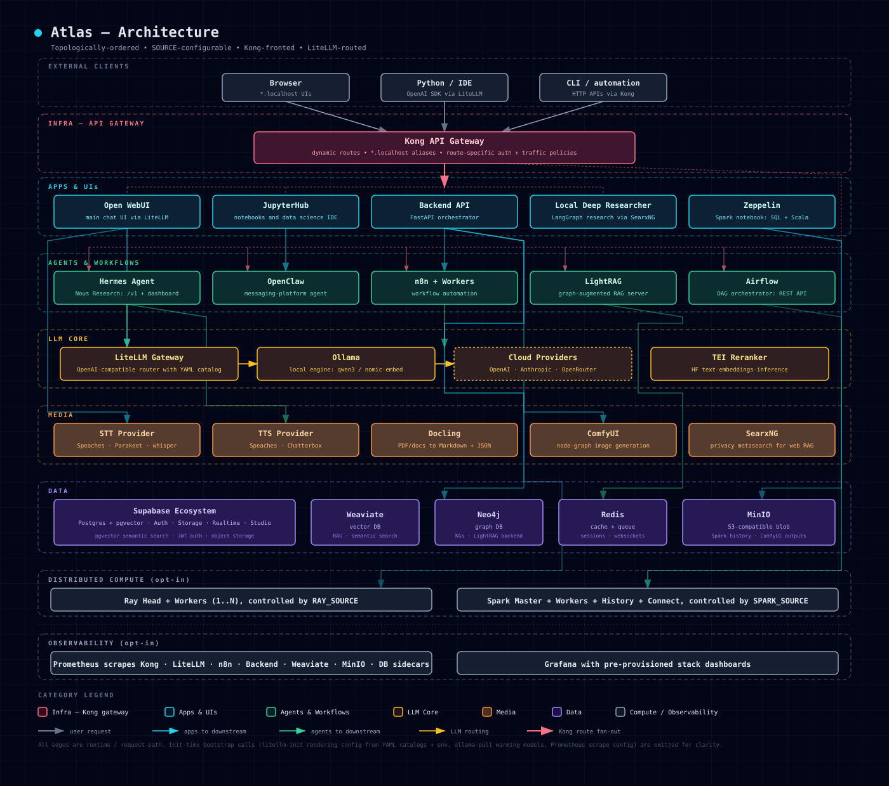

<p align="center">
  
</p>

# Atlas

A self-hosted, source-configurable, multi-disciplinary engineering platform — gen-AI, ML, and data — composable from a single Docker Compose stack.

[](./docs/screenshots/wizard-running.png)

*The Textual TUI wizard streaming a live `./start.sh` launch — one view for stack status and logs.*

[](./docs/diagrams/architecture.svg)

*How a request reaches a service: clients → Kong → apps/agents → shared LLM + data layers. Per-service diagrams under `services/<name>/architecture.svg` derive from each manifest's `data_flow.calls`.*

## 1. Quick start

```bash
git clone https://github.com/thekaveh/atlas && cd atlas
./start.sh
```

`./start.sh` with no arguments launches an interactive setup wizard covering track selection, per-service SOURCE choices, base-port selection, host aliases, and a launch summary; the default configuration runs a CPU starter stack (chat UI, workflow automation, vector database, privacy search). See [docs/quick-start/index.md](docs/quick-start/index.md) for the first-run walkthrough and [docs/quick-start/interactive-setup-wizard.md](docs/quick-start/interactive-setup-wizard.md) for what the wizard does step by step.

## 2. What is Atlas

Atlas is a self-hosted engineering platform for generative AI, ML, and data workloads. It bundles 30+ services (LLM gateway + inference, vector + graph DBs, workflow + DAG automation, distributed compute, object storage, notebooks, observability) behind a Kong gateway and an adaptive FastAPI backend, with each service independently switchable between `container`, `localhost`, or `disabled` via its own SOURCE variable. A **tracks system** (`gen-ai-rag`, `gen-ai-eng`, `gen-ai-creative`, `ml-eng`, `data-eng`, `trading`, `all`) picks sensible per-workflow defaults; the always-on core is Supabase, Redis, LiteLLM, and the Backend API.

## 3. Service topology

<!-- TOPOLOGY:BEGIN -->
_Engine-only manifests (speaches, chatterbox) are not listed — they're selected as source variants of their parent (STT Provider / TTS Provider) rather than as standalone services._

| Category | Service | Default port | Alias |
|---|---|---:|---|
| Infra | Backup / restore | — | — |
| Infra | Kong API Gateway | 63000 | — |
| Infra | Cloudflare Tunnel | — | — |
| Infra | Ray | 63002 | ray.localhost |
| Infra | Langfuse | 63005 | langfuse.localhost |
| Infra | Loki | — | — |
| Infra | Prometheus | 63006 | prometheus.localhost |
| Infra | Grafana | 63009 | grafana.localhost |
| Infra | Tempo | — | — |
| Infra | OpenTelemetry Collector | — | — |
| Data | Redpanda Console | 63011 | redpanda.localhost |
| Data | Supabase DB | 63012 | — |
| Data | Supabase Meta | 63014 | — |
| Data | Supabase Storage | 63015 | — |
| Data | Supabase Auth | 63016 | — |
| Data | Supabase API | 63017 | — |
| Data | Supabase Realtime | 63018 | — |
| Data | Supabase Studio | 63019 | supabase-studio.localhost |
| Data | MinIO Console | 63021 | minio.localhost |
| Data | Apache Iceberg REST Catalog | 63022 | — |
| Data | Neo4j Graph DB | 63024 | graph.localhost |
| Data | Redis | 63025 | — |
| Data | Apache Spark | 63027 | spark.localhost |
| Data | Apache Spark — History Server | 63028 | spark-history.localhost |
| Data | Supavisor | — | — |
| Data | Trino | 63029 | trino.localhost |
| Data | Weaviate | 63030 | weaviate.localhost |
| Data | Multi2Vec CLIP | — | — |
| LLM Core | LiteLLM | 63040 | litellm.localhost |
| LLM Core | LLM Engine | — | ollama.localhost |
| LLM Core | TEI Reranker | 63041 | rerank.localhost |
| LLM Core | vLLM (Metal) | — | — |
| Media | Blender MCP | — | — |
| Media | Crawl4AI | 63050 | crawl4ai.localhost |
| Media | Document Processor | 63051 | docling.localhost |
| Media | FAL Cloud Media | — | — |
| Media | Asset Baker | 63052 | asset-baker.localhost |
| Media | Asset Worker | 63053 | asset-worker.localhost |
| Media | ComfyUI | 63054 | comfyui.localhost |
| Media | STT Provider | 63055 | stt.localhost |
| Media | SearxNG | 63056 | search.localhost |
| Media | Apache Tika | 63057 | tika.localhost |
| Media | TTS Provider | 63058 | tts.localhost |
| Agents & Workflows | Apache Airflow | 63070 | airflow.localhost |
| Agents & Workflows | Celery Worker | — | — |
| Agents & Workflows | Flower | 63071 | flower.localhost |
| Agents & Workflows | Hermes Agent | 63072 | hermes.localhost |
| Agents & Workflows | LightRAG | 63074 | lightrag.localhost |
| Agents & Workflows | n8n | 63075 | n8n.localhost |
| Agents & Workflows | OpenClaw | 63076 | openclaw.localhost |
| Agents & Workflows | Curated MCP Servers | 63078 | mcp.localhost |
| Apps & UIs | Jenkins | 63090 | jenkins.localhost |
| Apps & UIs | Label Studio | 63091 | label-studio.localhost |
| Apps & UIs | MLflow | 63092 | mlflow.localhost |
| Apps & UIs | Backend API | 63093 | api.localhost |
| Apps & UIs | JupyterHub | 63094 | jupyter.localhost |
| Apps & UIs | Neo4j LLM Graph Builder | 63095 | graphbuilder.localhost |
| Apps & UIs | Open WebUI | 63096 | chat.localhost |
| Apps & UIs | Local Deep Researcher | 63097 | research.localhost |
| Apps & UIs | Verba | 63098 | verba.localhost |
| Apps & UIs | Apache Zeppelin | 63099 | — |
<!-- TOPOLOGY:END -->

Full port + Kong-route detail: [docs/reference/ports-routes.md](docs/reference/ports-routes.md) and [docs/deployment/ports-and-routes.md](docs/deployment/ports-and-routes.md). Per-service documentation: [docs/services.md](docs/services.md).

## 4. Documentation

[docs/README.md](docs/README.md) is the full documentation index. Key entry points:

- **Getting started** — [Quick Start](docs/quick-start/index.md), [Interactive Setup Wizard](docs/quick-start/interactive-setup-wizard.md), [Troubleshooting](docs/quick-start/troubleshooting.md), [Startup error recovery](docs/TROUBLESHOOTING.md)
- **Core concepts** — [Core Concepts](docs/core-concepts.md) (SOURCE values, tracks, manifests, gateway access), [SOURCE reference](docs/reference/source-values.md), [Tracks](docs/tracks.md)
- **Operating the stack** — [Service catalog](docs/services.md), [SOURCE configuration](docs/deployment/source-configuration.md), [Ports and routes](docs/deployment/ports-and-routes.md), [Architecture diagrams](docs/architecture/index.md)
- **Running Atlas for another project** — [Reusing Atlas as Infrastructure](docs/deployment/reusing-atlas.md), [Using as a submodule](docs/deployment/submodule-usage.md)
- **Contributing** — [Development](docs/development.md) (repository layout, parent-repo consumer layout, required docs checks), [Adding a service](docs/CONTRIBUTING-services.md), [Security policy](SECURITY.md)
- **Release history** — [ROADMAP](docs/ROADMAP.md), [CHANGELOG](docs/CHANGELOG.md), [Releasing & version tags](docs/deployment/releasing.md)

## 5. Contributing

Contributions welcome. Open a PR or an issue to propose changes.

## 6. License

[Apache License 2.0](LICENSE)

## 7. Support

- Check the [documentation](docs/README.md)
- Report issues on [GitHub Issues](https://github.com/thekaveh/atlas/issues)
- Ask questions in [GitHub Discussions](https://github.com/thekaveh/atlas/discussions)
