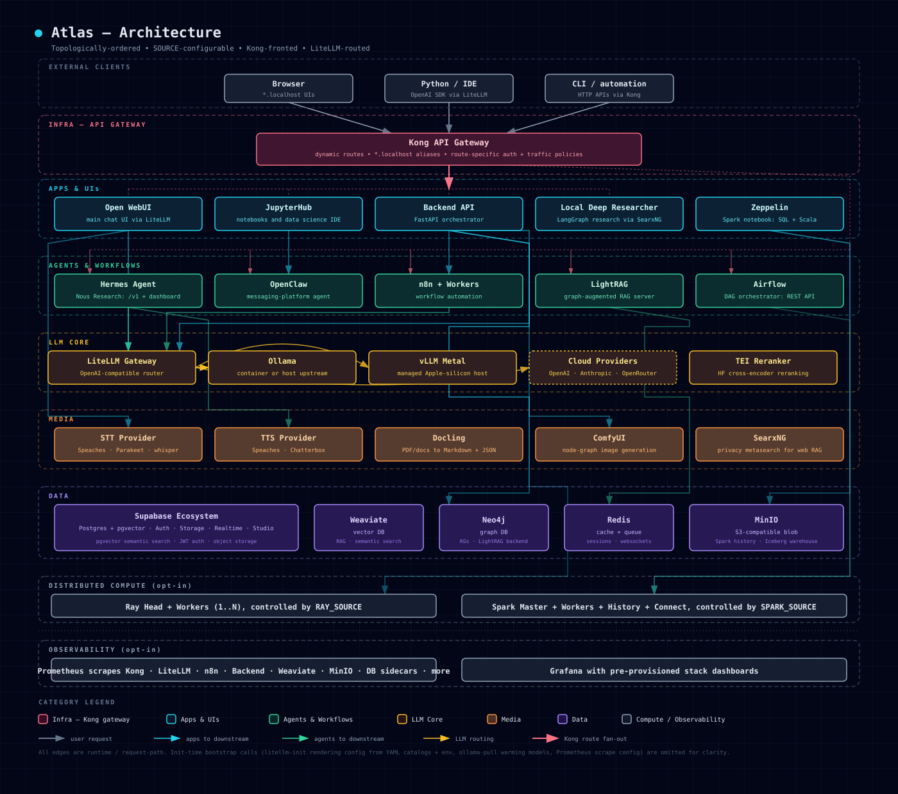

<p align="center">
  
</p>

<h1 align="center">Atlas</h1>

<p align="center">
  <strong>A self-hosted, pre-integrated gen-AI, ML, and data platform — one Docker Compose stack</strong>
</p>

<p align="center">
  Chat, RAG, agents, distributed compute, and a full data platform — source-configurable services wired together out of the box and selectable among the deployment modes each supports. <!-- lint-ok -->
</p>

<p align="center">
  
  
  
  
</p>

<p align="center">
  
  
  
  
  
  
  
  
  
  
  
  
  
  
  
</p>

Atlas is a self-hosted engineering platform that bundles 58 service families behind a Kong gateway and an adaptive FastAPI backend. They cover LLM inference and a gateway, vector and graph databases, workflow and DAG automation, distributed compute, object storage, notebooks, and observability.

The services are integrated, not just co-located. Kong routes every `*.localhost` host. LiteLLM puts local and cloud models behind one API. The adaptive FastAPI backend connects to whichever vector, graph, workflow and media services you enable. Supabase provides the shared database and storage, plus the user identity that the backend's APIs accept. One observability pipeline and declared start order tie it together.

Dashboards keep their own logins; there is no single sign-on. [Access and Credentials](docs/operations/access-and-credentials.md) says what opens each one.

Each source-configurable service offers the deployment variants its family supports, commonly `container`, `localhost` or `disabled`. The same stack therefore runs as a CPU starter or as a multi-GPU lab.

Seven tracks preselect a working subset per workload. They are Generative AI · RAG, Generative AI · Engineering, Generative AI · Creative, ML Engineering, Data Engineering, Trading / Financial Research, and All / Custom. `--profile dev` (alias `default`) or `--profile prod` applies a source and observability bundle. Both profiles bind published ports to loopback; an explicit `HOST_BIND_IP` is an operator choice. The always-on core is Kong, Supabase, Redis, LiteLLM and the Backend API.

- **58 service families across 7 tracks**, all ports derived from one `BASE_PORT`
- **Integrated, not just launched:** Kong routing, the LiteLLM gateway, an adaptive backend, shared Supabase database, storage and API identity, and one observability pipeline. Each dashboard keeps its own login.
- **Always-on core:** Kong, Supabase, Redis, LiteLLM, Backend
- **Per-service SOURCE:** family-specific variants, commonly `container` / `localhost` / `disabled`
- **Profiles:** `--profile dev` (default, loopback-bound) or `--profile prod` (also loopback-bound, observability on)
- **One command:** `./start.sh` opens the interactive **Textual TUI wizard** — pick a track, choose per-service sources, set the base port, and watch the live launch

[](./docs/screenshots/wizard-running.png)

*The Textual TUI wizard streaming a live `./start.sh` launch — one view for stack status and logs.*

## 1. Quick start

Requirements: Docker with Compose v2.20.3+ (v2.26+ recommended), and `uv` or Python 3.10+.

```bash
git clone https://github.com/thekaveh/atlas && cd atlas
./start.sh
```

`./start.sh` with no arguments opens the setup wizard. It asks for track and profile, base port and project name, per-service SOURCE choices and host aliases, then shows a launch summary.

The wizard preselects the `gen-ai-rag` track: chat UI, workflow automation, vector and graph databases, private web search, and deep research on a CPU Ollama engine. The `all` track (the `.env.example` defaults) adds ComfyUI, JupyterHub, Hermes, MinIO, speech-to-text, text-to-speech and CLIP. Plan memory and disk for the track you pick.

Next: the [first-run walkthrough](docs/quick-start/index.md) and the [wizard guide](docs/quick-start/interactive-setup-wizard.md).

## 2. Service topology

<!-- TOPOLOGY:BEGIN -->
_Engine-only manifests (speaches, chatterbox) are not listed — they're selected as source variants of their parent (STT Provider / TTS Provider) rather than as standalone services._

| Category | Service | Default port | Alias |
|---|---|---:|---|
| Infra | Backup / restore | — | — |
| Infra | Kong API Gateway | 63000 | — |
| Infra | Cloudflare Tunnel | — | — |
| Infra | Ray | 63002 | ray.localhost |
| Infra | Langfuse | 63005 | langfuse.localhost |
| Infra | Loki | — | — |
| Infra | Prometheus | 63006 | prometheus.localhost |
| Infra | Grafana | 63009 | grafana.localhost |
| Infra | Tempo | — | — |
| Infra | OpenTelemetry Collector | — | — |
| Data | Redpanda Console | 63011 | redpanda.localhost |
| Data | Supabase DB | 63012 | — |
| Data | Supabase Meta | — | — |
| Data | Supabase Storage | 63015 | — |
| Data | Supabase Auth | — | — |
| Data | Supabase API | 63017 | — |
| Data | Supabase Realtime | 63018 | — |
| Data | Supabase Studio | — (Kong only) | supabase-studio.localhost |
| Data | MinIO Console | 63021 | minio.localhost |
| Data | Apache Iceberg REST Catalog | 63022 | — |
| Data | Neo4j Graph DB | 63024 | graph.localhost |
| Data | Redis | 63025 | — |
| Data | Apache Spark | 63027 | spark.localhost |
| Data | Apache Spark — History Server | 63028 | spark-history.localhost |
| Data | Supavisor | — | — |
| Data | Trino | 63029 | trino.localhost |
| Data | Weaviate | 63030 | weaviate.localhost |
| Data | Multi2Vec CLIP | — | — |
| LLM Core | LiteLLM | 63040 | litellm.localhost |
| LLM Core | LLM Engine | — | ollama.localhost |
| LLM Core | TEI Reranker | 63041 | rerank.localhost |
| LLM Core | vLLM (Metal) | — | — |
| Media | Blender MCP | — | — |
| Media | Crawl4AI | 63050 | crawl4ai.localhost |
| Media | Document Processor | 63051 | docling.localhost |
| Media | FAL Cloud Media | — | — |
| Media | Asset Baker | 63052 | asset-baker.localhost |
| Media | Asset Worker | 63053 | asset-worker.localhost |
| Media | ComfyUI | 63054 | comfyui.localhost |
| Media | STT Provider | 63055 | stt.localhost |
| Media | SearxNG | 63056 | search.localhost |
| Media | Apache Tika | 63057 | tika.localhost |
| Media | TTS Provider | 63058 | tts.localhost |
| Agents & Workflows | Apache Airflow | 63070 | airflow.localhost |
| Agents & Workflows | Celery Worker | — | — |
| Agents & Workflows | Flower | 63071 | flower.localhost |
| Agents & Workflows | Hermes Agent | 63072 | hermes.localhost |
| Agents & Workflows | LightRAG | 63074 | lightrag.localhost |
| Agents & Workflows | n8n | 63075 | n8n.localhost |
| Agents & Workflows | OpenClaw | 63076 | openclaw.localhost |
| Agents & Workflows | Curated MCP Servers | 63078 | mcp.localhost |
| Agents & Workflows | TrueForge | 63079 | trueforge.localhost |
| Apps & UIs | Jenkins | 63090 | jenkins.localhost |
| Apps & UIs | Label Studio | 63091 | label-studio.localhost |
| Apps & UIs | MLflow | 63092 | mlflow.localhost |
| Apps & UIs | Backend API | 63093 | api.localhost |
| Apps & UIs | JupyterHub | 63094 | jupyter.localhost |
| Apps & UIs | Neo4j LLM Graph Builder | 63095 | graphbuilder.localhost |
| Apps & UIs | Open WebUI | 63096 | chat.localhost |
| Apps & UIs | Local Deep Researcher | 63097 | research.localhost |
| Apps & UIs | Verba | 63098 | verba.localhost |
| Apps & UIs | Apache Zeppelin | 63099 | — |
<!-- TOPOLOGY:END -->

[](./docs/diagrams/architecture.svg)

*Kong routes services with declared host aliases; loopback-only interfaces such as Zeppelin bypass the gateway.*

Full port + Kong-route detail: [docs/reference/ports-routes.md](docs/reference/ports-routes.md) and [docs/operations/ports-and-routes.md](docs/operations/ports-and-routes.md). Per-service documentation: [docs/services.md](docs/services.md).

## 3. Documentation

[docs/README.md](docs/README.md) is the full documentation index. Key entry points:

- **Getting started** — [Quick Start](docs/quick-start/index.md), [Interactive Setup Wizard](docs/quick-start/interactive-setup-wizard.md), [Quick Start Troubleshooting](docs/quick-start/troubleshooting.md), [Sudo recovery](docs/TROUBLESHOOTING.md)
- **Core concepts** — [Core Concepts](docs/core-concepts.md) (SOURCE values, tracks, manifests, gateway access), [SOURCE reference](docs/reference/source-values.md), [Tracks](docs/tracks.md)
- **Operating the stack** — [Service catalog](docs/services.md), [SOURCE configuration](docs/operations/source-configuration.md), [Ports and routes](docs/operations/ports-and-routes.md), [Architecture diagrams](docs/architecture/index.md)
- **Running Atlas for another project** — [Reusing Atlas as Infrastructure](docs/operations/reusing-atlas.md), [Using as a submodule](docs/operations/submodule-usage.md)
- **Contributing** — [Contributing guide](CONTRIBUTING.md) (setup, one safe test per area, branch target, required checks), [Development](docs/development.md) (repository and consumer layout, docs checks), [Adding a service](docs/CONTRIBUTING-services.md), [Security policy](SECURITY.md)
- **Release history** — [ROADMAP](docs/ROADMAP.md), [CHANGELOG](docs/CHANGELOG.md), [Releasing & version tags](docs/operations/releasing.md)
- **Project & internal docs** — research, strategy, and maintenance notes live under `docs/`: [docs/research/README.md](docs/research/README.md), [docs/strategy/README.md](docs/strategy/README.md), [docs/maintenance/README.md](docs/maintenance/README.md)

## 4. Contributing

Contributions are welcome. Start with the [contributing guide](CONTRIBUTING.md). It covers setup, one safe test for each code area, and the Docker and live-test boundary. It also covers the pull request against `develop` and its four required checks. For anything larger than a typo, open an issue first so the scope is agreed.

## 5. License

[Apache License 2.0](LICENSE)

## 6. Support

- Check the [documentation](docs/README.md)
- Report bugs and request features on [GitHub Issues](https://github.com/thekaveh/atlas/issues)
- Ask questions by [opening an issue with the `question` label](https://github.com/thekaveh/atlas/issues/new?labels=question)
- Report security vulnerabilities privately through the [security policy](SECURITY.md), never as a public issue
