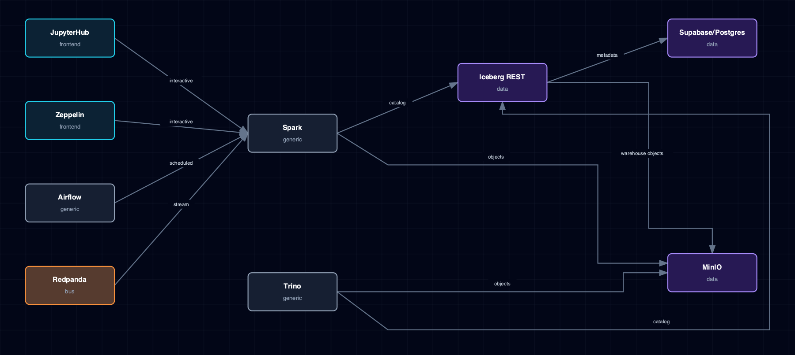

# 8.9. Data Engineering Lakehouse Flow

MinIO, Iceberg REST, Supabase Postgres, Spark, JupyterHub, Zeppelin, Airflow, Trino, and Redpanda.

## 1. Diagram

[Open the full-size diagram](./data-engineering-lakehouse-flow.html).

## 2. Notes

Iceberg REST keeps its catalog metadata in Supabase Postgres through a JDBC catalog, not a Hive metastore. If `CATALOG_URI` does not point at `jdbc:postgresql://supabase-db:5432/iceberg`, the base image falls back to a local SQLite catalog that a restart loses. Trino runs one coordinator and no workers, by design. Spark still starts with `ICEBERG_REST_SOURCE=disabled` for ML-only use; only lakehouse SQL fails.

## 3. Source Files

- `services/jupyterhub/service.yml`
- `services/zeppelin/service.yml`
- `services/airflow/service.yml`
- `services/redpanda/service.yml`
- `services/minio/service.yml`
- `services/trino/service.yml`
- `services/iceberg-rest/service.yml`
- `services/spark/service.yml`
- `services/supabase/service.yml`
