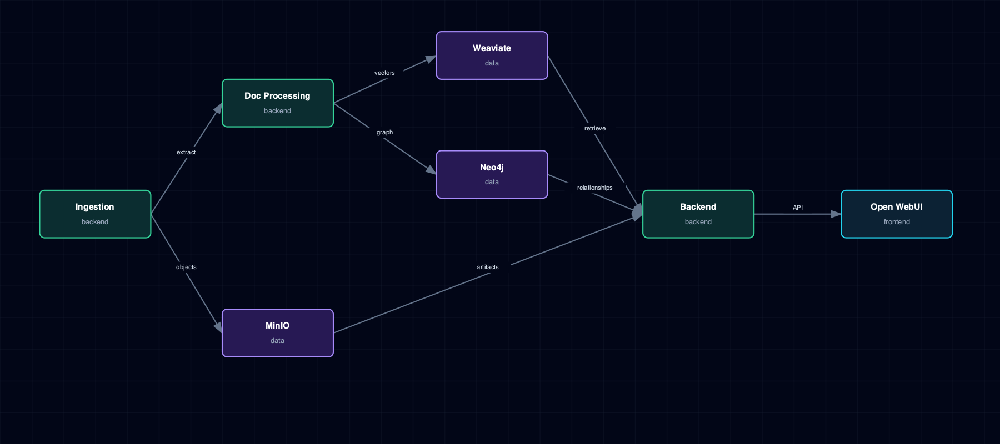

# 6.7. Data And RAG Flow

Ingestion, document processing, object storage, vector and graph stores, backend APIs, Open WebUI, and tool/MCP-adjacent flows.

## 1. Diagram

[Open the full-size diagram](./data-rag-flow.html).

## 2. Notes

Backend isn't the only writer into these stores: LightRAG writes directly to Neo4j over Bolt and to Supabase pgvector, and other MinIO consumers (the Iceberg pipeline, asset-worker) hold their own scoped IAM credentials and write directly too — only Backend's own ingestion path is pictured here, not every producer.

## 3. Source Files

- `services/weaviate/service.yml`
- `services/backend/service.yml`
- `services/lightrag/service.yml`
