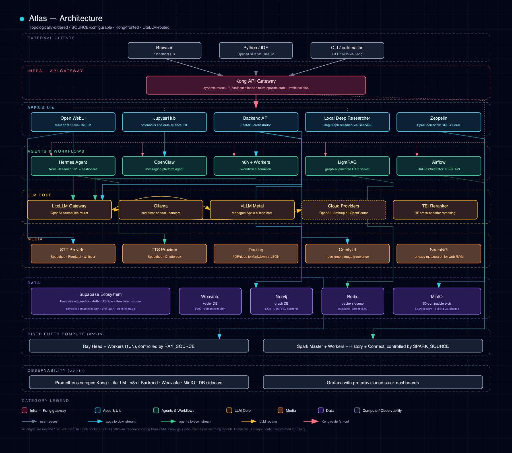

# 8.1. Platform Architecture

The platform's major tiers and runtime call direction, from user entrypoints through Kong to apps, agents, the LLM core and the data stores.

## 1. Diagram

[Open the full-size diagram](../diagrams/architecture.html).

## 2. Perspectives

Each split perspective (bootstrapper lifecycle, SOURCE model, tracks, routing, data and RAG flow, LLM providers, and more) has its own page; the [Diagram Catalog](README.md) lists them.
