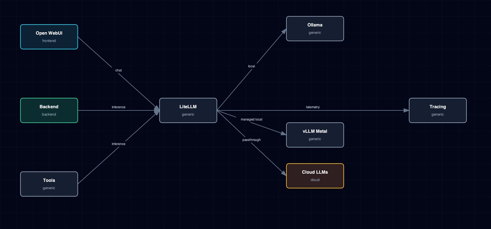

# 6.8. LLM Provider Flow

Ollama, managed vLLM Metal, LiteLLM, cloud passthroughs, Open WebUI, backend, MCP/tool access, and trace hooks.

## 1. Diagram

[Open the full-size diagram](./llm-provider-flow.html).

## 2. Notes

Disabling a cloud provider in `.env` doesn't error — the model resolver silently produces zero catalog entries for it. Managed vLLM Metal is another local LiteLLM upstream, so `LLM_PROVIDER_SOURCE=none` does not require a cloud provider. Ollama models get two aliases (`ollama/<name>` and the bare name); either works. Tracing observes requests out-of-band and isn't part of the inference call path, so a tracing-backend outage doesn't affect completions.

## 3. Source Files

- `services/litellm/service.yml`
- `services/litellm/models.yaml`
- `services/ollama/service.yml`
- `services/vllm-metal/service.yml`
