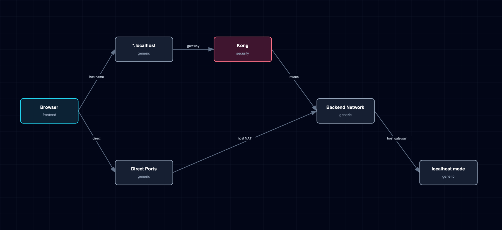

# 8.6. Network And Routing Topology

Host ports, Kong aliases, direct service ports, backend-network-only services, and localhost-mode boundaries.

## 1. Diagram

[Open the full-size diagram](./network-routing-topology.html).

## 2. Notes

The host-gateway address is runtime-dependent, not a fixed IP: Docker accepts the literal `host-gateway` value in `extra_hosts` and resolves it internally, but Podman has no such shortcut — it queries the default bridge network's IPAM gateway IP directly (`resolve_host_gateway_ip()` in `bootstrapper/utils/system.py`), falling back to a throwaway container if that lookup fails. Localhost-source endpoints always name `host.docker.internal`, and every container that reads one maps it to that gateway in `extra_hosts`; no host-side lookup or fixed bridge IP is involved (#1361).

## 3. Source Files

- `bootstrapper/utils/kong_config_generator.py`
- `bootstrapper/utils/system.py`
- `bootstrapper/services/topology.py`
- `services/kong/service.yml`
