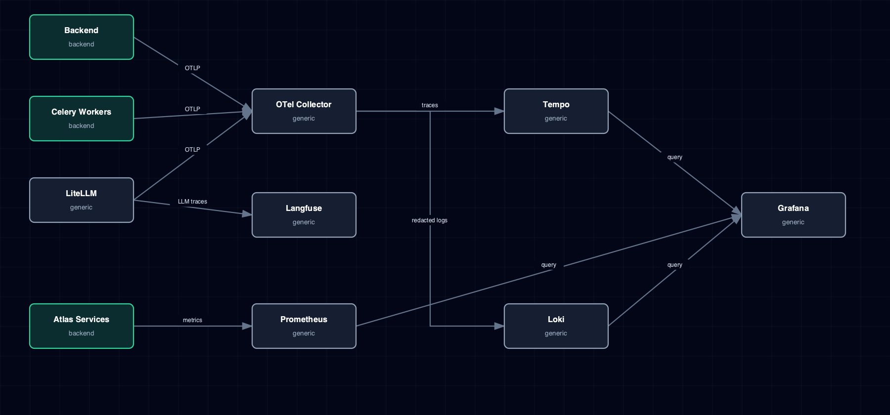

# 6.10. Observability Flow

Prometheus, Grafana, Langfuse, OpenTelemetry Collector, Tempo, Loki, and service instrumentation boundaries.

## 1. Diagram

[Open the full-size diagram](./observability-flow.html).

## 2. Notes

Langfuse is deliberately outside the OTel path: LiteLLM emits Langfuse traces via its own `success_callback`, not through the Collector, because Langfuse is the LLM-behavior layer while Prometheus/Grafana stay the infrastructure-metrics layer. Backend, Celery workers, and LiteLLM OTLP traces reach Tempo through the Collector. Applications that emit OTLP logs use the same receiver; the Collector redacts a documented field allowlist and persists accepted logs in Loki with trace/span structured metadata.

## 3. Source Files

- `services/backend/service.yml`
- `services/celery/service.yml`
- `services/litellm/service.yml`
- `services/prometheus/service.yml`
- `services/grafana/service.yml`
- `services/loki/service.yml`
- `services/tempo/service.yml`
- `services/otel-collector/service.yml`
