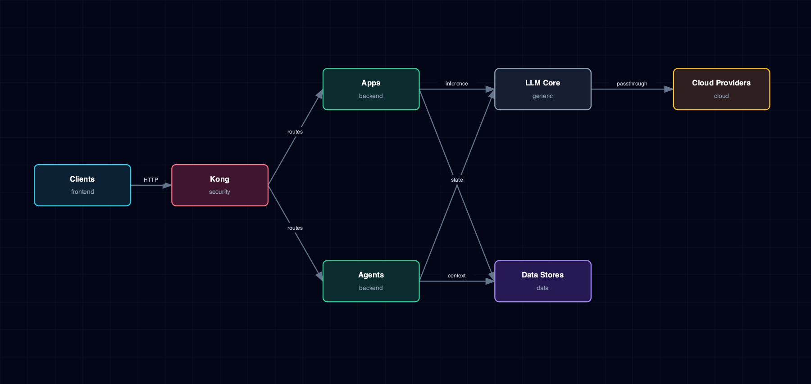

# 6.2. Atlas Platform Overview

User entrypoints, Kong, apps, agents, LLM core, data stores, and cloud-provider boundaries.

## 1. Diagram

[Open the full-size diagram](./platform-overview.html).

## 2. Notes

Direct published ports bypass Kong deliberately, for host tools that can't use the `*.localhost` gateway. Atlas-managed consumers use LiteLLM as the default path for local and cloud model traffic, centralizing credentials and routing. Services with explicit native-provider role overrides, such as LightRAG, can bypass LiteLLM by design (see [LLM provider flow](./llm-provider-flow.md)).

## 3. Source Files

- `services/*/service.yml`
- `bootstrapper/services/topology.py`
