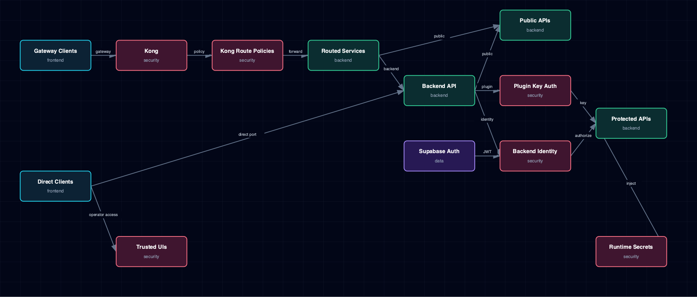

# 6.11. Security, Auth, And Secrets Boundary

Route-specific Kong controls, backend identity validation, application-enforced plugin keys, runtime secrets, and explicitly public or operator-trusted surfaces.

## 1. Diagram

[Open the full-size diagram](./security-auth-secrets-boundary.html).

## 2. Notes

Kong applies route-specific Basic, key-auth, pass-through, rate-limit, and CORS policies; it does not provide one uniform identity layer. Backend separately validates Supabase JWTs, scoped first-party tokens, and operator tokens, while plugin `open|key-auth|inherit` modes are enforced again at the application boundary. Backend `/health`, `/ready`, `/metrics`, and API-doc routes are intentionally public, and direct ports or operator-trusted UIs can bypass Kong, so those surfaces must remain inside their intended network boundary.

## 3. Source Files

- `services/kong/service.yml`
- `services/supabase/service.yml`
- `services/backend/service.yml`
- `services/backend/app/app/backend_identity.py`
- `services/backend/app/app/main.py`
- `bootstrapper/generate_supabase_keys.py`
