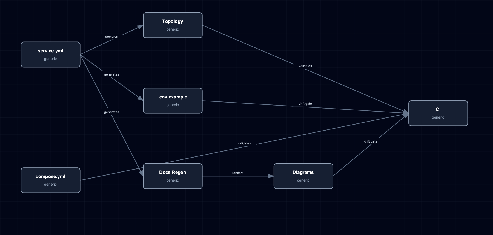

# 8.12. Service Admission Workflow

Manifest, compose fragment, topology row, env assembler, docs regeneration, diagrams, tests, and CI drift gates.

## 1. Diagram

[Open the full-size diagram](./service-admission-workflow.html).

## 2. Notes

The fragment check in `manifest_validator.py` blocks a partial landing. It reports `missing_fragment` for a non-virtual manifest without `compose.yml` and `unexpected_fragment` for a virtual manifest that ships one. It reports `fragment_container_drift` when `containers[]` disagrees with the compose `services:` keys. `tools/validate_fragments.py` runs this check in CI, and also checks `.env.example` drift and the README `TOPOLOGY` block.

## 3. Source Files

- `bootstrapper/services/manifest_validator.py`
- `bootstrapper/services/source_validator.py`
- `bootstrapper/services/topology.py`
- `bootstrapper/services/env_assembler.py`
- `bootstrapper/docs/regen.py`
- `bootstrapper/docs/diagram_renderer.py`
- `bootstrapper/tools/validate_fragments.py`
- `.github/workflows/services-lint.yml`
