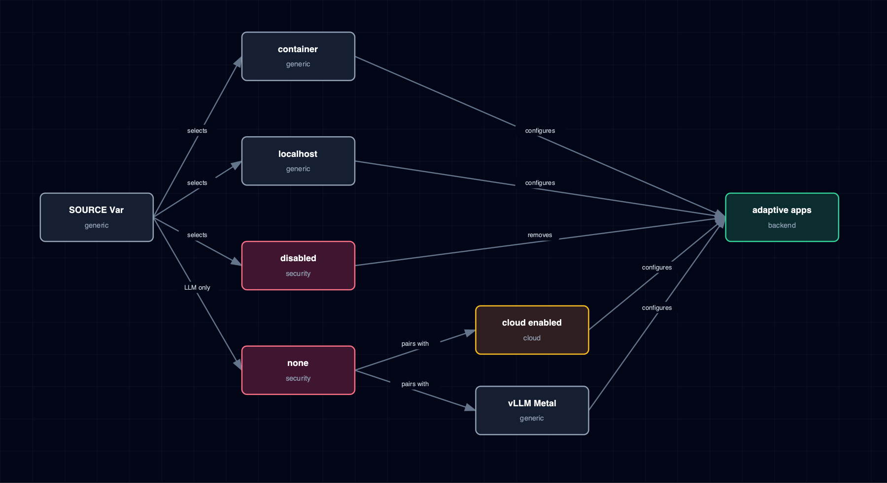

# 6.4. SOURCE Configuration Model

Container, localhost, disabled, none, cloud-provider and managed-vLLM enablement, and adaptive-service behavior.

## 1. Diagram

[Open the full-size diagram](./source-configuration-model.html).

## 2. Notes

SOURCE selects a deployment mode, not just an image variant — the same value gates Compose scale, env wiring, and Kong route generation together. `none` is unique to the LLM provider family; no other service exposes it. For that LLM-only mode, LiteLLM can be backed by enabled cloud providers, managed vLLM Metal, or both.

## 3. Source Files

- `bootstrapper/services/manifests.py`
- `bootstrapper/tracks.yml`
- `bootstrapper/services/topology.py`
- `services/vllm-metal/service.yml`
