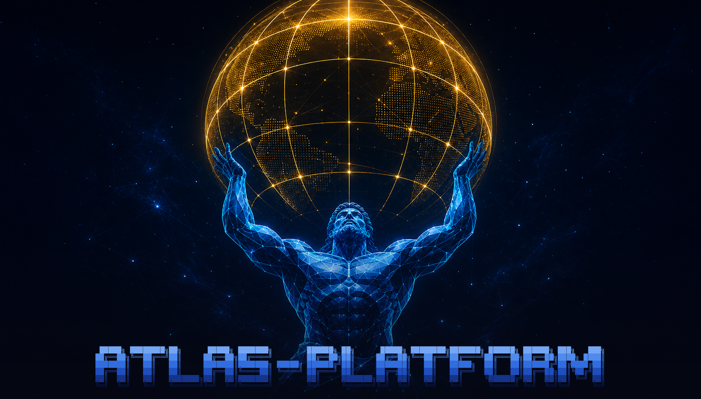

# Atlas Documentation

  

Atlas is a self-hosted, source-configurable engineering platform for generative AI, RAG, creative AI, ML engineering, and data engineering workloads. The stack is composed through Docker Compose, a Python bootstrapper, service manifests, SOURCE values, tracks, and a Kong-fronted access model.

  

  

## 1. Start Here

- [Quick Start](site/quick-start.md)
- [Core Concepts](site/core-concepts.md)
- [Service Catalog](site/services/index.md)
- [Architecture](site/architecture/index.md)
- [Reference](site/reference/index.md)

## 2. Documentation Scope

This site indexes 55 service families, 7 tracks, and 49 SOURCE-configurable surfaces from repository-owned source files.

## 3. Publication Surfaces

- Public site: [https://thekaveh.github.io/atlas/](https://thekaveh.github.io/atlas/)
- GitHub Wiki export source: [docs/wiki/Home.md](https://github.com/thekaveh/atlas/blob/main/docs/wiki/Home.md)
- Source repository: [thekaveh/atlas](https://github.com/thekaveh/atlas)
