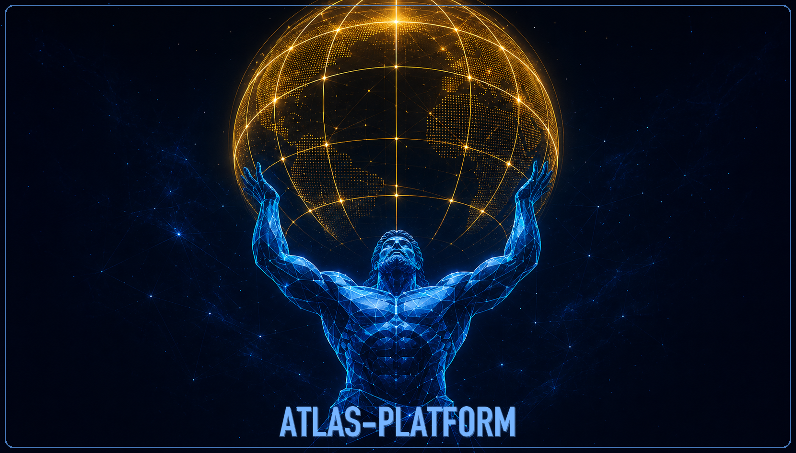

# 1. Overview

<div class="md-content--atlas-wide"></div>

<div class="atlas-home">
  <section class="atlas-home__hero">
    <div class="atlas-home__copy">
      <p class="atlas-kicker">A self-hosted, pre-integrated gen-AI, ML, and data platform — one Docker Compose stack</p>
      <p>Chat, RAG, agents, distributed compute, and a full data platform — integrated services, each selectable among the deployment modes it supports.</p>
      <p>Atlas is a self-hosted engineering platform that bundles 58 service families behind a Kong gateway and an adaptive FastAPI backend. They cover LLM inference and a gateway, vector and graph databases, workflow and DAG automation, distributed compute, object storage, notebooks, and observability.</p>
      <p>Seven tracks preselect coherent service families, while SOURCE modes choose container, localhost, or disabled operation where supported. Kong, Supabase, Redis, LiteLLM, and the Backend API form the always-on core, so every selected workload starts from the same integrated foundation.</p>
      <p>The launch wizard also offers the dev or prod profiles, then shows the launch summary.</p>
      <div class="atlas-home__actions">
        <a href="quick-start/index.md">Quick Start</a>
        <a href="services.md">Service Catalog</a>
        <a href="architecture/index.md">Architecture</a>
      </div>
    </div>
    <figure class="atlas-home__media">
      
    </figure>
  </section>
</div>

## 1. Capabilities

Atlas organizes 58 service families. Its configurable services are grouped into 7 tracks, which can overlap. Each track preselects a working subset for one class of workload. The wizard prompts for in-track services and force-disables the rest.

<div class="atlas-home__grid" markdown="1">

<div class="atlas-card" markdown="1">
<p class="atlas-card__title">Generative AI · RAG</p>
<p class="atlas-card__body">Retrieval-augmented generation — vectors, graph, reranker, doc ingest, web search, workflow automation.</p>

<a class="atlas-card__link" href="tracks.md">View track services →</a>
</div>

<div class="atlas-card" markdown="1">
<p class="atlas-card__title">Generative AI · Engineering</p>
<p class="atlas-card__body">Agentic apps + workflows with voice, vision, and search.</p>

<a class="atlas-card__link" href="tracks.md">View track services →</a>
</div>

<div class="atlas-card" markdown="1">
<p class="atlas-card__title">Generative AI · Creative</p>
<p class="atlas-card__body">Multimodal generation — image, voice, vision, doc.</p>

<a class="atlas-card__link" href="tracks.md">View track services →</a>
</div>

<div class="atlas-card" markdown="1">
<p class="atlas-card__title">ML Engineering</p>
<p class="atlas-card__body">Distributed training/inference + notebooks + experiment storage.</p>

<a class="atlas-card__link" href="tracks.md">View track services →</a>
</div>

<div class="atlas-card" markdown="1">
<p class="atlas-card__title">Data Engineering</p>
<p class="atlas-card__body">Batch + lakehouse + graph + vector with orchestration.</p>

<a class="atlas-card__link" href="tracks.md">View track services →</a>
</div>

<div class="atlas-card" markdown="1">
<p class="atlas-card__title">Trading / Financial Research</p>
<p class="atlas-card__body">Read-only financial research and paper portfolios in notebooks; no live trading.</p>

<a class="atlas-card__link" href="tracks.md">View track services →</a>
</div>

<div class="atlas-card" markdown="1">
<p class="atlas-card__title">All / Custom</p>
<p class="atlas-card__body">Every configurable service — full wizard, no filtering.</p>

<a class="atlas-card__link" href="tracks.md">View track services →</a>
</div>

</div>

## 2. Quick Start

<div class="atlas-home__quickstart" markdown="1">

Install Docker with Docker Compose v2.20.3 or newer, `uv` or Python 3.10 or newer, and Git. Clone the repository, then run the commands from its root:

```bash
git clone https://github.com/thekaveh/atlas && cd atlas
./start.sh
```

`./start.sh` opens the interactive wizard. `./start.sh --track gen-ai-rag` sets the track and skips that question. A source, model or key flag, such as `--llm-provider-source ollama-container-gpu`, skips the wizard. So do launch flags such as `--base-port` and `--detach`. Atlas then launches what `.env` holds, not a track's subset. Full flow, flags and troubleshooting: <a class="atlas-home__quickstart-link" href="quick-start/index.md">Quick Start</a>.
</div>

## 3. Platform Topology

<div class="atlas-home__topology" markdown="1">


<p class="atlas-home__caption">Kong routes every declared *.localhost host; LiteLLM is the default model path for Atlas-managed consumers, with explicit native-provider overrides where supported.</p>

</div>

Per-flow diagrams (data/RAG, LLM provider routing, observability, security boundary, bootstrapper lifecycle): [Architecture](architecture/index.md).

## 4. Documentation Map

<div class="atlas-home__grid" markdown="1">

<div class="atlas-card" markdown="1">
<p class="atlas-card__title">Quick Start</p>
<p class="atlas-card__body">Run the wizard, pick a track, launch the stack.</p>

<a class="atlas-card__link" href="quick-start/index.md">Start here →</a>
</div>

<div class="atlas-card" markdown="1">
<p class="atlas-card__title">Core Concepts</p>
<p class="atlas-card__body">SOURCE values, tracks, manifests, Kong routing, overlays.</p>

<a class="atlas-card__link" href="core-concepts.md">Read concepts →</a>
</div>

<div class="atlas-card" markdown="1">
<p class="atlas-card__title">Service Catalog</p>
<p class="atlas-card__body">Every service family, its SOURCE variants, and dependencies.</p>

<a class="atlas-card__link" href="services.md">Browse services →</a>
</div>

<div class="atlas-card" markdown="1">
<p class="atlas-card__title">Architecture</p>
<p class="atlas-card__body">Platform, data-flow, and lifecycle diagrams.</p>

<a class="atlas-card__link" href="architecture/index.md">View architecture →</a>
</div>

<div class="atlas-card" markdown="1">
<p class="atlas-card__title">Reference</p>
<p class="atlas-card__body">Env vars, ports, manifest fields, and the generated SOURCE matrix for every configurable service.</p>

<a class="atlas-card__link" href="reference/index.md">Open reference →</a>
</div>

</div>

## 5. Setup Surface

<div class="atlas-screenshot">
  
</div>

<p class="atlas-home__caption">The setup wizard during a live <code>./start.sh</code> launch of Atlas v0.1.0 on 2026-06-19. Its overview lists 36 services, 34 of them enabled, on base port 64075. Ollama and ComfyUI use host (<code>localhost</code>) sources, and the cloud APIs are off. The capture does not record the host hardware.</p>
