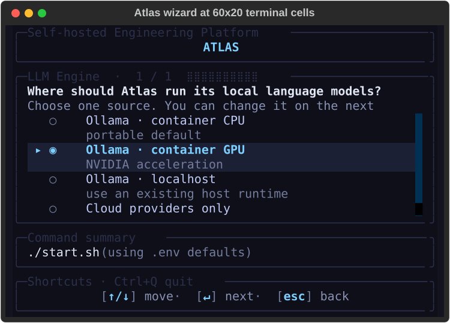
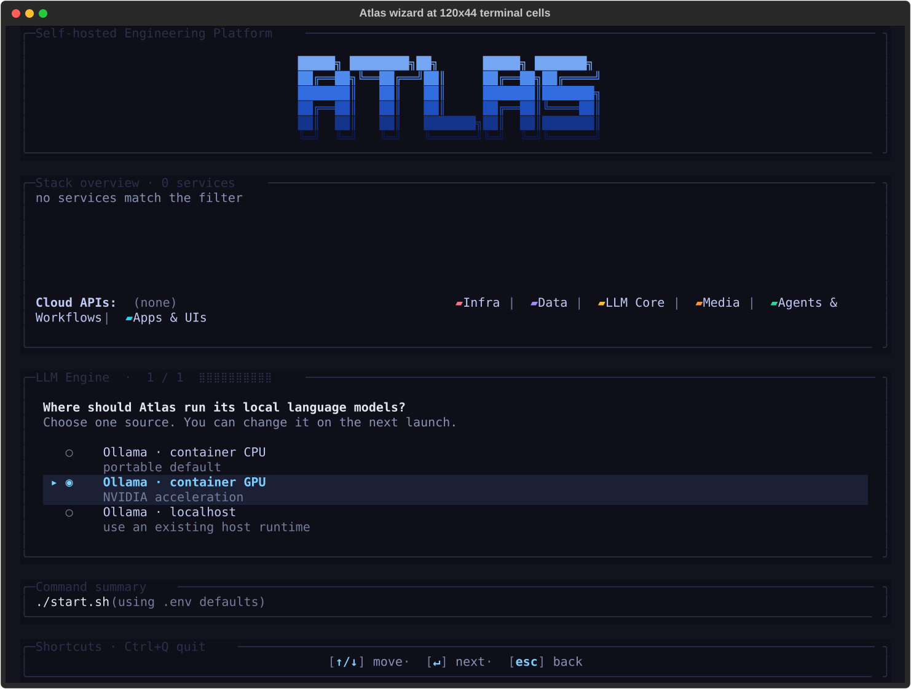

# 2.2. Interactive Setup Wizard

The interactive Textual wizard configures every service step by step. It opens when you run `./start.sh` with no arguments.

## 1. Quick Start

```bash
./start.sh
```

### 1.1. Terminal size and compact layout

The wizard needs a terminal of at least **60 columns × 20 rows**. Below 30 rows it uses a compact layout. The logo shrinks to a one-line strip, and the stack overview is hidden while a question is open. The prompt, its choices, the command summary and the `move`, `mark`, `next` and `back` actions get the rows. The overview returns on the Setup tab after launch.

Growing the terminal to 30 rows or more restores the full logo and overview. Typed text, selections, scroll position and focus are kept. The full shortcut list needs at least 132 columns as well. Narrower layouts keep the prompt's essential keys and name `Ctrl+Q quit` in the footer title.

Smaller terminals (**59×20**, **60×19** or less) use the linear stdout flow. To choose that flow at any size, run `./start.sh --no-tui`.



*At 60×20 the selected row, prompt, command and next/back actions stay visible. Subtitles are capped at two rows. On a destructive step, **Ctrl+R** shows the full text (§7.1).*



*At 120×44 the full logo, stack overview and work area are shown.*

The dark palette meets the WCAG 2.2 AA normal-text ratio of **4.5:1**; the faintest text measures 4.54:1. Selection and status also use cursor glyphs, checkbox text, icons and words, not color alone. The wizard is keyboard-operable; screen-reader support is not tested.

The screenshots use the dark theme and Textual's headless renderer at the stated cell sizes. Fonts, emoji width and inline images vary between terminal emulators.

## 2. Step Order

Service-source steps follow the topology order in `bootstrapper/services/topology.py`, the same order as the stack overview. The LLM cluster comes right after the LLM Engine step. The shape is roughly:

```
first  Track (skipped when --track is passed)
       Profile: dev or production hardening (skipped when --profile is passed)
       Base port
       Project name (Docker Compose namespace / container family → PROJECT_NAME)
…      Service-source steps, in topology order
       (… Weaviate, …, LLM Engine, ollama-related, …, ComfyUI, …)
…      LLM cluster (spliced right after the LLM Engine step):
         Ollama  ·  models               (single unified multiselect)
         Ollama  ·  additional models    (free-text, container only)
         OpenAI key + models
         Anthropic key + models
         OpenRouter key + models
         LLM defaults  ·  chat model      (single-select)
         LLM defaults  ·  embedding model (single-select, dimension-sensitive)
         LLM defaults  ·  vision model    (single-select, skippable)
…      Remaining service-source steps
near-end  Cold start
near-end  Hosts setup · /etc/hosts
last   Confirm — Launch the stack with this configuration?
```

A step gated by a `skip_if_prev` predicate is left out when its precondition is not met. For example, a cloud provider's models step appears only when its `CLOUD_*_SOURCE` is `enabled` after the API-key step, which is always shown. Ollama steps appear only when `LLM_PROVIDER_SOURCE` is an `ollama-*` value.

## 3. Prompt Kinds

Each wizard step uses one of five prompt widgets, chosen by the question type:

| Kind | Used for | UX |
|---|---|---|
| `options` | Single-select from a small fixed set: every `*_SOURCE`, `Cold start`, `Hosts setup · /etc/hosts`, and the **LLM defaults** pickers (chat / embedding / vision, §4.6). | Up/Down arrows + Enter; the current `.env` value is pre-highlighted. |
| `number` | Numeric prompts (`Base port`). | Single-line input. Enter keeps the displayed default. A non-number or out-of-range value is refused, and the hint shows the reason (§7.2). Overview ports follow the confirmed base, also for sources you change later. |
| `secret` | API keys (`OPENAI_API_KEY`, `ANTHROPIC_API_KEY`, `OPENROUTER_API_KEY`). | Masked input with a live character count. With a saved key, the hint says what Enter does. Type a new key to replace it, or a word from §4.4.1 (`enable`, `disable`, `remove`/`clear`). |
| `multiselect` | Cloud and Ollama model lists. | Scrollable `[selected]` / `[ ]` rows; Space toggles, Enter confirms. Cloud lists pre-check the default-active models your account returns. Ollama lists depend on the source, and your selection replaces the baseline (§4.2). |
| `text` | Free-text entries — the **Project name** step (Docker Compose namespace, persisted to `PROJECT_NAME`) and the Ollama "additional models to pull" step. | Single-line input, trimmed. The project name is lower-cased and validated. Enter keeps the current name. An invalid name keeps you on the step and shows the reason. |

Throughout: `Up/Down` to move, `Enter` to confirm, `Space` to toggle multiselect rows, `Esc` returns to the previous step, `Ctrl+C` (or `Ctrl+Q`) quits.

## 4. LLM Cluster Steps in Detail

### 4.1. LLM Engine (single-select)

`LLM_PROVIDER_SOURCE` choice — `ollama-container-cpu`, `ollama-container-gpu`, `ollama-localhost`, or `none` (no Ollama upstream). LiteLLM always runs and has **no** prompt of its own. It is the default front door for Atlas-managed LLM consumers. The **Generative AI · Engineering** and **All / Custom** tracks ask about vLLM Metal in a later step. Other tracks force-disable it without a prompt.

The wizard refuses to launch when **LLM Engine = `none`**, vLLM Metal is disabled **and** every cloud provider is disabled. LiteLLM would then have nothing to route to. A managed vLLM-Metal-only stack is valid.

### 4.2. Ollama  ·  models (multiselect)

A multiselect shown for every `ollama-*` source. The [Ollama README](../../services/ollama/README.md) §5 describes the list: its sources, row badges, size estimates, sort order, fallbacks and default baseline. In short:

- **`ollama-container-*`** lists the live `https://ollama.com/library` catalog. The `ollama-pull` init container pulls the checked models at start.
- **`ollama-localhost`** merges the host's pulled models (`[pulled]`, active at once) with the catalog (`[library]`). The bootstrapper pulls checked `[library]` models onto the host daemon at start.

Each row has two lines. Line 1 shows capability badges, status badges and the pull count. Line 2 shows size variants, the description and `updated X ago`.

**Search.** Press `Tab` or `/`, or click, to focus the search box, then type to filter by name. `Tab`, `Enter` or `Esc` returns to the list. The arrow keys still move through the list while you type. Other wizard keys are off while search has focus.

**Filter.** Press `f` or click a chip to filter by capability (`ALL`, `embedding`, `thinking`, `vision`, `tools`, `audio`). A row must match both the chip and the search. Filters only hide rows; hidden checked rows stay checked.

**Variants.** Press `Space` on a multi-variant row to expand it in place. Press `Space` on a leaf to toggle that tag, and on the parent again to collapse. Single-variant rows toggle directly. Expanding fetches real sizes, context window and per-tag capabilities in the background; a failed fetch keeps the estimates.

A model is saved either as its bare name (pulls `:latest`) or as tags (`qwen3:8b,qwen3:14b`), never both. The `latest` leaf selects the bare name. The parent checkbox is green when any leaf is checked.

**Saved selection.** The selection is saved as `OLLAMA_USER_MODELS`. `.env.example` seeds it with the default baseline, so a fresh clone opens with the baseline checked. If the key is missing, the wizard pre-checks the baseline. Later visits restore the saved value. Saved models that are not in the list (for example `hf.co/...`) appear as `saved` rows and stay checked.

Unchecking everything writes `OLLAMA_USER_MODELS=`. Nothing is pulled and no Ollama model is registered, except host models auto-imported for `ollama-localhost`.

### 4.3. Ollama  ·  additional models to pull (text)

Shown only for `ollama-container-*` sources. Free-text comma-separated list, e.g. `mistral:7b,phi4:latest`. Used when an entry isn't surfaced by the library scrape but you still want it pulled at startup. Persists as `OLLAMA_CUSTOM_MODELS`.

### 4.4. Cloud key + model pairs (secret + multiselect)

Each cloud provider gets two consecutive steps. The API-key step is always shown; the models step only when the provider ends up enabled:

1. **API key** (`secret` kind). A masked input; there are no option rows. Turning a provider on or off and storing or deleting its key are **separate actions** (§4.4.1). The hint under the input always says what Enter will do.
2. **Models** (`multiselect`). Live fetch from the provider's models endpoint:
   - **OpenAI** — `GET /v1/models` (filtered to the chat / o-series / `text-embedding-3-*` set).
   - **Anthropic** — `GET /v1/models` (Anthropic's documented endpoint).
   - **OpenRouter** — `GET /api/v1/models`. The listing needs no key. **Routing requests through OpenRouter still needs `OPENROUTER_API_KEY`**, so do not skip the key step.

   The default-active subset of `bootstrapper/utils/llm_catalog.py` is intersected with what your account returns, and the result is pre-checked. Selections persist as `OPENAI_USER_MODELS`, `ANTHROPIC_USER_MODELS`, `OPENROUTER_USER_MODELS`.

#### 4.4.1. Turning a provider off is not the same as deleting its key

`CLOUD_<PROVIDER>_SOURCE` and `<PROVIDER>_API_KEY` are two separate facts, so the key step accepts one word per intent. With a key already saved:

| You type | What happens |
|---|---|
| **Enter** (nothing) | Nothing changes. A provider that is off stays off and keeps its key; one that is on stays on. |
| `enable` | Turns the provider on using the saved key. The key is not rewritten. |
| `disable` | Turns the provider off and **keeps** the key, so re-enabling later needs no re-paste. |
| a new key | Replaces the key and turns the provider on. |
| `remove` | Deletes the key and turns the provider off. The only action that erases a credential. |

`clear` is a synonym for `remove`. Matching ignores case and surrounding spaces.

Unchecking every model in the model step turns the provider off and keeps the key; the step heading says so.

With no saved key, type a key and press Enter to enable the provider, or press Enter on an empty input to leave it disabled.

The model step is skipped for a provider that will end up off.

Your key never appears in the command preview. Each action previews as `--cloud-<provider>-source enabled` or `disabled`. A new key previews as `--<provider>-api-key <set>`, because that line is meant to be copied into a shell.

The **fal.ai** key step (FAL Cloud Media, after ComfyUI) uses the same words for `FAL_SOURCE` and `FAL_API_KEY`. It has no model step. Its actions preview as `--fal-source enabled` or `disabled`, and a new key as `--fal-api-key <set>`. The overview's FAL Cloud Media row updates as soon as you answer.

#### 4.4.2. Where the listed models came from

The caption above the list always names the source of the list. A listed model is therefore never mistaken for proof that your key works:

- **`Live from the provider · key accepted · Space toggles, Enter confirms`.** The provider answered and these are its own models. Each row is badged `live`.
- **`Curated catalog · credentials unverified · <reason> · Esc re-enters the key and retries · Space toggles, Enter confirms`**. The provider did not answer usefully, so the list is the bundled catalog from `bootstrapper/utils/llm_catalog.py`. Each row is badged `catalog`. The reason is one of:
  - no API key was supplied
  - the provider rejected the key
  - the provider rate-limited the request
  - the provider returned an error
  - the request timed out
  - the provider could not be reached
  - the provider's reply could not be read
  - the provider listed no usable models

A rejected key, a timed-out request and an empty listing get three different captions. To recover, press **Esc** to return to the key step, correct the key, and press Enter. That clears the cached result and fetches again (§4.5). The key is never written to the caption or to the launch log.

Models saved in `*_USER_MODELS` that neither source lists appear badged `saved` and stay checked. One failed lookup therefore cannot drop them from the saved list.

The failure reason also appears in the launch log (see [Troubleshooting](troubleshooting.md)).

### 4.5. Splash + cache + back-invalidation

Live fetches run in the background, so the wizard stays responsive. A `Fetching <provider> models…` placeholder shows until the options arrive. The result is cached for the session, so moving forward and back does not fetch again. Going back with **Esc** clears the cache for that provider and every later step, so the next visit fetches again. Use this after you change an API key.

### 4.6. LLM defaults · chat / embedding / vision (single-select)

After the cloud key/model pairs, the wizard asks for the **default model per role** from everything you selected (Ollama and cloud). These are three consecutive `options` steps, each pre-highlighting the current `.env` value:

1. **Chat / content** → `LITELLM_DEFAULT_MODEL`. The backend and Open WebUI use it when no model is named. It is pre-selected to your saved default if still offered, else to the highest-priority content-capable model in your selection.
2. **Embedding** → `LITELLM_EMBEDDING_MODEL` and its dimension `LANGMEM_EMBEDDING_DIM`. For a curated model the wizard reads `dim:` from `services/*/models.yaml`. Backend and the Supabase memory migration use the same value. Every start re-derives the dimension if the catalog value changed (for example, `qwen3-embedding:0.6b` is 1024).

   Existing 768-dimension deployments keep working. A 1024-, 1536- or 3072-dimension model starts a lossless expand, re-embed and validate rollout at the next start. Backend checks the model's real output before it accepts traffic. A custom model needs an explicit `LANGMEM_EMBEDDING_DIM` from 1 to 4,000 (pgvector's halfvec HNSW limit). The dimension step refuses `clear`, non-numbers and out-of-range values before launch. It refuses empty input when no dimension is saved; with a saved value, Enter keeps it.
3. **Vision** → `LITELLM_VISION_MODEL`. The first option is **— none / skip —** because vision routing is optional. The step is skipped when no vision-capable model is selected.

All three persist to `.env`. `litellm-init` reads them (through `model_resolver`) on the next `docker compose up`. The three steps are skipped when no LLM provider is active.

## 5. ComfyUI Model Picker

`ComfyUI  ·  models` is a multiselect shown for every `COMFYUI_SOURCE` except `disabled`: `container-cpu`, `container-gpu`, `localhost` and `managed-localhost-mps`. Its catalog (`bootstrapper/utils/comfyui_library.py`, typically about 150 entries) merges four inputs:

- a live Hugging Face search (image, image-edit, video, audio and 3D models);
- anonymous civitai LoRAs;
- a curated allowlist;
- the optional `services/comfyui/custom-models.yaml` file.

Each row shows:

- a category chip: `[image]`, `[image-edit]`, `[video]`, `[audio]`, `[3d]`, or `[Custom]` for `custom-models.yaml` entries;
- `[family]`, category, size in GB, and `[precision]`, `[variant]` and `[license]` when the catalog sets them;
- `[pulled]` when every file is already in the `<project>-comfyui-models` volume. Docker Desktop keeps that volume inside its VM, where the host cannot read it. There, a missing `[pulled]` does not mean the model is absent;
- warning badges (nothing is hidden): `node: <nodes>`, `requires GPU`, `requires N GB VRAM`, `requires N GB RAM`, and license restrictions.

**Custom nodes.** For container sources, Atlas installs only allowlisted nodes from `services/comfyui/custom-nodes.yaml`, at pinned commits and from hash-verified locks. Unknown, unallowlisted or unconstrained nodes are not installed; this currently includes 3D-Pack. The [ComfyUI README](../../services/comfyui/README.md) §7 gives the rules and the 3D-Pack reasons.

**Search, chips and variants** work as in the Ollama picker (§4.2). The chips are `ALL image image-edit video audio 3d`. Hugging Face repositories with a common family root share one parent row. For example, `TRELLIS  ·  6 variants` holds all `microsoft--TRELLIS-*` and `gqk--TRELLIS-*` repositories. Selections are saved as full repository names. Single-entry families, civitai IDs, allowlist entries and custom entries stay flat.

The first open takes about 10–15 s longer while file sizes load from Hugging Face. A failed size lookup shows `0.00 GB` and does not block the catalog.

**At start**, the result depends on the source:

- **`container-cpu` / `container-gpu`**: the init containers download the selected models and install the required nodes.
- **`localhost`**: `comfyui-init` does not run. The bootstrapper still writes the manifest, so the backend `/comfyui/db/models` endpoint (used by Open WebUI and n8n) lists the active set. You put the files in your host ComfyUI's `models/<target_dir>/`.
- **`managed-localhost-mps`**: Atlas downloads the models into `COMFYUI_MPS_MODELS_PATH` and installs allowlisted nodes into the host ComfyUI (ComfyUI README §10).

The selection is saved as `COMFYUI_USER_MODELS` (comma-separated catalog names). `--comfyui-models` takes the same list, and `--comfyui-custom-models-file PATH` replaces the default `custom-models.yaml` path.

One entry can be a bundle, for example diffusion weights, a text encoder and a VAE. Selecting it downloads every file to its target directory. The bundle schema is documented with `services/comfyui/models.yaml`.

If both the Hugging Face and civitai requests fail with network errors, the wizard uses the bundled allowlist (`bootstrapper/utils/comfyui_library.py::list_fallback()`) and logs a warning. An empty but successful (`200 OK`) Hugging Face reply does not trigger the fallback.

## 6. Inline secondary numeric inputs

These service rows mount an inline numeric input alongside the source prompt
via the `SecondaryNumberInput` widget (see `ui.textual.widgets.prompt_panel`).
Selections persist as a sibling env var:

| Row | Env var | Default | Range | Visible when |
|---|---|---|---|---|
| Ray | `RAY_WORKER_COUNT` | `2` | 0..64 | `ray-container-cpu`, `ray-container-gpu` |
| Spark | `SPARK_WORKER_COUNT` | `2` | 1..8 | `container` |
| Prometheus | `PROMETHEUS_RETENTION_DAYS` | `7` | 1..365 | `container` |
| ComfyUI, Document Processor, Apache Tika, Hermes Agent, OpenClaw, LLM Engine, Neo4j, Weaviate, STT/TTS providers, LightRAG, TEI Reranker | that option's `*_LOCALHOST_PORT` (e.g. `OLLAMA_LOCALHOST_PORT`) | the current `.env` value | 1024..65535 | the service's localhost-type option (`localhost`, `ollama-localhost`, `docling-localhost`, `managed-localhost-mps`, …) |

The input appears on the source step itself, so you pick the source and the
number in one step. A value outside the listed range is refused, not clamped
(§7.2).

To add a manifest-driven inline input like Prometheus's, add a
`secondary_number` block to the `rows[]` entry in `service.yml`
(`docs/CONTRIBUTING-services.md` documents the field). The Ray and Spark
worker-count inputs are wired in `bootstrapper/ui/textual/integration.py`.

## 7. Stack Options

The wizard also asks these stack-level questions. Track and profile come first, then **base port**, before any service source. Cold start and hosts come last.

- **Track.** Every track asks about the LLM Engine, Prometheus, Grafana and the cloud-provider keys. Being asked is not the same as running: Prometheus and Grafana ship **disabled**, and a blank key leaves its provider off. The always-running core (Supabase, Kong, Redis, LiteLLM, Backend) is never asked. Picking a track dims the service rows it excludes.
- **Profile.** Both shipped profiles bind published ports to `127.0.0.1:`. `prod` adds log rotation, turns Prometheus and Grafana on, and hides localhost sources. Under `prod`, the Prometheus and Grafana steps default to `container`; choosing `disabled` there wins. A source that your consumer manifest or `.env.user` sets keeps its value as the default, as under `--no-tui`. The CLI-flag launch overview applies the same rule. Per-service resource limits come from `.env`, not from the profile.
- **Base port** for all services (default: 63000). Every later port display uses it.
- **Cold start** defaults to **No**. Press **Ctrl+R** to read every consequence first (§7.1). **Yes** removes this project's containers and Compose-managed volumes, with the database records, object files, workflow and chat history, models and caches stored there. It re-creates `.env` and regenerates keys and passwords. Bind-mounted files and external volumes remain. Back up needed data and configuration first.

  Answers you kept with Enter are carried into the new `.env`. These are each cloud API key with its state and model list, the fal.ai key and state, and the Ollama and ComfyUI model lists. Answer `remove` to drop a key.
- **Hosts file** enables friendly URLs such as `chat.localhost` and `n8n.localhost` (§18).

### 7.1. Reading a destructive warning in full

On a destructive step, the compact layout shows only two subtitle rows. At the 60×20 floor that cuts off part of the cold-start warning.

Press **Ctrl+R** on such a step for a full-screen, read-only review. It shows the complete warning and what each choice does, including the project and volume scope. Scroll with `↑` `↓` `PgUp` `PgDn`. Close it with **Esc**, `Ctrl+R` or `q`.

The review confirms nothing. Your selection does not change, and the safe choice stays selected. The footer shows `ctrl+r review` whenever the step offers it.

### 7.2. Invalid numbers are refused, not adjusted

A numeric entry is accepted as typed or refused. It is never clamped into range, and never replaced by the previous value.

On the base-port step, typing `70000` keeps you on the step and replaces the hint under the input with:

```
70000 — choose 1024–65000, or enter auto
```

Typing `six` gives `'six' is not a number — choose 1024–65000, or enter auto`. The message names that step's own bounds, and mentions `auto` only where `auto` is valid. Editing the field restores the normal hint. Nothing is written to `.env` and no port is recomputed until the value is accepted.

**Empty** input keeps the displayed default. **`auto`** (any case) is a valid value on the base-port step only; on other steps it is refused.

The inline numeric inputs (§6) follow the same rule. A refused value there shows a `Value out of range` panel below the option list, and that row's env var stays unwritten.

## 8. Pre-Launch Summary

Before launching, a configuration summary inside the same anchored info-box shows:

- Every service with its selected source, alias (when hosts are configured), and direct port.
- Hosted endpoints (e.g., `chat.localhost:63000`) if hosts file entries are configured.
- A separate **Cloud APIs** sub-section lists OpenAI / Anthropic / OpenRouter status. Each shows `enabled · key set` with a check mark, `disabled`, or `enabled · key MISSING` with a warning mark. Cloud providers don't run as containers, so they render below the services grid rather than alongside real services.
- Color-coded source choices (container = green, localhost / cloud = cyan, off = slate).

You confirm to launch (the **Launch the stack with this configuration?** step is the wizard's final question), or cancel to exit without changes.

### 8.1. What "started" means, and what it does not

`All services started` means Compose converged: every planned container was created and reported up. It does not mean the stack was checked, because the post-start probes run after that line. Each probe reports one outcome:

| Outcome | Meaning |
|---|---|
| `verified` | The probe ran and found nothing wrong. |
| `failed` | The probe ran and found a problem — for example a published port that differs from `.env`. |
| `unverified` | The probe raised. The launch is **not** a clean success, and the reason is in the Logs tab. |
| `skipped` | The probe does not apply to this configuration. Labelled with its reason — a skip is not a pass. The ComfyUI host-models check, for instance, applies only to `COMFYUI_SOURCE=localhost`. |

The launch then ends with one result block that names each stage. `--no-tui` prints the same block for the same outcomes. Only its next action differs: it points at the output above instead of the Logs tab.

```text
⚠️  Launch result: unverified — started, but not verified: ports · containers are up
  ✓ Configuration saved — .env and generated configuration written
  ✓ Compose converged — containers started; required init containers succeeded
  – Service health — skipped: not awaited; containers were started without waiting for healthchecks, and `docker compose ps` shows live health
  ? Application verification — ports unverified (RuntimeError: …) · comfyui-models skipped (applies only to COMFYUI_SOURCE=localhost; this run uses container-cpu)
  Next: check the Logs tab for the reason before relying on these services; `docker compose ps` shows what is running.
```

The result is `verified` only when every applicable probe passed. A probe that found a problem makes it `degraded`, and one that raised makes it `unverified`. Either also raises a warning toast, visible from the Setup tab. Only `./start.sh --detach` (and `--json`) waits for service health, through the detached status summary. A stack that is not running or healthy there is `failed`.

The readiness gates set the exit code. They are the setup steps, `docker compose up`, the required one-shot init containers, n8n reactivation and, under `--detach`, the detached health summary. Post-start probes are advisory. They qualify the result but never fail a launch whose containers converged. Under `--no-tui`, a probe that raised is also reported as `unverified`.

## 9. Streaming Logs

After you confirm, the same screen switches from prompts to the launch phase:

- The brand panel stays **pinned** at the top while logs flow.
- Two **tabs** appear on its bottom border, `[▸ Setup ] [  Logs ]`. **Setup** holds the stack overview, the step prompts and the command summary. **Logs** holds the filter chips and the log pane. Each tab gets the full height.
- Switch with **`1`** / **`2`**, cycle with **`Shift+Tab`**, or click a tab. **Logs** stays dimmed and its keys do nothing until the launch phase begins. The bottom shortcut bar shows the keys for the current tab.
- **Unseen-error marker:** an error logged while you are on Setup adds a red `!` to the Logs label (`[  Logs! ]`). Unlike the failure toast, the marker stays until you open the tab. Warnings do not set it.
- The **Logs** pane streams `docker compose` build, up, port-verify and `logs -f` output, line by line.
- Container names (for example `atlas-supabase-db`, `atlas-ollama-pull`) are **color-coded** from `bootstrapper/ui/textual/palette.py::SOURCE_COLORS`. Other names get a stable hue from a small md5-based palette.
- The full output is also written to an owner-only `${TMPDIR:-/tmp}/atlas-launch-<timestamp>-<unique>.log` (Python's temporary directory; under `/var/folders` on macOS). See [Troubleshooting](troubleshooting.md#2-session-log).
- Once the stack is up, `Ctrl+Q` detaches and services keep running. The log pane then lists `ctrl+q`, `ctrl+s` and `ctrl+x` with their effects (§9.2). During startup, `Ctrl+Q` only reminds you that `Ctrl+C` cancels.
- `Ctrl+C` during startup sends SIGINT and can leave a Compose step half-done. Containers already started keep running, configuration written so far is kept, and no data is deleted. After the screen closes, a notice says so. It also says if this start stopped a previous stack to free its ports.
- During the wait for one-shot init containers (up to 900 s), `Ctrl+C` returns within seconds. It takes longer only if `docker compose ps` hangs. The wizard's cold-start volume removal (`down --volumes`) also stops on `Ctrl+C`; the notice then says volumes may already be removed.
- Exit codes: `130` only when `Ctrl+C` interrupts a running launch. After the launch ends, `Ctrl+C` keeps its result (`0` started, `1` failed) and prints no notice.
- A failed init container's error line ends with its last 40 log lines.
- To follow logs later, set `COMPOSE_PROJECT_NAME` as shown at the top of [Troubleshooting](troubleshooting.md), then run `docker compose logs -f <service>`.

### 9.1. Recovery without deleting data

A permission failure does not prove an ownership mismatch. Before you change permissions, identify the failing service, the container path, the effective UID/GID and the host mount mapping. Also check whether the mount is read-only. When that evidence is missing, the recovery hint says the diagnosis is incomplete. It never recommends a world-writable volumes tree.

For an authentication failure, check service availability and health first. Then compare the effective project and env configuration with the configuration that initialized the installation. If stored credentials differ, keep the volume. Recover the matching configuration, or follow the service's credential-recovery procedure after a verified backup.

A rejected password does not prove that a volume is stale, and deletion does not repair authentication. For connection and DNS failures, check the host, port and network; do not reset keys.

Keep the session log for diagnosis, and check it for secrets before you share it. Detach with `Ctrl+Q`, fix the diagnosed cause, and retry the original launch command with the same project and consumer options. These hints do not repair permissions, reset credentials or delete anything.

### 9.2. Separate stop and destructive cold stop

After launch, `Ctrl+S` stops the project and keeps its volumes. `Ctrl+X` is a separate, destructive cold stop. Its warning names the project. It removes Compose-managed named volumes and attached anonymous volumes, with the database records, object files, workflow and chat history, models and caches stored there. Bind mounts, external volumes, `.env` and managed host processes remain. Unlike cold start, cold stop does not regenerate configuration.

Both need the **same key pressed twice within eight seconds**. A different key arms its own confirmation, and an expired confirmation needs a new first press. The cold-stop warning stays in the session log. Back up needed data before you confirm. Detaching never deletes data.

While a stop runs, a second stop, a cold stop, `Ctrl+Q` and `Ctrl+C` are refused with a warning. Wait for the result. If the stop hangs (for example, the Docker daemon stalls), press `Ctrl+Q` or `Ctrl+C` again within 5 seconds to leave. The result is then unknown; check with `./stop.sh` or `docker compose ls`.

The stop's Compose command is stopped after 600 seconds, and its output goes to the log pane. The stop acts on the project this screen started, even if `.env` changes meanwhile. If Docker cannot list the project's volumes afterwards, cold stop reports a problem, not success.

The four ways out are distinct:

| Action | Services | Configuration (`.env`) | Persistent data |
|---|---|---|---|
| Detach (`Ctrl+Q`; `Ctrl+C` while following logs under `--no-tui`) | keep running | kept | not deleted |
| Cancel startup (`Ctrl+C` while starting) | containers already started keep running | what was written so far is kept | not deleted |
| Stop (`Ctrl+S` twice, or `./stop.sh`) | containers stop | kept | not deleted (volumes kept) |
| Cold stop (`Ctrl+X` twice, or `./stop.sh --cold`) | containers stop | kept | **deleted** (Compose-managed volumes) |

Only cold stop deletes data, and only after the second `Ctrl+X` or with the `--cold` flag. Cancelling never deletes anything. Declining the `--no-tui` pre-launch summary starts nothing and keeps the configuration written so far. Under `--cold`, the cold cleanup has already run by then (volumes removed, `.env` recreated), and the cancel message says so.

## 10. Navigation

| Key | Action |
|-----|--------|
| `Up/Down` | Navigate between options or rows |
| `j` / `k` | Move down / up (same as Down/Up; off while search has focus) |
| `Space` | Toggle a row in a multiselect |
| `Enter` | Confirm the current selection |
| `Esc` | Return to the previous step (and from the first visible step, exit, including when `--track`/`--profile` pre-answered the steps before it) |
| `Tab` or `/` | Focus the model search box (model pickers) |
| `f` | Cycle the capability filter chips (model pickers) |
| `1` / `2` | Jump to the Setup / Logs tab (Logs only after launch begins) |
| `Shift+Tab` | Cycle to the previous tab |
| `a` `e` `w` `i` | After launch: show all log lines, errors, warnings or info |
| `s` | Logs tab: open the filter-by-source picker |
| `y` / `Y` | After launch: copy the visible log lines / the session log's first segment |
| `Ctrl+R` | Review the full warning on a destructive step (§7.1) |
| `Ctrl+O` | Review the whole command, every service's details and every answered decision (§10.1, §10.2) |
| `Ctrl+S` / `Ctrl+X` (twice) | After launch: stop / cold stop (§9.2) |
| `Ctrl+Q` | Quit the wizard |

### 10.1. Reviewing the command and service details by keyboard

The command summary shows at most four rows. The service table shows a row's source options, dependencies and URLs only in a mouse tooltip. Neither takes keyboard focus.

Press **Ctrl+O** for a full-screen, read-only view, available down to the 60×20 floor. It has three pages during setup and two after launch. **Tab** moves to the next page and **Shift+Tab** to the previous one:

- **Command** lists the generated `./start.sh` command, one flag per line, in copyable shell form. Scroll with `↑` `↓` `PgUp` `PgDn`.
- **Services** lists every service. Moving with `↑` `↓` shows that service's card, the same text as its tooltip.
- **Decisions** (setup only) lists every answered step, in wizard order, with its current answer (§10.2).

Press **y** to copy the command through OSC 52; a terminal without OSC 52 leaves the clipboard unchanged. A flag named like a secret (password, secret, token or key) shows and copies as `'<set>'`. **Esc**, `Ctrl+O` or `q` closes the view with your step, cursor and selections unchanged. On Decisions the search box has focus, so `q` and `y` are typed there; use Esc or `Ctrl+O` to close. The command summary's border shows `ctrl+o details`.

### 10.2. Jumping to a previous decision

To change an earlier answer, you do not need to press Esc back through every step. Press **Ctrl+O**, then **Tab** to the Decisions page. Type words from a step title or service name, such as `ollama models`, to narrow the list. Move with `↑` `↓` `PgUp` `PgDn`, then press **Enter** to jump to that step.

The step opens with its current answer selected. When you confirm a new answer with **Enter**, the wizard:

1. keeps every answer that does not depend on it;
2. clears dependent answers and asks them again, in wizard order. This includes a choice the wizard no longer offers, such as a default chat model you just deselected. Provider model lists keep your saved picks;
3. drops the answers of steps the change hides, such as model picks for an engine you turned off;
4. returns to the step where you opened the view, with the same search, highlight and scroll position on Decisions.

Confirming the answer you already had changes nothing. The command summary updates with each answer, and matches what a straight run with the same answers produces. Besides the base-port, track, profile, source, cloud, Ollama, cold and hosts flags, it names `--project`, `--comfyui-models`, `--ray-worker-count`, `--spark-workers` and `--prometheus-retention-days` when you answer those steps. Deselecting every Ollama model shows `--ollama-models ""`.

During an edit, **Esc** returns to the Decisions page. Esc on the step you jumped to, before you confirm, changes nothing. If your edit cleared an answer, you must answer that step first; Esc there says so and stays.

A second Esc leaves the edit and steps back as usual. Going forward then visits every step, so no answer is skipped. To change another step, open the view again; you still return to where you first opened it.

A jump leaves the current step without confirming it, so an unconfirmed selection there is lost. API keys and secret-named steps show as `<set>` (or keep current, clear, disable or enable), never their value.

## 11. Progress Tracking

The prompt panel's top border shows the step title, a counter and a progress bar, for example `Weaviate  ·  source  ·  4 / 12  ⣿⣿⣿⣀⣀⣀⣀⣀⣀⣀  ·  9 skipped`. The counter counts only the steps this run will ask: `4 / 12` means three are done and eight follow.

Steps hidden by the track or by an earlier answer are not in the total. They appear only as `N skipped`, which is cut first on a narrow terminal. The count is recomputed on every step, so it shrinks when an answer hides later steps. Going back or changing the track never puts the position past the total. An unanswered later step counts until an answer hides it.

## 12. When to Use the Wizard vs CLI Flags

| Scenario | Approach |
|----------|----------|
| First time setting up the stack | Wizard (`./start.sh`) |
| Exploring available service options | Wizard |
| Changing one or two services | CLI flags (`./start.sh --llm-provider-source ollama-localhost`) |
| CI/CD or scripted deployments | CLI flags or `.env` file |
| Repeating a previous configuration | CLI flags (copy from wizard's command preview) |

## 13. Relationship to .env and CLI Flags

The wizard uses your current `.env` values as defaults, with two exceptions. A source that the selected profile declares defaults to the profile's value. A `.env` value that the step does not offer falls back to the manifest's default. The wizard produces the same `--*-source` overrides as CLI flags. After you confirm, they are applied to `.env` and the stack launches.

- **Wizard selections are persistent** in `.env` and carry over to future runs
- **Configuration flags skip the whole wizard** and apply directly. These are:
  - any `--*-source`, model-list or API-key flag;
  - `--ray-worker-count`, `--spark-workers`, `--prometheus-retention-days` and `--comfyui-custom-models-file`;
  - `--base-port`, `--cold`, `--setup-hosts`, `--skip-hosts`, `--detach` and `--json`.
- **Selection flags keep the wizard.** `--track` and `--profile` pre-answer and hide their own steps; a consumer manifest's `profile:` hides the profile step too. `--project` and `--consumer` change no prompt.

## 14. Requirements

The TUI needs three Python libraries, all declared in `bootstrapper/pyproject.toml`:

- **textual** — the wizard prompts and the launch phase (pinned summary, log pane, filter chips), in one Textual app.
- **rich** — styled text inside Textual widgets, and the `--no-tui` pre-launch summary table.
- **textual-image** — the splash poster, drawn with the terminal's image protocol where supported.

Python ≥ 3.10 is required. The linear stdout flow runs instead when stdin is not a TTY, the terminal is smaller than 60×20, or you pass `--no-tui`. It prints a pre-launch summary table and streams `docker compose` output.

If you pass no configuration flag (§13) and no `--track`, the linear flow asks for a track on stdin. It then writes out-of-track services to `.env` as `disabled`. Without a terminal (cron, systemd, CI, `ssh` without `-t`), it takes `gen-ai-rag` without asking. Scripted runs should therefore pass `--track all` (no filtering) or `--track <key>`.

## 15. Brand Customization

The metadata on the pinned info-box's border (brand name, tagline, version, author, author email, license, repo URL) is overridable via `BRAND_*` environment variables. Defaults are Atlas's identity; forks can rebrand the wizard by editing the `BRAND_*` block in `.env`:

```
BRAND_NAME=Atlas
BRAND_TAGLINE=A self-hosted, source-configurable, multi-disciplinary engineering platform — gen-AI, ML, and data.
BRAND_VERSION=0.1.0
BRAND_AUTHOR=Kaveh Razavi
BRAND_AUTHOR_EMAIL=kaveh.razavi@gmail.com
BRAND_LICENSE=Apache License 2.0
BRAND_REPO_URL=https://github.com/thekaveh/atlas
BRAND_LOGO_FILE=
```

Empty values fall back to the canonical defaults (encoded in `bootstrapper/wizard/model/state.py::AppState`). See `.env.example` for the latest documented block.

### 15.1. Block-art logo (`BRAND_LOGO_FILE`)

The ASCII block-art logo in the brand panel and the `--no-tui` banner defaults to **ATLAS** (an [ANSI-Shadow](https://patorjk.com/software/taag/#p=display&f=ANSI%20Shadow) figlet). To replace it, point `BRAND_LOGO_FILE` at a text file; leave it empty to keep ATLAS. Generate art with any figlet tool, for example `figlet -f "ANSI Shadow" "My Brand"`.

`bootstrapper/utils/brand_logo.py` documents the file layout: a wide lockup, plus an optional narrow version after a `---` line for small terminals. Both the TUI and the banner read it.

> The globe **splash** (`atlas_hero.py`, generated from a source image by `bootstrapper/scripts/generate_logo.py`) is a separate asset. `BRAND_LOGO_FILE` does not change it.

## 16. Configurable Services

The wizard discovers every configurable service from its `services/<name>/service.yml` manifest. The table below is a representative subset. The wizard also prompts for other track services per `bootstrapper/tracks.yml`. Examples are MLflow, Label Studio, Verba, Langfuse, LLM Graph Builder, Jenkins, Celery, MCP Servers, Iceberg REST, Trino, Redpanda and Tika. For the complete set, run `./start.sh --list-tracks` or see [Source configuration](../operations/source-configuration.md).

| Service | Options |
|---------|---------|
| LiteLLM Gateway | locked / always-on (no choice; mandatory front door for every LLM consumer) |
| LLM Engine (Ollama upstream) | ollama-container-cpu, ollama-container-gpu, ollama-localhost, none |
| ComfyUI | container-cpu, container-gpu, localhost, managed-localhost-mps, disabled |
| Weaviate | container, localhost, disabled |
| Multi2Vec CLIP | container-cpu, container-gpu, disabled |
| Neo4j Graph DB | container, localhost, disabled |
| STT Provider | speaches-container-cpu, speaches-container-gpu, parakeet-container-gpu, parakeet-localhost, whisper-cpp-localhost, disabled |
| TTS Provider | speaches-container-cpu, speaches-container-gpu, chatterbox-container-gpu, chatterbox-localhost, disabled |
| Document Processor (Docling) | docling-container-gpu, docling-localhost, disabled |
| OpenClaw | container, localhost, disabled |
| Hermes Agent | container, localhost, disabled |
| n8n | container, disabled |
| SearxNG | container, disabled |
| Crawl4AI | container, disabled |
| JupyterHub | container, disabled |
| LightRAG | container, localhost, disabled |
| Ray | ray-container-cpu, ray-container-gpu, disabled (with inline `RAY_WORKER_COUNT` input on container variants) |
| Spark cluster | container, disabled (with inline `SPARK_WORKER_COUNT` input on `container`, default 2, range 1..8) |
| Zeppelin | container, disabled (requires Spark — `ZEPPELIN_SOURCE=container` with `SPARK_SOURCE=disabled` errors at bootstrap) |
| Airflow | container, disabled |
| TEI Reranker | container-cpu, container-gpu, localhost, disabled |
| Prometheus | container, disabled (with inline `PROMETHEUS_RETENTION_DAYS` input on `container`, default 7, range 1..365) |
| Grafana | container, disabled |
| Open WebUI | container, disabled |
| MinIO Console | container, disabled |
| Local Deep Researcher | container, disabled |

### 16.1. Cloud LLM providers (not auto-discovered)

OpenAI, Anthropic, and OpenRouter are **not** regular services — they don't run as containers (`scale: 0` in the `services/cloud-providers/service.yml` virtual manifest). Instead, the wizard injects them via `bootstrapper/wizard/llm_steps.py:build_cloud_steps` as bespoke (secret + multiselect) pairs spliced after the LLM Engine step:

| API | Key var | Wizard step |
|---|---|---|
| OpenAI | `OPENAI_API_KEY` | `OpenAI Cloud  ·  API key` then `OpenAI Cloud  ·  models` |
| Anthropic | `ANTHROPIC_API_KEY` | `Anthropic Cloud  ·  API key` then `Anthropic Cloud  ·  models` |
| OpenRouter | `OPENROUTER_API_KEY` | `OpenRouter Cloud  ·  API key` then `OpenRouter Cloud  ·  models` |

Source toggles are persisted as `CLOUD_OPENAI_SOURCE` / `CLOUD_ANTHROPIC_SOURCE` / `CLOUD_OPENROUTER_SOURCE` (`enabled` / `disabled`). They render in the **Cloud APIs** sub-section of the stack overview, separate from the services grid.

New services added under `services/<name>/` with a `service.yml` manifest (and included in `docker-compose.yml`'s `include:` list) are automatically picked up by the wizard.

## 17. Dependency Validation

Dependencies are checked at launch, not while you answer the prompts. If a service's required dependency is disabled, the service is reported and disabled too; an example is n8n with Weaviate disabled. If a service you picked does not start, check the launch log. The `gen-ai-eng` track includes n8n but not Weaviate, so n8n is disabled there unless you also pass `--weaviate-source container`.

Source validation enforces the "LiteLLM must have an upstream" rule and stops the launch before anything starts. The rule needs LLM Engine != `none`, at least one cloud provider `enabled`, or `VLLM_METAL_SOURCE=managed-localhost`.

## 18. Hosts File Setup

The hosts file configuration step enables friendly URLs routed through Kong API Gateway:

| Option | Behavior |
|--------|----------|
| **Default** | Checks `/etc/hosts` for required entries, warns if missing |
| **Setup now** | Adds missing entries to `/etc/hosts`. The wizard cannot show a `sudo` password prompt, so this works only when `sudo` needs no password. Otherwise the launch continues with a warning; then run `./start.sh --setup-hosts` from a terminal. |
| **Skip** | No hosts check, use `localhost:PORT` URLs only |

None of the three options stops the launch: missing entries affect only the friendly `*.localhost` URLs.

When hosts are configured, the pre-launch summary table shows both the direct `localhost:PORT` URL and the friendly `service.localhost:KONG_PORT` URL for applicable services.
