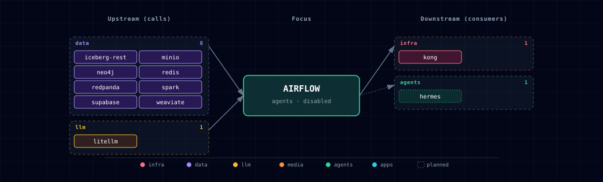

# 5.2.1. Apache Airflow (DAG orchestrator)

## 1. Overview

Airflow schedules and runs Python-defined DAGs against the stack's data services: Spark, MinIO, Iceberg, Supabase Postgres and LiteLLM. It is disabled by default. The `data-eng` track prompts for it, or pass `--airflow-source container`.

Airflow runs as four containers in the `agents` band:
- `airflow-webserver`: Web UI and REST API (`airflow api-server`).
- `airflow-scheduler`: LocalExecutor task runner. It starts after `airflow-webserver` is healthy, because tasks call the api-server's Execution API.
- `airflow-dag-processor`: parses DAG files into the metadata DB. Airflow 3 requires it as a separate service.
- `airflow-init`: runs on every start. It checks the database login, runs `airflow db migrate`, syncs the admin user and seeds Connections.

Image: `apache/airflow:3.3.2` (Apache 2.0), extended by `services/airflow/build/Dockerfile` with:
- nine providers: apache-spark, amazon, postgres, redis, common-sql, weaviate, neo4j, openai, fab;
- `pyspark[connect]==4.1.2` for the sample DAG's Spark Connect step (the `[connect]` extra pulls grpcio);
- Java 17, PySpark's `spark-submit` on `PATH`, and the S3A and Iceberg jars;
- `/opt/airflow/atlas-jars/atlas-lakehouse-smoke.jar`, built from source for the lakehouse smoke DAG.

LocalExecutor is the only supported executor; tasks run in the scheduler's process pool. The metadata DB is the `airflow` database on Supabase Postgres. `supabase-db-init` creates it (`services/supabase/db/scripts/05-scoped-roles.sh`); `airflow-init` checks the login and runs `airflow db migrate`.

## 2. Access

| Surface | URL | Auth |
|---|---|---|
| Web UI (direct) | `http://localhost:${AIRFLOW_PORT}` | `admin` / `${AIRFLOW_ADMIN_PASSWORD}` (FAB session cookie) |
| Web UI (Kong) | `http://airflow.localhost:${KONG_HTTP_PORT}` | Same |
| REST API | `http://airflow.localhost:${KONG_HTTP_PORT}/api/v2/` | JWT bearer: POST to `/auth/token` first (§6). `AIRFLOW__FAB__AUTH_BACKENDS` (basic auth) applies only to legacy FAB endpoints, not `/api/v2/`. |

`AIRFLOW_ADMIN_PASSWORD` is auto-generated on first run and persisted to `.env`. Treat it like any other secret.

## 3. Configuration

```bash
AIRFLOW_SOURCE=disabled              # container | disabled
AIRFLOW_IMAGE=apache/airflow:3.3.2
AIRFLOW_PORT=                        # auto-assigned (agents band)
AIRFLOW_DB_USER=airflow              # role on Supabase Postgres
AIRFLOW_DB_PASSWORD=                 # auto-generated
AIRFLOW_FERNET_KEY=                  # auto-generated (Connection-password encryption)
AIRFLOW_SECRET_KEY=                  # auto-generated (AIRFLOW__API__SECRET_KEY — signs inter-process payloads in Airflow 3.x)
AIRFLOW_JWT_SECRET=                  # auto-generated (AIRFLOW__API_AUTH__JWT_SECRET — signs Execution API JWTs; shared across webserver/scheduler/dag-processor)
AIRFLOW_ADMIN_PASSWORD=              # auto-generated (admin login)
```

Auto-managed (resolved by the bootstrapper from `AIRFLOW_SOURCE`; do not hand-edit): `AIRFLOW_WEBSERVER_SCALE`, `AIRFLOW_SCHEDULER_SCALE`, `AIRFLOW_DAG_PROCESSOR_SCALE`, `AIRFLOW_INIT_SCALE`.

**Execution API routing.** `airflow-scheduler` and `airflow-dag-processor` set `AIRFLOW__CORE__EXECUTION_API_SERVER_URL=http://airflow-webserver:8080/execution/` in `compose.yml`. Only `airflow-webserver` runs `airflow api-server`, so the upstream default (`http://localhost:8080/execution/`) is unreachable from the other containers. Without the override, every task fails at Pre-Execute with `httpcore.ConnectError`. The URL uses the Compose service name, so it works under any `PROJECT_NAME`. All three processes also share `AIRFLOW_JWT_SECRET`. Without it, the Execution API rejects task tokens with `403 InvalidSignatureError`.

## 4. Seeded Connections

`airflow-init` runs on every `./start.sh`. It seeds an Airflow Connection for each enabled sibling service, gated on that sibling's `_SOURCE` variable:

| Connection ID | Type | Target | Gated on |
|---|---|---|---|
| `postgres_supabase` | postgres | `supabase-db:5432/${SUPABASE_DB_NAME}` as the scoped reader `${AIRFLOW_ATLAS_DB_USER}` | always (required dep) |
| `litellm_default` | openai | `http://litellm:4000/v1` with `LITELLM_MASTER_KEY` (the `/v1` lives in conn.host because OpenAIHook ignores `api_base` extras) | always (LiteLLM is locked always-on) |
| `redis_default` | redis | `redis:6379` with `REDIS_PASSWORD` | always (Redis ships container-only always-on, auth-on by default) |
| `spark_default` | spark | `spark://spark-master:7077` with `deploy-mode=cluster`, `spark-binary=spark-submit` | `SPARK_SOURCE=container` |
| `minio_default` | aws (S3-compat) | `http://minio:9000` with root creds, path-style addressing, region `us-east-1` | `MINIO_SOURCE=container` |
| `weaviate_default` | weaviate | host `weaviate`, port `8080`, gRPC `weaviate:50051` (via extra) | `WEAVIATE_SOURCE=container` (NOT `localhost` — the in-Compose DNS does not resolve in host-mode) |
| `neo4j_default` | neo4j | host `neo4j-graph-db`, port `7687`, login `${GRAPH_DB_USER}`, password `${GRAPH_DB_PASSWORD}` (Hook prepends `bolt://`) | `NEO4J_GRAPH_DB_SOURCE=container` (same caveat) |

Seeding is idempotent: `airflow-init` deletes and re-adds each Connection on every start, so credential changes apply on the next `./start.sh`. For a `localhost` source, create the Connection yourself (for example `weaviate_default` pointing at `host.docker.internal`); `airflow-init` leaves it alone. It removes a source-gated Connection only in these cases:
- the source is `container` (the Connection is re-seeded) or `disabled`;
- a `localhost` source still has the in-Compose Connection Atlas seeded earlier (host `weaviate` / `neo4j-graph-db`).

**Trusted DAG boundary.** LocalExecutor does not sandbox DAG code. DAGs run in the scheduler's process pool and can read every seeded Connection. These hold MinIO root, LiteLLM master, Neo4j administrator, the scoped Supabase reader role (`AIRFLOW_ATLAS_DB_USER`) and Redis credentials. Only trusted authors may supply DAGs. Atlas does not provide tenant isolation for untrusted DAG code.

**Reading a seeded Connection outside a task.** DAG tasks use hooks and operators, for example `S3Hook(aws_conn_id="minio_default")` and `SparkSubmitOperator(conn_id="spark_default")`. Scripts run with `docker exec … python` are outside a task execution context. There, `BaseHook.get_connection()` or hook construction can raise `AirflowNotFoundException`, even though `airflow connections get minio_default` shows the row. In preflight scripts, read the metadata DB directly:

```python
from airflow.models import Connection
from airflow.settings import Session

with Session() as session:
    conn = session.query(Connection).filter(Connection.conn_id == "minio_default").one()
```

The same pattern works for `spark_default`. Use direct `airflow.settings.Session` + `airflow.models.Connection` access only in standalone health or preflight scripts. DAG tasks should keep using hooks/operators so masking, provider behaviour and task-context rules stay intact.

## 5. Sample DAG

`services/airflow/dags/example_etl_with_llm.py` ships pre-loaded. It is scheduled `@daily` with `catchup=False`, and runs three `PythonOperator` steps that smoke-test the stack:

1. `spark_smoke` checks that the Spark cluster answers through Spark Connect at `sc://spark-connect:15002` (`pyspark[connect]`). It does not use the seeded `spark_default` Connection, which points at `spark://spark-master:7077` for `SparkSubmitOperator` DAGs.
2. `summarize_via_litellm` calls LiteLLM's chat-completions endpoint through `OpenAIHook.get_conn()`. It defaults to `ollama/qwen3.8:latest`. With `--llm-provider-source none` and `CLOUD_OPENAI_SOURCE=enabled`, switch to a cloud model such as `gpt-4o-mini`.
3. `list_minio_buckets` calls `S3Hook.list_buckets()` against `minio_default`.

A commented LangChain block at the end of the file shows chain-based LLM steps in a `PythonOperator`. Apache publishes no LangChain provider, so wrap chains in a Python callable.

Use it as a template. Put your own DAGs in `services/airflow/dags/`. The folder is bind-mounted into the scheduler, DAG processor and API server.

### 5.1. Lakehouse SparkSubmit smoke

`services/airflow/dags/lakehouse_spark_submit_smoke.py` is a manual DAG (`schedule=None`) for the data-engineering track. It prepares a tiny landing object, uploads the image-built validation JAR to `s3a://jars/atlas/lakehouse-smoke/latest/atlas-lakehouse-smoke.jar`, and runs the Atlas `SparkSubmitOperator` subclass with `deploy_mode="cluster"` against `spark://spark-master:7077`.

Cluster deploy mode is the default: the driver runs on a Spark worker, which already has the S3A and Iceberg jars. The Airflow image carries the same jars, so the submit client resolves S3A paths and client-mode runs do not fail on missing classes.

**Driver status through `:6066`.** The provider polls post-submit driver status over the `spark_default` RPC port (`:7077`). The standalone master reports status only over REST on `spark-master:6066` (backend network only; no host port or Kong route). `AtlasSparkSubmitOperator` therefore wraps the provider hook in `RestConfirmingSparkHook` (`dags/atlas_spark_utils.py`). The wrapper:
- turns off the `:7077` poll;
- streams spark-submit output into the task log and reads the driver ID (`driver-YYYYMMDDHHMMSS-NNNN`);
- fails the task if spark-submit exits non-zero or no driver ID is found;
- fails the task unless `:6066` reports `FINISHED` with success;
- kills the cluster driver through `:6066` when the task is killed, marked failed or times out (the smoke DAG sets a 30-minute `execution_timeout`).

The wrapper uses internals of `apache-airflow-providers-apache-spark==5.6.0`, so the image pins that exact version. To reuse it, copy the `AtlasSparkSubmitOperator` class from `lakehouse_spark_submit_smoke.py`. The smoke DAG passes explicit S3A, Iceberg REST and event-log settings:

```python
AtlasSparkSubmitOperator(
    task_id="submit_lakehouse_s3a_jar",
    conn_id="spark_default",
    application="s3a://jars/atlas/lakehouse-smoke/latest/atlas-lakehouse-smoke.jar",
    java_class="com.atlas.spark.LakehouseSmoke",
    deploy_mode="cluster",
    rest_host="spark-master",
    conf={
        "spark.hadoop.fs.s3a.endpoint": "http://minio:9000",
        "spark.sql.catalog.lakehouse.uri": "http://iceberg-rest:8181",
        "spark.eventLog.enabled": "true",
        "spark.eventLog.dir": "s3a://spark-history/",
    },
)
```

Validation flow:

```bash
./start.sh --track data-eng \
  --airflow-source container \
  --spark-source container \
  --iceberg-rest-source container \
  --minio-source container
```

New DAGs start paused, so unpause `lakehouse_spark_submit_smoke` first. Trigger it in the UI at `http://airflow.localhost:${KONG_HTTP_PORT}`, or use the REST flow in §6. A successful run writes `lakehouse.bronze.airflow_spark_submit_smoke` and leaves an event log in Spark History (`http://spark-history.localhost:${KONG_HTTP_PORT}`). If it fails:
- before submission: check that `airflow-init` seeded `minio_default` and `spark_default`;
- after Spark ran, with a status failure in Airflow: check that the scheduler can reach `http://spark-master:6066`;
- during Spark execution: inspect the driver in the master UI and the app in Spark History.

## 6. Triggering DAGs over the REST API (Hermes and other clients)

Hermes has no built-in Airflow client. A Hermes skill, or any other client, triggers a DAG over the REST API. Airflow 3's `/api/v2/` uses JWT bearer tokens, not HTTP basic auth, so this takes two steps:

```bash
# 1. Exchange admin password for a short-lived JWT.
TOKEN=$(curl -fsS -X POST \
  -H 'Content-Type: application/json' \
  -d "{\"username\":\"admin\",\"password\":\"${AIRFLOW_ADMIN_PASSWORD}\"}" \
  http://airflow.localhost:${KONG_HTTP_PORT}/auth/token | jq -r .access_token)

# 2. Trigger the DAG. `logical_date` is REQUIRED-but-nullable in
# Airflow 3.x's TriggerDAGRunPostBody schema — omit it and the API
# returns 422. Set to null to let the scheduler assign one.
curl -fsS -X POST \
  -H "Authorization: Bearer $TOKEN" \
  -H 'Content-Type: application/json' \
  -d '{"logical_date": null, "conf": {}}' \
  http://airflow.localhost:${KONG_HTTP_PORT}/api/v2/dags/example_etl_with_llm/dagRuns
```

New DAGs start paused. Unpause the DAG in the UI before you trigger it.

## 7. Dependencies & Integrations

### 7.1. Current — Upstream (this service calls)

| Service | Category | Status |
|---|---|---|
| iceberg-rest | data | current |
| minio | data | current |
| neo4j | data | optional: an operator-authored DAG; airflow-init only seeds the Connection |
| redis | data | optional: an operator-authored DAG; airflow-init only seeds the Connection |
| redpanda | data | optional: an operator-authored DAG; Atlas passes only SPARK_KAFKA_BOOTSTRAP_SERVERS |
| spark | data | current |
| supabase | data | current |
| weaviate | data | optional: an operator-authored DAG; airflow-init only seeds the Connection |
| litellm | llm | current |

### 7.2. Current — Downstream (services that call this)

_Rows marked planned are documented or intended, not wired yet._

| Service | Category | Status |
|---|---|---|
| kong | infra | current |
| hermes | agents | planned |

### 7.3. Architecture diagram



[Open the full-size diagram](./architecture.html) for a full-screen view.

### 7.4. Future — Missing pair integrations

_No high-confidence opportunities identified._

### 7.5. Future — Candidate new services

_No high-confidence opportunities identified._

### 7.6. Future — Unused features in this service

_No high-confidence opportunities identified._

## 8. Troubleshooting

- **`airflow-init` fails with "database does not exist"** — the Airflow database is created by `supabase-db-init`. `airflow-init` depends_on `supabase-db-init: service_completed_successfully`, so this points at a failed or skipped db-init: check `docker logs ${PROJECT_NAME}-supabase-db-init`, then `docker logs ${PROJECT_NAME}-airflow-init` for the psql error.
- **Web UI login rejected** — `AIRFLOW_ADMIN_PASSWORD` in `.env` may have rotated. Check the value; if rotated, `airflow-init` re-runs and re-syncs the admin user on next `./start.sh`.
- **Deferrable operators never resume** — Atlas runs no `airflow-triggerer` service, so a task using `deferrable=True` or an async sensor defers and stays deferred. Use the non-deferrable form of the operator.
- **Spark submit stays SUBMITTED / waiting for cores** — the standalone pool is 2 workers × 2 cores by default. `SPARK_WORKER_CORES` is unset, so each worker offers the 2 CPUs of `SPARK_WORKER_CPU_LIMIT`. Spark Connect holds `SPARK_CONNECT_CORES_MAX` (1) and Zeppelin's interpreter `ZEPPELIN_SPARK_CORES_MAX` (1). A cluster-mode submit needs one core for its driver plus one for an executor, so with `SPARK_WORKER_COUNT=1` it cannot start until another app releases cores.
- **DAG appears in the UI but does not run** — New DAGs start paused (Airflow default `dags_are_paused_at_creation=True`); unpause the DAG in the UI. If the DAG shows an import error, read `docker logs ${PROJECT_NAME}-airflow-dag-processor`. The DAG processor finds new files every 300 s (`[dag_processor] refresh_interval`) and re-parses known files every 30 s.
- **`summarize_via_litellm` (OpenAIHook) fails with `auth required`** — `litellm_default` Connection has the wrong `LITELLM_MASTER_KEY`. Re-run `./start.sh` to re-sync the Connection; alternatively edit it in the Web UI under Admin → Connections.
- **`spark_smoke` cannot reach `sc://spark-connect:15002`** (or a user DAG cannot reach `spark://spark-master:7077`):
  - Spark is disabled (`SPARK_SOURCE=disabled`). Start with `--spark-source container`, or remove the Spark steps from the DAG.
  - It is the first run after start-up, and spark-connect is still binding port 15002 (20-60 s). The DAG's `retries: 1` with `retry_delay: 2m` usually covers this. If not, trigger the DAG again.
- **`ModuleNotFoundError: No module named 'pyspark'`** — the running container predates the current image. Run `./start.sh`; it rebuilds stale local images.

## 9. Capabilities & limitations

Support tier: **experimental** — Capability contract declared; no cited cold-start, workflow, or upgrade qualification run yet (evidence at `v0.1.0`).

| Capability | Status | Verification | Notes |
|---|---|---|---|
| Code-defined DAG orchestration | supported | tested | Atlas runs Airflow 3 with a separate API server, scheduler, DAG processor, and init path, using LocalExecutor for operator-authored DAGs. |
| Untrusted DAG code isolation | not-supported | tested | LocalExecutor operator-authored DAGs execute unsandboxed. Their Airflow Connections hold MinIO root, LiteLLM master, Neo4j administrator, scoped Supabase reader, and Redis password credentials. Admit only trusted DAG authors. |
| Seeded stack service connections | partial | tested | Init seeds LiteLLM, Redis, Supabase, and enabled container-only lakehouse or graph connections; localhost variants are deliberately not mapped to unusable Compose DNS names. |
| Spark lakehouse job execution | partial | tested | Bundled DAGs and jars exercise SparkSubmit and lakehouse configuration, but live Spark, MinIO, Iceberg, and Redpanda execution remains an operator-run smoke path. |
| Airflow UI and API authentication | supported | tested | Direct and CORS-only Kong surfaces rely on Airflow FAB login for the UI and JWT exchange for /api/v2. Kong adds routing but no second authentication gate. |
| Distributed executor and control-plane HA | not-supported | documented | Atlas fixes one scheduler, API server, and DAG processor around LocalExecutor; it configures neither Celery/KubernetesExecutor nor a multi-replica Airflow control plane. |
