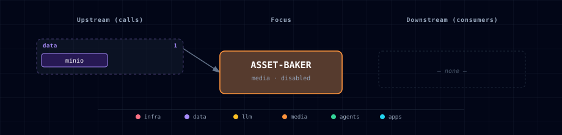

# 5.2.2. Asset Baker

## 1. Overview

Asset Baker is Atlas' containerized **Blender headless HP→LP bake worker**. It turns messy AI-generated high-poly meshes — the interpenetrating shells/flaps, texture distortion, and missing normal maps that make img2mesh output unusable as game/web assets — into clean low-poly GLBs with a baked BaseColor + tangent-normal map. The pipeline is the industry HP→LP bake: **voxel-remesh → decimate → fresh Smart-UV → selected-to-active bake** of color + normal from the original.

It is a **distinct service from the [Asset Worker](../asset-worker/README.md)** (#343): that Node/glTF-Transform worker does weld/simplify/compress and *cannot* voxel-remesh, regenerate UVs, or bake textures/normals — those need Blender. Asset Baker rides the same content-addressed MinIO artifact schema and sits behind the same `/assets/*` route family, so `generate → image→3D → bake (this) → optimize (asset-worker)` speak one job idiom while remaining separate containers (Blender vs Node images).

It is **disabled by default** (`ASSET_BAKER_SOURCE=disabled`); the recommended enabled mode is `container-cpu`. Cycles bakes on **CPU** by design: deterministic, runs anywhere (CI, Linux prod), measured 30–200 s/asset at 2k textures, and GPU-contention-safe (Docker on macOS can't pass Metal into a container anyway). GPU (`container-gpu`) and managed `localhost` are deferred until separate lifecycle/performance evidence exists. The Blender image is ~1.5–2.5 GB, so the service is track-membered (`gen-ai-creative`) and never always-on.

There is **no MCP surface, by design**: this is a deterministic batch stage whose instructions are job parameters, not a conversational agent. (The `blender-mcp` addon also refuses to start under `blender -b`, and making the one reliably-deterministic pipeline stage agent-dependent would forfeit reproducibility/CI-testability. The agentic Blender need belongs to the separate `blender-mcp` service.)

## 2. Access

| Surface | URL | Notes |
|---|---|---|
| Direct API | `http://localhost:${ASSET_BAKER_PORT}` | Host-side FastAPI service when `ASSET_BAKER_SOURCE=container-cpu`. |
| Kong alias | `http://asset-baker.localhost:${KONG_HTTP_PORT}` | Requires `./start.sh --setup-hosts`; generated only when the service is enabled. |
| Internal API | `http://asset-baker:8096` | Used by sibling containers through `ASSET_BAKER_ENDPOINT`. |
| Health | `GET /health` | Returns `200` only when the configured Blender executable is available; otherwise returns `503`. |
| Metrics | `GET /metrics` | Prometheus request counters and duration histograms; intentionally unauthenticated for in-network scraping. |

Every route except `GET /health` and `GET /metrics` requires `Authorization: Bearer ${ASSET_BAKER_API_TOKEN}`. Atlas generates the token on first startup; requests fail closed with `503` if authentication is not configured.

## 3. Configuration

| Variable | Default | Purpose |
|---|---:|---|
| `ASSET_BAKER_SOURCE` | `disabled` | Enables the containerized worker when set to `container-cpu`. |
| `ASSET_BAKER_IMAGE` | `python:3.12.9-slim` | Base image; the Dockerfile downloads pinned Blender on top. |
| `ASSET_BAKER_BLENDER_VERSION` | `4.3.2` | Pinned headless Blender (≥ 4.3) installed in the image; bundles Python + numpy. |
| `ASSET_BAKER_BLENDER_SHA256` | `4da1c956...a5592e6` | Published SHA-256 verified before the pinned Blender archive is extracted. |
| `ASSET_BAKER_PORT` | computed | Host port assigned by Atlas' topology allocator. |
| `ASSET_BAKER_API_TOKEN` | generated | Bearer token required by upload, reference-bake, and artifact-download routes. |
| `ASSET_BAKER_ALLOWED_INPUT_BUCKETS` | _(blank)_ | Optional comma- or space-separated MinIO bucket allowlist. Blank follows `MINIO_BUCKET_ASSET_INPUTS`. |
| `ASSET_BAKER_ARTIFACT_DIR` | `/data/artifacts` | Local cache path for baked outputs and direct downloads. |
| `ASSET_BAKER_MINIO_ENABLED` | `true` | Writes baked GLB + textures to MinIO when enabled. |
| `ASSET_BAKER_MINIO_BUCKET` | `asset-baker` | Output bucket for content-addressed artifacts. |
| `ASSET_BAKER_MINIO_ENDPOINT` | auto-managed | Internal MinIO S3 API endpoint. |
| `ASSET_BAKER_MINIO_ACCESS_KEY` / `ASSET_BAKER_MINIO_SECRET_KEY` | empty | Optional credential override; compose otherwise uses the generated `MINIO_ASSET_BAKER_*` scoped account. |
| `ASSET_BAKER_TARGET_TRIS` | `39000` | Default low-poly triangle budget (overridable per request). |
| `ASSET_BAKER_TEX_SIZE` | `2048` | Default baked texture resolution (square). |
| `ASSET_BAKER_CANONICAL_SIZE` | `4.0` | Canonical max-dimension each mesh is scaled to before remesh. |
| `ASSET_BAKER_BRIGHTNESS_MIN` | `0.05` | Mean-brightness QA gate; a baked color mean below this is refused. |
| `ASSET_BAKER_TIMEOUT_SECONDS` | `600` | Hard wall-clock ceiling per bake subprocess. |
| `ASSET_BAKER_MAX_UPLOAD_MB` | `200` | Maximum accepted GLB input size (MiB). |
| `ASSET_BAKER_CONCURRENCY` | `1` | Maximum concurrent bakes; default 1 (one bake saturates CPU). |

Enable from the CLI with:

```bash
./start.sh --asset-baker-source container-cpu
```

The default `ASSET_BAKER_SOURCE=disabled` keeps the ~2 GB Blender worker out of normal starts until a creative or 3D workflow needs it.

### 3.1. Pinned Blender runtime

The image installs a **pinned, checksum-verified** headless Blender at build time (`services/asset-baker/app/Dockerfile`). The build is reproducible and source-host-independent:

| Property | Value |
|---|---|
| Version | `ASSET_BAKER_BLENDER_VERSION` (default `4.3.2`) |
| Artifact | `blender-<version>-linux-x64.tar.xz` |
| Integrity | `ASSET_BAKER_BLENDER_SHA256` (default `4da1c956…a5592e6`), verified with `sha256sum -c` before extraction |
| Architecture | **`linux/amd64` (x86_64) only** — Blender ships no official `linux-arm64` build; the Dockerfile fails fast with an actionable message on any other architecture (build with `--platform=linux/amd64` on Apple Silicon) |
| License | Blender is **GNU GPL-2.0-or-later**; it runs as a separate headless subprocess (`blender -b`), not linked into Atlas code, so it imposes no license obligation on Atlas itself |

**Download source.** The canonical `download.blender.org` returns HTTP 403 to automated clients ([#505](https://github.com/thekaveh/atlas/issues/505)), so the build fetches from the official Blender **mirror network**, trying each in turn (`ftp.nluug.nl`, `mirror.clarkson.edu`, `mirrors.ocf.berkeley.edu`, `mirrors.dotsrc.org`) until one succeeds. Because the SHA-256 is verified regardless of host, the mirror is interchangeable and a single mirror outage does not break the build. A clean `docker build` therefore succeeds without any developer cache, and a build-time smoke step asserts `blender --version` matches the pinned version.

**Updating the pin.** Pick the new version, download its `blender-<version>-linux-x64.tar.xz` and the matching `blender-<version>.sha256` from any mirror above, then set `ASSET_BAKER_BLENDER_VERSION` + `ASSET_BAKER_BLENDER_SHA256` (in `.env`, or the `service.yml` defaults) to the new version and its published checksum.

## 4. API Contract

### 4.1. Uploaded GLB

`POST /assets/bake` accepts `multipart/form-data`:

```bash
curl -H "Authorization: Bearer ${ASSET_BAKER_API_TOKEN}" \
  -F file=@mesh.glb \
  "http://localhost:${ASSET_BAKER_PORT}/assets/bake"
```

| Field | Required | Notes |
|---|---:|---|
| `file` | yes | Raw `.glb` file (plain GLB, not EXT_meshopt_compressed). |
| `target_tris` | no | Low-poly triangle budget for the decimate stage. Defaults to `ASSET_BAKER_TARGET_TRIS`. |
| `tex_size` | no | Baked BaseColor/Normal texture resolution (square). Defaults to `ASSET_BAKER_TEX_SIZE`. |
| `canonical_size` | no | Canonical max-dimension normalization scale. Defaults to `ASSET_BAKER_CANONICAL_SIZE`. |
| `mode` | no | `bake` (full HP→LP + texture bake, default) or `skip` (foliage bypass — normalize + export, no remesh/bake). |

### 4.2. MinIO Referenced GLB

`POST /assets/bake/ref` accepts JSON:

```json
{
  "input": {"bucket": "raw-assets", "key": "incoming/cottage.glb"},
  "params": {"target_tris": 15000, "tex_size": 2048, "mode": "bake"}
}
```

The request bucket must be listed in `ASSET_BAKER_ALLOWED_INPUT_BUCKETS`; other buckets return `403` before MinIO is contacted.
Populate the default `raw-assets` bucket with the generated
`MINIO_ASSET_INGEST_ACCESS_KEY` and `MINIO_ASSET_INGEST_SECRET_KEY`; that
identity can write inputs without receiving MinIO root or processor-output access.

### 4.3. Response

Both endpoints return a content-addressed artifact envelope — the baked LP GLB plus its BaseColor/Normal textures:

```json
{
  "status": "succeeded",
  "sha256": "<lp-glb-sha256>",
  "artifact": {
    "storage": "minio",
    "bucket": "asset-baker",
    "key": "bake/<sha256>.glb",
    "uri": "s3://asset-baker/bake/<sha256>.glb",
    "content_type": "model/gltf-binary"
  },
  "textures": [
    {"role": "basecolor", "storage": "minio", "bucket": "asset-baker", "key": "bake/<sha>.png", "content_type": "image/png"},
    {"role": "normal",    "storage": "minio", "bucket": "asset-baker", "key": "bake/<sha>.png", "content_type": "image/png"}
  ],
  "summary": {"mode": "bake", "faces_in": 98000, "tris_out": 15000, "shells_kept": 1, "color_mean": 0.34, "duration_s": 72.0},
  "download_url": null
}
```

When `ASSET_BAKER_MINIO_ENABLED=false`, artifacts are stored under `ASSET_BAKER_ARTIFACT_DIR/bake/<sha256>.{glb,png}` and `download_url=/assets/artifacts/<sha256>.glb`. A `skip` (foliage) bake emits `textures: []` and `color_mean: null`.

Failure statuses: `400` (empty / non-GLB), `413` (over `ASSET_BAKER_MAX_UPLOAD_MB`), `422` (bake failed — including the **black-bake QA gate**), `429` (worker busy — bounded concurrency), `504` (bake timeout).

## 5. Architecture & Wiring

The worker spawns a headless Blender subprocess (`blender -b -P bake.py`) per request and enforces bounds (size, timeout, concurrency=1, temp-file cleanup) around it. The bake pipeline (`bake.py`, ported from DayDreams' battle-tested `spikes/one-cell/bake_lp.py`) runs per source:

1. **Import → join → canonical-normalize.** All meshes are joined and scaled to `canonical_size` max-dimension **before** remeshing — raw GLBs aren't meter-scale and the relative voxel/ray heuristics explode without it (a 0.99 m "cottage" otherwise remeshes to 8.3 M faces). The base is rested at `z=0`.
2. **Voxel-remesh** fuses the interpenetrating shells/flaps that cause tilt/floaters into one watertight surface.
3. **Debris-shell drop** removes loose fragments below `MIN_SHELL_FACES`.
4. **Decimate** to `target_tris` (skipped if already under).
5. **Uniform smooth shading** (hard normals corrupt cage baking) + clear seams.
6. **Smart-UV Project by angle** + pack — seam-based unwrap *fails* on remeshed surfaces.
7. **Two-pass selected-to-active bake** (tight + far-fallback, numpy composite of missed texels) of DIFFUSE/COLOR and TANGENT normal from the original into fresh textures.
8. **Mean-brightness QA gate**, then export `<name>_LP.glb` + `BaseColor.png` + `Normal.png`.

**Hard-won correctness rules encoded as tested invariants** (each cost DayDreams a real shipped defect):

- **Metallic neutralization** — img2mesh sources ship `metallic=1.0`; a fully-metallic BSDF has no diffuse, so COLOR bakes come out pure black. The worker neutralizes metallic on the bake source in-memory only.
- **Mean-brightness gate** — a baked color mean below `ASSET_BAKER_BRIGHTNESS_MIN` is a silently-failed bake and is refused with a non-zero result (`422`), never shipped. Re-enforced at the worker boundary.
- **Canonical-scale normalization** before remeshing (above).
- **Smart-UV by angle only** — seam-based unwrap fails on remeshed surfaces.
- **Foliage bypass** (`mode=skip`) — thin leaf-shell meshes fragment into shards under remesh+decimate, so foliage is normalized and re-exported without remesh/bake. Rule: buildings/props → `bake`; foliage → `skip`.
- **Per-source isolation + JSON summary** — one bad asset never aborts a batch; a machine-readable summary drives the gate and content-addressing.

Outputs are SHA-256 content-addressed and written to MinIO (`bake/<sha256>.{glb,png}`) or the local artifact cache, reusing the Asset Worker (#343) schema. The service is intentionally separate from the media gateway; image-to-3D tickets submit raw provider GLB to this worker rather than embedding bake logic in each adapter.

## 6. Dependencies & Integrations

### 6.1. Current — Upstream (this service calls)

| Service | Category |
|---|---|
| minio | data |

### 6.2. Current — Downstream (services that call this)

| Service | Category |
|---|---|
| kong | infra |
| prometheus | infra |

### 6.3. Architecture diagram



[Open the interactive HTML diagram](./architecture.html) for a full-screen view.

### 6.4. Future — Missing pair integrations

- Backend media operations should call Asset Baker after hosted image-to-3D providers return raw GLB, before Asset Worker's optimize pass, forming the `generate → image→3D → bake → optimize` chain.
- Once a durable media-operation/Celery contract exists (#339), the bake step should ride the shared `queued|running|succeeded|failed|cancelled|timeout` operation idiom instead of the current synchronous bounded API.

### 6.5. Future — Candidate new services

- A `creative-3d` wizard track should split from `gen-ai-creative` once the 3D fleet (gateway, image→3D, bake, segment, terrain) reaches ~5+ services.

### 6.6. Future — Unused features in this service

- GPU baking (`container-gpu`, Cycles OPTIX/CUDA) is a fleet-scale optimization, deferred until separate performance evidence exists. The `bake.py` `--gpu` path exists but is not exposed as a source variant.
- Managed host `localhost` (a `/Applications/Blender.app` on the developer machine, mirroring the ComfyUI managed-MPS pattern) is deferred until separate lifecycle evidence exists.

## 7. Troubleshooting

- `400 Input must be a GLB file`: use a `.glb` filename and a binary GLB payload; decompress EXT_meshopt GLBs to plain GLB first (Blender 4.3 can't import meshopt).
- `422 baked color is black`: the mean-brightness QA gate fired — typically a `metallic=1` source (neutralized automatically, but check the source's textures) or dead UVs. The bake is refused rather than shipping a black asset.
- Thin foliage fragments into shards: pass `mode=skip` (foliage bypass) — buildings/props bake, foliage skips.
- `429 Bake worker is busy`: bounded concurrency (`ASSET_BAKER_CONCURRENCY`, default 1) rejected a concurrent bake; retry after the in-flight bake finishes.
- `504` bake timeout: raise `ASSET_BAKER_TIMEOUT_SECONDS` or lower `tex_size`/`target_tris` for very heavy assets.
- `401 Invalid Asset Baker bearer token`: pass `Authorization: Bearer ${ASSET_BAKER_API_TOKEN}`.
- `403 Input bucket is not allowed`: add the intended bucket to `ASSET_BAKER_ALLOWED_INPUT_BUCKETS`; do not broaden the list to unrelated or private buckets.
- MinIO upload failure: confirm `MINIO_SOURCE=container`, `ASSET_BAKER_MINIO_BUCKET`, and the generated `MINIO_ASSET_BAKER_*` credentials.
- Kong alias missing: confirm `ASSET_BAKER_SOURCE=container-cpu`, run `./start.sh --setup-hosts`, and regenerate routes through the normal startup flow.
