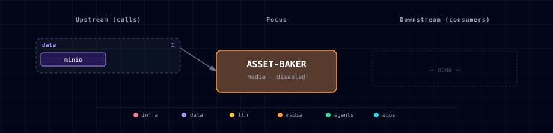

# 5.2.2. Asset Baker

## 1. Overview

Asset Baker is Atlas' containerized **Blender headless HP→LP bake worker**. It turns AI-generated high-poly meshes into clean low-poly GLBs with a baked BaseColor map and a tangent-space normal map. Raw img2mesh output has interpenetrating shells, texture distortion and no normal map. The pipeline is **voxel-remesh → decimate → fresh Smart-UV → selected-to-active bake** of color and normal from the original.

It is a **separate service from the [Asset Worker](../asset-worker/README.md)**. Asset Worker (Node, glTF-Transform) welds, simplifies and compresses. It *cannot* voxel-remesh, regenerate UVs or bake textures and normals; those steps need Blender. Both use the same content-addressed MinIO artifact schema. Asset Baker serves its own `asset-baker.localhost` route; the Backend gateway has no bake route. The intended chain is `generate → image→3D → bake (this) → optimize (asset-worker)`.

It is **disabled by default** (`ASSET_BAKER_SOURCE=disabled`); the supported enabled mode is `container-cpu`. Cycles bakes on **CPU** for determinism and portability (CI, Linux), and Docker on macOS cannot pass Metal into a container. A bake takes 30–200 s per asset at 2k textures. GPU (`container-gpu`) and managed `localhost` wait for separate lifecycle and performance evidence. The image is ~1.5–2.5 GB, so only the `gen-ai-creative` track offers it.

There is **no MCP surface, by design**: this is a deterministic batch stage driven by job parameters. The `blender-mcp` add-on also refuses to start under `blender -b`. For agent-driven Blender, use [Blender MCP](../blender-mcp/README.md).

## 2. Access

| Surface | URL | Notes |
|---|---|---|
| Direct API | `http://localhost:${ASSET_BAKER_PORT}` | Host-side FastAPI service when `ASSET_BAKER_SOURCE=container-cpu`. |
| Kong alias | `http://asset-baker.localhost:${KONG_HTTP_PORT}` | Requires `./start.sh --setup-hosts`; generated only when the service is enabled. |
| Internal API | `http://asset-baker:8096` | Used by sibling containers through `ASSET_BAKER_ENDPOINT`. |
| Health | `GET /health` | Returns `200` only when the configured Blender executable is available; otherwise returns `503`. |
| Metrics | `GET /metrics` | Prometheus request counters and duration histograms; intentionally unauthenticated for in-network scraping. |

Every route except `GET /health` and `GET /metrics` requires `Authorization: Bearer ${ASSET_BAKER_API_TOKEN}`. Atlas generates the token on first startup; requests fail closed with `503` if authentication is not configured.

## 3. Configuration

| Variable | Default | Purpose |
|---|---:|---|
| `ASSET_BAKER_SOURCE` | `disabled` | Enables the containerized worker when set to `container-cpu`. |
| `ASSET_BAKER_IMAGE` | `python:3.12.9-slim` | Base image; the Dockerfile downloads pinned Blender on top. |
| `ASSET_BAKER_BLENDER_VERSION` | `4.3.2` | Pinned headless Blender (≥ 4.3) installed in the image; bundles Python + numpy. |
| `ASSET_BAKER_BLENDER_SHA256` | `4da1c956...a5592e6` | Published SHA-256 verified before the pinned Blender archive is extracted. |
| `ASSET_BAKER_PORT` | computed | Host port assigned by Atlas' topology allocator. |
| `ASSET_BAKER_API_TOKEN` | generated | Bearer token required by upload, reference-bake, and artifact-download routes. |
| `ASSET_BAKER_ALLOWED_INPUT_BUCKETS` | _(blank)_ | Optional comma- or space-separated MinIO bucket allowlist. Blank follows `MINIO_BUCKET_ASSET_INPUTS`. |
| `ASSET_BAKER_ARTIFACT_DIR` | `/data/artifacts` | Local cache path for baked outputs and direct downloads. |
| `ASSET_BAKER_MINIO_ENABLED` | `true` | Writes baked GLB + textures to MinIO when enabled. |
| `ASSET_BAKER_MINIO_BUCKET` | `asset-baker` | Output bucket for content-addressed artifacts. |
| `ASSET_BAKER_MINIO_ENDPOINT` | auto-managed | Internal MinIO S3 API endpoint. |
| `ASSET_BAKER_MINIO_ACCESS_KEY` / `ASSET_BAKER_MINIO_SECRET_KEY` | empty | Optional credential override; compose otherwise uses the generated `MINIO_ASSET_BAKER_*` scoped account. |
| `ASSET_BAKER_TARGET_TRIS` | `39000` | Default low-poly triangle budget (overridable per request). |
| `ASSET_BAKER_TEX_SIZE` | `2048` | Default baked texture resolution (square). |
| `ASSET_BAKER_CANONICAL_SIZE` | `4.0` | Canonical max-dimension each mesh is scaled to before remesh. |
| `ASSET_BAKER_BRIGHTNESS_MIN` | `0.05` | Mean-brightness QA gate; a baked color mean below this is refused. |
| `ASSET_BAKER_TIMEOUT_SECONDS` | `600` | Hard wall-clock ceiling per bake subprocess. |
| `ASSET_BAKER_MAX_UPLOAD_MB` | `200` | Maximum accepted GLB input size (MiB). |
| `ASSET_BAKER_CONCURRENCY` | `1` | Maximum concurrent bakes; default 1 (one bake saturates CPU). |

Enable from the CLI with:

```bash
./start.sh --asset-baker-source container-cpu
```

The default `ASSET_BAKER_SOURCE=disabled` keeps the ~2 GB Blender worker out of normal starts until a creative or 3D workflow needs it.

### 3.1. Pinned Blender runtime

The image installs a **pinned, checksum-verified** headless Blender at build time (`services/asset-baker/app/Dockerfile`). The build is reproducible and source-host-independent:

| Property | Value |
|---|---|
| Version | `ASSET_BAKER_BLENDER_VERSION` (default `4.3.2`) |
| Artifact | `blender-<version>-linux-x64.tar.xz` |
| Integrity | `ASSET_BAKER_BLENDER_SHA256` (default `4da1c956…a5592e6`), verified with `sha256sum -c` before extraction |
| Architecture | **`linux/amd64` (x86_64) only** — Blender ships no official `linux-arm64` build; the Dockerfile fails fast with an actionable message on any other architecture. The compose service pins `platform: ${ASSET_BAKER_PLATFORM:-linux/amd64}`, so an arm64 host (Apple Silicon) builds and runs it under emulation |
| License | Blender is **GNU GPL-2.0-or-later**. It runs as a separate headless subprocess (`blender -b`) and is not linked into Atlas code. What redistributing a built image requires is open item R-BUILD in the [license inventory](../../docs/reference/license-inventory.md) |

**Download source.** `download.blender.org` returns HTTP 403 to automated clients. The build therefore fetches from the official Blender **mirror network** and tries each mirror in turn: `ftp.nluug.nl`, `mirror.clarkson.edu`, `mirrors.ocf.berkeley.edu`, `mirrors.dotsrc.org`. The SHA-256 is verified whatever the host, so one mirror outage does not break the build. A clean `docker build` needs no developer cache. A build-time smoke step asserts that `blender --version` matches the pin.

**Updating the pin.**

1. Download `blender-<version>-linux-x64.tar.xz` and `blender-<version>.sha256` from a mirror above.
2. Set `ASSET_BAKER_BLENDER_VERSION` to the new version, in `.env` or the `service.yml` defaults.
3. Set `ASSET_BAKER_BLENDER_SHA256` to its published checksum in the same place.

## 4. API Contract

### 4.1. Uploaded GLB

Input rules are the same as for the [Asset Worker](../asset-worker/README.md) (§4.1): a self-contained binary glTF 2.0 file whose `buffers[].uri` and `images[].uri` are `data:` URIs only. Other input returns `400` before Blender runs.

`POST /assets/bake` accepts `multipart/form-data`:

```bash
curl -H "Authorization: Bearer ${ASSET_BAKER_API_TOKEN}" \
  -F file=@mesh.glb \
  "http://localhost:${ASSET_BAKER_PORT}/assets/bake"
```

| Field | Required | Notes |
|---|---:|---|
| `file` | yes | Raw `.glb` file (plain GLB, not EXT_meshopt_compressed). |
| `target_tris` | no | Low-poly triangle budget for the decimate stage. Defaults to `ASSET_BAKER_TARGET_TRIS`. |
| `tex_size` | no | Baked BaseColor/Normal texture resolution (square). Defaults to `ASSET_BAKER_TEX_SIZE`. |
| `canonical_size` | no | Canonical max-dimension normalization scale. Defaults to `ASSET_BAKER_CANONICAL_SIZE`. |
| `mode` | no | `bake` (full HP→LP + texture bake, default) or `skip` (foliage bypass — normalize + export, no remesh/bake). |

### 4.2. MinIO Referenced GLB

`POST /assets/bake/ref` accepts JSON:

```json
{
  "input": {"bucket": "raw-assets", "key": "incoming/cottage.glb"},
  "params": {"target_tris": 15000, "tex_size": 2048, "mode": "bake"}
}
```

The bucket must be in `ASSET_BAKER_ALLOWED_INPUT_BUCKETS`; other buckets return `403` before MinIO is contacted. Write inputs to `raw-assets` with the ingest credentials described in [Asset Worker](../asset-worker/README.md) §4.2.

### 4.3. Response

Both endpoints return a content-addressed artifact envelope — the baked LP GLB plus its BaseColor/Normal textures:

```json
{
  "status": "succeeded",
  "sha256": "<lp-glb-sha256>",
  "artifact": {
    "storage": "minio",
    "bucket": "asset-baker",
    "key": "bake/<sha256>.glb",
    "uri": "s3://asset-baker/bake/<sha256>.glb",
    "content_type": "model/gltf-binary"
  },
  "textures": [
    {"role": "basecolor", "storage": "minio", "bucket": "asset-baker", "key": "bake/<sha>.png", "content_type": "image/png"},
    {"role": "normal",    "storage": "minio", "bucket": "asset-baker", "key": "bake/<sha>.png", "content_type": "image/png"}
  ],
  "summary": {"mode": "bake", "faces_in": 98000, "tris_out": 15000, "shells_kept": 1, "color_mean": 0.34, "duration_s": 72.0},
  "download_url": null
}
```

When `ASSET_BAKER_MINIO_ENABLED=false`, artifacts are stored under `ASSET_BAKER_ARTIFACT_DIR/bake/<sha256>.{glb,png}` and `download_url=/assets/artifacts/<sha256>.glb`. A `skip` (foliage) bake emits `textures: []` and `color_mean: null`.

Failure statuses:

- `400`: empty or non-GLB input.
- `401`: bad bearer token. `503`: no token configured.
- `413`: input over `ASSET_BAKER_MAX_UPLOAD_MB`.
- `422`: bake failed, including the **black-bake QA gate**, or invalid parameters (for example a `mode` other than `bake`/`skip`, or an out-of-range `target_tris`).
- `429`: worker busy (bounded concurrency). `504`: bake timeout.
- `/assets/bake/ref` only: `404` for a missing input object, `403` for one the service account cannot read.

The Kong route's read/write timeout is `ASSET_BAKER_TIMEOUT_SECONDS` + 30 s, so the gateway's 300 s default does not cut a long bake.

## 5. Architecture & Wiring

The worker runs one headless Blender subprocess (`blender -b -P bake.py`) per request. It enforces input size, timeout, concurrency (`ASSET_BAKER_CONCURRENCY`, default 1) and temp-file cleanup. The `bake.py` pipeline runs per source:

1. **Import → join → canonical-normalize.** Apply parent transforms, join all meshes, and scale to `canonical_size` **before** remeshing. Raw GLBs are not meter-scale, so the voxel heuristics fail without this step. The base rests at `z=0`.
2. **Voxel-remesh** fuses the interpenetrating shells/flaps that cause tilt/floaters into one watertight surface.
3. **Debris-shell drop** removes loose fragments below `MIN_SHELL_FACES`.
4. **Decimate** to `target_tris` (skipped if already under).
5. **Uniform smooth shading** (hard normals corrupt cage baking) + clear seams.
6. **Smart-UV Project by angle** + pack — seam-based unwrap *fails* on remeshed surfaces.
7. **Two-pass selected-to-active bake** of DIFFUSE/COLOR and TANGENT normal from the original into fresh textures. The passes are tight and far-fallback, with a numpy composite of missed texels.
8. **Mean-brightness QA gate**, then export `<name>_LP.glb` + `BaseColor.png` + `Normal.png`.

**Correctness rules (each is a tested invariant):**

- **Metallic neutralization** — img2mesh sources ship `metallic=1.0`; a fully-metallic BSDF has no diffuse, so COLOR bakes come out pure black. The worker neutralizes metallic on the bake source in-memory only.
- **Mean-brightness gate** — a baked color mean below `ASSET_BAKER_BRIGHTNESS_MIN` is a silently-failed bake and is refused with a non-zero result (`422`), never shipped. Re-enforced at the worker boundary.
- **Canonical-scale normalization** before remeshing (above).
- **Smart-UV by angle only** — seam-based unwrap fails on remeshed surfaces.
- **Foliage bypass** (`mode=skip`) — thin leaf-shell meshes fragment into shards under remesh+decimate, so foliage is normalized and re-exported without remesh/bake. Rule: buildings/props → `bake`; foliage → `skip`.
- **Per-source isolation + JSON summary** — one bad asset never aborts a batch; a machine-readable summary drives the gate and content-addressing.

Outputs are SHA-256 content-addressed and written to MinIO (`bake/<sha256>.{glb,png}`) or the local artifact cache, with the Asset Worker schema. The service is separate from the media gateway. Image-to-3D flows send raw provider GLBs to this worker; adapters do not embed bake logic.

## 6. Dependencies & Integrations

### 6.1. Current — Upstream (this service calls)

| Service | Category |
|---|---|
| minio | data |

### 6.2. Current — Downstream (services that call this)

| Service | Category |
|---|---|
| kong | infra |
| prometheus | infra |

### 6.3. Architecture diagram



[Open the full-size diagram](./architecture.html) for a full-screen view.

### 6.4. Future — Missing pair integrations

- Backend media operations should call Asset Baker after hosted image-to-3D providers return raw GLB, before Asset Worker's optimize pass. This forms the `generate → image→3D → bake → optimize` chain.
- The backend media-operation contract (`/media/operations/{id}`, states `queued|running|succeeded|failed|cancelled|timeout`) exists. Asset Baker does not use it yet; bakes are synchronous, bounded requests.

### 6.5. Future — Candidate new services

- A `creative-3d` wizard track should split from `gen-ai-creative` once the 3D fleet (gateway, image→3D, bake, segment, terrain) reaches ~5+ services.

### 6.6. Future — Unused features in this service

- GPU baking (`container-gpu`, Cycles OPTIX/CUDA) is a fleet-scale optimization, deferred until separate performance evidence exists. The `bake.py` `--gpu` path exists but is not exposed as a source variant.
- Managed host `localhost` (a `/Applications/Blender.app` on the developer machine, mirroring the ComfyUI managed-MPS pattern) is deferred until separate lifecycle evidence exists.

## 7. Troubleshooting

- `400 Input must be a GLB file`: use a `.glb` filename and a binary GLB payload. Decompress EXT_meshopt GLBs to plain GLB first (Blender 4.3 can't import meshopt).
- `422 baked color is black`: the mean-brightness QA gate fired — typically a `metallic=1` source (neutralized automatically, but check the source's textures) or dead UVs. The bake is refused rather than shipping a black asset.
- Thin foliage fragments into shards: pass `mode=skip` (foliage bypass) — buildings/props bake, foliage skips.
- `429 Bake worker is busy`: bounded concurrency (`ASSET_BAKER_CONCURRENCY`, default 1) rejected a concurrent bake; retry after the in-flight bake finishes.
- `504` bake timeout: raise `ASSET_BAKER_TIMEOUT_SECONDS` or lower `tex_size`/`target_tris` for very heavy assets.
- `401 Invalid Asset Baker bearer token`: pass `Authorization: Bearer ${ASSET_BAKER_API_TOKEN}`.
- `403 Input bucket is not allowed`: add the bucket to `ASSET_BAKER_ALLOWED_INPUT_BUCKETS` (see [Asset Worker](../asset-worker/README.md) §7).
- Dependency check fails with "Asset Baker requires MinIO": the container waits on `minio` and `minio-init`, and the `gen-ai-creative` track leaves MinIO off. Add `--minio-source container` (for example `./start.sh --track gen-ai-creative --asset-baker-source container-cpu --minio-source container`), declare `MINIO_SOURCE: container` in a consumer manifest, or disable Asset Baker.
- MinIO upload failure: confirm `MINIO_SOURCE=container`, `ASSET_BAKER_MINIO_BUCKET`, and the generated `MINIO_ASSET_BAKER_*` credentials.
- Kong alias missing: confirm `ASSET_BAKER_SOURCE=container-cpu`, run `./start.sh --setup-hosts`, and regenerate routes through the normal startup flow.

## 8. Capabilities & limitations

Support tier: **experimental** — Capability contract declared; no cited cold-start, workflow, or upgrade qualification run yet (evidence at `v0.1.0`).

| Capability | Status | Verification | Notes |
|---|---|---|---|
| Headless high-to-low-poly texture baking | supported | tested | Atlas runs the voxel-remesh, decimate, Smart-UV, color-bake, normal-bake, and black-output QA pipeline through pinned Blender on Cycles CPU. |
| Bounded authenticated bake API | supported | tested | Upload, MinIO-reference, and artifact routes require the generated bearer token and enforce input-size, concurrency, and subprocess-timeout bounds; health and metrics remain public. |
| Content-addressed bake artifacts | supported | tested | Successful GLBs and textures use SHA-256 keys in the scoped MinIO bucket by default, with an explicitly selected local-artifact fallback. |
| GPU and native ARM64 baking | not-supported | tested | The only source is the CPU container and its pinned Blender archive is linux/amd64-only; the dormant bake-script GPU path is not an Atlas source variant. |
