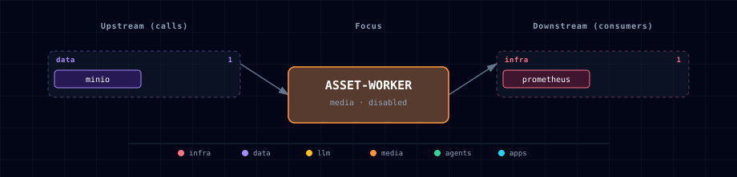

# Asset Worker

## 1. Overview

Asset Worker is Atlas' containerized glTF post-processing service for generated 3D assets. It accepts raw GLB input from upload clients or from a MinIO object reference, applies the shared Atlas normalization contract, runs glTF-Transform optimization, and writes the resulting GLB to a content-addressed artifact location.

This service exists so image-to-3D providers, Blender/DayDreams flows, and future creative routes do not duplicate mesh cleanup logic. It is disabled by default until a workflow explicitly needs a common post-processing API.

## 2. Access

| Surface | URL | Notes |
|---|---|---|
| Direct API | `http://localhost:${ASSET_WORKER_PORT}` | Host-side FastAPI service when `ASSET_WORKER_SOURCE=container`. |
| Kong alias | `http://asset-worker.localhost:${KONG_HTTP_PORT}` | Requires `./start.sh --setup-hosts`; generated only when the service is enabled. |
| Internal API | `http://asset-worker:8095` | Used by sibling containers through `ASSET_WORKER_ENDPOINT`. |
| Health | `GET /health` | Returns `200` only when the configured glTF-Transform executable is available; otherwise returns `503`. |

Every route except `GET /health` requires `Authorization: Bearer ${ASSET_WORKER_API_TOKEN}`. Atlas generates the token on first startup; requests fail closed with `503` if authentication is not configured.

## 3. Configuration

| Variable | Default | Purpose |
|---|---:|---|
| `ASSET_WORKER_SOURCE` | `disabled` | Enables the containerized worker when set to `container`. |
| `ASSET_WORKER_IMAGE` | `python:3.12.9-slim` | Base image for the local build. |
| `ASSET_WORKER_GLTF_TRANSFORM_VERSION` | `4.4.1` | Pinned `@gltf-transform/cli` version installed in the image. |
| `ASSET_WORKER_MAX_UPLOAD_MB` | `200` | Maximum uploaded or MinIO-referenced GLB size. Inputs are streamed and rejected with `413` before transformation when exceeded. |
| `ASSET_WORKER_TIMEOUT_SECONDS` | `300` | Per-command timeout for `inspect`, `validate`, and `optimize`. A timeout returns `504`. |
| `ASSET_WORKER_PORT` | computed | Host port assigned by Atlas' topology allocator. |
| `ASSET_WORKER_API_TOKEN` | generated | Bearer token required by upload, reference-processing, and artifact-download routes. |
| `ASSET_WORKER_ALLOWED_INPUT_BUCKETS` | _(blank)_ | Optional comma- or space-separated MinIO bucket allowlist. Blank follows `MINIO_BUCKET_ASSET_INPUTS`. |
| `ASSET_WORKER_ARTIFACT_DIR` | `/data/artifacts` | Local cache path for optimized GLBs and direct downloads. |
| `ASSET_WORKER_MINIO_ENABLED` | `true` | Writes optimized GLBs to MinIO when enabled. |
| `ASSET_WORKER_MINIO_BUCKET` | `asset-worker` | Output bucket for content-addressed artifacts. |
| `ASSET_WORKER_MINIO_ENDPOINT` | auto-managed | Internal MinIO S3 API endpoint. |
| `ASSET_WORKER_MINIO_ACCESS_KEY` / `ASSET_WORKER_MINIO_SECRET_KEY` | empty | Optional credential override; compose otherwise uses the generated `MINIO_ASSET_WORKER_*` scoped account. |

Enable from the CLI with:

```bash
./start.sh --asset-worker-source container
```

The default `ASSET_WORKER_SOURCE=disabled` keeps the worker out of normal starts until a creative or 3D workflow needs it.

## 4. API Contract

### 4.1 Uploaded GLB

`POST /gltf/postprocess` accepts `multipart/form-data`:

```bash
curl -H "Authorization: Bearer ${ASSET_WORKER_API_TOKEN}" \
  -F file=@mesh.glb \
  "http://localhost:${ASSET_WORKER_PORT}/gltf/postprocess"
```

| Field | Required | Notes |
|---|---:|---|
| `file` | yes | Raw `.glb` file. |
| `target_height_m` | no | Target height after normalization when `normalize_axis=height`. |
| `target_width_m` | no | Target max horizontal width after normalization when `normalize_axis=width`. |
| `normalize_axis` | no | `height` or `width`; default `height`. |
| `up_axis` | no | Orientation policy (#524): `keep` (default — trust the incoming +Y-up orientation; scale/center/ground only), `auto` (minimum-AABB-volume search over small pitch/roll tilts; never rotates a model already within a few degrees of Y-up), or `x`/`y`/`z` (explicitly remap that axis to +Y). |
| `simplify_ratio` | no | glTF-Transform simplification ratio from `0` to `1`. |
| `draco` | no | Enables Draco mesh compression. |
| `meshopt` | no | Enables Meshopt mesh compression when Draco is not selected. |
| `ktx2` | no | Uses KTX2 texture compression; otherwise WebP is used. |
| `collider_decimation` | no | collider decimation ratio used when `simplify_ratio` is absent. |

### 4.2 MinIO Referenced GLB

`POST /gltf/postprocess/ref` accepts JSON:

```json
{
  "input": {"bucket": "raw-assets", "key": "incoming/mesh.glb"},
  "params": {"target_height_m": 1.8, "draco": true, "ktx2": true}
}
```

The request bucket must be listed in `ASSET_WORKER_ALLOWED_INPUT_BUCKETS`; other buckets return `403` before MinIO is contacted.
Populate the default `raw-assets` bucket with the generated
`MINIO_ASSET_INGEST_ACCESS_KEY` and `MINIO_ASSET_INGEST_SECRET_KEY`; that
identity can write inputs without receiving MinIO root or processor-output access.

### 4.3 Response

Both endpoints return a normalized artifact envelope:

```json
{
  "status": "succeeded",
  "sha256": "<optimized-glb-sha256>",
  "artifact": {
    "storage": "minio",
    "bucket": "asset-worker",
    "key": "gltf/<sha256>.glb",
    "uri": "s3://asset-worker/gltf/<sha256>.glb",
    "content_type": "model/gltf-binary"
  },
  "download_url": null,
  "normalization": {
    "method": "keep",
    "up_axis": "keep",
    "base_y": 0,
    "normalize_axis": "height",
    "target_height_m": 1.8
  },
  "optimization": {
    "simplify_ratio": 0.5,
    "draco": true,
    "meshopt": true,
    "ktx2": true,
    "collider_decimation": 0.25
  }
}
```

When `ASSET_WORKER_MINIO_ENABLED=false`, the worker stores the optimized GLB under `ASSET_WORKER_ARTIFACT_DIR/gltf/<sha256>.glb` and returns `download_url=/gltf/artifacts/<sha256>.glb`. The normalization places the base-at-y=0 before scaling.

### 4.4 Scope boundary — mechanical conditioning only

This service performs **mechanical glTF conditioning**: scale-to-target, center-XZ, ground-at-`y=0`, and mesh/texture optimization. **Orientation policy is the consumer's** — glTF is +Y-up by spec, so by default (`up_axis=keep`) incoming orientation is trusted and never second-guessed; reorientation (`auto` or an explicit axis) is strictly opt-in per request (#524). Product-specific asset rules (which assets to reorient, semantic up-ness, placement conventions) belong in the consuming pipeline, not here.

## 5. Architecture & Wiring

The worker performs three operations in order. Uploaded bodies are copied to bounded temporary files in chunks, and the blocking transformation pipeline runs in a worker thread so health and concurrent API requests remain responsive.

1. Normalize geometry by reading float32 GLB `POSITION` accessors, choosing the largest min-AABB extent as the upright axis, remapping that axis to Y, placing the base at `y=0`, centering X/Z around the origin, and scaling to the requested target height or width.
2. Run `gltf-transform inspect`, `gltf-transform validate`, and `gltf-transform optimize` with the requested simplification and compression settings.
3. Hash the optimized GLB with SHA-256 and write it to MinIO or the local artifact cache under `gltf/<sha256>.glb`.

The service is intentionally separate from the media gateway. Provider-specific image-to-3D tickets should submit raw provider outputs to this worker rather than embedding mesh normalization in each provider adapter.

## 6. Dependencies & Integrations

### 6.1 Current — Upstream (this service calls)

| Service | Category |
|---|---|
| minio | data |

### 6.2 Current — Downstream (services that call this)

_No downstream consumers._

### 6.3 Architecture diagram



[Open the interactive HTML diagram](./architecture.html) for a full-screen view.

### 6.4 Future — Missing pair integrations

- Backend media operations should call Asset Worker after hosted image-to-3D providers return raw GLB outputs.
- Blender and DayDreams flows should use the API for the same upright/normalize/optimize contract instead of carrying local duplicate scripts.

### 6.5 Future — Candidate new services

_No high-confidence opportunities identified._

### 6.6 Future — Unused features in this service

- Meshopt and Draco are mutually exclusive mesh-compression modes in a single glTF-Transform optimize pass. Requests may include both for policy compatibility; the worker prefers Draco for mesh compression and records both requested toggles in response metadata.

## 7. Troubleshooting

- `400 Input must be a GLB file`: use a `.glb` filename and binary GLB payload.
- `gltf-transform validate` failure: inspect the raw provider output; invalid GLB input is rejected before storage.
- `401 Invalid Asset Worker bearer token`: pass `Authorization: Bearer ${ASSET_WORKER_API_TOKEN}`.
- `403 Input bucket is not allowed`: add the intended bucket to `ASSET_WORKER_ALLOWED_INPUT_BUCKETS`; do not broaden the list to unrelated or private buckets.
- MinIO upload failure: confirm `MINIO_SOURCE=container`, `ASSET_WORKER_MINIO_BUCKET`, and the generated `MINIO_ASSET_WORKER_*` credentials.
- Kong alias missing: confirm `ASSET_WORKER_SOURCE=container`, run `./start.sh --setup-hosts`, and regenerate routes through the normal startup flow.
