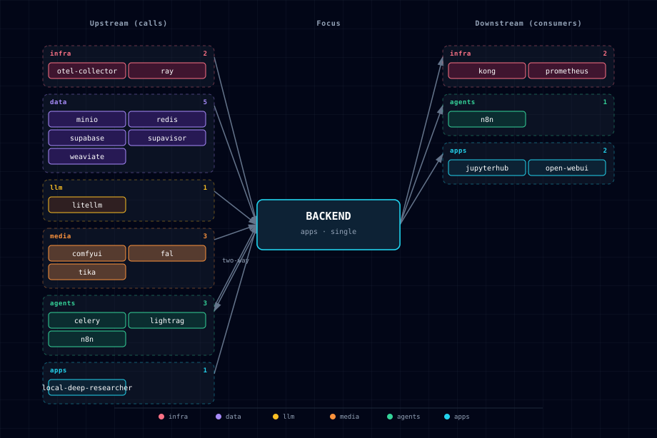

# 5.2.4. Backend API (FastAPI)

Always-on adaptive FastAPI service that orchestrates the rest of the stack. It is the only "apps"-tier service that explicitly declares itself as a hub: at runtime it calls Supabase (Postgres + Storage), Weaviate, LiteLLM, ComfyUI, n8n, Ray, Local Deep Researcher, and the optional Celery worker tier; Neo4j/Hermes env wiring is injected for future use but unconsumed by backend code today (STT/TTS/doc-processor likewise sit behind "future proxy" env). Health checks, LangMem-backed long-term memory, async jobs, file uploads, and orchestration endpoints all live here.

The backend is `_SOURCE`-trivial — it has only one variant, `container` — because nothing in the design contemplates running FastAPI off-stack or as an external dependency. Instead, the variability lives in *what* the backend talks to: adaptive logic in `runtime_adaptive.backend.adapts_to` flips capabilities on or off based on the active `LLM_PROVIDER_SOURCE`, `WEAVIATE_SOURCE`, `STT_PROVIDER_SOURCE`, `TTS_PROVIDER_SOURCE`, `DOC_PROCESSOR_SOURCE`, `RAY_SOURCE`, and `LIGHTRAG_SOURCE`.

## 1. Overview

Source: `services/backend/app/`. The FastAPI app boots in `app/main.py`, mounts feature routes (`/memory`, `/research`, `/storage`, `/health`, `/ready`, `/workflows`, `/media/*`, `/comfyui/*`, `/api/ray/*`, `/api/chunk`, `/api/rag/evaluate`, `/api/rag/ingestions`), and reads adaptive env vars at startup. LangMem (LangChain's long-term-memory layer) is bundled in: `LANGMEM_ENABLED=true` by default, with extraction/embedding models resolved from `LITELLM_DEFAULT_MODEL` / `LITELLM_EMBEDDING_MODEL` (set by `litellm-init` from the YAML catalog + env). Chonkie powers `/api/chunk` so n8n, notebooks, and downstream services can request token, recursive, or semantic text chunks through the Backend rather than importing the library independently. Ragas powers `/api/rag/evaluate` so callers can score supplied questions, answers, contexts, and optional references through Atlas-owned LiteLLM routing instead of adding evaluator packages to each service. A small pytest suite lives at `app/app/tests/` (Ray client/routes, chunking service/API tests, Ragas contract/API tests, and the RAG ingestion engine/API tests; run in the required CI job). Runtime dependencies live in `app/requirements.txt`; pytest and its plugins live in `app/requirements-dev.txt` and are installed only by test environments. Local iteration is edit-in-place — the compose fragment bind-mounts `./app/app` onto `/app` and `uvicorn[standard] --reload` (via `watchfiles`) hot-reloads on every source edit. Runtime requirement changes need a `docker compose up --force-recreate backend`; test-only requirement changes do not alter the production image.

## 2. Access

| Path | URL | Notes |
|---|---|---|
| Direct | `http://localhost:${BACKEND_PORT}` (default `63093`) | Always exposed when the container is up; application authentication is identical to Kong access. |
| Kong | `http://api.localhost:${KONG_HTTP_PORT}` | Requires `./start.sh --setup-hosts`. Kong policy is an optional outer gate; application identity remains required on protected routes. |
| Public diagnostics | `GET /`, `GET /health`, `GET /ready`, `GET /metrics`, API schema/docs | No bearer token. `/health` is process liveness; `/ready` probes PostgreSQL, Redis, and LiteLLM and returns `503` until all are available. Do not publish metrics or schema routes beyond the intended network boundary. |
| Chunking | `POST /api/chunk` | Chonkie-backed splitting; accepts a Supabase user JWT, the internal-service token, or the scoped notebook token. |
| RAG evaluation | `POST /api/rag/evaluate` | Ragas-backed metrics; accepts the same stateless-route credentials as chunking. |
| RAG ingestion | `POST /api/rag/ingestions`, `GET /api/rag/ingestions[/{id}]`, `POST /api/rag/ingestions/{id}/cancel` | Internal-service only. Generic ingestion job over a consumer `rag_ingestion_profile` with machine-readable per-phase status. |
| Ray jobs | `POST /api/ray/jobs/submit`, `GET`/`DELETE /api/ray/jobs/{job_id}`, `/api/ray/cluster/status` | Requires `Authorization: Bearer ${RAY_JOB_API_TOKEN}` on direct and Kong access paths. |

Canonical port table: [Ports and Routes](../../docs/deployment/ports-and-routes.md).

## 3. Configuration

The backend has no source-variants beyond `container`. Customization happens through `.env` and through which upstream services are enabled.

```bash
BACKEND_SOURCE=container          # only value
BACKEND_PORT=63093                # computed by topology.py from BASE_PORT
```

Backend Kong route authentication:

```bash
BACKEND_KONG_AUTH=disabled        # disabled (default) or key-auth
BACKEND_KONG_API_KEY=             # auto-generated; send as apikey when key-auth is enabled
```

Application identity (required by default on every non-public route):

```bash
BACKEND_IDENTITY_AUTH=required
BACKEND_INTERNAL_API_TOKEN=       # auto-generated; full operator scope
BACKEND_N8N_API_TOKEN=            # auto-generated; n8n workflow scope
BACKEND_NOTEBOOK_API_TOKEN=       # auto-generated; stateless notebook routes only
BACKEND_OPEN_WEBUI_API_TOKEN=     # auto-generated; memory/legacy ComfyUI scope
SUPABASE_JWT_SECRET=              # verifies authenticated Supabase user JWTs
```

Supabase user JWTs bind memory, research, hosted-media operations, and spend
reads to the JWT `sub`; caller-supplied user or consumer identifiers cannot
impersonate another subject. The internal token is the full operator
credential. Open WebUI and n8n use separate generated tokens that can delegate
identifiers only within the route families their bundled integrations need.
The notebook token is narrower still and is accepted only by
`/documents/extract`, `/api/chunk`, and `/api/rag/evaluate`. Operator surfaces
such as workflow administration, RAG ingestion, plugin inventory, and generic
jobs require the internal token. Ray and LightRAG adapter routes retain their
own dedicated machine tokens.

`BACKEND_IDENTITY_AUTH=disabled` is an explicit emergency rollback mode. It
removes the application identity boundary and must not be used on an exposed
deployment.

`BACKEND_KONG_AUTH=disabled` preserves the local-development default: Kong adds
only CORS to `api.localhost`. Set `BACKEND_KONG_AUTH=key-auth` before exposing
the gateway beyond a trusted workstation or private reverse proxy. In that
mode, Kong requires:

```bash
curl -H "Host: api.localhost" \
  -H "apikey: ${BACKEND_KONG_API_KEY}" \
  http://localhost:${KONG_HTTP_PORT}/health
```

The direct host port bypasses Kong's optional API-key gate, but it does not
bypass application identity. Bind host ports to loopback or firewall them in
shared environments because the public diagnostics remain reachable.

Ray job API authentication is independent of the optional Kong setting:

```bash
RAY_JOB_API_TOKEN=             # auto-generated during Atlas setup

curl -H "Authorization: Bearer ${RAY_JOB_API_TOKEN}" \
  http://localhost:${BACKEND_PORT}/api/ray/cluster/status
```

Every `/api/ray` route requires this bearer token, including requests through
the direct Backend port and deployments where `BACKEND_KONG_AUTH=disabled`.

LangMem long-term memory:

```bash
LANGMEM_ENABLED=true
LANGMEM_MEMORY_NAMESPACE=default
LANGMEM_AUTO_CONSOLIDATE=true
LANGMEM_CONSOLIDATION_INTERVAL=86400
LANGMEM_MAX_FACTS_PER_USER=1000
LANGMEM_EXTRACTION_MODEL=          # empty = LITELLM_DEFAULT_MODEL (resolved by litellm-init from YAML catalogs + env)
LANGMEM_EMBEDDING_MODEL=
```

Extraction creates the session first, releases PostgreSQL while LiteLLM runs, then commits accepted facts and the completed session in one transaction. A per-user transaction advisory lock makes `LANGMEM_MAX_FACTS_PER_USER` authoritative across concurrent Backend replicas. Malformed model output or a database failure records a terminal failed session; vector indexing remains a best-effort post-commit step. Recall and profile summarization likewise release their database connections before remote model calls.

Graphiti temporal graph memory experiment:

```bash
GRAPHITI_ENABLED=false
GRAPHITI_GROUP_ID_PREFIX=atlas
GRAPHITI_DEFAULT_NAMESPACE=langmem
GRAPHITI_LLM_MODEL=                  # empty = LANGMEM_EXTRACTION_MODEL, then LITELLM_DEFAULT_MODEL
GRAPHITI_EMBEDDING_MODEL=            # empty = LANGMEM_EMBEDDING_MODEL, then LITELLM_EMBEDDING_MODEL
GRAPHITI_EXPOSE_TO_AGENTS=false
```

This is a backend-only evaluation scaffold, not a new service. LangMem remains the default and canonical memory API: Postgres stores memory facts, Weaviate/pgvector backs semantic recall, and `/memory/*` routes keep their existing behavior. Graphiti is reserved as an augmenting temporal graph projection for selected relationship/event episodes after a concrete backend workflow is chosen. The strict `group_id` convention is `atlas:<project>:backend:<namespace>:user:<uuid>`; it isolates per-user/per-namespace graphs in the shared Neo4j instance and avoids collisions with LightRAG, Neo4j LLM Graph Builder, future Hermes, and future OpenClaw writers. `GRAPHITI_EXPOSE_TO_AGENTS=false` means Hermes/OpenClaw integration and the upstream Graphiti MCP server are deliberately deferred.

Adaptive env (injected automatically based on active SOURCE values):

```bash
LITELLM_BASE_URL=http://litellm:4000
LITELLM_API_KEY=${LITELLM_MASTER_KEY}
WEAVIATE_URL=http://weaviate:8080
STT_ENDPOINT=...                  # resolved per STT_PROVIDER_SOURCE
TTS_ENDPOINT=...                  # resolved per TTS_PROVIDER_SOURCE
DOCLING_ENDPOINT=...              # resolved per DOC_PROCESSOR_SOURCE
HERMES_ENDPOINT=http://hermes:8642
HERMES_API_KEY=${HERMES_API_KEY}
NEO4J_URI=bolt://neo4j-graph-db:7687
NEO4J_USER=${GRAPH_DB_USER}
NEO4J_PASSWORD=${GRAPH_DB_PASSWORD}
KONG_URL=http://kong-api-gateway:8000
SUPABASE_SERVICE_KEY=${SUPABASE_SERVICE_KEY}
REDIS_URL=redis://:${REDIS_PASSWORD}@redis:6379/0
RAY_JOB_API_TOKEN=${RAY_JOB_API_TOKEN}
CELERY_SOURCE=disabled
CELERY_BROKER_URL=                 # auto-managed when CELERY_SOURCE=container
CELERY_RESULT_BACKEND=             # auto-managed when CELERY_SOURCE=container
```

Adaptive listing comes from `runtime_adaptive.backend.adapts_to` in `services/backend/service.yml`.

Hosted media gateway:

```bash
FAL_SOURCE=disabled
FAL_API_KEY=
FAL_MODEL=fal-ai/flux/dev
FAL_MODEL_LICENSE=fal/provider-terms
FAL_TIMEOUT_SECONDS=120
FAL_OUTPUT_FORMAT=jpeg
FAL_ENABLE_SAFETY_CHECKER=true
MEDIA_REQUEST_MAX_BYTES=41943040
MEDIA_INPUT_MAX_BYTES=26214400
MEDIA_INPUT_MAX_PIXELS=40000000
MEDIA_OPERATION_TTL_SECONDS=604800
```

When `FAL_SOURCE=enabled`, `POST /media/generate` accepts a provider-neutral request with `provider`, `modality`, `model`, and `input` fields (plus optional `consumer`/`project` attribution). The registry supports `provider=fal` with `modality=image` and `modality=image_to_3d`; unsupported provider/modality pairs return `400` before any provider client is initialized. `POST /media/generate` returns `202` with an operation id and `GET /media/operations/{operation_id}` polls the provider queue into a normalized response containing status, provider, model, modality, artifacts, cost, license, and provenance. `POST /media/operations/{operation_id}/cancel` cancels an in-flight operation (#518): it becomes terminal `cancelled` (stable on subsequent polls), its budget reservation is released via the spend-ledger reconcile path, and the provider-side operation is cancelled best-effort where supported (`provenance.provider_cancelled`); `404` for unknown ids, `409` when already terminal. Before paid submission, the route verifies that shared operation state is reachable. A post-submission persistence failure is retried three times, then Atlas attempts provider cancellation and returns `503` with the provider operation id, cancellation result, and whether manual reconciliation is required. An accepted operation that could not be cancelled retains its budget reservation rather than being silently uncharged. Every blocking FAL SDK submit, status, result, and cancel call is bounded by `FAL_TIMEOUT_SECONDS`; timeout failures are surfaced through the operation contract rather than occupying an API worker indefinitely. Request bodies over `MEDIA_REQUEST_MAX_BYTES` are rejected with `413` before route parsing, including streamed bodies without `Content-Length`. Inline images are bounded by `MEDIA_INPUT_MAX_BYTES` before base64 decoding and by `MEDIA_INPUT_MAX_PIXELS` before Pillow conversion or conditioned-canvas allocation. `FAL_API_KEY` remains backend-only and is never returned in API responses.

**Spend ledger & budgets (`MEDIA_BUDGET_ENABLED`, disabled by default).** When enabled, each generation reserves its estimated cost *before* the provider is invoked and records an immutable ledger row (`consumer`/`project`, provider/model, estimated + final cost, currency, pricing timestamp, artifact refs, status). Over-budget submissions are hard-stopped with `402` before any provider call; a per-provider kill-switch (`MEDIA_DISABLED_PROVIDERS`) returns `403` for a disabled provider without downing the gateway; reservations are concurrency-safe (two simultaneous submissions at the remaining-budget boundary cannot both pass); on completion the spend is reconciled (unknown provider costs are never silently recorded as `$0`). `GET /media/spend?consumer=<c>[&project=<p>]` returns that consumer's committed/reserved totals and rows only — never provider keys or another consumer's records. The durable spend store is `public.media_spend_ledger` (Postgres). Enabled Postgres budgets require `DATABASE_URL`; malformed booleans, unsupported stores, non-finite or negative caps, non-object cap maps, invalid retention values, and invalid media input limits fail startup instead of weakening enforcement. Polling and cancellation state is shared through Redis for `MEDIA_OPERATION_TTL_SECONDS` (seven days by default); terminal transitions are atomic, so concurrent polls, timeouts, and cancellation cannot replace the first terminal result.

Chonkie chunking surface:

```bash
CHONKIE_SEMANTIC_EMBEDDING_MODEL=minishlab/potion-base-32M
```

`POST /api/chunk` accepts `text`, `strategy` (`recursive` by default, plus
`token` or `semantic`), `chunk_size`, `overlap`, `tokenizer`, and semantic tuning fields.
Responses include stable character offsets, ordered chunk indexes, optional
token counts, and metadata that records whether the requested overlap was
applied by the selected Chonkie strategy. Token chunking honors overlap;
recursive and semantic chunking report an ignored-overlap reason because the
current Chonkie APIs do not expose overlap controls for those strategies. The
semantic strategy uses `CHONKIE_SEMANTIC_EMBEDDING_MODEL` unless service code
injects a test embedding model.

Ragas evaluation surface:

```bash
RAGAS_EVALUATOR_MODEL=            # empty = LITELLM_DEFAULT_MODEL
RAGAS_EMBEDDINGS_MODEL=           # empty = LITELLM_EMBEDDING_MODEL
```

`POST /api/rag/evaluate` accepts one or more records with `question`, `answer`,
`contexts`, and optional `ground_truth`. Supported metrics are `faithfulness`,
`answer_relevancy`, `context_precision`, and `context_recall`; context precision
and recall require `ground_truth` because Ragas needs a reference answer. The
backend builds Ragas `SingleTurnSample` records, routes evaluator model calls
through `LITELLM_BASE_URL` / `LITELLM_API_KEY`, and returns per-record metric
scores plus runner metadata. Unit tests use a fake runner and never call live
LLMs.

## 4. Architecture & wiring

**Request flow (typical Open WebUI ↔ backend ↔ LiteLLM ↔ Ollama):**

1. Open WebUI sends a chat completion to Kong at `api.localhost/v1/...`.
2. Kong proxies to `backend:8000`.
3. Backend route either:
   - forwards directly to `litellm:4000/v1/chat/completions`, or
   - invokes a LangMem-augmented pipeline (retrieve facts from Supabase pgvector → enrich prompt → call LiteLLM → extract & store new facts).
4. LiteLLM dispatches to the registered provider (Ollama, Anthropic, OpenAI, etc.).

**Required hard dependencies** (from `depends_on.required`):
- `supabase` — Postgres (LangMem facts, public tables) and Storage (file uploads default to 100 MiB via `MAX_UPLOAD_BYTES`). The backend uses service credentials for outbound storage/database work and verifies inbound authenticated-user JWTs for user-scoped routes. Supabase Auth users are synchronized into `public.users` so research and memory foreign keys remain satisfiable.
- `redis` — declared required; `REDIS_URL` database 0 stores shared hosted-media operation state and RAG ingestion state, while the optional Celery worker tier uses Redis database 4 for async job broker/result state.
- `litellm` — gated `service_healthy` in compose; the Backend readiness endpoint probes the gateway's liveness endpoint.

**Optional adaptive dependencies** (from `runtime_deps.backend.optional`):
- `neo4j-graph-db`, `searxng`, `n8n`, `weaviate`, `parakeet`, `speaches`, `chatterbox`, `docling`.

When any optional service is `disabled`, the corresponding backend feature degrades gracefully — `/storage/upload` returns 503 if Supabase Storage is down, and `/research/start` persists sessions in Supabase while `research_client.py` creates LangGraph threads and runs them through `/threads/{id}/runs/stream` on the Local Deep Researcher service.

Research sessions use Supabase as their durable state boundary. Session creation and its first audit log commit atomically. The Backend closes its database connection before waiting on Local Deep Researcher, claims only `pending` sessions for execution, and commits a result under a row lock only while the session remains `running`. While remote work runs, a separate heartbeat updates the database; each replica atomically marks `pending` or `running` sessions failed after `RESEARCH_SESSION_LEASE_SECONDS` without a fresh creation time or heartbeat. Graceful shutdown terminalizes local work before exit. A cancellation, expired lease, or other terminal status therefore cannot be revived or overwritten by a late remote response, including when requests reach different Backend replicas.

**Internal network:** all upstream calls use Docker DNS names on `backend-network`. No host-port hops; nothing reaches the host filesystem outside the mounted `./services/backend/app/` source directory.

**Init container:** none. The backend has no `backend-init`; one-time setup (DB migrations) is delegated to `supabase-db-init` which runs SQL scripts from `services/supabase/db/scripts/`.

**Downstream plugin seam (`BACKEND_PLUGINS_DIR`):** after mounting its built-in routers, the app calls `load_plugins(app)` (`plugin_seam.py`). It scans `$BACKEND_PLUGINS_DIR` (default `/app/plugins`); an optional shared `$BACKEND_PLUGINS_DIR/requirements.txt` is installed first, then each immediate subdirectory that is an importable package exposing a module-level `router` (a FastAPI `APIRouter`) has its own optional `requirements.txt` installed before that package is imported and `include_router`'d into the app. It is a **no-op when the directory is absent**, so base Atlas is unaffected — the seam exists purely so a downstream consumer (e.g. one vendoring Atlas as a submodule) can add its own API routes without forking the backend. A plugin whose requirements fail to install is logged with the requirements path and pip output, then skipped before import; a shared requirements failure skips plugin loading for that startup. Requirements install into a **writable plugin site** (`pip --target $BACKEND_PLUGINS_SITE_DIR`, default `/tmp/atlas-plugins-site`) that the seam pre-creates and prepends to `sys.path` before any plugin import — the image runs as `appuser` with root-owned site-packages and no `$HOME`, so untargeted installs would fail with `EACCES` (#559); no consumer-side tmpfs/`PYTHONUSERBASE` workaround is needed. A plugin that fails to import is logged and skipped, never crashing the backend. Consumer-side walkthrough: [reusing-atlas.md §6.3](../../docs/deployment/reusing-atlas.md#63-adding-backend-api-routes-via-the-plugin-seam).

**Optional typed plugin manifest (`plugin.yml`, #402):** a plugin package MAY ship a `plugin.yml` next to its `__init__.py` (`plugin_manifest.py` validates it with Pydantic). Absent manifests and `auth: inherit` use the Backend application identity boundary. `auth: key-auth` validates `BACKEND_KONG_API_KEY` both in Kong and inside the application, so the direct port cannot bypass it. `auth: open` is the only explicit public opt-out. The manifest also declares `name`, `route_prefix`, `health_path`/`docs_url`, typed env, and dependency hints. Validation occurs **before** requirements installation or import; malformed manifests, duplicate/overlapping/reserved prefixes, and import failures skip only the affected plugin. `GET /plugins` is internal-service only and masks secret env values. See [reusing-atlas.md §6.3.1](../../docs/deployment/reusing-atlas.md#631-declaring-a-typed-plugin-contract-with-pluginyml); canonical schema: [`bootstrapper/schemas/plugin.schema.json`](../../bootstrapper/schemas/plugin.schema.json).

**Graphiti experiment status:** `GET /memory/graphiti/status` returns the disabled-by-default experiment configuration and namespace pattern without importing `graphiti-core` or writing to Neo4j. Treat it as a readiness/contract endpoint for future backend-only Graphiti work, not as an active memory writer.

**Hosted media gateway:** `POST /media/generate` is the provider-neutral submission surface for hosted creative generation. It dispatches by `provider`, `modality`, and `model`; today the registry includes FAL image generation and returns an operation id without blocking on long-running provider work. `GET /media/operations/{operation_id}` polls provider status and normalizes completed artifacts; `POST /media/operations/{operation_id}/cancel` stops an in-flight operation and releases its budget reservation (#518). The older `POST /comfyui/generate` route remains a compatibility surface for simple image calls and still routes to FAL when `FAL_SOURCE=enabled`; ComfyUI workflow/history/queue/image-file routes remain ComfyUI-specific.

**RAG chunking gateway:** `POST /api/chunk` centralizes Chonkie text splitting in the Backend. n8n workflows, notebooks, and future ingestion routes should call this endpoint so chunking defaults, offsets, overlap behavior, and semantic model selection stay consistent across Atlas. JupyterHub also installs Chonkie for exploratory notebook work, but the Backend endpoint is the canonical runtime API.

**RAG ingestion job engine (`rag_ingestion/`, #413):** `POST /api/rag/ingestions` runs a generic, repeatable ingestion lifecycle over a consumer-declared `rag_ingestion_profile` — discover → parse (Docling → Tika → plain-text fallback) → chunk (Chonkie) → embed (LiteLLM) → vector-store write (Weaviate, class namespaced `{collection_prefix}_{profile}`) → LightRAG upload → drain (poll extraction with a timeout) → finalize. Parser-order entries invoke the named extractor exactly; unsupported or unavailable parsers advance to the next entry. Each phase records status, counts, timing, and actionable per-file errors, and every target is **capability-gated** by its backend's endpoint env var with per-target `on_unavailable: fail | skip` semantics. Jobs are **idempotent** by consumer + profile revision + a real corpus fingerprint and run through the Celery tier when enabled (else synchronously in-request); synchronous discovery and Chonkie work are moved off the API event loop. State is held in the ingestion store (Redis when `REDIS_URL` is set, else in-memory), and Redis operations use bounded connect/read deadlines. Idempotency claims, cancellation, terminal transitions, and dispatch-failure recovery are atomic in that store: concurrent submissions share one job, cancellation cannot be erased by a stale worker save, and a broker failure releases the key for a fresh retry. In worker mode, connection and timeout failures leave the current phase pending and propagate to Celery's bounded backoff/retry policy; synchronous fallback keeps the established terminal-record response contract. The profiles themselves are declared in `atlas.consumer.yml` and compiled by the bootstrapper into `RAG_INGESTION_PROFILES_FILE`; corpus inputs are a consumer-mounted read-only path under `RAG_INGESTION_CORPUS_ROOT` (default `/app/corpus`) or a MinIO prefix — never an arbitrary host path. Discovery reads in bounded chunks and rejects inputs over `RAG_INGESTION_MAX_FILE_BYTES` (100 MiB per file), `RAG_INGESTION_MAX_CORPUS_BYTES` (1 GiB aggregate), or `RAG_INGESTION_MAX_FILES` (10,000 files) before retaining unbounded content in memory. Consumer-side walkthrough: [reusing-atlas.md §6.3.4](../../docs/deployment/reusing-atlas.md#634-declaring-rag-ingestion-profiles-with-rag_ingestion_profiles). Covered by `app/app/tests/test_rag_ingestion.py` + `test_rag_ingestion_api.py` (fake upstreams; a live round-trip is an optional test).

## 5. LightRAG integration

When `LIGHTRAG_SOURCE != disabled`, the backend receives `LIGHTRAG_ENDPOINT` and `LIGHTRAG_API_KEY` env vars. The RAG ingestion job engine (§4, #413) uses them as a `graph_target` — uploading parsed documents and draining the extraction pipeline with a timeout. A consumer can still add a bespoke `/rag` route without manifest changes via the plugin seam described in §4 (mount a `rag` route package under `BACKEND_PLUGINS_DIR`).

<a id="51-lightrag--tei-rerank-adapter-post-lightragrerank-415"></a>

### 5.1. LightRAG → TEI rerank adapter (`POST /lightrag/rerank`, #415)

LightRAG can rerank its retrieved chunks with a cross-encoder for a quality lift, but its built-in Jina/Cohere rerank clients POST `{"query", "documents"}` and read back `{"results": [{"index", "relevance_score"}]}`, while Atlas's [TEI reranker](../tei-reranker/README.md) `/rerank` speaks a *different* wire shape — `{"query", "texts"}` in, a sorted top-level array of `{"index", "score"}` out. The two are not wire-compatible, which is why Atlas historically kept `RERANK_BINDING=null` and [#414](../../docs/deployment/reusing-atlas.md#635-declaring-lightrag-query-profiles-with-lightrag_query_profiles) rejected `enable_rerank: true` query profiles.

`POST /lightrag/rerank` is the translation seam that closes that gap. It is a thin backend route (`app/app/lightrag_rerank_adapter.py`), not a new service: it owns no model and holds no state — it rewrites LightRAG's request into TEI's shape, calls the TEI reranker, and maps TEI's `score` back to LightRAG's `relevance_score` (preserving the original document index, best-first order, and honoring `top_n`). Direct LightRAG→TEI wiring stays forbidden.

**Enabling it.** Off by default. Set `LIGHTRAG_RERANK_ADAPTER_ENABLED=true` **with** `TEI_RERANKER_SOURCE` enabled (and LightRAG enabled). The bootstrapper then wires LightRAG's rerank binding to `http://backend:8000/lightrag/rerank` (binding `jina`) and consumer query profiles may set `enable_rerank: true`. `./start.sh doctor` warns (`lightrag-rerank-adapter` check) if the flag is on but a prerequisite service is off, since reranking would silently be a no-op.

| Env var | Default | Purpose |
|---|---|---|
| `LIGHTRAG_RERANK_ADAPTER_ENABLED` | `false` | Opt-in. Gates the LightRAG↔TEI wiring and `enable_rerank` query profiles. |
| `LIGHTRAG_RERANK_ADAPTER_TOKEN` | *(auto-generated)* | Bearer token guarding the route; handed to LightRAG as `RERANK_BINDING_API_KEY` so both sides share one secret. Masked as a `secret`. |
| `LIGHTRAG_RERANK_ADAPTER_TIMEOUT_SECONDS` | `30` | Per-request timeout calling TEI before the route returns 504. |
| `TEI_RERANKER_ENDPOINT` | *(resolved)* | Resolved by the TEI reranker service; the route forwards `{query, texts}` here. |

**Auth & errors.** The route requires `Authorization: Bearer <LIGHTRAG_RERANK_ADAPTER_TOKEN>` (constant-time compared): missing/invalid → `401`, token unset (adapter not configured) → `503`. Input is bounded (query/document sizes and count); an empty document list short-circuits to `{"results": []}` without calling TEI. TEI errors surface as `502` (upstream error / malformed body), `504` (timeout), or `503` (TEI unreachable / not configured). Enabling reranking trades a little latency (an extra cross-encoder pass over retrieved chunks) for better passage ordering; leave it off if latency-sensitive.

```bash
curl -X POST http://localhost:${BACKEND_PORT}/lightrag/rerank \
  -H "Authorization: Bearer ${LIGHTRAG_RERANK_ADAPTER_TOKEN}" \
  -H "Content-Type: application/json" \
  -d '{"query": "what is graph-augmented RAG?", "documents": ["…", "…"], "top_n": 3}'
```

## 6. Dependencies & Integrations

### 6.1. Current — Upstream (this service calls)

| Service | Category |
|---|---|
| otel-collector | infra |
| ray | infra |
| minio | data |
| redis | data |
| supabase | data |
| supavisor | data |
| weaviate | data |
| litellm | llm |
| comfyui | media |
| fal | media |
| tika | media |
| celery | agents |
| lightrag | agents |
| n8n ↔ | agents |
| local-deep-researcher | apps |

### 6.2. Current — Downstream (services that call this)

| Service | Category |
|---|---|
| kong | infra |
| prometheus | infra |
| n8n ↔ | agents |
| jupyterhub | apps |
| open-webui | apps |

### 6.3. Architecture diagram



[Open the interactive HTML diagram](./architecture.html) for a full-screen view.

### 6.4. Future — Missing pair integrations

- **backend ↔ minio** — *Why:* `minio-init` provisions a dedicated `backend` bucket plus scoped `MINIO_BACKEND_ACCESS_KEY`/`SECRET_KEY`, but the backend container receives none of those env vars and ships no S3 client. Artifact-tier storage (research outputs, ComfyUI image cache, large user uploads) currently spills into Supabase Storage, sized for app data not blobs. *Mechanism:* pass `MINIO_ENDPOINT=http://minio:9000`, `MINIO_BUCKET_BACKEND`, and the access/secret keys into `services/backend/compose.yml`; add `boto3` to `requirements.txt`; expose `POST /storage/artifact` + `GET /storage/artifact/{key}`. *Effort:* small. *Confidence:* high.
- **backend ↔ hermes** — *Why:* `HERMES_ENDPOINT` + `HERMES_API_KEY` are passed in but no client consumes them. Talking to Hermes only through LiteLLM's `hermes-agent` model loses Hermes-native surfaces (skill/tool registration, session state at `/opt/data`, dashboard introspection). *Mechanism:* add `hermes_client.py` next to `n8n_client.py`; call `${HERMES_ENDPOINT}/v1/sessions` and `/skills` with `Authorization: Bearer ${HERMES_API_KEY}`; expose `POST /agents/hermes/run` + `GET /agents/hermes/sessions/{id}`. *Effort:* small. *Confidence:* medium.
- **backend ↔ jupyterhub** — *Why:* notebook users can't reach backend's research/memory/ComfyUI APIs except through Kong + tokens, and backend has no view of JupyterHub state. A thin bridge enables programmatic notebook launches for batch evaluations. *Mechanism:* backend calls JupyterHub REST at `http://jupyterhub:8000/hub/api` with `Authorization: token ${JUPYTERHUB_TOKEN}`; expose `POST /notebooks/users/{name}/server` proxy; share `MINIO_BUCKET_JUPYTER` for artifact handoff. *Effort:* medium. *Confidence:* medium.
- **backend ↔ neo4j (knowledge-graph endpoints)** — *Why:* `neo4j`, `langchain-neo4j`, `NEO4J_URI`/`USER`/`PASSWORD` are all installed and injected, but no graph endpoints exist. LangMem facts and research sources are natural graph citizens. *Mechanism:* add `graph_service.py`; on memory-extract, mirror canonical entities into Neo4j via `bolt://neo4j-graph-db:7687`; expose `GET /memory/user/{id}/graph` and `GET /research/{session_id}/entities`. *Effort:* medium. *Confidence:* high.

### 6.5. Future — Candidate new services

- **Langfuse** ([details](../../docs/research/candidates/langfuse.md)) — *Headline:* self-hostable LLM observability with traces, evals, prompt versioning. *Wires into:* hermes, n8n, local-deep-researcher, litellm, open-webui.
- **Celery + Flower** ([details](../../docs/research/candidates/celery-flower.md)) — *Headline:* Redis-backed async worker tier so long-running research/memory-consolidate/ComfyUI calls stop blocking the FastAPI request loop. *Wires into:* redis, supabase, comfyui, local-deep-researcher.
- **MLflow** ([details](../../docs/research/candidates/mlflow.md)) — *Headline:* experiment tracking + model registry for LangMem extraction/embedding models, ComfyUI checkpoints, Hermes skill evaluations. *Wires into:* jupyterhub, comfyui, hermes, minio.

### 6.6. Future — Unused features in this service

- **LangMem auto-consolidate scheduler** — *Why pursue:* `LANGMEM_AUTO_CONSOLIDATE` + `LANGMEM_CONSOLIDATION_INTERVAL` are declared, `apscheduler` is in `requirements.txt`, but no scheduler runs in `main.py`. Wiring it lights up nightly fact-consolidation. *Effort:* small.
- **STT/TTS proxy endpoints** — *Why pursue:* `STT_ENDPOINT` and `TTS_ENDPOINT` reach the container but the FastAPI surface exposes neither; clients must hit the engines directly, bypassing auth/quota. *Effort:* small.
- **Supabase Realtime channels** — *Why pursue:* `supabase-realtime` is a `depends_on` of backend yet no WebSocket fan-out endpoints exist for streaming research logs or memory updates. *Effort:* medium.
- **Per-user storage namespacing** — *Why pursue:* `/storage/upload` accepts a `bucket` query but no per-user prefix or quota; trivial to abuse. *Effort:* small.

## 7. Troubleshooting

**`/ready` returns 503 for a required upstream.** Read which of `postgres`, `redis`, or `litellm` is `unavailable` in the response payload, then inspect that service's logs. `/health` remains a cheap process-liveness check so orchestration can distinguish a running process from one ready to serve traffic.

**LangMem extraction silently fails.** Check that `LITELLM_DEFAULT_MODEL` is set (it is written into `.env` by `litellm-init` on first start from the YAML catalogs + env). Without a resolved default model, `LANGMEM_EXTRACTION_MODEL` remains empty and the consolidation loop short-circuits. Set it explicitly to a known model id (e.g. `ollama/qwen3:8b`).

**Cold-start hangs on Supabase.** Backend `depends_on: supabase-db-init: { condition: service_completed_successfully }`. If `supabase-db-init` is stuck (usually a bad SQL script in `services/supabase/db/scripts/`), backend will wait forever. Check `docker logs <project>-supabase-db-init`.

**`HERMES_ENDPOINT` reachable but feature returns 404.** Hermes-native endpoints are not wired (see Future — Missing pair integrations above). Calls go through LiteLLM's `hermes-agent` model only.

```bash
docker compose ps backend
docker compose logs -f backend
docker exec <project>-backend env | grep -E 'LITELLM|WEAVIATE|HERMES|NEO4J|STT|TTS|DOCLING'
```

For general startup and routing issues, see [Troubleshooting](../../docs/quick-start/troubleshooting.md).
