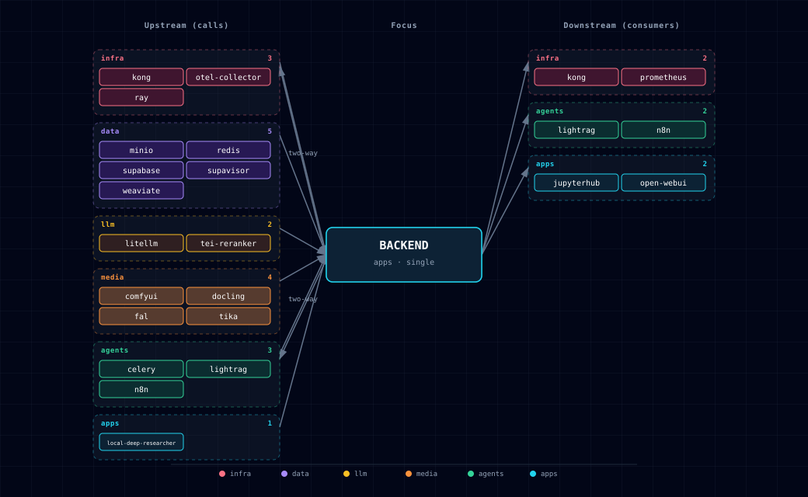

# 5.2.4. Backend API (FastAPI)

Always-on FastAPI service that orchestrates the stack. It serves memory, research, RAG chunking, evaluation and ingestion, media generation, Ray jobs, uploads and health checks. §6.1 lists every upstream service it calls. Neo4j, Hermes, STT and TTS settings are injected but no Backend code uses them yet.

`BACKEND_SOURCE` has one value, `container`. The Backend adapts to the services around it instead. `runtime_adaptive.backend.adapts_to` turns capabilities on or off from `LLM_PROVIDER_SOURCE`, `WEAVIATE_SOURCE`, `STT_PROVIDER_SOURCE`, `TTS_PROVIDER_SOURCE`, `DOC_PROCESSOR_SOURCE`, `TIKA_SOURCE`, `RAY_SOURCE`, `LIGHTRAG_SOURCE`, `SUPAVISOR_SOURCE` and `OTEL_COLLECTOR_SOURCE`.

## 1. Overview

Source: `services/backend/app/`. The app boots in `app/main.py` and reads its adaptive env vars at startup. It mounts `/memory`, `/research`, `/storage`, `/health`, `/ready`, `/workflows`, `/media/*`, `/comfyui/*`, `/api/ray/*`, `/api/chunk`, `/api/rag/evaluate` and `/api/rag/ingestions`.

LangMem (long-term memory) is on by default (`LANGMEM_ENABLED=true`). Its models come from `LITELLM_DEFAULT_MODEL` and `LITELLM_EMBEDDING_MODEL`, which `./start.sh` resolves from the YAML model catalogs. If `LITELLM_EMBEDDING_MODEL` is empty, the entrypoint uses `/shared/weaviate-config.env` (written by `weaviate-init`), then `ollama/nomic-embed-text`. Compose always sets it.

Dependencies:

- Runtime dependencies are in `app/requirements.txt`.
- Test dependencies are in `app/requirements-dev.txt`. Only test environments install them.
- The Backend test suite is in `app/app/tests/`. The `services-lint` job "Bootstrapper and Backend suites (with containers)" runs it.

Local iteration: compose bind-mounts `./app/app` onto `/app`, so you edit the source in place. To apply a change, recreate the Backend. On a stack with no consumer manifest and no overlays, run:

```bash
docker compose -p <PROJECT_NAME> up -d --force-recreate backend
```

With a consumer manifest, run `./start.sh --consumer <manifest>` again instead. A bare Compose command drops the overlay that mounts the plugins.

Recreate it also after a runtime dependency change. Set `BACKEND_DEV_RELOAD=true` to run `uvicorn[standard] --reload` and hot-reload host-side edits. It is off by default, because git churn in the bind-mounted plugin directory can restart or crash-loop the Backend.

## 2. Access

| Path | URL | Notes |
|---|---|---|
| Direct | `http://localhost:${BACKEND_PORT}` (default `63093`) | Always exposed when the container is up; application authentication is identical to Kong access. |
| Kong | `http://api.localhost:${KONG_HTTP_PORT}` | Requires `./start.sh --setup-hosts`. Kong policy is an optional outer gate; application identity remains required on protected routes. |
| Public diagnostics | `GET /`, `GET /health`, `GET /ready`, `GET /metrics`, API schema/docs | No bearer token. `/health` is process liveness. `/ready` probes PostgreSQL, Redis, and LiteLLM and returns `503` until all are available. Do not publish metrics or schema routes beyond the intended network boundary. |
| Chunking | `POST /api/chunk` | Chonkie-backed splitting; accepts a Supabase user JWT, the internal-service token, or the scoped notebook token. |
| RAG evaluation | `POST /api/rag/evaluate` | Ragas-backed metrics; accepts the same stateless-route credentials as chunking. |
| RAG ingestion | `POST /api/rag/ingestions`, `GET /api/rag/ingestions[/{id}]`, `POST /api/rag/ingestions/{id}/cancel` | Internal-service only. Runs an ingestion job over a consumer `rag_ingestion_profile` and reports status per phase. An embedding endpoint that answers 5xx, 408 or 429 is retried like a connection error. Other 4xx answers fail the job. |
| Ray jobs | `POST /api/ray/jobs/submit`, `GET`/`DELETE /api/ray/jobs/{job_id}`, `/api/ray/cluster/status` | Requires `Authorization: Bearer ${RAY_JOB_API_TOKEN}` on direct and Kong paths. Submit requires a stable `submission_id` (`raysubmit_` plus letters, digits, or underscores), so a job stays reconcilable after a lost response. `GET`/`DELETE` of an unknown job id return 404. |

Canonical port table: [Ports and Routes](../../docs/reference/ports-routes.md).

## 3. Configuration

The Backend has no source variants beyond `container`. You configure it through `.env` and through the upstream services you enable.

```bash
BACKEND_SOURCE=container          # only value
BACKEND_PORT=63093                # computed by topology.py from BASE_PORT
```

### 3.1. Authentication

Backend Kong route authentication:

```bash
BACKEND_KONG_AUTH=disabled        # disabled (default) or key-auth
BACKEND_KONG_API_KEY=             # auto-generated; send as apikey when key-auth is enabled
```

Application identity (required by default on every non-public route):

```bash
BACKEND_IDENTITY_AUTH=required
BACKEND_INTERNAL_API_TOKEN=       # auto-generated; full operator scope
BACKEND_N8N_API_TOKEN=            # auto-generated; n8n workflow scope
BACKEND_NOTEBOOK_API_TOKEN=       # auto-generated; stateless notebook routes only
BACKEND_OPEN_WEBUI_API_TOKEN=     # auto-generated; memory/legacy ComfyUI scope
COMFYUI_MAX_IMAGE_BYTES=20971520  # bounded ComfyUI image input/output
COMFYUI_INIT_IMAGE_TRUSTED_ORIGINS=  # exact HTTPS origins; blank rejects remote URLs
COMFYUI_COMPLETION_TIMEOUT_SECONDS=300  # synchronous generation deadline; on expiry the legacy routes cancel the prompt and return 504 with its prompt_id
SUPABASE_JWT_SECRET=              # verifies authenticated Supabase user JWTs
```

Token scopes:

- A Supabase user JWT binds memory, research, hosted-media operations and spend reads to the JWT `sub`. Caller-supplied user or consumer ids cannot impersonate another subject.
- The internal token is the full operator credential. Workflow administration, RAG ingestion, plugin inventory and generic jobs require it.
- The Open WebUI and n8n tokens can delegate identifiers only within the route families their bundled integrations need.
- The notebook token works only on `/documents/extract`, `/api/chunk` and `/api/rag/evaluate`.
- Ray and LightRAG adapter routes keep their own machine tokens.

`BACKEND_IDENTITY_AUTH=disabled` is an emergency rollback mode. It removes the application identity boundary. Do not use it on an exposed deployment.

`BACKEND_KONG_AUTH=disabled` is the local-development default: Kong adds only CORS to `api.localhost`. Set `BACKEND_KONG_AUTH=key-auth` before you expose the gateway beyond a trusted workstation or private reverse proxy. Kong then requires the key:

```bash
curl -H "Host: api.localhost" \
  -H "apikey: ${BACKEND_KONG_API_KEY}" \
  http://localhost:${KONG_HTTP_PORT}/health
```

The direct host port bypasses Kong's optional API-key gate, but not application identity. The public diagnostics stay reachable, so keep host ports on loopback or firewall them in shared environments.

Ray job API authentication does not depend on the Kong setting:

```bash
RAY_JOB_API_TOKEN=             # auto-generated during Atlas setup

curl -H "Authorization: Bearer ${RAY_JOB_API_TOKEN}" \
  http://localhost:${BACKEND_PORT}/api/ray/cluster/status
```

Every `/api/ray` route requires this bearer token, also on the direct port and with `BACKEND_KONG_AUTH=disabled`. Every submission must include a validated `submission_id`. Send the same value on each retry. A reused id returns `409`; inspect or stop that job through the `{job_id}` routes instead of launching a second copy.

### 3.2. LangMem memory

```bash
LANGMEM_ENABLED=true
LANGMEM_MEMORY_NAMESPACE=default
LANGMEM_AUTO_CONSOLIDATE=true
LANGMEM_CONSOLIDATION_INTERVAL=86400
LANGMEM_MAX_FACTS_PER_USER=1000
LANGMEM_EXTRACTION_MODEL=          # empty = LITELLM_DEFAULT_MODEL (resolved by ./start.sh from the YAML catalogs)
LANGMEM_EMBEDDING_MODEL=
LANGMEM_EMBEDDING_DIM=768
```

`LANGMEM_AUTO_CONSOLIDATE` and `LANGMEM_CONSOLIDATION_INTERVAL` are reserved. No scheduler reads them yet (§6.6).

**Extraction.** The LLM call runs outside the database transaction. Accepted facts and the completed session then commit atomically. A per-user lock enforces `LANGMEM_MAX_FACTS_PER_USER`. A failed extraction records a terminal failed session, not partial facts. The LangMem extraction module's docstring documents the full transaction and lock sequence.

**Vector store consistency.**

- Every memory write (edit, soft delete, consolidation, retention) marks a durable `vector_sync_pending` intent with the Postgres change.
- While Weaviate serves recall, each write also updates a pgvector shadow. The intent clears only after both writes are durable.
- When Weaviate is unavailable, a pgvector write advances the dirty generation atomically with the vector update.
- A Weaviate outage latches recall to pgvector, without readiness probes on each request.
- Recall and writes check the generation before and after external I/O. On a change, the result is discarded or pgvector stays authoritative. No stale result or lost write crosses a switch.

**Failback to Weaviate.**

- Failback happens only through `POST /memory/vector-store/probe`. The probe checks the model, dimension and collection module.
- It then rebuilds active objects and retirements from Postgres before searches switch.
- It clears the generation by a compare-and-set on model and dimension, after every pending retirement drains.
- Sustained write churn keeps pgvector latched and reports the reason.
- The probe and `GET /memory/health` (whose fact count spans every user) accept only service callers: n8n, Open WebUI and the internal token. A user JWT is refused.

**Embedding and recall limits.**

- A failed embedding inside Weaviate (its LiteLLM vectorizer call) is not an outage. It shows as a 5xx on writes or GraphQL `errors` on recall.
- In that case the write lands in pgvector and stays `vector_sync_pending`. Recall uses pgvector for that request, and nothing latches. Weaviate allows 30 s for the embedding call.
- Reconciliation skips a row that the target rejects with a 4xx until the row changes. A restart retries it once.
- `min_confidence` is applied inside the vector query, so low-confidence hits cannot take `limit` slots.
- `WEAVIATE_SOURCE=localhost` is unsupported for memory. The collection vectorizes through `http://litellm:4000`, which a host Weaviate cannot resolve, and the Backend sends no Weaviate API key. Every write fails vectorization, and recall uses pgvector.
- `LANGMEM_EMBEDDING_DIM` is checked against a real LiteLLM embedding before startup. The migration keeps existing vectors and re-embeds them in short transactions. It narrows the column only when every row matches.

**Reviewing and deleting memories.**

- `GET /memory/user/{user_id}` and recall return `source_conversation_id`, `source_message_ids` and `origin` (`recorded` or `not recorded`).
- Extraction stores only a `conversation_id` that the caller sends, and no message ids. The bundled Open WebUI tool and filter and the n8n workflows send none, so their facts read `not recorded`.
- `GET`, `PUT` and `DELETE` take a `user_id`. With a user JWT, another user's id gets `403`.
- `PUT /memory/{memory_id}` corrects content; the next recall returns the new text. `PUT` with `is_active: true` restores a deleted fact. Restore takes the extraction lock and returns `409` at the fact cap.
- `DELETE /memory/{memory_id}` is a soft delete. The response reports `deletion: "soft"` and the row state (`is_active: false`).
- It also reports the Weaviate object state: `deactivated` when Weaviate serves recall, `awaiting_rebuild` until the next failback, or `configured: false`.
- The `retained` list names what stays: the row and its pgvector `embedding`, the Weaviate content, `memory_consolidation_log` reasons, `memory_sessions` records. Atlas never stores the source conversation.
- A deleted fact leaves recall immediately, because recall re-reads `is_active` for every vector hit. Re-extracting the same conversation can store the fact again.

**Async consolidation.** `POST /memory/consolidate?async_job=true` accepts an optional `idempotency_key`.

- The same key gives the same Celery job id, so you can safely retry a request lost before broker acknowledgement. Omit the key only for fire-and-forget calls.
- The worker takes a Redis execution lease and keeps the result for the effective Celery visibility timeout (default 4,200 s).
- That timeout is `max(CELERY_BROKER_VISIBILITY_TIMEOUT_SECONDS, max(RAG hard limit, global hard limit + 60 s) + 300 s)`.
- A duplicate delivery waits for the lease or returns the stored result.
- Each consolidation action takes the per-user extraction lock. Two concurrent runs cannot each supersede the other's keeper.

### 3.3. Graphiti experiment

```bash
GRAPHITI_ENABLED=false
GRAPHITI_GROUP_ID_PREFIX=atlas
GRAPHITI_DEFAULT_NAMESPACE=langmem
GRAPHITI_LLM_MODEL=                  # empty = LANGMEM_EXTRACTION_MODEL, then LITELLM_DEFAULT_MODEL
GRAPHITI_EMBEDDING_MODEL=            # empty = LANGMEM_EMBEDDING_MODEL, then LITELLM_EMBEDDING_MODEL
GRAPHITI_EXPOSE_TO_AGENTS=false
```

This is a backend-only evaluation scaffold, not a new service. LangMem remains the default and canonical memory API. Graphiti is reserved as an optional temporal graph projection. `GRAPHITI_EXPOSE_TO_AGENTS=false` keeps Hermes/OpenClaw integration and the upstream Graphiti MCP server deferred.

### 3.4. Adaptive environment

Injected automatically from the active SOURCE values:

```bash
LITELLM_BASE_URL=http://litellm:4000
LITELLM_API_KEY=${LITELLM_MASTER_KEY}
WEAVIATE_URL=http://weaviate:8080
STT_ENDPOINT=...                  # resolved per STT_PROVIDER_SOURCE
TTS_ENDPOINT=...                  # resolved per TTS_PROVIDER_SOURCE
DOCLING_ENDPOINT=...              # resolved per DOC_PROCESSOR_SOURCE
DOCLING_API_TOKEN=                # generated Docling bearer; server-side only
HERMES_ENDPOINT=http://hermes:8642
HERMES_API_KEY=${HERMES_API_KEY}
NEO4J_URI=bolt://neo4j-graph-db:7687
NEO4J_USER=${GRAPH_DB_USER}
NEO4J_PASSWORD=${GRAPH_DB_PASSWORD}
KONG_URL=http://kong-api-gateway:8000
SUPABASE_SERVICE_KEY=${SUPABASE_SERVICE_KEY}
REDIS_URL=redis://:${REDIS_PASSWORD}@redis:6379/0
RAY_JOB_API_TOKEN=${RAY_JOB_API_TOKEN}
CELERY_SOURCE=disabled
CELERY_BROKER_URL=                 # auto-managed when CELERY_SOURCE=container
CELERY_RESULT_BACKEND=             # auto-managed when CELERY_SOURCE=container
RAG_INGESTION_EXECUTION_LEASE_SECONDS=30
BACKEND_STATE_STORE_MODE=redis       # memory is explicit single-process/ephemeral mode
```

The list comes from `runtime_adaptive.backend.adapts_to` in `services/backend/service.yml`.

### 3.5. Document extraction

- The Backend sends `DOCLING_API_TOKEN` on every Docling conversion. It refuses to call a Docling endpoint that has no token. Clients of Backend routes never see the token.
- Docling's `/health` route is public; its conversion and discovery routes are protected.
- Docling converts one document at a time by default and answers `429` when busy. The Backend retries with backoff (1, 2, 4 … 10 s).
- On `/documents/extract` it retries for up to 30 s, then returns `503`. During corpus ingestion it retries for up to 120 s, then tries the next parser in the profile's `parser_order`, such as Tika.
- Ingestion asks Docling for markdown only (`enable_chunking=false`), because it re-chunks the text itself. This also keeps long books under Docling's 10,000-chunk limit.
- `POST /documents/extract` treats Docling and Tika as untrusted. A malformed success payload fails validation instead of being indexed as an empty document. The route returns a stable generic error, so no provider detail or document content leaks. The extraction route's code documents the required response shape.

### 3.6. Hosted media gateway

```bash
FAL_SOURCE=disabled
FAL_API_KEY=
FAL_MODEL=fal-ai/flux/dev
FAL_MODEL_LICENSE=fal/provider-terms
FAL_TIMEOUT_SECONDS=120
FAL_OUTPUT_FORMAT=jpeg
FAL_ENABLE_SAFETY_CHECKER=true
MEDIA_REQUEST_MAX_BYTES=41943040
MEDIA_INPUT_MAX_BYTES=26214400
MEDIA_INPUT_MAX_PIXELS=40000000
MEDIA_OPERATION_TTL_SECONDS=604800
MEDIA_LEDGER_RECOVERY_BATCH_SIZE=100
MEDIA_LEDGER_RECOVERY_MAX_CYCLES=4
```

**Operations and artifacts.**

- `POST /media/generate` takes `provider`, `modality`, `model` and `input`. It sends image and image-to-3D work to FAL, and image work to the managed or localhost ComfyUI host. It returns `202` with an operation id.
- `GET /media/operations/{operation_id}` returns normalized status and artifacts.
- `POST /media/operations/{operation_id}/cancel` requests cancellation. The budget reservation is held until a terminal state is confirmed.
- `artifact_url` is an absolute CDN URL for FAL. For ComfyUI it is a gateway-relative Backend path, so resolve it against your own base URL before you fetch it.
- `GET /media/operations/{operation_id}/artifacts/{index}` serves a ComfyUI file. It takes the poll's credentials and resolves the file from the stored operation, never from the request.
- Only the operation's owner gets the file. Anyone else, or an out-of-range index, gets `404`. All service tokens share one owner scope: they read service-created operations, never a user's.
- An artifact URL lives as long as its operation record: `MEDIA_OPERATION_TTL_SECONDS` with the Redis store, or until a restart with the in-memory store.
- A budget-tracked record does not expire while the operation is in flight, in either store. This includes a record whose ledger attach failed at submit and was recovered later.
- For a budget-tracked operation, `MEDIA_OPERATION_TTL_SECONDS` starts once it is terminal and its ledger row is settled. It also applies to operations that are not budget-tracked.

**Timeouts.**

- Set the request's top-level `timeout_seconds` above the provider's cold start. Otherwise a successful generation is timed out and cancelled mid-flight.
- A cold Krea 2 BF16 load on the managed-MPS ComfyUI host takes about 90–120 s before the first sampler step.
- Nothing polls in the background. The first poll after the deadline asks the provider once and keeps a terminal result (`succeeded`, `failed`, `cancelled`). Otherwise it records `timeout` and requests provider cancellation.
- With budgets enabled, a timed-out FAL job becomes `cancellation_requested` with `provenance.timed_out=true`. It keeps its reservation until a poll sees FAL's terminal state, because FAL can keep running and billing.
- Keep polling, or settle the job with `/reconcile` (below).

**Ambiguous submissions and reconciliation.**

- If FAL may have accepted paid work but returned no usable request id, Atlas returns a local `submission_unknown` operation and keeps the reservation.
- An operator with `BACKEND_INTERNAL_API_TOKEN` settles it with `POST /media/operations/{operation_id}/reconcile` and `outcome=commit|release`, after reviewing provider billing.
- The same route settles a timed-out FAL job or a user-cancelled one (`cancellation_requested` without `timed_out`) that FAL never resolves.
- Release only after FAL's dashboard shows the job is no longer running. A release while it runs drops spend that FAL still bills.
- The intent and recovery ledger row are exempt from normal retention until settlement. Same-outcome retries are safe after transient failures.
- If the operation-state write fails (`local_record_persisted=false`), the spend ledger is the recovery source.
- If reservation attachment or cleanup fails after provider acceptance, Atlas keeps the candidate ledger ids as a non-expiring recovery intent. It retries every 30 s and on each poll. The response exposes `recovery_ledger_ids`.
- A ComfyUI `/media/generate` that may have queued without confirmation returns `504` with a `local_submission_id` and keeps a `submission_unknown` operation.

**ComfyUI cancellation and errors.**

- Cancellation uses the pinned core's atomic `POST /api/jobs/{job_id}/cancel` and accepts only an exact boolean `cancelled`. Interrupted history becomes terminal `cancelled`.
- An ambiguous ComfyUI delivery can be retried safely. A localhost ComfyUI without that endpoint fails closed; Atlas never falls back to the global `/interrupt`.
- A failed job's poll reports only `ComfyUI execution failed (<exception class>)`. The message, traceback and node inputs are logged, never returned.
- A ComfyUI rejection on `/media/generate` returns a fixed message: `400` for a bad graph, `502` for any other upstream status. The upstream body is logged, never returned.

**Legacy ComfyUI routes.**

- `GET /comfyui/image/{filename}` serves the n8n and Open WebUI automation callers.
- `POST /comfyui/generate` uses FAL when `FAL_SOURCE=enabled`, and ComfyUI otherwise. With FAL it returns `409` while media budgets are enabled, because it reserves no budget, and `504` on a FAL timeout.
- If ComfyUI may have queued a prompt without confirming it, `/comfyui/generate` and `/comfyui/workflow` return `504`. Check `/comfyui/queue` before you retry, because a retry can render twice.
- Only a connection failure returns a retryable `503`. After a prompt is queued, a timeout or a lost history poll returns `504` with its `prompt_id`.
- `GET /comfyui/health` returns ComfyUI's `system_stats` only to n8n, Open WebUI and service callers. A user token gets the status alone.

**Spend ledger and budgets (`MEDIA_BUDGET_ENABLED`, disabled by default).**

- When enabled, each generation reserves its estimated cost before the provider call. It records an immutable row in `public.media_spend_ledger` (Postgres) and stops over-budget requests before any provider call.
- A request estimated at $0 (local ComfyUI) is never refused by the cap, even when settled spend already exceeds it.
- `GET /media/spend` returns a consumer's committed and reserved totals.
- A provider in `MEDIA_DISABLED_PROVIDERS` gets `403` on `/media/generate`, `/comfyui/generate` and `/comfyui/workflow`, with or without budgets. The read-only `/comfyui/*` routes are not refused.
- With or without enforcement, an ambiguous FAL submission creates a recovery row in `MEDIA_BUDGET_STORE`. Keep the default `postgres` store so recovery survives restarts; `memory` is ephemeral.

The Backend's `/docs` (Swagger) endpoint serves the full media request and response contract. It also serves the validation rules, byte and pixel limits, ledger schema, concurrency guarantees and reconciliation behavior.

### 3.7. Chunking and evaluation

```bash
CHONKIE_SEMANTIC_EMBEDDING_MODEL=minishlab/potion-base-32M
LIGHTRAG_PIPELINE_STATUS_TIMEOUT_SECONDS=30
RAG_INGESTION_TTL_SECONDS=604800
```

`.env.example` declares these non-secret controls, and both the Backend and the Celery worker receive them.

- A blank Chonkie model reference uses `minishlab/potion-base-32M`.
- The LightRAG pipeline-status timeout must be above 0 and at most 3,600 s.
- RAG ingestion state is kept in Redis for 60 to 31,536,000 s (one year).
- An invalid timeout falls back to 30 s, and an invalid TTL to seven days. A malformed value cannot remove the deadline, keep records forever, or crash module import.

`POST /api/chunk` splits text with Chonkie's `recursive` (default), `token`, or `semantic` strategy. It returns stable offsets and chunk indexes. Only token chunking honors `overlap`, because the current Chonkie APIs expose no overlap control for the other strategies. `/docs` serves the full schema.

```bash
RAGAS_EVALUATOR_MODEL=            # empty = LITELLM_DEFAULT_MODEL
RAGAS_EMBEDDINGS_MODEL=           # empty = LITELLM_EMBEDDING_MODEL
```

`POST /api/rag/evaluate` scores question, answer and context records with the Ragas metrics `faithfulness`, `answer_relevancy`, `context_precision` and `context_recall`. Evaluator model calls go through LiteLLM. `context_precision` and `context_recall` also require `ground_truth`. `/docs` serves the full schema.

Chunking and evaluation use a separate Backend pool. A burst of slow evaluations cannot stall job-status, ingestion or other thread-backed routes.

```bash
BACKEND_HEAVY_WORK_CONCURRENCY=4         # jobs at once; further calls get 503 + Retry-After
BACKEND_HEAVY_WORK_TIMEOUT_SECONDS=600   # wait per call, then 504; the slot frees when the job ends
```

### 3.8. Status codes

| Route | Status | Meaning |
|---|---|---|
| `/api/chunk`, `/api/rag/evaluate` | `400` | Invalid input, including a tokenizer or evaluator model that the caller named and that cannot load. |
| `/api/chunk`, `/api/rag/evaluate` | `502` | Fixed detail (`Chunking failed`, `RAG evaluation failed`): the chunker failed, or the evaluator failed with `raise_exceptions=true`. The cause is logged, not returned. |
| `/api/chunk`, `/api/rag/evaluate` | `503` / `504` | Missing dependency or full pool / past the deadline. |
| `/api/rag/evaluate` with `raise_exceptions=false` (default) | `200` | A failed metric is `null`; `metadata.metric_errors[<metric>]` names only the exception type. |
| `GET /workflows` | `503` / `502` | n8n is unreachable / n8n answered with an error. |
| `POST /research/{session_id}/cancel` | `404` / `409` | Unknown or foreign session / session not running. |

## 4. Architecture & wiring

**Request flow.** Open WebUI sends chat completions straight to LiteLLM (`http://litellm:4000/v1`); the Backend is not in that path. Open WebUI's bundled memory tool and filter call Backend memory routes, such as `POST /memory/recall`. Other callers, such as n8n, JupyterHub and downstream consumers, reach the Backend directly or through Kong at `api.localhost`.

**Required hard dependencies** (from `depends_on.required`):

- `supabase`: Postgres (LangMem facts, research, media ledger) and Storage. Supabase Auth users are synced into `public.users`, so research and memory foreign keys hold. The Backend uses service credentials outbound and verifies user JWTs inbound.
- `redis`: `REDIS_URL` database 0 holds hosted-media operation state and RAG ingestion state. The optional Celery worker tier uses database 4 for its broker and results.
- `litellm`: gated `service_healthy` in compose. `/ready` probes the gateway's liveness endpoint.

**Optional adaptive dependencies** (from `runtime_deps.backend.optional`):

- `neo4j-graph-db`, `searxng`, `n8n`, `weaviate`, `parakeet`, `speaches`, `chatterbox`, `docling`, `tika`, `celery`.

A disabled optional service degrades only its feature:

- `/storage/upload` returns `503` if Supabase Storage is down, and `409` when the path exists. Uploads never overwrite.
- `/research/start` stores sessions in Supabase. `research_client.py` creates LangGraph threads on the Local Deep Researcher service and runs them through `/threads/{id}/runs/stream`.

**Limits and deadlines.**

- Ray control-plane calls: 5 s connect and 30 s read. A timed-out submit, status or stop returns `504` with the `submission_id` to reconcile. Do not resubmit blindly.
- Postgres pool: if all `BACKEND_PG_POOL_MAX` connections stay busy for 5 s, the request gets `503` with `Retry-After: 1`. Readiness stays green. Metrics: `backend_pg_pool_saturated_total`, `backend_pg_pool_acquire_wait_seconds`.
- Request bodies are capped before parsing. `/media/generate` authenticates, then buffers up to `MEDIA_REQUEST_MAX_BYTES` (40 MiB).
- `/storage/upload` is capped at `MAX_UPLOAD_BYTES` (100 MiB) + 1 MiB, and `/documents/extract` at the extractor limit (`TIKA_MAX_FILE_SIZE`) + 1 MiB.
- Supabase Storage rejects files over `STORAGE_FILE_SIZE_LIMIT` (50 MiB by default). Raise both limits together.
- All other bodies are capped at 16 MiB. An oversize body or a false `Content-Length` returns `413`, which never echoes request bytes.
- Ragas input: at most 8 MiB of evidence, 64 KiB of metadata per record, and 32,000 characters per context.

**Research sessions.**

- Supabase holds session state and heartbeats atomically. A session past its `RESEARCH_SESSION_LEASE_SECONDS` lease is marked failed.
- A late remote response cannot revive a cancelled or expired session. `research_service.py` documents the heartbeat, lease and row-lock sequence.
- Cancelling a session cancels its local task and closes the `/runs/stream` connection. The run starts with `on_disconnect: cancel`, so LangGraph stops the remote run too.
- Each run waits at most `max(300, 180 × max_loops)` s for the stream, then is cancelled and the session failed. At `max_loops=10` a session can hold a slot for 30 minutes.
- Each Backend process admits at most `RESEARCH_MAX_CONCURRENT` sessions (default `4`). A saturated `POST /research/start` returns `429` with `Retry-After: 1` before any database work.
- This is a per-process limit. Atlas runs one Backend container; a consumer that scales it multiplies the limit.
- After a completed run the LangGraph thread is deleted, because `langgraph dev` keeps every thread in memory. A timed-out or cancelled run's thread is kept, so LangGraph's cancellation can still find the run.

**Network and mounts.** Upstream calls use Docker DNS on `backend-network`. Localhost-sourced services, such as a host ComfyUI, are reached through `host.docker.internal`. Host mounts: `./app/app` (source and plugins) and `volumes/comfyui` (read-only ComfyUI manifest).

**Init container:** none. One-time setup (DB migrations) is done by `supabase-db-init`, which runs the SQL scripts in `services/supabase/db/scripts/`.

**Downstream plugin seam (`BACKEND_PLUGINS_DIR`).**

- After the Ray router and `/metrics`, and before the other built-in routes, the app scans `$BACKEND_PLUGINS_DIR` (default `/app/plugins`).
- It imports each subdirectory that exposes a FastAPI `router`, after installing its `requirements.txt`.
- Without the directory the seam does nothing. A downstream consumer, such as one that vendors Atlas as a submodule, uses it to add API routes without forking the Backend.
- A plugin whose requirements fail to install, or that fails to import, is logged and skipped. The Backend keeps running.
- Consumer-side walkthrough: [Reusing Atlas §6.3](../../docs/operations/reusing-atlas.md#63-adding-backend-api-routes-via-the-plugin-seam). Loading and naming rules: [Consumer Manifest Reference §8.1](../../docs/reference/consumer-manifest.md#81-loading-rules).

**Optional typed plugin manifest (`plugin.yml`).**

- A plugin can ship a `plugin.yml` with its name, route prefix and `auth` mode: `inherit` (the Backend identity boundary), `key-auth`, or `open`.
- It can also set millisecond `connect_timeout`, `write_timeout` and `read_timeout`, and `request_buffering` / `response_buffering` booleans for its Kong route. `false` streams uploads or downloads.
- A malformed manifest or a prefix conflict skips only that plugin.
- A plugin that declares timeouts or buffering flags gets its own Kong service, so its limits do not affect other Backend routes.
- With `request_buffering: false`, the Backend checks the plugin's `auth` mode before it reads the body.
- The default body limit applies to any request that declares a body (`Content-Length` or `Transfer-Encoding`), whatever its method. `GET /plugins` is internal-service only.
- Contract: [Consumer Manifest Reference §8.2](../../docs/reference/consumer-manifest.md#82-pluginyml). Canonical schema: `bootstrapper/schemas/plugin.schema.json`.

**Graphiti experiment status:** `GET /memory/graphiti/status` returns the disabled-by-default experiment configuration and namespace pattern. It does not import `graphiti-core` or write to Neo4j. Treat it as a readiness and contract endpoint for future backend-only Graphiti work, not as an active memory writer.

**RAG chunking gateway:** `POST /api/chunk` centralizes Chonkie text splitting in the Backend. n8n workflows, notebooks, and future ingestion routes call it. Chunking defaults, offsets, overlap and semantic model choice then stay consistent. JupyterHub also installs Chonkie for exploratory notebook work, but the Backend endpoint is the canonical runtime API.

**RAG ingestion job engine (`rag_ingestion/`).** `POST /api/rag/ingestions` runs an idempotent lifecycle over a consumer-declared `rag_ingestion_profile`. The phases are discover, parse, chunk, embed, vector-store write, LightRAG upload, drain and finalize. It runs through the Celery tier when enabled, and synchronously otherwise. Profile contract: [Consumer Manifest Reference §11](../../docs/reference/consumer-manifest.md#11-rag_ingestion_profiles).

- **Submission:** the job snapshots the corpus path and profile definitions, so a queued worker runs what was submitted even if the registry changes. The corpus content is fingerprinted for idempotency and re-read by the worker.
- **Progress:** each phase reports status, counts and actionable errors. Each run removes prior-generation Weaviate objects that are no longer in the source corpus.
- **Bounds:** `RAG_INGESTION_MAX_FILE_BYTES`, `RAG_INGESTION_MAX_CORPUS_BYTES` and `RAG_INGESTION_MAX_FILES`.
- **Listing:** `GET /api/rag/ingestions` returns at most 100 jobs by default (maximum 200). Pass `cursor` from `X-Atlas-Next-Cursor` and read `X-Atlas-Page-Limit` to page.
- **Leases:** an owner-fenced execution lease (`RAG_INGESTION_EXECUTION_LEASE_SECONDS`) protects each phase. Every Celery delivery uses a fresh owner. After an ambiguous Redis response, only an exact compare-and-set against the prior owner can transfer the claim.
- **Lease loss:** a renewal that errors is retried until the lease would expire. A failed renewal carries the current owner into recovery. A lost lease counts against the same 20-attempt limit as a Redis outage.
- **Redis failures:** an error reply that will not change (for example `WRONGTYPE`) fails the task and the job without retry. Other failures, including `READONLY` and `OOM` replies during recovery, retry with full-jitter backoff capped at 600 s.
- **Retry limit:** at most 20 Redis retries (about an hour on average). They do not use the three-retry budget of the upstream phases. At the limit the job is marked `failed`, unless another live worker holds its lease, so a resubmit starts a fresh job.
- **Exactly-once:** fencing stops two workers from persisting as the same owner. It does not make external services exactly-once. LightRAG uploads stay safe under retry through deterministic content-and-path identities.

**Shared state store.**

- The Backend API and the Celery worker share Redis state, the profile registry and resource limits. RAG and hosted-media state default to Redis (`BACKEND_STATE_STORE_MODE=redis`).
- An unavailable Redis returns the typed `state_store_unavailable` `503`. The Backend does not switch to process-local state.
- `BACKEND_STATE_STORE_MODE=memory` is a single-process, non-durable mode for unit tests and ephemeral development only. RAG submissions then run synchronously, even with Celery enabled, so no ingestion id reaches a worker-local store.
- Do not use memory mode if you scale the Backend yourself.
- Rolling upgrades keep the legacy Redis SET indexes for old replicas and copy membership into versioned sorted indexes without deleting it.
- Media ledger recovery reads at most `MEDIA_LEDGER_RECOVERY_BATCH_SIZE` intents per page and at most `MEDIA_LEDGER_RECOVERY_MAX_CYCLES` pages per poll. The next cycle resumes the cursor.

## 5. LightRAG integration

When `LIGHTRAG_SOURCE != disabled`, the Backend receives `LIGHTRAG_ENDPOINT` and `LIGHTRAG_API_KEY`. The RAG ingestion job engine (§4) uses them as a `graph_target`: it uploads parsed documents and drains the extraction pipeline with a timeout. A consumer can add a bespoke `/rag` route through the plugin seam (§4) without manifest changes: mount a `rag` route package under `BACKEND_PLUGINS_DIR`.

<a id="51-lightrag--tei-rerank-adapter-post-lightragrerank-415"></a>

### 5.1. LightRAG → TEI rerank adapter (`POST /lightrag/rerank`)

LightRAG can rerank its retrieved chunks with a cross-encoder. Its built-in Jina/Cohere rerank clients send `{"query", "documents"}` and read `{"results": [{"index", "relevance_score"}]}`. Atlas's [TEI reranker](../tei-reranker/README.md) `/rerank` takes `{"query", "texts"}` and returns a sorted top-level array of `{"index", "score"}`. Without the adapter the two shapes are incompatible.

`POST /lightrag/rerank` translates between them. It is a thin Backend route (`app/app/lightrag_rerank_adapter.py`), not a new service, and holds no model or state. It rewrites LightRAG's request into TEI's shape and calls the TEI reranker. It maps `score` back to `relevance_score`, keeps the original document index and best-first order, and honors `top_n`. Direct LightRAG→TEI wiring stays forbidden.

**Enabling it.** Off by default. Set `LIGHTRAG_RERANK_ADAPTER_ENABLED=true` **with** `TEI_RERANKER_SOURCE` and LightRAG enabled. The bootstrapper then points LightRAG's rerank binding (`jina`) at `http://backend:8000/lightrag/rerank`, and consumer [query profiles](../../docs/reference/consumer-manifest.md#12-lightrag_query_profiles) can set `enable_rerank: true`. `./start.sh doctor` warns (`lightrag-rerank-adapter` check) if the flag is on but a prerequisite is off, because reranking would then do nothing.

| Env var | Default | Purpose |
|---|---|---|
| `LIGHTRAG_RERANK_ADAPTER_ENABLED` | `false` | Opt-in. Gates the LightRAG↔TEI wiring and `enable_rerank` query profiles. |
| `LIGHTRAG_RERANK_ADAPTER_TOKEN` | *(auto-generated)* | Bearer token guarding the route; handed to LightRAG as `RERANK_BINDING_API_KEY` so both sides share one secret. Masked as a `secret`. |
| `LIGHTRAG_RERANK_ADAPTER_TIMEOUT_SECONDS` | `30` | Finite per-request TEI timeout; must be greater than 0 and no greater than 3,600 seconds or Backend startup fails. |
| `TEI_RERANKER_ENDPOINT` | *(resolved)* | Resolved by the TEI reranker service; the route forwards `{query, texts}` here. |

**Auth and errors.** The route requires `Authorization: Bearer <LIGHTRAG_RERANK_ADAPTER_TOKEN>`. It validates the input and the TEI response shape. The route's code documents distinct error codes for auth, timeout and upstream failures. Reranking adds an extra cross-encoder pass, so it trades a little latency for better passage order. Leave it off if latency matters most.

```bash
curl -X POST http://localhost:${BACKEND_PORT}/lightrag/rerank \
  -H "Authorization: Bearer ${LIGHTRAG_RERANK_ADAPTER_TOKEN}" \
  -H "Content-Type: application/json" \
  -d '{"query": "what is graph-augmented RAG?", "documents": ["…", "…"], "top_n": 3}'
```

## 6. Dependencies & Integrations

### 6.1. Current — Upstream (this service calls)

_Rows marked planned are documented or intended, not wired yet._

| Service | Category | Status |
|---|---|---|
| kong ↔ | infra | current |
| otel-collector | infra | current |
| ray | infra | current |
| minio | data | current |
| neo4j | data | planned |
| redis | data | current |
| supabase | data | current |
| supavisor | data | current |
| weaviate | data | current |
| litellm | llm | current |
| tei-reranker | llm | current |
| comfyui | media | current |
| docling | media | current |
| fal | media | current |
| tika | media | current |
| celery | agents | current |
| lightrag ↔ | agents | current |
| n8n ↔ | agents | current |
| local-deep-researcher | apps | current |

### 6.2. Current — Downstream (services that call this)

| Service | Category |
|---|---|
| kong ↔ | infra |
| prometheus | infra |
| lightrag ↔ | agents |
| n8n ↔ | agents |
| jupyterhub | apps |
| open-webui | apps |

### 6.3. Architecture diagram



[Open the full-size diagram](./architecture.html) for a full-screen view.

### 6.4. Future — Missing pair integrations

- **backend ↔ minio (general artifact API)**
  - *Why:* RAG ingestion reads consumer-declared MinIO corpora through manifest-bound scoped credentials. Research outputs, ComfyUI image caches and large user uploads still use Supabase Storage, not the built-in `backend` bucket.
  - *Mechanism:* add an artifact client using `MINIO_BUCKET_BACKEND` plus `MINIO_BACKEND_ACCESS_KEY`/`SECRET_KEY`; expose `POST /storage/artifact` + `GET /storage/artifact/{key}`.
  - *Effort:* small. *Confidence:* high.
- **backend ↔ hermes**
  - *Why:* `HERMES_ENDPOINT` + `HERMES_API_KEY` are passed in, but no client uses them. Through LiteLLM's `hermes-agent` model alone, the Backend loses Hermes-native surfaces: skill/tool registration, session state at `/opt/data`, dashboard introspection.
  - *Mechanism:* add `hermes_client.py` next to `n8n_client.py`. Call `${HERMES_ENDPOINT}/v1/sessions` and `/skills` with `Authorization: Bearer ${HERMES_API_KEY}`. Expose `POST /agents/hermes/run` + `GET /agents/hermes/sessions/{id}`.
  - *Effort:* small. *Confidence:* medium.
- **backend ↔ jupyterhub**
  - *Why:* notebook users reach the research, memory and ComfyUI APIs only through Kong + tokens, and the Backend has no view of JupyterHub state. A thin bridge enables programmatic notebook launches for batch evaluations.
  - *Mechanism:* call JupyterHub REST at `http://jupyterhub:8000/hub/api` with `Authorization: token ${JUPYTERHUB_TOKEN}`. Expose a `POST /notebooks/users/{name}/server` proxy. Share `MINIO_BUCKET_JUPYTER` for artifact handoff.
  - *Effort:* medium. *Confidence:* medium.
- **backend ↔ neo4j (knowledge-graph endpoints)**
  - *Why:* `neo4j`, `langchain-neo4j` and `NEO4J_URI`/`USER`/`PASSWORD` are installed and injected, but no graph endpoints exist. LangMem facts and research sources fit a graph well.
  - *Mechanism:* add `graph_service.py`. On memory extraction, mirror canonical entities into Neo4j via `bolt://neo4j-graph-db:7687`. Expose `GET /memory/user/{id}/graph` and `GET /research/{session_id}/entities`.
  - *Effort:* medium. *Confidence:* high.

### 6.5. Future — Candidate new services

_No high-confidence opportunities identified._

### 6.6. Future — Unused features in this service

- **LangMem auto-consolidate scheduler** — *Why pursue:* `LANGMEM_AUTO_CONSOLIDATE` + `LANGMEM_CONSOLIDATION_INTERVAL` are declared and `apscheduler` is in `requirements.txt`, but no scheduler runs in `main.py`. Wiring it enables nightly fact consolidation. *Effort:* small.
- **STT/TTS proxy endpoints** — *Why pursue:* `STT_ENDPOINT` and `TTS_ENDPOINT` reach the container, but no FastAPI route exposes them. Clients call the engines directly and bypass auth and quota. *Effort:* small.
- **Supabase Realtime channels** — *Why pursue:* `supabase-realtime` is a `depends_on` of the Backend, but no WebSocket endpoint streams research logs or memory updates. *Effort:* medium.
- **Per-user storage namespacing** — *Why pursue:* `/storage/upload` is limited to n8n and operator tokens and an allowlisted bucket (`BACKEND_STORAGE_ALLOWED_BUCKETS`). It has no per-user prefix or quota, so it cannot yet back user-facing uploads. *Effort:* small.

## 7. Troubleshooting

**`/ready` returns 503 for a required upstream.** The response payload names which of `postgres`, `redis` or `litellm` is `unavailable`. Inspect that service's logs. `/health` stays a cheap liveness check, so orchestration can tell a running process from one ready for traffic.

**LangMem extraction fails with "No content model available".** `./start.sh` resolves `LITELLM_DEFAULT_MODEL` from the YAML model catalogs and the enabled providers, then writes it to `.env`. If no content-capable model is active, it stays empty and every extraction call fails. Set `LANGMEM_EXTRACTION_MODEL` or `LITELLM_DEFAULT_MODEL` to a model id that LiteLLM serves (e.g. `ollama/qwen3:8b`), then recreate the Backend.

**Cold start hangs on Supabase.** The Backend has `depends_on: supabase-db-init: { condition: service_completed_successfully }`. If `supabase-db-init` is stuck (usually a bad SQL script in `services/supabase/db/scripts/`), the Backend waits forever. Check `docker logs <project>-supabase-db-init`.

**`HERMES_ENDPOINT` reachable but feature returns 404.** Hermes-native endpoints are not wired (see §6.4). Calls go through LiteLLM's `hermes-agent` model only.

```bash
docker compose ps backend
docker compose logs -f backend
docker exec <project>-backend env | grep -E 'LITELLM|WEAVIATE|HERMES|NEO4J|STT|TTS|DOCLING'
```

For general startup and routing issues, see [Troubleshooting](../../docs/quick-start/troubleshooting.md).

## 8. Capabilities & limitations

Support tier: **experimental** — Capability contract declared; no cited cold-start, workflow, or upgrade qualification run yet (evidence at `v0.1.0`).

| Capability | Status | Verification | Notes |
|---|---|---|---|
| Authenticated adaptive orchestration API | supported | tested | Protected routes enforce Supabase user identity or scoped internal caller tokens on both direct and Kong paths. Public health, readiness, metrics, schema, and docs remain intentionally unauthenticated. |
| Memory research and RAG workflows | partial | tested | Atlas provides bounded memory, Local Deep Researcher, evaluation, and ingestion APIs. Availability and quality depend on the enabled databases, models, extractors, and optional Celery tier. |
| Media generation gateway | partial | tested | The Backend normalizes bounded ComfyUI and FAL operations with durable operation and optional spend state, while provider availability, cloud retrieval, and synchronous deadlines remain source-specific. |
| Asynchronous backend jobs | partial | tested | Celery can offload memory consolidation and RAG ingestion with owner-fenced leases, but research and other long-running routes retain separate in-process or database lifecycles. |
| Trusted backend plugin seam | partial | tested | Atlas validates plugin manifests and route auth modes. It then installs and imports operator-supplied Python code at Backend startup without sandboxing. Recreate the container to apply changes. |
| Adaptive proxy environment placeholders | stubbed | documented | STT, TTS, document-provider, Neo4j, and Hermes variables are injected for planned paths. No general Backend proxy or Hermes/Neo4j consumer uses all of those settings today. |
| Backend horizontal availability | not-supported | documented | Atlas fixes the adaptive Backend to one container; PostgreSQL and Redis preserve selected state, but process-local concurrency guards and in-memory fallbacks are not replica-coordinated HA. |
