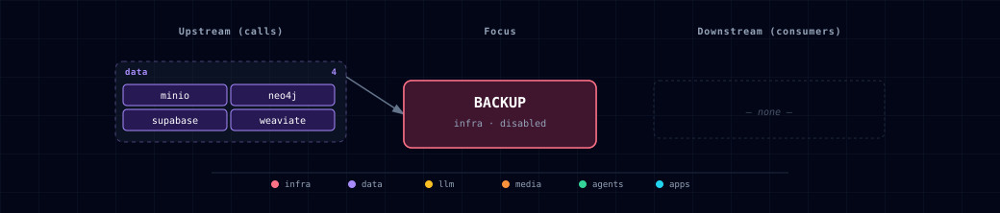

# 5.2.5. Backup / restore

On-demand backup runner for the Atlas stack. The host orchestrator captures a Postgres custom-format dump (`pg_dump -Fc`), bounded offline Neo4j Community dumps, a native online Weaviate snapshot, and a Supabase Storage archive, then pushes deployment-authenticated artifacts to an S3-compatible bucket. PostgreSQL restore is staged with a retained rollback database; Neo4j and Weaviate restore through their exact pinned database contracts.

The container is **never long-running** (`BACKUP_SCALE=0`). It exists in compose so it shares the stack network, env vars, and volume mounts — but it only does work when explicitly invoked:

```bash
# Run a full consistency-safe backup
services/backup/run-consistent-backup.sh

# Persist the enabled SOURCE through the Atlas CLI
./start.sh --backup-source container --detach

# Restore the latest backup after quiescing every database writer
docker compose run --rm \
  -e BACKUP_RESTORE_MAINTENANCE_MODE=confirmed \
  backup /scripts/restore-postgres.sh

# Restore a specific timestamp
docker compose run --rm \
  -e BACKUP_RESTORE_MAINTENANCE_MODE=confirmed \
  -e BACKUP_TIMESTAMP=20240101_120000 \
  backup /scripts/restore-postgres.sh

# Restore authenticated Neo4j and Weaviate snapshots for one timestamp
BACKUP_RESTORE_MAINTENANCE_MODE=confirmed \
  BACKUP_TIMESTAMP=20240101_120000 \
  services/backup/run-database-restore.sh
```

## 1. Overview

Runtime image: `${PROJECT_NAME}-backup:local`, built by Compose from the digest-pinned `postgres:17.10-alpine@sha256:742f40ea20b9ff2ff31db5458d127452988a2164df9e17441e191f3b72252193` base (provides `pg_dump` / `pg_restore`; the major version must be >= the `supabase-db` server, currently 17.x, or `pg_dump` aborts on a server-version mismatch). The Dockerfile bakes exact package `openssl=3.5.8-r0`. At startup the entrypoint downloads the exact official MinIO client `RELEASE.2025-08-13T08-35-41Z` binary for amd64/arm64, verifies its committed SHA-256 and reported version, and installs it atomically as `mc`. The runner never mounts the live Neo4j or Weaviate data volumes.

Scripts live under `services/backup/init/scripts/`:
- `entrypoint.sh` — verifies the image-baked OpenSSL CLI, installs the checksum-pinned `mc` binary, then execs the requested script (runs for both backup and restore).
- `database-snapshots.sh` — validates the exact Neo4j 5.26.27 offline dump, drives Weaviate 1.38.13's native filesystem backup API to `SUCCESS`, and emits signed version/checksum/completeness metadata.
- `backup-all.sh` — one exported repeatable-read Postgres snapshot, database snapshot artifacts, authenticated inventories, and the Supabase Storage archive -> S3 prefix `s3/<bucket>/<timestamp>/`.
- `restore-postgres.sh` — preflight `postgres.dump`, stage it in a temporary database, validate it, and cut over with a retained rollback database.
- `restore-databases.sh` — authenticate and bound database artifacts into a private preparation directory. The host coordinator performs all database staging, validation, and cutover work.

`run-consistent-backup.sh` and `run-database-restore.sh` execute on the host because only the operator-side Compose boundary may stop and restart Neo4j. Both use a per-repository lock, finite deadlines, and preserve an initially stopped Neo4j service instead of starting it. The lock records an OS-derived process-start identity that independent processes can verify. If owned Docker cleanup cannot be proven, the lock is atomically marked `poisoned` and is never automatically reclaimed; verify that no labeled job containers or volumes remain, then remove the lock manually before retrying. Direct `docker compose run --rm backup` is appropriate only with `BACKUP_DATABASES=false`; otherwise it fails closed when no same-timestamp offline Neo4j dump is present.

## 2. Access

The backup runner has no published port and no Kong route. It is invoked directly via `docker compose run`.

| Path | URL | Notes |
|---|---|---|
| Trigger | `services/backup/run-consistent-backup.sh` | Quiesces Neo4j, restores its prior state, then runs `backup-all.sh`. |
| Bucket (MinIO) | `http://localhost:${MINIO_CONSOLE_PORT}` | Browse backups in the MinIO console. |

## 3. Configuration

```bash
BACKUP_SOURCE=disabled          # set to container to enable
BACKUP_BUCKET=atlas-backups     # target bucket
BACKUP_S3_MODE=local            # local or external credential/dependency boundary
BACKUP_S3_ENDPOINT=http://minio:9000 # absolute HTTP(S) S3 origin
BACKUP_S3_ACCESS_KEY=           # dedicated access key; required in external mode
BACKUP_S3_SECRET_KEY=           # dedicated secret key; required in external mode
BACKUP_S3_REGION=us-east-1      # signing and bucket-creation region
BACKUP_S3_SESSION_TOKEN=        # optional temporary-credential security token
BACKUP_S3_TLS_VERIFY=true       # true verifies HTTPS; false explicitly disables verification
BACKUP_IMAGE=postgres:17.10-alpine@sha256:742f40ea20b9ff2ff31db5458d127452988a2164df9e17441e191f3b72252193 # digest-pinned build base providing pg_dump
BACKUP_COMMAND_TIMEOUT_SECONDS=900        # positive per-command deadline
BACKUP_RESTORE_GLOBAL_TIMEOUT_SECONDS=28800 # complete restore deadline; must exceed command timeout
BACKUP_MANIFEST_HMAC_KEY=                 # required 64-lowercase-hex operator secret
BACKUP_DEPLOYMENT_ID=                     # required stable deployment identity
BACKUP_MAX_POSTGRES_DUMP_BYTES=10737418240 # producer and restore download ceiling
BACKUP_RESTORE_MAX_CANDIDATES=100          # newest completion markers tried by latest restore
BACKUP_DATABASES=true                      # require consistency-safe Neo4j and Weaviate snapshots
BACKUP_DATABASE_QUIESCE_TIMEOUT_SECONDS=120 # bounded stop/start/native status deadline
BACKUP_MAX_DATABASE_ARCHIVE_BYTES=53687091200 # per-database producer/restore ceiling
BACKUP_LOCAL_SNAPSHOT_RETENTION_COUNT=3        # completed local snapshot sets kept (1-100)
BACKUP_LOCAL_ROLLBACK_RETENTION_COUNT=1        # rollback volumes kept per database (1-20)
```

`BACKUP_S3_MODE=local` is the safe default. It requires the exact internal origin `http://minio:9000`; this constraint prevents an endpoint override from sending on-stack MinIO root credentials to a remote host. New deployments should set the dedicated `BACKUP_S3_ACCESS_KEY` / `BACKUP_S3_SECRET_KEY` pair even in local mode. For upgrade compatibility only, local mode falls back to `MINIO_ROOT_USER` / `MINIO_ROOT_PASSWORD` when both dedicated values are empty. A partial pair fails closed, and a session token requires the dedicated pair.

For AWS S3 or another offsite S3-compatible service, set `BACKUP_S3_MODE=external`, the provider's origin (for example `https://s3.us-east-1.amazonaws.com`), and dedicated `BACKUP_S3_ACCESS_KEY` / `BACKUP_S3_SECRET_KEY` values. `BACKUP_S3_SESSION_TOKEN` is optional for temporary credentials. External mode never reads `MINIO_ROOT_*`. If no other selected Atlas service needs on-stack MinIO, also select `MINIO_SOURCE=disabled`; the synthesizer then renders `minio` and `minio-init` at zero replicas while the backup runner remains available. Startup validation rejects `BACKUP_S3_MODE=local` with disabled MinIO before Compose launch, but external mode permits that combination. `BACKUP_S3_MODE` deliberately does not change the global MinIO source because other enabled services may still depend on it.

The endpoint must be a complete `http://` or `https://` origin with no credentials, path, query, or fragment. DNS names are limited to 253 bytes with nonempty 1–63 byte labels; IPv4 octets are canonical decimal 0–255; IPv6 literals use valid hexadecimal compression and must be bracketed (bracketed IPv4 and dotted IPv6 forms are rejected deliberately). Optional ports are canonical decimal 1–65535 with no leading zeroes. Regions use 1–64 letters, digits, dots, underscores, or hyphens without leading/trailing punctuation. `BACKUP_S3_TLS_VERIFY` accepts only lowercase `true` or `false`; `false` is allowed only for an `https://` endpoint and enables insecure certificate handling, while plain HTTP uses `true` because no certificate exists to bypass. Credentials must be valid UTF-8 without control bytes; supported Unicode bytes are preserved exactly in JSON. The client imports them through a private per-run `0600` configuration file, removes the source immediately, deletes the client configuration on success/error/signal, and never places raw S3 credentials in command arguments.

`BACKUP_S3_ALIAS_URL` remains accepted only as a deprecated migration aid when `BACKUP_S3_ENDPOINT` is left at its default. Migrate the value to `BACKUP_S3_ENDPOINT` and set the explicit mode; conflicting values fail. A remote legacy alias still requires `BACKUP_S3_MODE=external` and dedicated credentials, so the compatibility path cannot redirect local MinIO root credentials.

`BACKUP_SOURCE` is enforced by the one-shot container entrypoint. Both backup and restore commands exit before installing tools or touching data while the source is `disabled`; set it to `container` to authorize on-demand runs. `BACKUP_SCALE` remains zero in both modes because the runner is never a long-running service.

The setup wizard exposes the same `container` / `disabled` choice. For automation, `./start.sh --backup-source container --detach` persists the selection before the one-shot `docker compose run` command is used.

Every package-install, PostgreSQL, archive, digest, sidecar parse, and S3 command is terminated when `BACKUP_COMMAND_TIMEOUT_SECONDS` elapses. Values are canonical positive decimal integers (no leading zeroes), and the command deadline is capped at 86,400 seconds. `BACKUP_RESTORE_GLOBAL_TIMEOUT_SECONDS` bounds active restore work and the lock-holder lifetime; it defaults to eight hours, must exceed the per-command deadline, and is capped at seven days. On global timeout, the trap receives `TERM`; the hard-kill grace covers the maximum foreground command remainder, one cutover compensation/drop command, exact lock-session termination, and a 60-second margin (three command deadlines plus 60 seconds). Total wall time remains finite.

Before the first backup, generate an independent HMAC key (for example, `openssl rand -hex 32`) and choose a stable deployment ID. Store both in `.env` and in the deployment's disaster-recovery secret store. The key is exactly 64 lowercase hexadecimal characters decoded by OpenSSL's `hexkey` option to 32 raw key bytes; it is not the 64-character text used verbatim. Do not reuse a JWT, database password, S3 secret, or another application credential. `BACKUP_DEPLOYMENT_ID` may contain letters, digits, dots, underscores, and hyphens. Preserve both values outside the backup bucket; losing either prevents authenticated restore, while disclosure lets an attacker forge backup publications. Rotation requires retaining the old key wherever old backups must remain restorable.

The default Compose wiring supplies the HMAC key and S3 credentials as container environment variables, and the OpenSSL CLI receives the HMAC `hexkey` option in its short-lived process arguments. Administrators with Docker inspection or host process-inspection access can therefore observe container environment values and the HMAC argument; Atlas does not claim those administrative boundaries hide secrets. Restrict Docker/host access, never enable shell tracing for these scripts, and use a dedicated narrowly scoped runner environment. The scripts never print the keys themselves, and S3 child processes receive only the private client-config path, region, and TLS setting.

Timed execution: the runner has no internal scheduler. Wire `services/backup/run-consistent-backup.sh` to the Airflow DAG, n8n workflow, or host scheduler that owns the backup cadence.

### 3.1. Neo4j and Weaviate service boundaries

Neo4j Community does not provide online backup. `run-consistent-backup.sh` records the service's initial state, stops it with a finite deadline when it was running, launches the repository's exact `neo4j:5.26.27` image against the offline data volume, dumps both `system` and `neo4j`, verifies nonempty artifacts, writes checksums/version/start/completion metadata, and restores only the state it changed. Its EXIT/signal path attempts that restart once and reports an operator-visible failure if health does not return. A repository-scoped host lock excludes overlapping backup and restore boundaries.

Weaviate remains online during capture. The exact `cr.weaviate.io/semitechnologies/weaviate:1.38.13` service enables `backup-filesystem`; the collector uses a collision-resistant backup ID, accepts only the documented 1.38.13 progress/final states, attempts bounded cancellation after a timeout, and archives only the completed native snapshot directory. Existing `.env` files are migrated to add `backup-filesystem` without dropping other enabled modules. Restore uses an empty private volume, the stable single-node `CLUSTER_HOSTNAME=weaviate`, and exact 1.38.13 before any live-volume change.

PostgreSQL and the Neo4j/Weaviate set use independent authenticated completion markers. The database-set marker binds Neo4j and Weaviate together, but it is not an atomic cross-database recovery point with PostgreSQL or Supabase Storage. Operators select and verify each independently published component for the requested timestamp.

### 3.2. Restore maintenance and rollback

The database restore command refuses to start unless `BACKUP_RESTORE_MAINTENANCE_MODE=confirmed` is supplied. This is an operator acknowledgement, not an automatic maintenance switch: first stop or scale down every service and external client that writes to Neo4j or Weaviate. `localhost` sources fail before any database is touched; `disabled` sources are skipped. Keep writers quiesced until the restored databases have been checked and the rollback decision is complete.

The host coordinator authenticates and extracts both archives into a unique private artifact volume. It loads both Neo4j dumps into a fresh exact-5.26.27 volume and starts a disposable node to query-validate both databases. It restores Weaviate only into a fresh exact-1.38.13 volume and requires native `SUCCESS`, exact version metadata, readiness, and readable schema/object APIs; it does not compare a mutable live pre-backup object count with the online snapshot. Only after every enabled stage passes does it stop the initially running database services, prepare and content-verify every live rollback volume, replace live contents from the validated stages, and validate again. A copy, start, health, or signal failure restores every available completed rollback copy and then restores only the services that were initially running. Compose cannot atomically switch its fixed named-volume pointers, so this is a bounded offline copy cutover with compensating rollback, not a pointer swap.

After authenticated backup publication, local snapshot pruning runs with the selected database services temporarily quiesced and retains `BACKUP_LOCAL_SNAPSHOT_RETENTION_COUNT` completed native snapshot directories. Successful restore commits the cutover before retaining the newest `BACKUP_LOCAL_ROLLBACK_RETENTION_COUNT` rollback volumes per database; a later retention-prune failure is reported as housekeeping and never triggers a destructive rollback. Volumes are selected only through repository-scope and role labels. Retention never prunes S3 objects.

Each completed backup contains `postgres.dump`, `postgres.manifest`, `postgres.tables`, and `postgres.objects` under an immutable random 128-bit backup-ID subprefix, plus a timestamp-level `postgres.complete` publication marker. Manifest format 3 binds the requested timestamp, backup ID, stable deployment ID, exact database-name bytes, every artifact's digest and byte size, complete canonical archive-object inventory digest/count, nonzero user-table inventory digest/count, completion size, and producing PostgreSQL version. A cluster-wide backup-publication advisory lock is held from before the timestamp-prefix check through the final marker upload; an overlapping producer exits 75. Under that lock the producer rejects any existing timestamp-prefix object, uploads data and sidecars first, then publishes the separately authenticated completion marker pointing at the signed random subprefix.

Latest restore streams the recursive listing through a fixed-memory newest-first selector and authenticates at most `BACKUP_RESTORE_MAX_CANDIDATES` completion markers (default 100, maximum 1,000). It skips interrupted or replayed publications whose signed timestamp does not match their prefix and falls back only within that bounded window. Set an exact `BACKUP_TIMESTAMP` to restore an older completed backup outside the window; exact selection also requires a valid completion marker.

Completion and manifest are streamed into small fixed caps before authentication. Their authenticated sizes then bound streaming of the dump and inventories to at most the signed size plus one byte; `BACKUP_MAX_POSTGRES_DUMP_BYTES` is an additional finite producer/consumer ceiling. S3 transport credentials and object adjacency alone are not a trust boundary: the HMAC key must remain outside S3, and bucket policy/versioning should prevent unauthorized replacement or deletion. Legacy unsigned/format-2 backups fail closed; there is no unsafe compatibility override.

`pg_dump` and the table inventory import the same exported repeatable-read snapshot; the object inventory is derived from the completed archive. Concurrent DDL therefore falls wholly before or after the authenticated logical backup instead of splitting its dump and inventories across snapshots. The dump remains executable, source-controlled PostgreSQL input: `pg_restore` can create functions and other code-bearing objects. Restore only backups authenticated by the deployment key and obtained from the expected bucket/prefix.

The script runs four explicit phases:

1. **Preflight** rejects impossible calendar timestamps; downloads the dump and three sidecars under strict size/line limits; verifies the deployment HMAC, exact target identity, checksums, nonzero inventories, the archive's complete object list, and producer compatibility; and rejects database-bound logical slots, subscriptions, or prepared transactions that a logical archive/cutover cannot preserve.
2. **Restore** takes a cluster-wide advisory lock, creates a uniquely named `atlas_restore_*` database from `template0` with the target's owner, encoding, locale provider/locale, tablespace, and connection limit, copies database ACLs and per-database/per-role GUCs, and runs `pg_restore --exit-on-error` against that database only.
3. **Validate** rejects the staged database if PostgreSQL reports an invalid index or unvalidated constraint, or if its exact user-table inventory differs from the authenticated sidecar.
4. **Cutover** terminates target/staging connections, renames the original database to a unique `atlas_rollback_*` name, and renames the validated database to the configured `SUPABASE_DB_NAME`.

Corrupt, empty, wrong-deployment, wrong-database, incomplete, unauthenticated, and incompatible archives, restore errors, and validation errors never target or mutate the original database. Before cutover, failure cleanup drops only the uniquely generated staging database. Once cutover starts, cleanup never drops validated staging: it inspects all three exact names, restores the original target name when safe, preserves ambiguous state, and prints the target/staging/rollback recovery names. A global advisory lock rejects overlapping restore attempts while allowing its own just-starting lock backend time to register the advisory request; ownership is checked again immediately before cutover.

PostgreSQL cannot transactionally rename databases. If the second cutover rename fails or times out, the script attempts to restore the original name before exiting and preserves the validated staging database; if compensation is impossible, it emits all exact names for manual recovery. Do not resume writers in that state. On success, the final line reports the rollback database name. While writers remain quiesced, perform only read-only verification and choose whether to accept or roll back. Resume writes only after accepting the restore: any writes to the restored database make a later rename rollback lossy. Atlas never drops the rollback database automatically.

To roll back after a successful cutover, quiesce writers again, terminate connections to both databases, rename the restored target aside, and rename the reported `atlas_rollback_*` database back to `SUPABASE_DB_NAME`. The configured PostgreSQL credential need not itself own the database, but it must be administrative: it needs `CREATEDB`; `CREATE` on the target tablespace; connection rights to `template1`, target, and staging; membership or `SET ROLE` access for the target owner, database ACL roles, and every archive object-owner role; permission to inspect database-bound replication/subscription/prepared state and metadata; permission to terminate every target/staging connection (`pg_signal_backend` or equivalent); and `CREATEROLE`/admin rights needed to apply `ALTER ROLE ... IN DATABASE` settings. Arbitrary authenticated archives generally require superuser-equivalent restore administration. The usual Supabase `postgres` administrative role satisfies these requirements.

## 4. Architecture & wiring

**Backup mounts.** The runner sees one live application volume and two completed-snapshot volumes:

| Mount path | Named volume | Contents |
|---|---|---|
| `/volumes/supabase-storage` | `${PROJECT_NAME}-supabase-storage-data` | Supabase Storage object files |
| `/database-snapshots/neo4j` | `${PROJECT_NAME}-neo4j-backups` | Completed offline Neo4j dumps and restore staging |
| `/database-snapshots/weaviate` | `${PROJECT_NAME}-weaviate-backups` | Completed native Weaviate backups and restore staging |

Postgres data lives in `supabase-db-data` but is captured via `pg_dump` (not volume tar), so the dump is logically consistent. Restore reads PostgreSQL 17 target catalogs, including libc, ICU, and builtin locale-provider metadata; backups from older supported server majors may restore into PostgreSQL 17, but a backup from a newer major is rejected.

**Client binaries.** The shared entrypoint (`init/scripts/entrypoint.sh`) downloads the official `mc.RELEASE.2025-08-13T08-35-41Z` asset, accepts only amd64 or arm64, verifies the architecture-specific SHA-256 committed from the upstream release, verifies `mc --version`, and atomically installs `/usr/local/bin/mc`. The disposable S3 contracts exercise that same release, including temporary-session-token behavior. The Dockerfile installs exact `openssl=3.5.8-r0` while building `${PROJECT_NAME}-backup:local`; runtime backup and restore never resolve OpenSSL from a package repository, and the entrypoint fails clearly if the built-image invariant is broken. The entrypoint and target are invoked via `sh`, so they do not depend on bind-mounted (read-only, mode 0644) scripts carrying an executable bit.

CI builds `atlas-backup:local` from the same digest-pinned Postgres base, pulls the pinned MinIO server/client images, opts into the production-image integration, and runs the built image's real entrypoint download/checksum/install path against isolated tmpfs S3. Local test runs remain offline-safe: the production-image test is skipped unless `ATLAS_BACKUP_PRODUCTION_IMAGE_INTEGRATION=1`, and an opted-in run fails rather than silently skipping when an exact image is absent.

**Network.** Attached to `backend-network` only — reaches `supabase-db:5432` and, in local mode, `minio:9000` via Docker DNS. External mode reaches the configured S3 origin without a Compose `depends_on` edge to MinIO.

## 5. Dependencies & Integrations

### 5.1. Current — Upstream (this service calls)

| Service | Category |
|---|---|
| minio | data |
| neo4j | data |
| supabase | data |
| weaviate | data |

### 5.2. Current — Downstream (services that call this)

_No downstream consumers._

### 5.3. Architecture diagram



[Open the full-size diagram](./architecture.html) for a full-screen view.

### 5.4. Future — Missing pair integrations

- **backup -> airflow** — *Why:* schedule the backup runner from an Airflow DAG (`BashOperator` calling `docker compose run --rm backup`) for cron-based automation without adding a cron daemon. *Effort:* small.
- **backup -> n8n** — *Why:* n8n's Execute Command node can trigger backup runs and send Slack/email alerts on failure. *Effort:* small.

### 5.5. Future — Candidate new services

- **Restic** — *Why:* restic provides incremental, deduplicated, encrypted backups with retention policies, replacing the full-tar approach. *Effort:* medium.

### 5.6. Future — Unused features in this service

- **Supabase Storage restore** — *Why:* database restores are executable, but the read-only Supabase Storage archive still needs a bounded, maintenance-mode restore workflow. *Effort:* small.
- **Remote retention / pruning** — *Why:* local native snapshot and rollback retention is bounded, but S3 objects still require an operator-owned lifecycle rule. *Effort:* small.
- **Post-upload backup verification** — *Why:* restore preflight checks an archive only when it is consumed; checking immediately after upload would detect corruption earlier. *Effort:* small.

## 6. Troubleshooting

**`pinned mc download failed` / `checksum verification failed`.** The entrypoint could not retrieve the exact official release asset or its bytes did not match the committed architecture checksum. Do not bypass verification or substitute Alpine's mutable `minio-client` package. Check outbound GitHub release access and architecture, then retry; a version/hash mismatch fails before backup or restore starts.

**`Backup local S3 mode requires MINIO_SOURCE to be enabled`.** Either enable on-stack MinIO for local mode, or explicitly select `BACKUP_S3_MODE=external` and provide dedicated external credentials before disabling MinIO.

**`pg_dump: connection refused`.** `supabase-db` is not healthy. Check `docker compose ps supabase-db` and wait for the health check to pass before running the backup.

**`ERROR: bucket does not exist`.** The bucket is auto-created by the script (`mc mb --ignore-existing`). In local mode, check `docker compose ps minio`. In external mode, verify the endpoint, region, dedicated credentials, bucket-creation permission, and provider network policy.

**`BACKUP_S3_ACCESS_KEY and BACKUP_S3_SECRET_KEY are required for external endpoints`.** External mode never falls back to `MINIO_ROOT_*`. Supply a dedicated pair and, when using temporary credentials, the matching session token.

**`BACKUP_S3_MODE=local requires BACKUP_S3_ENDPOINT=http://minio:9000`.** Select `external` before configuring any remote origin. This is a fail-closed credential boundary, not a connectivity error.

**`Neo4j offline snapshot is missing`.** Run `services/backup/run-consistent-backup.sh`, not the container command directly. The wrapper is the bounded stop/dump/restart boundary; the runner refuses to tar a live graph volume.

**Weaviate restore reports a hostname mismatch.** Restore uses Weaviate's native node contract. Keep Atlas's fixed single-node `CLUSTER_HOSTNAME=weaviate`; restoring to a differently named or differently sized cluster requires an upstream-supported node mapping and is not inferred by Atlas.

```bash
services/backup/run-consistent-backup.sh
docker compose logs backup
```

For general startup and routing issues, see [Troubleshooting](../../docs/quick-start/troubleshooting.md).

## 7. Capabilities & limitations

| Capability | Status | Verification | Notes |
|---|---|---|---|
| On-demand Postgres and consistency-safe snapshot export | supported | documented | The orchestrated runner creates a snapshot-consistent PostgreSQL custom-format dump, an offline Neo4j Community dump, and a native online Weaviate snapshot with deployment-key-authenticated manifests, plus a read-only Supabase Storage archive, then uploads them to constrained on-stack MinIO or external S3. |
| Postgres restore workflow | partial | tested | The tested PostgreSQL workflow fail-closes on missing, unauthenticated, or mismatched deployment/identity/integrity inventories, preserves target database attributes, ACLs, and settings, restores and validates a temporary database, then performs a recoverable maintenance-mode cutover while retaining the original; Supabase Storage volume archives still have no restore workflow. |
| Consistent Neo4j and Weaviate backup/restore | supported | tested | The host orchestrator captures Neo4j Community 5.26.27 offline, restores both databases into a disposable exact-version stage, and uses Weaviate 1.38.13's native online backup plus an isolated exact-version restore stage. Live cutover is quiesced, copy-based, query-validated, and protected by retained rollback volumes. |
| Scheduled and remote retention | partial | documented | Atlas has no scheduler and does not delete S3 objects. Bounded local native-snapshot and rollback-volume retention runs only after successful publication or cutover. Operators provide scheduling and an S3 lifecycle. |
