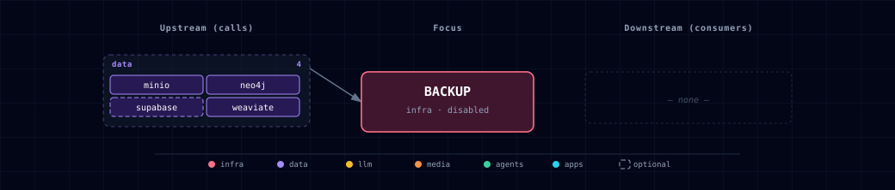

# 5.2.5. Backup / restore

On-demand backup runner for the Atlas stack. The host orchestrator captures four artifact sets:

- a PostgreSQL custom-format dump (`pg_dump -Fc`);
- bounded offline Neo4j Community dumps;
- a native online Weaviate snapshot;
- a Supabase Storage archive.

It uploads them to an S3-compatible bucket with deployment-authenticated manifests. PostgreSQL restore stages the dump and keeps a rollback database. Neo4j and Weaviate restore through their exact pinned database contracts.

The container is **never long-running** (`BACKUP_SCALE=0`). It is in Compose to share the stack network, env vars and volume mounts. It does work only when you invoke it:

```bash
# Run a full consistency-safe backup
services/backup/run-consistent-backup.sh

# Persist the enabled SOURCE through the Atlas CLI
./start.sh --backup-source container --detach

# Restore the latest backup after quiescing every database writer
docker compose run --rm \
  -e BACKUP_RESTORE_MAINTENANCE_MODE=confirmed \
  backup /scripts/restore-postgres.sh

# Restore a specific timestamp
docker compose run --rm \
  -e BACKUP_RESTORE_MAINTENANCE_MODE=confirmed \
  -e BACKUP_TIMESTAMP=20240101_120000 \
  backup /scripts/restore-postgres.sh

# Restore authenticated Neo4j and Weaviate snapshots for one timestamp
BACKUP_RESTORE_MAINTENANCE_MODE=confirmed \
  BACKUP_TIMESTAMP=20240101_120000 \
  services/backup/run-database-restore.sh
```

## 1. Overview

Runtime image: `${PROJECT_NAME}-backup:local`. Compose builds it from the digest-pinned base `postgres:17.11-alpine@sha256:b0f9560a2de083e2cc7382e75f808c7381a32852a7ec49117deedb300e552b24`, which supplies `pg_dump` and `pg_restore`.

- The base's PostgreSQL major must be equal to or higher than the `supabase-db` server (17.x). Otherwise `pg_dump` aborts on the server-version mismatch.
- The Dockerfile applies Alpine's published package updates at build time, because the pinned base lags them and the final-image scan gate reports that. It then installs the exact package `openssl=3.5.9-r0`.
- The image also contains the checksum-pinned MinIO client `mc` `RELEASE.2026-09-16T00-00-00Z` from the maintained [pgsty/mc](https://github.com/pgsty/mc) fork. §4 (**Client binaries**) describes how the entrypoint verifies it.
- The runner never mounts the live Neo4j or Weaviate data volumes.

Scripts live under `services/backup/init/scripts/`:
- `entrypoint.sh` — verifies the image-baked OpenSSL CLI and the checksum-pinned, image-baked `mc` binary, then execs the requested script (runs for both backup and restore).
- `database-snapshots.sh` — validates the exact Neo4j 5.26.31 offline dump, drives Weaviate 1.38.17's native filesystem backup API to `SUCCESS`, and emits signed version, checksum and completeness metadata.
- `backup-all.sh` — one exported repeatable-read Postgres snapshot, database snapshot artifacts, authenticated inventories, and the Supabase Storage archive -> S3 prefix `s3/<bucket>/<timestamp>/`.
- `restore-postgres.sh` — preflight `postgres.dump`, stage it in a temporary database, validate it, and cut over with a retained rollback database.
- `restore-databases.sh` — authenticate and bound database artifacts into a private preparation directory. The host coordinator does all database staging, validation and cutover work.
- `s3-client.sh` — shared S3 client functions sourced by `backup-all.sh`, `restore-postgres.sh` and `restore-databases.sh`. It validates the endpoint, region, TLS setting and credentials, and writes the private per-run `mc` configuration.

**Host scripts.** `run-consistent-backup.sh` and `run-database-restore.sh` run on the host, because only the operator-side Compose boundary can stop and restart Neo4j.

- Both take a per-checkout lock: `volumes/locks/atlas-database-boundary-<digest>.lock` (gitignored, owner-only). A scheduled backup and an interactive restore therefore contend for the same file.
- To move the lock, set `ATLAS_DATABASE_LOCK_DIR`. Set it identically for every run.
- Both scripts use finite deadlines. They leave an initially stopped Neo4j service stopped.
- If owned Docker cleanup cannot be proven, the lock is atomically marked `poisoned` and is never reclaimed automatically. Verify that no labeled job containers or volumes remain, then remove the lock manually and retry.

Run `docker compose run --rm backup` directly only with `BACKUP_DATABASES=false`. Otherwise it fails closed when no same-timestamp offline Neo4j dump is present.

## 2. Access

The backup runner has no published port and no Kong route. It is invoked directly via `docker compose run`.

| Path | URL | Notes |
|---|---|---|
| Trigger | `services/backup/run-consistent-backup.sh` | Quiesces Neo4j, restores its prior state, then runs `backup-all.sh`. |
| Bucket (MinIO) | `http://localhost:${MINIO_CONSOLE_PORT}` | Browse backups in the MinIO console. |

## 3. Configuration

```bash
BACKUP_SOURCE=disabled          # set to container to enable
BACKUP_BUCKET=atlas-backups     # target bucket
BACKUP_S3_MODE=local            # local or external credential/dependency boundary
BACKUP_S3_ENDPOINT=http://minio:9000 # absolute HTTP(S) S3 origin
BACKUP_S3_ACCESS_KEY=           # dedicated access key; required in external mode
BACKUP_S3_SECRET_KEY=           # dedicated secret key; required in external mode
BACKUP_S3_REGION=us-east-1      # signing and bucket-creation region
BACKUP_S3_SESSION_TOKEN=        # optional temporary-credential security token
BACKUP_S3_TLS_VERIFY=true       # true verifies HTTPS; false explicitly disables verification
BACKUP_IMAGE=postgres:17.11-alpine@sha256:b0f9560a2de083e2cc7382e75f808c7381a32852a7ec49117deedb300e552b24 # digest-pinned build base providing pg_dump
BACKUP_COMMAND_TIMEOUT_SECONDS=900        # positive per-command deadline
BACKUP_RESTORE_GLOBAL_TIMEOUT_SECONDS=28800 # complete restore deadline; must exceed command timeout
BACKUP_MANIFEST_HMAC_KEY=                 # required 64-lowercase-hex operator secret
BACKUP_DEPLOYMENT_ID=                     # required stable deployment identity
BACKUP_MAX_POSTGRES_DUMP_BYTES=10737418240 # producer and restore download ceiling
BACKUP_RESTORE_MAX_CANDIDATES=100          # newest completion markers tried by latest restore
BACKUP_DATABASES=true                      # require consistency-safe Neo4j and Weaviate snapshots
BACKUP_DATABASE_QUIESCE_TIMEOUT_SECONDS=120 # bounded stop/start/native status deadline (bulk copy/verify/load/dump steps get max(this, 900) s)
BACKUP_MAX_DATABASE_ARCHIVE_BYTES=53687091200 # per-database producer/restore ceiling
BACKUP_LOCAL_SNAPSHOT_RETENTION_COUNT=3        # completed local snapshot sets kept (1-100)
BACKUP_LOCAL_ROLLBACK_RETENTION_COUNT=1        # rollback volumes kept per database (1-20)
```

**Enabling the runner.** The one-shot container entrypoint enforces `BACKUP_SOURCE`. While it is `disabled`, backup and restore commands exit before they check tools or touch data. Set it to `container` to allow on-demand runs. `BACKUP_SCALE` stays zero in both modes. The setup wizard offers the same `container` / `disabled` choice. For automation, `./start.sh --backup-source container --detach` persists the selection before you use `docker compose run`.

**Local S3 mode.** `BACKUP_S3_MODE=local` is the safe default.

- It requires the exact internal origin `http://minio:9000`. An endpoint override therefore cannot send on-stack MinIO root credentials to a remote host.
- Set the dedicated `BACKUP_S3_ACCESS_KEY` / `BACKUP_S3_SECRET_KEY` pair in new deployments, also in local mode.
- Atlas does not create that MinIO account. Create it yourself, for example with `mc admin user add`, and put its keys in `.env`.
- Its policy must allow `s3:CreateBucket`, `s3:ListBucket`, `s3:GetObject`, `s3:PutObject` and `s3:DeleteObject` on the backup bucket. The runner issues `mc mb --ignore-existing` before it uploads.
- A key that MinIO does not know fails the run at bucket creation.
- For upgrade compatibility only, local mode uses `MINIO_ROOT_USER` / `MINIO_ROOT_PASSWORD` when both dedicated values are empty. A partial pair fails closed. A session token requires the dedicated pair.

**External S3 mode.** For AWS S3 or another offsite S3-compatible service:

- Set `BACKUP_S3_MODE=external`, the provider's origin (for example `https://s3.us-east-1.amazonaws.com`), and dedicated `BACKUP_S3_ACCESS_KEY` / `BACKUP_S3_SECRET_KEY` values.
- `BACKUP_S3_SESSION_TOKEN` is optional, for temporary credentials. External mode never reads `MINIO_ROOT_*`.
- If no other selected service needs on-stack MinIO, also select `MINIO_SOURCE=disabled`. The synthesizer then renders `minio` and `minio-init` at zero replicas, and the backup runner stays available.
- Startup validation rejects `BACKUP_S3_MODE=local` with disabled MinIO before Compose launch. External mode allows that combination.
- `BACKUP_S3_MODE` does not change the global MinIO source, because other enabled services can still depend on it.

**Endpoint, region and credential syntax.** Startup rejects a value that breaks these rules:

| Setting | Rule |
|---|---|
| Endpoint | A complete `http://` or `https://` origin. No credentials, path, query or fragment. |
| DNS host | At most 253 bytes. Each label is 1–63 bytes. |
| IPv4 host | Canonical decimal octets 0–255. Bracketed IPv4 is rejected. |
| IPv6 host | Valid hexadecimal compression, in brackets. Dotted IPv6 forms are rejected. |
| Port | Optional. Canonical decimal 1–65535, no leading zeroes. |
| Region | 1–64 letters, digits, dots, underscores or hyphens. No leading or trailing punctuation. |
| `BACKUP_S3_TLS_VERIFY` | Lowercase `true` or `false` only. `false` (insecure certificate handling) is allowed only for an `https://` endpoint. Plain HTTP uses `true`. |
| Credentials | Valid UTF-8 without control bytes. Supported Unicode bytes are preserved exactly in JSON. |

The client imports credentials through a private per-run `0600` configuration file and removes the source at once. It deletes the client configuration on success, error or signal. Raw S3 credentials never go into command arguments.

**Legacy alias.** `BACKUP_S3_ALIAS_URL` is still accepted as a deprecated migration aid, but only when `BACKUP_S3_ENDPOINT` keeps its default. Move the value to `BACKUP_S3_ENDPOINT` and set the mode explicitly. Conflicting values fail. A remote legacy alias still requires `BACKUP_S3_MODE=external` and dedicated credentials, so it cannot redirect local MinIO root credentials.

**Deadlines.** Each value is a canonical positive decimal integer, with no leading zeroes.

- `BACKUP_COMMAND_TIMEOUT_SECONDS` (default 900, maximum 86,400) ends any single package-install, PostgreSQL, archive, digest, sidecar-parse or S3 command.
- `BACKUP_RESTORE_GLOBAL_TIMEOUT_SECONDS` (default 28,800 = eight hours, maximum 604,800 = seven days) bounds active restore work and the lock-holder lifetime. It must exceed the command deadline.
- On global timeout the trap receives `TERM`. The hard-kill grace is three command deadlines plus 60 seconds. It covers the foreground command remainder, one cutover compensation or drop command, and lock-session termination.
- The host orchestrator bounds a whole backup run at `max(3 × BACKUP_COMMAND_TIMEOUT_SECONDS, 900)` seconds, because the run chains dumps, the snapshot wait and uploads.
- The Weaviate snapshot wait inside the runner uses `BACKUP_COMMAND_TIMEOUT_SECONDS`, not the 120 s quiesce timeout. A larger command deadline gives a large snapshot more time in total.
- A staged Weaviate restore waits up to `max(BACKUP_DATABASE_QUIESCE_TIMEOUT_SECONDS, 900)` seconds.
- When a host orchestrator step times out it exits 124. Configuration and contract errors exit 64; an interruption exits 130.

**Known gap: Weaviate cancellation.** Atlas cancels a timed-out Weaviate operation with `wget --method=DELETE`. The BusyBox `wget` in the runner and in the Weaviate image rejects that option ([#1376](https://github.com/thekaveh/atlas/issues/1376)).

- After a snapshot timeout the Weaviate backup keeps running. The next backup can be refused as already in progress until it finishes.
- After a restore timeout the cancel reports failure, and the staged container is removed anyway.

**Failed backup job cleanup.** The backup job's `docker compose run` can fail from a `backup-all.sh` failure, a startup error or a timeout. The orchestrator then polls for the job container.

- The poll lasts up to `max(BACKUP_DATABASE_QUIESCE_TIMEOUT_SECONDS, 900)` seconds: up to an hour with the quiesce maximum of 3,600. Interrupts are deferred meanwhile.
- If `--rm` already removed the container (the usual case after a script failure), the full window elapses.
- A container that is still present, for example after a timeout, is removed at once.
- The wait exists because a failed create-capable command can become visible to the daemon late.

**HMAC key and deployment ID.** Do these steps before the first backup:

1. Generate an independent HMAC key, for example with `openssl rand -hex 32`.
2. Choose a stable deployment ID: letters, digits, dots, underscores and hyphens.
3. Store both in `.env` and in the deployment's disaster-recovery secret store, outside the backup bucket.

- The key is exactly 64 lowercase hexadecimal characters. OpenSSL's `hexkey` option decodes it to 32 raw key bytes; the 64-character text is not used verbatim.
- Do not reuse a JWT, database password, S3 secret or other application credential.
- If you lose either value, authenticated restore is not possible. If either is disclosed, an attacker can forge backup publications.
- To rotate the key, keep the old key wherever old backups must stay restorable.

**Secret exposure.** The default Compose wiring passes the HMAC key and S3 credentials as container environment variables. The OpenSSL CLI receives the HMAC `hexkey` option in its short-lived process arguments. Administrators with Docker inspection or host process-inspection access can therefore see them.

- Restrict Docker and host access.
- Never enable shell tracing for these scripts.
- Use a dedicated, narrowly scoped runner environment.

The scripts never print the keys. S3 child processes receive only the private client-config path, the region and the TLS setting.

**Scheduling.** The runner has no internal scheduler. Run `services/backup/run-consistent-backup.sh` from a host scheduler, such as cron, that owns the backup cadence. It must run on the host to stop and restart Neo4j, so an Airflow or n8n trigger needs host command access.

### 3.1. Neo4j and Weaviate service boundaries

**Neo4j.** Neo4j Community has no online backup. `run-consistent-backup.sh` does these steps:

1. Records the service's initial state, and stops it with a finite deadline if it was running.
2. Runs the repository's exact `neo4j:5.26.31` image against the offline data volume and dumps both `system` and `neo4j`.
3. Verifies nonempty artifacts and writes checksum, version, start and completion metadata.
4. Restores only the state it changed.

Its EXIT and signal path tries that restart once and reports a visible failure if health does not return. A repository-scoped host lock prevents overlapping backup and restore boundaries.

**Weaviate.** Weaviate stays online during capture. The exact `cr.weaviate.io/semitechnologies/weaviate:1.38.17` service enables `backup-filesystem`. The collector uses a collision-resistant backup ID and accepts only the documented 1.38.17 progress and final states. It tries bounded cancellation after a timeout and archives only the completed native snapshot directory.

- Existing `.env` files are migrated to add `backup-filesystem` without dropping other enabled modules. A blank or missing module list becomes the full shipped default list, because blank meant the defaults.
- Restore uses an empty private volume, the stable single-node `CLUSTER_HOSTNAME=weaviate`, and exact 1.38.17 before any live-volume change.

**Recovery points.** PostgreSQL and the Neo4j/Weaviate set use independent authenticated completion markers. The database-set marker authenticates the Neo4j and Weaviate artifacts as one set, but they are not one point in time. Neo4j is dumped offline first; then Weaviate is snapshotted online while writers keep running. The set is also not an atomic cross-database recovery point with PostgreSQL or Supabase Storage. Select and verify each independently published component for the requested timestamp.

### 3.2. Restore maintenance and rollback

**Maintenance mode.** The database restore command refuses to start unless `BACKUP_RESTORE_MAINTENANCE_MODE=confirmed` is set. This is an operator acknowledgement, not an automatic maintenance switch. First stop or scale down every service and external client that writes to Neo4j or Weaviate. `localhost` sources fail before any database is touched; `disabled` sources are skipped. Keep writers quiesced until you have checked the restored databases and made the rollback decision.

**Accepted versions.** New backups always record Neo4j 5.26.31 and Weaviate 1.38.17.

- A restore also accepts Neo4j snapshots from 5.26.30, the previous pinned release, because both use the 5.26 LTS dump format.
- A restore also accepts native Weaviate backups from 1.38.13, the previous pin. They restore into the newer patch release.
- Every other release, or an image that disagrees with its recorded version, is rejected before any load.

**Stage.** The host coordinator authenticates both archives and extracts them into a unique private artifact volume.

- It loads both Neo4j dumps into a fresh exact-5.26.31 volume and starts a disposable node to query-validate both databases.
- It restores Weaviate only into a fresh exact-1.38.17 volume. It requires native `SUCCESS`, exact version metadata, readiness, and readable schema and object APIs.
- It does not compare a mutable live pre-backup object count with the online snapshot.

**Cutover.** Only after every enabled stage passes, the coordinator stops the initially running database services. It prepares and content-verifies every live rollback volume, replaces live contents from the validated stages, and validates again. Compose cannot atomically switch its fixed named-volume pointers. This is therefore a bounded offline copy cutover with compensating rollback, not a pointer swap.

**Failure.** A copy, start, health or signal failure restores every available completed rollback copy. It then restarts only the services that were initially running.

**Retention.**

- After authenticated backup publication, local snapshot pruning runs with the selected database services briefly quiesced. It keeps `BACKUP_LOCAL_SNAPSHOT_RETENTION_COUNT` completed native snapshot directories.
- A successful restore commits the cutover first, then keeps the newest `BACKUP_LOCAL_ROLLBACK_RETENTION_COUNT` rollback volumes per database. A later prune failure is reported as housekeeping and never triggers a destructive rollback.
- With the default of 1, a second restore prunes the first restore's rollback volume. That volume holds the pre-incident data, which may exist nowhere else. Raise the count before you restore again.
- A restore whose cutover changed live data but could not prove recovery poisons the lock. It keeps the rollback and stage volumes and prints their names. Copy or rename them before you clear the lock, because the next restore prunes older rollback volumes.
- Volumes are selected only through repository-scope and role labels. Retention never prunes S3 objects.

**Backup layout.** Each completed backup contains `postgres.dump`, `postgres.manifest`, `postgres.tables` and `postgres.objects` under an immutable random 128-bit backup-ID subprefix. A timestamp-level `postgres.complete` publication marker points to it.

- A database (Neo4j/Weaviate) restore also requires a signed `postgres.complete` for the same backup ID. A backup whose final upload failed is therefore never cut over in part.
- A disabled Neo4j or Weaviate source is recorded as an empty placeholder archive.

Manifest format 3 binds:

- the requested timestamp, the backup ID and the stable deployment ID;
- the exact database-name bytes;
- every artifact's digest and byte size;
- the complete canonical archive-object inventory digest and count;
- the nonzero user-table inventory digest and count;
- the completion size and the producing PostgreSQL version.

**Publication.** A cluster-wide backup-publication advisory lock is held from before the timestamp-prefix check until the final marker upload. An overlapping producer exits 75. Under that lock the producer rejects any existing timestamp-prefix object. It uploads data and sidecars first, then publishes the separately authenticated completion marker that points to the signed random subprefix.

**Latest-backup selection.** Latest restore streams the recursive listing through a fixed-memory newest-first selector. It authenticates at most `BACKUP_RESTORE_MAX_CANDIDATES` completion markers (default 100, maximum 1,000). It skips interrupted or replayed publications whose signed timestamp does not match their prefix, and falls back only within that window. To restore an older backup outside the window, set an exact `BACKUP_TIMESTAMP`. Exact selection also requires a valid completion marker.

**Download bounds and trust.**

- Completion and manifest files are streamed into small fixed caps before authentication. Their authenticated sizes then limit the dump and inventories to the signed size plus one byte.
- `BACKUP_MAX_POSTGRES_DUMP_BYTES` is an additional finite producer and consumer ceiling.
- S3 transport credentials and object adjacency alone are not a trust boundary. Keep the HMAC key outside S3, and use bucket policy and versioning to prevent unauthorized replacement or deletion.
- Legacy unsigned and format-2 backups fail closed. There is no unsafe compatibility override.

**Snapshot consistency.** `pg_dump` and the table inventory import the same exported repeatable-read snapshot. The object inventory is derived from the completed archive. Concurrent DDL therefore falls wholly before or after the authenticated logical backup. The dump stays executable PostgreSQL input: `pg_restore` can create functions and other code-bearing objects. Restore only backups that the deployment key authenticates and that come from the expected bucket and prefix.

The script runs four explicit phases:

1. **Preflight**:
    - rejects impossible calendar timestamps;
    - downloads the dump and three sidecars under strict size and line limits;
    - verifies the deployment HMAC, exact target identity, checksums, nonzero inventories, the archive's complete object list, and producer compatibility;
    - rejects database-bound logical slots, subscriptions or prepared transactions that a logical archive and cutover cannot preserve.
2. **Restore**:
    - takes a cluster-wide advisory lock;
    - creates a uniquely named `atlas_restore_*` database from `template0` with the target's owner, encoding, locale provider and locale, tablespace, and connection limit;
    - copies database ACLs and per-database and per-role GUCs;
    - runs `pg_restore --exit-on-error` against that database only.
3. **Validate** rejects the staged database if PostgreSQL reports an invalid index or unvalidated constraint. It also rejects it if its exact user-table inventory differs from the authenticated sidecar.
4. **Cutover** terminates target/staging connections and renames the original database to a unique `atlas_rollback_*` name. It then renames the validated database to the configured `SUPABASE_DB_NAME`.

**Failure safety.**

- Corrupt, empty, wrong-deployment, wrong-database, incomplete, unauthenticated or incompatible archives never target or mutate the original database. Restore and validation errors do not either.
- Before cutover, failure cleanup drops only the uniquely generated staging database.
- After cutover starts, cleanup never drops validated staging. It inspects all three exact names and restores the original target name when safe. It keeps ambiguous state and prints the target, staging and rollback names.
- A global advisory lock rejects overlapping restore attempts. It gives its own just-starting lock backend time to register the advisory request. Ownership is checked again just before cutover.

**Cutover renames.** PostgreSQL cannot rename databases transactionally. If the second cutover rename fails or times out, the script tries to restore the original name and keeps the validated staging database. If compensation is not possible, it prints all exact names for manual recovery. Do not resume writers in that state.

**After a successful cutover.** The final line reports the rollback database name. While writers stay quiesced, do only read-only verification, then accept or roll back. Resume writes only after you accept the restore, because any write to the restored database makes a later rename rollback lossy. Atlas never drops the rollback database automatically.

**Rollback.** To roll back after a successful cutover:

1. Quiesce writers again.
2. Terminate connections to both databases.
3. Rename the restored target aside.
4. Rename the reported `atlas_rollback_*` database back to `SUPABASE_DB_NAME`.

**Restore credential.** The configured PostgreSQL credential need not own the database, but it must be administrative. It needs:

- `CREATEDB`, and `CREATE` on the target tablespace;
- connection rights to `template1`, the target and staging;
- membership or `SET ROLE` access for the target owner, the database ACL roles and every archive object-owner role;
- permission to inspect database-bound replication, subscription and prepared state and metadata;
- permission to terminate every target and staging connection (`pg_signal_backend` or equivalent);
- the `CREATEROLE` or admin rights needed to apply `ALTER ROLE ... IN DATABASE` settings.

Arbitrary authenticated archives generally require superuser-equivalent restore administration. The default `SUPABASE_DB_USER` (`supabase_admin`, a superuser) meets these requirements. In Supabase images the `postgres` role is not a superuser.

## 4. Architecture & wiring

**Backup mounts.** The runner sees one live application volume and two completed-snapshot volumes:

| Mount path | Named volume | Contents |
|---|---|---|
| `/volumes/supabase-storage` | `${PROJECT_NAME}-supabase-storage-data` | Supabase Storage object files |
| `/database-snapshots/neo4j` | `${PROJECT_NAME}-neo4j-backups` | Completed offline Neo4j dumps (restore stages in a per-run volume) |
| `/database-snapshots/weaviate` | `${PROJECT_NAME}-weaviate-backups` | Completed native Weaviate backups (restore stages in a per-run volume) |

**What is not captured.**

- Postgres data lives in `supabase-db-data`, but the runner captures it with `pg_dump`, not a volume tar, so the dump is logically consistent.
- Only `SUPABASE_DB_NAME` is dumped. The per-service databases on the same server are not: `litellm`, `airflow`, `langfuse`, `trueforge`, `mlflow`, `label_studio`, `iceberg` and `supavisor`.
- LightRAG's full documents, chunks, LLM cache and document status live in Redis db 2, which is not backed up. A restored LightRAG has its Neo4j graph and Postgres vectors but not the content they point to. Re-ingesting duplicates graph content.
- In local mode the artifacts live in this project's MinIO volume, which `./stop.sh --cold` deletes. Copy them off the host, or use external mode, before a reset.

**Compose scope.** The host entry points (`run-consistent-backup.sh`, `run-database-restore.sh`) scope every `docker compose` call to `PROJECT_NAME` and this checkout's `docker-compose.yml`. They set `COMPOSE_PROJECT_NAME` / `COMPOSE_FILE` unless you set them. They therefore work from cron, a worktree or a consumer submodule. A bare `docker compose` there would name the project after the working directory and mistake running databases for stopped ones.

**PostgreSQL versions.** Restore reads PostgreSQL 17 target catalogs, including libc, ICU and builtin locale-provider metadata. Backups from older supported server majors can restore into PostgreSQL 17. A backup from a newer major is rejected.

**Client binaries.** `init/Dockerfile` copies `/usr/bin/mc` from `pgsty/mc:RELEASE.2026-09-16T00-00-00Z@sha256:cfc83108c3abb371f8fb84d99c1fdc88f8c237e022409b0081fb7c0a3be634dd` to `/usr/local/bin/mc`. `minio-init` runs the same image. Backup and restore never download a client.

- The shared entrypoint (`init/scripts/entrypoint.sh`) accepts only amd64 or arm64. It verifies the architecture-specific SHA-256 of the binary and `mc --version`, and fails closed.
- A missing `mc` exits 69. A checksum or version mismatch exits 65.
- The disposable S3 contracts exercise that same client, including temporary-session-token behavior.
- The Dockerfile installs exact `openssl=3.5.9-r0` while it builds `${PROJECT_NAME}-backup:local`. Backup and restore never resolve OpenSSL from a package repository at runtime. The entrypoint fails clearly if the built-image invariant is broken.
- The entrypoint and target are invoked via `sh`, so the bind-mounted scripts (read-only, mode 0644) need no executable bit.

**CI.** CI builds `atlas-backup:local` from the same digest-pinned Postgres base and pulls the pinned MinIO server and client images. It runs the built image's real entrypoint checksum and version check of its baked `mc` against isolated tmpfs S3 on an internal network. Local test runs stay offline-safe: the production-image test is skipped unless `ATLAS_BACKUP_PRODUCTION_IMAGE_INTEGRATION=1`. An opted-in run fails, rather than skipping, when an exact image is absent.

**Network.** Attached to `backend-network` only — reaches `supabase-db:5432` and, in local mode, `minio:9000` via Docker DNS. External mode reaches the configured S3 origin without a Compose `depends_on` edge to MinIO.

## 5. Dependencies & Integrations

### 5.1. Current — Upstream (this service calls)

| Service | Category | Status |
|---|---|---|
| minio | data | current |
| neo4j | data | current |
| supabase | data | optional: BACKUP_SOURCE=container; runs on demand, not resident |
| weaviate | data | current |

### 5.2. Current — Downstream (services that call this)

_No downstream consumers._

### 5.3. Architecture diagram



[Open the full-size diagram](./architecture.html) for a full-screen view.

### 5.4. Future — Missing pair integrations

- **backup -> airflow** — *Why:* schedule `services/backup/run-consistent-backup.sh` from an Airflow DAG for cron-based automation without a cron daemon. The wrapper must run on the host to stop and restart Neo4j, so the DAG needs host command access. *Effort:* small.
- **backup -> n8n** — *Why:* n8n's Execute Command node can trigger backup runs and send Slack/email alerts on failure. It needs the same host command access. *Effort:* small.

### 5.5. Future — Candidate new services

- **Restic** — *Why:* restic provides incremental, deduplicated, encrypted backups with retention policies, replacing the full-tar approach. *Effort:* medium.

### 5.6. Future — Unused features in this service

- **Supabase Storage restore** — *Why:* database restores are executable, but the read-only Supabase Storage archive still needs a bounded, maintenance-mode restore workflow. *Effort:* small.
- **Remote retention / pruning** — *Why:* local native snapshot and rollback retention is bounded, but S3 objects still require an operator-owned lifecycle rule. *Effort:* small.
- **Post-upload backup verification** — *Why:* restore preflight checks an archive only when it is consumed; checking immediately after upload would detect corruption earlier. *Effort:* small.

## 6. Troubleshooting

**`backup image is missing the pinned mc` / `pinned mc checksum verification failed`**. The image's `/usr/local/bin/mc` is absent, or is not the binary that `init/Dockerfile` copies from the digest-pinned `pgsty/mc` image.

- The usual cause is a `backup` image built before the client was baked in. Backup and restore runs reuse the existing local image and do not rebuild it.
- Otherwise the image was built from a modified Dockerfile or an overridden `MC_IMAGE`.
- Do not bypass verification or substitute Alpine's mutable `minio-client` package. Rebuild from the committed Dockerfile (`docker compose build backup`), check the architecture, and retry.

**`Backup local S3 mode requires MINIO_SOURCE to be enabled`**. Either enable on-stack MinIO for local mode, or explicitly select `BACKUP_S3_MODE=external` and provide dedicated external credentials before disabling MinIO.

**`pg_dump: connection refused`.** `supabase-db` is not healthy. Check `docker compose ps supabase-db` and wait for the health check to pass before running the backup.

**`ERROR: bucket does not exist`.** The bucket is auto-created by the script (`mc mb --ignore-existing`). In local mode, check `docker compose ps minio`. In external mode, verify the endpoint, region, dedicated credentials, bucket-creation permission, and provider network policy.

**`BACKUP_S3_ACCESS_KEY and BACKUP_S3_SECRET_KEY are required for external endpoints`.** External mode never falls back to `MINIO_ROOT_*`. Supply a dedicated pair and, when using temporary credentials, the matching session token.

**`BACKUP_S3_MODE=local requires BACKUP_S3_ENDPOINT=http://minio:9000`.** Select `external` before configuring any remote origin. This is a fail-closed credential boundary, not a connectivity error.

**`Neo4j offline snapshot is missing`.** Run `services/backup/run-consistent-backup.sh`, not the container command directly. The wrapper is the bounded stop/dump/restart boundary; the runner refuses to tar a live graph volume.

**Weaviate restore reports a hostname mismatch.** Restore uses Weaviate's native node contract. Keep Atlas's fixed single-node `CLUSTER_HOSTNAME=weaviate`. Restoring to a differently named or sized cluster needs an upstream-supported node mapping, which Atlas does not infer.

**Reading a failed run.** The one-shot container runs with `--rm`, so its logs are gone when the run ends. Re-run the wrapper and read its terminal output:

```bash
services/backup/run-consistent-backup.sh
```

For general startup and routing issues, see [Troubleshooting](../../docs/quick-start/troubleshooting.md).

## 7. Capabilities & limitations

Support tier: **experimental** — Capability contract declared; no cited cold-start, workflow, or upgrade qualification run yet (evidence at `v0.1.0`).

| Capability | Status | Verification | Notes |
|---|---|---|---|
| On-demand Postgres and consistency-safe snapshot export | supported | documented | The orchestrated runner creates a snapshot-consistent PostgreSQL custom-format dump, an offline Neo4j Community dump, and a native online Weaviate snapshot. Deployment-key-authenticated manifests cover these three. It also archives Supabase Storage, outside the signed manifest and with no restore procedure yet. It uploads everything to constrained on-stack MinIO or external S3. |
| Postgres restore workflow | partial | tested | The tested PostgreSQL workflow fail-closes on missing, unauthenticated, or mismatched deployment/identity/integrity inventories. It preserves target database attributes, ACLs, and settings. It restores and validates a temporary database, then performs a recoverable maintenance-mode cutover that retains the original. Supabase Storage volume archives still have no restore workflow. |
| Consistent Neo4j and Weaviate backup/restore | supported | tested | The host orchestrator captures Neo4j Community 5.26.31 offline and restores both databases into a disposable exact-version stage. For Weaviate 1.38.17 it uses the native online backup and an isolated exact-version restore stage. Snapshots from the previous pins (Neo4j 5.26.30, Weaviate 1.38.13) stay restorable. Live cutover is quiesced, copy-based, query-validated, and protected by retained rollback volumes. |
| Scheduled and remote retention | partial | documented | Atlas has no scheduler and does not delete S3 objects. Bounded local native-snapshot and rollback-volume retention runs only after successful publication or cutover. Operators provide scheduling and an S3 lifecycle. |
