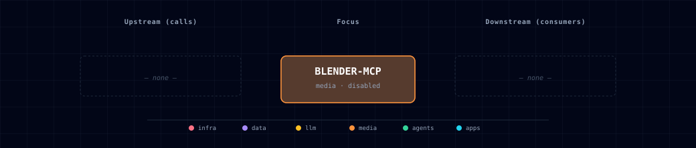

# 5.2.6. Blender MCP

## 1. Overview

Blender MCP is a disabled-by-default, host-installed profile for MCP-assisted 3D scene work. Two host sources exist: `localhost` (you run Blender's GUI, install the add-on, click Connect — Atlas only records the contract) and **`managed-localhost` (#759)** — Atlas provisions the pinned add-on and runs **headless** `blender --background` as a managed host process (preflight / install / start / status / stop, mirroring the ComfyUI MPS lifecycle). Neither runs as a container.

This profile is intentionally conservative. Current Blender MCP workflows depend on a local Blender add-on, an MCP client/server process, and a socket opened by Blender. They can execute generated Python code inside Blender, so Atlas keeps the bridge disabled by default and does not publish it through Kong.

## 2. Access

| Surface | URL or command | Notes |
|---|---|---|
| Atlas SOURCE | `BLENDER_MCP_SOURCE=disabled` | Default. No Blender MCP bridge is active. |
| Host Blender MCP | `BLENDER_MCP_SOURCE=localhost` | Development-only source. Requires host-installed Blender, Blender MCP add-on, and MCP server/client configuration — all user-run (GUI + Connect click). |
| Managed headless | `BLENDER_MCP_SOURCE=managed-localhost` | Atlas-managed (#759): pinned add-on provisioned (sha256-verified), headless `blender --background` launched + health-checked at start. Requires a host Blender install (`BLENDER_MCP_BLENDER_PATH` to override detection). Lifecycle: `./start.sh blender-mcp preflight\|install\|start\|stop\|status\|health\|remove`. |
| Blender socket | `${BLENDER_MCP_HOST}:${BLENDER_MCP_LOCALHOST_PORT}` | Defaults to `localhost:9876`, matching common Blender MCP socket defaults. |
| Kong | No Kong route | There is no `blender-mcp.localhost` route and no `blender.localhost` route by design. |

Enable the wizard profile with:

```bash
./start.sh --blender-mcp-source localhost           # user-run GUI add-on
./start.sh --blender-mcp-source managed-localhost   # Atlas-managed headless (#759)
```

The profile is hidden/rejected under `--profile prod`.

## 3. Configuration

| Variable | Default | Purpose |
|---|---:|---|
| `BLENDER_MCP_SOURCE` | `disabled` | Enables the host-only Blender MCP profile when set to `localhost` (user-run GUI) or `managed-localhost` (Atlas-managed headless, #759). |
| `BLENDER_MCP_HOST` | `localhost` | Hostname where the Blender MCP add-on socket listens. |
| `BLENDER_MCP_LOCALHOST_PORT` | `9876` | Host-tool socket port. This is not allocated from Atlas topology because Atlas does not own the Blender process. |
| `BLENDER_MCP_ENDPOINT` | generated | Runtime endpoint hint for MCP-client integrations (`tcp://…`). Empty when disabled. Exported as `ATLAS_BLENDER_MCP_HOST_ENDPOINT` for both host sources (#758). |
| `BLENDER_MCP_STATE_DIR` | `~/.atlas/blender-mcp` | Managed-source state: pinned add-on, generated headless launcher, pid/log. |
| `BLENDER_MCP_BIND` | `127.0.0.1` | Managed bridge bind. Loopback-only by default — `execute_code` runs arbitrary Python inside Blender; any other value is refused unless `BLENDER_MCP_ALLOW_REMOTE=true` (a deliberate double opt-in). |
| `BLENDER_MCP_BLENDER_PATH` | auto-detect | Explicit Blender binary. Atlas manages the MCP **bridge**, not the Blender application — install Blender yourself (preflight fails with guidance otherwise). |
| `BLENDER_MCP_ADDON_REF` / `_SHA256` | pinned | The exact upstream `ahujasid/blender-mcp` `addon.py` the managed source provisions; a sha mismatch refuses installation. Move both together. |
| `BLENDER_MCP_ADDON_FILE` | empty | Escape hatch: a local add-on file instead of the pinned download (no sha verification; preflight warns). |

## 4. Architecture & Wiring

Atlas models Blender MCP as a virtual media service:

- Track membership: `gen-ai-creative` and `all`.
- Service category: `media`.
- Source values: `disabled` and dev-only `localhost`.
- Wizard placement: the creative track prompt appears as “Blender MCP”.
- Port strategy: `BLENDER_MCP_LOCALHOST_PORT` is a host-tool override and does not consume an Atlas topology slot.
- Kong behavior: no alias, no route, no extra host entry, and no gateway proxy by default.
- Direct access: configure the host MCP client/server according to the Blender MCP implementation you choose, then point it at `${BLENDER_MCP_HOST}:${BLENDER_MCP_LOCALHOST_PORT}`.
- Downstream consumers: none are auto-wired in this ticket. Future Open WebUI, Hermes, or curated MCP integrations must add explicit consumer docs, env wiring, and `data_flow.calls` edges when they actually call the bridge.
- Init companion: none for `localhost`. For `managed-localhost`, Atlas provisions the **add-on + launcher** (not Blender itself, not `uvx`, not client config) into `BLENDER_MCP_STATE_DIR`.
- Headless mechanism (`managed-localhost`, verified live on Blender 4.3.2): the stock add-on executes commands on Blender's main thread via `bpy.app.timers.register`, which only fires when the GUI event loop pumps timers — upstream even guards against `--background` for exactly that reason. Atlas's generated launcher shims timer registration into a queue drained by its own main-thread loop: same main-thread execution contract, no GUI, no add-on patching. Caveat: `get_viewport_screenshot` has no viewport headless and will error; scene/object/code commands work fully.
- Volumes and secrets: none by default. Asset-provider credentials such as Sketchfab, Poly Haven, Hyper3D, or Hunyuan-style keys remain host-side user configuration until Atlas adopts a dedicated integration.

## 5. Dependencies & Integrations

### 5.1. Current — Upstream (this service calls)

_No upstream calls._

### 5.2. Current — Downstream (services that call this)

_No downstream consumers._

### 5.3. Architecture diagram



[Open the full-size diagram](./architecture.html) for a full-screen view.

### 5.4. Future — Missing pair integrations

- Optional MCP-client registration for Open WebUI or Hermes once Atlas has a policy for host-side code-execution tools.
- Optional asset export path from ComfyUI-generated concepts to Blender scene construction, with explicit human approval before code execution.

### 5.5. Future — Candidate new services

- A drivable, in-network **`container` source** (headed-but-virtual Blender via Xvfb/EGL) for the agentic composition stage — under evaluation, gated behind a validation spike and go/no-go thresholds. See [`docs/strategy/blender-mcp-container-source-evaluation.md`](../../docs/strategy/blender-mcp-container-source-evaluation.md) (#410). Until that spike passes, this service stays `localhost | disabled`.
- Asset validation queue that runs glTF-Transform checks on generated GLB files before publication.

### 5.6. Future — Unused features in this service

- Remote Blender MCP access is intentionally out of scope for this profile.
- Asset-provider credentials are not projected into Atlas services yet.

## 6. Security & Guardrails

- Treat Blender MCP as a code-execution bridge. Current workflows can execute generated Python code inside Blender, which may read, modify, delete, or exfiltrate local data accessible to that Blender process.
- Use a separate OS account, VM, or machine without sensitive files for experiments.
- Keep `BLENDER_MCP_SOURCE=disabled` unless you are actively using a trusted local Blender session.
- Do not expose the Blender MCP socket on public interfaces. Prefer `BLENDER_MCP_HOST=localhost`.
- Do not add a Kong route without a separate design review covering auth, network reachability, tool approval, and prompt-injection behavior.
- Do not paste Atlas database, cloud-provider, Supabase, MinIO, or GitHub credentials into host MCP client configuration for this bridge.

## 7. glTF-Transform Asset Postprocess

Atlas includes a helper for inspecting and optimizing GLB assets without adding a long-running service:

```bash
scripts/gltf-transform-postprocess.sh input.glb output.glb
```

The script runs the official `@gltf-transform/cli` in a temporary Node container. It performs:

- `gltf-transform inspect`
- `gltf-transform validate`
- `gltf-transform optimize --compress meshopt --texture-compress webp`

Use this as a postprocess step for exported Blender assets, ComfyUI-assisted 3D experiments, or future creative-3D pipelines. Inspect the output visually before treating it as production-ready; optimization can change geometry, textures, and extension usage.

## 8. Troubleshooting

- If the wizard profile is missing, confirm you selected the `gen-ai-creative` or `all` track, or pass `--blender-mcp-source localhost` explicitly.
- If `--profile prod` rejects the source, that is expected: Blender MCP localhost mode is development-only.
- If a client cannot connect, confirm the Blender add-on is installed, enabled, and listening on `${BLENDER_MCP_HOST}:${BLENDER_MCP_LOCALHOST_PORT}`.
- If `uvx` is not found by a GUI MCP client, configure the absolute path to `uvx` or the installed Blender MCP command in that client.
- If `scripts/gltf-transform-postprocess.sh` fails before optimization, inspect the validation output first; invalid GLB input should be fixed at the source.
