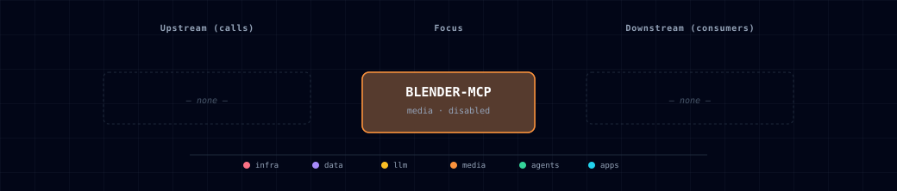

# 5.2.6. Blender MCP

## 1. Overview

Blender MCP is a disabled-by-default host integration for MCP-assisted 3D scene work. It never runs as a container. There are two host sources:

- `localhost`: you run the Blender GUI, install the add-on and click Connect. Atlas only records the endpoint.
- **`managed-localhost`**: Atlas installs the pinned add-on and runs **headless** `blender --background` as a managed host process. Its lifecycle commands follow the same pattern as ComfyUI MPS.

This integration is intentionally conservative. Current Blender MCP workflows depend on a local Blender add-on, an MCP client/server process, and a socket opened by Blender. They can execute generated Python code inside Blender, so Atlas keeps the bridge disabled by default and does not publish it through Kong.

## 2. Access

| Surface | URL or command | Notes |
|---|---|---|
| Atlas SOURCE | `BLENDER_MCP_SOURCE=disabled` | Default. No Blender MCP bridge is active. |
| Host Blender MCP | `BLENDER_MCP_SOURCE=localhost` | Development-only source. Requires host-installed Blender, Blender MCP add-on, and MCP server/client configuration — all user-run (GUI + Connect click). |
| Managed headless | `BLENDER_MCP_SOURCE=managed-localhost` | Atlas installs the pinned add-on (sha256-verified), then starts and health-checks headless `blender --background`. A warm start runs a read-only check first: if the bridge would not start, the running containers stay up. A change to `BLENDER_MCP_LOCALHOST_PORT` or `BLENDER_MCP_BIND` restarts an Atlas-owned bridge at the next start. Requires a host Blender install (`BLENDER_MCP_BLENDER_PATH` overrides detection). Lifecycle: `./start.sh blender-mcp preflight\|install\|start\|stop\|status\|health\|remove`. |
| Blender socket | `${BLENDER_MCP_HOST}:${BLENDER_MCP_LOCALHOST_PORT}` | Defaults to `localhost:9876`, matching common Blender MCP socket defaults. |
| Kong | No Kong route | There is no `blender-mcp.localhost` route and no `blender.localhost` route by design. |

Select a Blender MCP host source with:

```bash
./start.sh --blender-mcp-source localhost           # user-run GUI add-on
./start.sh --blender-mcp-source managed-localhost   # Atlas-managed headless
```

Both host sources are development-only: `--profile prod` hides and rejects them.

## 3. Configuration

| Variable | Default | Purpose |
|---|---:|---|
| `BLENDER_MCP_SOURCE` | `disabled` | Enables the host-only Blender MCP profile when set to `localhost` (user-run GUI) or `managed-localhost` (Atlas-managed headless). |
| `BLENDER_MCP_HOST` | `localhost` | Hostname written into the `BLENDER_MCP_ENDPOINT` hint for MCP clients. It does not change where the socket binds. |
| `BLENDER_MCP_LOCALHOST_PORT` | `9876` | Host-tool socket port. This is not allocated from Atlas topology because Atlas does not own the Blender process. |
| `BLENDER_MCP_ENDPOINT` | generated | Runtime endpoint hint for MCP-client integrations (`tcp://…`). Empty when disabled. For both host sources, `./start.sh endpoints export` also emits `ATLAS_BLENDER_MCP_HOST_ENDPOINT=tcp://localhost:<BLENDER_MCP_LOCALHOST_PORT>`; that value always uses `localhost`. |
| `BLENDER_MCP_STATE_DIR` | `~/.atlas/blender-mcp` | Managed-source state: pinned add-on, generated headless launcher, pid/log. |
| `BLENDER_MCP_INSTANCES` | `1` | Managed pool size, 1 to 16 (consumer manifest `blender_mcp.instances`). See the pool note below this table. |
| `BLENDER_MCP_BIND` | `127.0.0.1` | Managed bridge bind. Loopback-only by default — `execute_code` runs arbitrary Python inside Blender; any other value is refused unless `BLENDER_MCP_ALLOW_REMOTE=true` (a deliberate double opt-in). Loopback does **not** keep stack containers out on Docker Desktop: they reach host loopback through `host.docker.internal`. The bridge has no authentication. While it runs, any container that runs user code (JupyterHub, n8n Code nodes, Open WebUI tools) can execute Python on the host. |
| `BLENDER_MCP_ALLOW_REMOTE` | `false` | Second opt-in required before `BLENDER_MCP_BIND` can be non-loopback. Leave `false` unless you own the network boundary. |
| `BLENDER_MCP_BLENDER_PATH` | auto-detect | Explicit Blender binary. Atlas manages the MCP **bridge**, not the Blender application — install Blender yourself (preflight fails with guidance otherwise). |
| `BLENDER_MCP_ADDON_REF` / `_SHA256` | pinned | The exact upstream `ahujasid/blender-mcp` `addon.py` the managed source provisions; a sha mismatch refuses installation. Move both together. |
| `BLENDER_MCP_ADDON_FILE` | empty | Escape hatch: a local add-on file instead of the pinned download (no sha verification; preflight warns). |

**Managed pool (`BLENDER_MCP_INSTANCES`).** Instance `i` uses port `BLENDER_MCP_LOCALHOST_PORT + i` and directory `<state dir>/instances/i`; instance 0 uses the state dir itself. All instances reuse instance 0's sha-verified add-on and share one launch lock. A warm start preflights every instance; a busy port or a port above 65535 stops the launch.

`status`/`health` report each instance; `stop`/`remove` act on all. With more than one instance, `./start.sh endpoints export` adds `ATLAS_BLENDER_MCP_HOST_ENDPOINTS`. A port or bind change restarts the whole pool. Instances above the pool size stop at the next start. `./start.sh doctor` warns about an invalid `BLENDER_MCP_INSTANCES` and an instance running above the pool size. It also warns about a pool pid file whose process is gone or unverifiable.

## 4. Architecture & Wiring

Atlas models Blender MCP as a virtual media service:

- Track membership: `gen-ai-creative` and `all`.
- Service category: `media`.
- Source values: `disabled`, dev-only `localhost`, and Atlas-managed headless `managed-localhost`.
- Wizard placement: the creative track prompt appears as “Blender MCP”.
- Port strategy: `BLENDER_MCP_LOCALHOST_PORT` is a host-tool override and does not consume an Atlas topology slot.
- Kong behavior: no alias, no route, no extra host entry, and no gateway proxy by default.
- Direct access: configure the host MCP client/server according to the Blender MCP implementation you choose, then point it at `${BLENDER_MCP_HOST}:${BLENDER_MCP_LOCALHOST_PORT}`.
- Downstream consumers: none. No Atlas service calls the bridge.
- Init companion: none for `localhost`. For `managed-localhost`, Atlas provisions the **add-on + launcher** (not Blender itself, not `uvx`, not client config) into `BLENDER_MCP_STATE_DIR`.
- Headless mechanism (`managed-localhost`, verified live on Blender 4.3.2): the stock add-on runs commands on Blender's main thread via `bpy.app.timers.register`. Those timers fire only when the GUI event loop pumps them, so upstream guards against `--background`. Atlas's generated launcher shims timer registration into a queue drained by its own main-thread loop: same main-thread execution contract, no GUI, no add-on patching. Caveat: `get_viewport_screenshot` has no viewport headless and will error; scene/object/code commands work fully.
- Volumes and secrets: none by default. Asset-provider credentials such as Sketchfab, Poly Haven, Hyper3D, or Hunyuan-style keys remain host-side user configuration until Atlas adopts a dedicated integration.

## 5. Dependencies & Integrations

### 5.1. Current — Upstream (this service calls)

_No upstream calls._

### 5.2. Current — Downstream (services that call this)

_No downstream consumers._

### 5.3. Architecture diagram



[Open the full-size diagram](./architecture.html) for a full-screen view.

### 5.4. Future — Missing pair integrations

- Optional MCP-client registration for Open WebUI or Hermes once Atlas has a policy for host-side code-execution tools.
- Optional asset export path from ComfyUI-generated concepts to Blender scene construction, with explicit human approval before code execution.

### 5.5. Future — Candidate new services

- A drivable, in-network **`container` source** (headed-but-virtual Blender via Xvfb/EGL) for the agentic composition stage — under evaluation, gated behind a validation spike and go/no-go thresholds. See the [container-source evaluation](https://github.com/thekaveh/atlas/blob/main/docs/strategy/blender-mcp-container-source-evaluation.md). Until that spike passes, this service stays `localhost | managed-localhost | disabled`.
- Asset validation queue that runs glTF-Transform checks on generated GLB files before publication.

### 5.6. Future — Unused features in this service

- Remote Blender MCP access is intentionally out of scope for this profile.
- Asset-provider credentials are not projected into Atlas services yet.

## 6. Security & Guardrails

- Treat Blender MCP as a code-execution bridge. Current workflows can execute generated Python code inside Blender, which may read, modify, delete, or exfiltrate local data accessible to that Blender process.
- Use a separate OS account, VM, or machine without sensitive files for experiments.
- Keep `BLENDER_MCP_SOURCE=disabled` unless you are actively using a trusted local Blender session.
- Do not expose the Blender MCP socket on public interfaces. For `managed-localhost`, keep `BLENDER_MCP_BIND=127.0.0.1` and `BLENDER_MCP_ALLOW_REMOTE=false`. For the user-run `localhost` source, the Blender add-on sets the bind; keep it on loopback. `BLENDER_MCP_HOST` sets only the endpoint hint, not the bind address.
- Do not add a Kong route without a separate design review covering auth, network reachability, tool approval, and prompt-injection behavior.
- Do not paste Atlas database, cloud-provider, Supabase, MinIO, or GitHub credentials into host MCP client configuration for this bridge.

## 7. glTF-Transform Asset Postprocess

Atlas includes a helper for inspecting and optimizing GLB assets without adding a long-running service:

```bash
scripts/gltf-transform-postprocess.sh input.glb output.glb
```

Run it from the repository root with paths relative to it; absolute paths are rejected. It requires Docker. The script runs `@gltf-transform/cli`, at the version locked in `services/asset-worker/app/package-lock.json`, in a temporary Node container. It performs:

- `gltf-transform inspect`
- `gltf-transform validate`
- `gltf-transform optimize --compress meshopt --texture-compress webp`

Use this as a postprocess step for exported Blender assets, ComfyUI-assisted 3D experiments, or future creative-3D pipelines. Inspect the output visually before treating it as production-ready; optimization can change geometry, textures, and extension usage.

## 8. Troubleshooting

- If the Blender MCP prompt is missing, confirm you selected the `gen-ai-creative` or `all` track, or pass `--blender-mcp-source localhost` explicitly.
- If `--profile prod` rejects the source, that is expected: both Blender MCP host sources are development-only.
- If a client cannot connect, confirm the Blender add-on is installed, enabled, and listening on `${BLENDER_MCP_HOST}:${BLENDER_MCP_LOCALHOST_PORT}`.
- If `uvx` is not found by a GUI MCP client, configure the absolute path to `uvx` or the installed Blender MCP command in that client.
- If `scripts/gltf-transform-postprocess.sh` fails before optimization, inspect the validation output first; invalid GLB input should be fixed at the source.
- If the managed source warns that its pid file "has no start_utc identity stamp", an older Atlas version wrote it. Atlas does not signal a process it cannot prove it launched. It leaves that Blender running and starts the rest of the stack. Confirm the pid is that Blender. Then run the `kill -TERM <pid>` and `rm -f <pid file>` commands from the warning, and re-run `./start.sh`.
- If `./start.sh doctor` warns that the pid file names a pid that "now belongs to a different, younger process", the OS recycled the pid. The record is stale; the next start replaces it and never signals that process.

## 9. Capabilities & limitations

Support tier: **experimental** — Capability contract declared; no cited cold-start, workflow, or upgrade qualification run yet (evidence at `v0.1.0`).

| Capability | Status | Verification | Notes |
|---|---|---|---|
| Host-only Blender MCP bridge | supported | documented | Atlas configures user-run GUI and managed headless host sources; it does not run Blender in a container. |
| Managed headless scene control | partial | tested | Scene inspection and generated-code commands work through the managed bridge, but GUI-dependent operations are unavailable. |
| Managed-bridge loopback guard for arbitrary Python execution | partial | tested | Atlas refuses non-loopback binds for managed-localhost without an explicit override; the user-run localhost GUI source remains operator-controlled. |
| Viewport screenshots in managed headless mode | not-supported | documented | Headless Blender has no VIEW_3D context, so use the user-run GUI source when viewport screenshots are required. |
