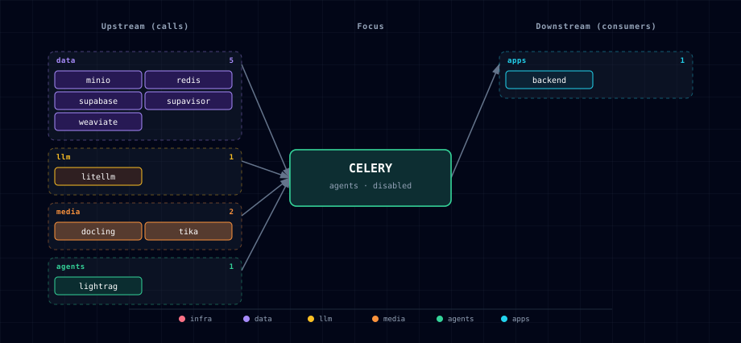

# 5.2.7. Celery + Flower (async jobs)

Redis-backed backend worker tier for Atlas long-running jobs. It starts disabled by default:

```bash
CELERY_SOURCE=disabled
```

Set `CELERY_SOURCE=container` from the setup wizard or CLI to run one backend Celery worker plus Flower. The worker reuses `services/backend/app`, talks to Supabase, LiteLLM, and Weaviate for the first memory-consolidation task, and stores broker/result state in existing Redis database 4.

## 1. Overview

The worker currently runs memory consolidation and RAG ingestion. `POST /memory/consolidate?async_job=true` returns a Celery job id immediately instead of holding the FastAPI request open while the LangMem consolidation loop performs database reads and LLM calls. RAG ingestion submissions dispatch the phase engine when this tier is enabled. Use `GET /jobs/{job_id}` to inspect pending, running, success, retry, failure, or revoked state.

The old synchronous `POST /memory/consolidate` path remains available for compatibility. Research start is deferred because it already has a separate database-backed session lifecycle, and moving it first would mix two lifecycle models in one change.

## 2. Access

| Surface | URL | Notes |
|---|---|---|
| Flower via Kong | `http://flower.localhost:${KONG_HTTP_PORT}` | Requires `./start.sh --setup-hosts`; protected by Kong dashboard basic-auth/ACL and Flower basic-auth. |
| Flower direct | `http://localhost:${FLOWER_PORT}` | Uses Flower basic-auth. |
| Worker | none | No public port. The worker consumes Redis queue messages only. |

## 3. Configuration

```bash
CELERY_SOURCE=container
CELERY_QUEUE=atlas
CELERY_WORKER_CONCURRENCY=2
CELERY_WORKER_PREFETCH_MULTIPLIER=1
CELERY_TASK_SOFT_TIME_LIMIT_SECONDS=840
CELERY_TASK_TIME_LIMIT_SECONDS=900
CELERY_BROKER_VISIBILITY_TIMEOUT_SECONDS=3600
RAG_INGESTION_EXECUTION_LEASE_SECONDS=30
```

All Celery numeric controls must be positive integers. The soft limit must be less than the hard limit, and the Redis visibility timeout must be greater than the hard limit; malformed or contradictory values fail worker and Backend startup rather than falling back to defaults. The RAG execution lease must be an integer from 10 through 300 seconds.

The bootstrapper computes these when enabled:

```bash
CELERY_BROKER_URL=redis://:${REDIS_PASSWORD}@redis:6379/4
CELERY_RESULT_BACKEND=redis://:${REDIS_PASSWORD}@redis:6379/4
CELERY_WORKER_SCALE=1
FLOWER_SCALE=1
```

Redis database 4 is reserved for Celery broker/result state. It is operational state, not the durable memory store; memory facts remain in Supabase/pgvector.

## 4. Architecture & Wiring

```text
FastAPI backend
  └─ enqueue task -> Redis db 4 -> celery-worker
                                     ├─ Supabase/Postgres memory tables
                                     ├─ LiteLLM for consolidation prompts
                                     ├─ Weaviate for memory vector updates
                                     └─ Redis db 0 owner-fenced RAG state/leases

Flower -> Redis db 4 -> worker/task inspection
Kong   -> flower.localhost -> Flower
```

`CELERY_SOURCE=container` belongs to the `gen-ai-rag`, `gen-ai-eng`, and `all` tracks. The service category is `agents` because it provides asynchronous workflow execution rather than a public infrastructure primitive. It is not included in ML/data-only tracks until those tracks have concrete backend async consumers.

## 5. Retry, Timeout, And Failure Behavior

The worker uses JSON task/result serialization and Redis as both broker and result backend. Memory consolidation tasks run with a soft time limit before the hard time limit so failures are captured instead of leaving a request open indefinitely. The public job endpoint surfaces Celery failure state with the generic `Background job failed` message; exception types are logged server-side, while detailed errors and raw tracebacks remain in worker logs and Flower for operators.

Redis visibility timeout is intentionally longer than the hard task time limit. If a worker is killed before acknowledging a task, Redis can redeliver it after the visibility timeout; tasks should therefore remain idempotent or tolerate a retry. RAG ingestion uses the Backend's Redis state database and receives the same compiled profiles, upstream endpoints, corpus limits, and scoped MinIO credential references. It acquires and renews an owner-fenced execution lease before phase side effects, and each state save verifies the owner. A duplicate delivery that finds an active lease waits for its expiry and retries; a worker that loses ownership cancels its active async phase, logs the renewal failure, and reschedules without overwriting replacement state. Transient upstream failures retain a separate three-retry exponential-backoff budget whose counter is independent of lease contention; exhaustion records a terminal ingestion failure. LightRAG replays are idempotent through deterministic document identities and duplicate-source handling. Memory consolidation deactivates/updates memory rows through existing service logic, so future tasks that mutate external systems must be reviewed before being added to the queue.

## 6. Dependencies & Integrations

### 6.1. Current — Upstream (this service calls)

| Service | Category |
|---|---|
| otel-collector | infra |
| minio | data |
| redis | data |
| supabase | data |
| supavisor | data |
| weaviate | data |
| litellm | llm |
| docling | media |
| tika | media |
| lightrag | agents |

### 6.2. Current — Downstream (services that call this)

| Service | Category |
|---|---|
| kong | infra |
| backend | apps |

### 6.3. Architecture diagram



[Open the full-size diagram](./architecture.html) for a full-screen view.

### 6.4. Future — Missing pair integrations

- **celery ↔ research start** — Move the Local Deep Researcher start/wait loop into a task once the existing research session model can persist the Celery job id without confusing remote and local session ids.
- **celery ↔ ComfyUI generation** — Add async image-generation tasks for callers that currently use `wait_for_completion=true`.

### 6.5. Future — Candidate new services

- **Celery Beat** — Add only when Atlas has scheduled jobs that cannot be expressed more clearly in Airflow or n8n.

### 6.6. Future — Unused features in this service

- Flower's task mutation APIs are exposed only behind auth and should not become a public automation surface.

## 7. Capabilities & limitations

| Capability | Status | Verification | Notes |
|---|---|---|---|
| Backend asynchronous task execution | partial | tested | The worker offloads memory consolidation and phased RAG ingestion, but research, media generation, and arbitrary Backend routes are not Celery tasks in this slice. |
| Bounded worker scheduling | supported | tested | Atlas validates positive concurrency, prefetch, soft and hard time limits, and a Redis visibility timeout longer than the hard task limit before Backend or worker startup. |
| Retry-safe RAG ingestion ownership | partial | tested | Owner-fenced renewable leases and deterministic LightRAG identities limit duplicate phase effects, but Redis delivery is at-least-once and future side-effecting tasks still require idempotency review. |
| Flower task monitoring access | supported | tested | Flower requires its own Basic authentication on the direct port and is additionally protected by Kong dashboard Basic Auth and ACL on flower.localhost. |
| Durable queue high availability | not-supported | documented | Atlas runs one worker replica and one Flower process on the shared single Redis service; result and broker state survive only according to that Redis instance's persistence. |
