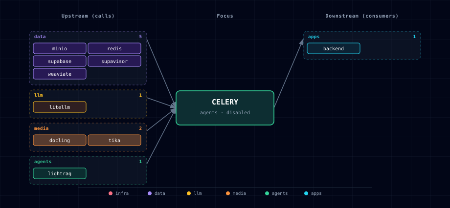

# 5.2.7. Celery + Flower (async jobs)

Redis-backed backend worker tier for Atlas long-running jobs. It starts disabled by default:

```bash
CELERY_SOURCE=disabled
```

Set `CELERY_SOURCE=container` (wizard or `--celery-source container`) to run one Celery worker plus Flower. The worker reuses `services/backend/app`, runs memory consolidation and RAG ingestion, and keeps broker and result state in Redis database 4.

## 1. Overview

`POST /memory/consolidate?async_job=true` returns a Celery job id at once. The FastAPI request does not stay open while the LangMem loop reads the database and calls the LLM. When this tier is enabled, RAG ingestion submissions dispatch the phase engine.

Use `GET /jobs/{job_id}` to read the state: pending, running, success, retry, failure or revoked. `pending` is ambiguous. Celery reports it for an unknown id and for a result past its expiry (`result_expires`, default one day). A mistyped id, or a job polled more than a day after it finished, reads `pending` indefinitely.

The synchronous `POST /memory/consolidate` path remains. Research start is deferred: it is not a Celery task, because it has its own database-backed session lifecycle.

## 2. Access

| Surface | URL | Notes |
|---|---|---|
| Flower via Kong | `http://flower.localhost:${KONG_HTTP_PORT}` | Requires `./start.sh --setup-hosts`; protected by Kong dashboard basic-auth/ACL and Flower basic-auth. |
| Flower direct | `http://localhost:${FLOWER_PORT}` | Uses Flower basic-auth. |
| Worker | none | No public port. The worker consumes Redis queue messages only. |

Flower's API can also start and revoke tasks (`/api/task/apply`, `/api/task/revoke`). Keep it behind its authentication; do not use it as a public automation surface.

## 3. Configuration

```bash
CELERY_SOURCE=container
CELERY_QUEUE=atlas
CELERY_WORKER_CONCURRENCY=2
CELERY_WORKER_PREFETCH_MULTIPLIER=1
CELERY_TASK_SOFT_TIME_LIMIT_SECONDS=840
CELERY_TASK_TIME_LIMIT_SECONDS=900
CELERY_BROKER_VISIBILITY_TIMEOUT_SECONDS=3600
RAG_INGESTION_EXECUTION_LEASE_SECONDS=30
CHONKIE_SEMANTIC_EMBEDDING_MODEL=minishlab/potion-base-32M
LIGHTRAG_PIPELINE_STATUS_TIMEOUT_SECONDS=30
RAG_INGESTION_TTL_SECONDS=604800
```

Startup validation (worker and Backend) requires:

- every Celery numeric control is a positive integer;
- soft time limit < hard time limit < Redis visibility timeout;
- `RAG_INGESTION_EXECUTION_LEASE_SECONDS` is 10–300.

Invalid values stop startup; there is no fallback to defaults.

The Backend and worker receive the same semantic-chunking and RAG lifecycle
controls:

- A blank Chonkie model uses `minishlab/potion-base-32M`.
- The LightRAG pipeline-status timeout accepts finite values above zero, up to 3,600 seconds.
- The ingestion-state TTL accepts 60 through 31,536,000 seconds.
- An invalid timeout or TTL uses the 30-second or seven-day default.

The bootstrapper computes these when enabled:

```bash
CELERY_BROKER_URL=redis://:${REDIS_PASSWORD}@redis:6379/4
CELERY_RESULT_BACKEND=redis://:${REDIS_PASSWORD}@redis:6379/4
CELERY_WORKER_SCALE=1
FLOWER_SCALE=1
```

Redis database 4 is reserved for Celery broker and result state. It is operational state, not the durable memory store; memory facts stay in Supabase/pgvector.

## 4. Architecture & Wiring

```text
FastAPI backend
  └─ enqueue task -> Redis db 4 -> celery-worker
                                     ├─ Supabase/Postgres memory tables
                                     ├─ LiteLLM for consolidation prompts
                                     ├─ Weaviate for memory vector updates
                                     └─ Redis db 0 owner-fenced RAG state/leases

Flower -> Redis db 4 -> worker/task inspection
Kong   -> flower.localhost -> Flower
```

Celery belongs to the `gen-ai-rag`, `gen-ai-eng` and `all` tracks. Its category is `agents`, because it runs asynchronous workflows. The ML and data tracks do not include it, because they have no backend async consumers.

## 5. Retry, Timeout, And Failure Behavior

**Time limits.** The soft time limit bounds each whole task except `rag_ingestion`. One ingestion includes its LightRAG drain, so it has its own `RAG_INGESTION_TASK_SOFT_TIME_LIMIT_SECONDS` / `RAG_INGESTION_TASK_TIME_LIMIT_SECONDS`. Empty means the larger of 3840 / 3900 s and the global limits.

The worker keeps the visibility timeout at least 300 s above the longest hold. That hold is the RAG hard limit, or the global hard limit + 60 s for a delayed memory retry. A running ingestion is therefore not re-delivered.

The Backend rejects a Celery ingestion whose graph targets' `timeout_seconds` sum to the `rag_ingestion` soft limit or more, and names both values. Parsing, embedding and writing share that limit, so passing this check does not guarantee completion.

The worker uses JSON task and result serialization, with Redis as broker and result backend. Memory consolidation tasks hit a soft time limit before the hard time limit, so the failure is recorded and no request stays open. The public job endpoint reports a Celery failure with the generic `Background job failed` message. Exception types are logged server-side; detailed errors and raw tracebacks remain in worker logs and Flower for operators.

The Redis visibility timeout is longer than the hard task time limit. RAG ingestion uses the Backend's Redis state database and the same compiled profiles, upstream endpoints, corpus limits and scoped MinIO credential references.

- Redis can re-deliver a task if a worker dies before it acknowledges the task. Tasks must be idempotent or tolerate a retry.
- RAG ingestion takes and renews an owner-fenced execution lease before phase side effects. Every state save checks the owner.
- A duplicate delivery that finds an active lease waits for it to expire, then retries.
- A worker that loses its lease cancels the running phase, logs the failure and reschedules without overwriting state.
- Transient upstream failures get three retries with exponential backoff, counted separately from lease waits. After that, the ingestion fails.
- LightRAG replays are idempotent (deterministic document ids, duplicate-source handling).
- Memory consolidation changes memory rows through existing service logic. Review any new task that changes external systems before you add it.

## 6. Dependencies & Integrations

### 6.1. Current — Upstream (this service calls)

| Service | Category |
|---|---|
| otel-collector | infra |
| minio | data |
| redis | data |
| supabase | data |
| supavisor | data |
| weaviate | data |
| litellm | llm |
| docling | media |
| tika | media |
| lightrag | agents |

### 6.2. Current — Downstream (services that call this)

| Service | Category |
|---|---|
| kong | infra |
| backend | apps |

### 6.3. Architecture diagram



[Open the full-size diagram](./architecture.html) for a full-screen view.

### 6.4. Future — Missing pair integrations

- **celery ↔ research start** — Move the Local Deep Researcher start/wait loop into a task. First, the research session model must store the Celery job id without confusing remote and local session ids.
- **celery ↔ ComfyUI generation** — Add async image-generation tasks for callers that currently use `wait_for_completion=true`.

### 6.5. Future — Candidate new services

- **Celery Beat** — Add only when Atlas has scheduled jobs that cannot be expressed more clearly in Airflow or n8n.

### 6.6. Future — Unused features in this service

_No high-confidence opportunities identified._

## 7. Capabilities & limitations

Support tier: **experimental** — Capability contract declared; no cited cold-start, workflow, or upgrade qualification run yet (evidence at `v0.1.0`).

| Capability | Status | Verification | Notes |
|---|---|---|---|
| Backend asynchronous task execution | partial | tested | The worker offloads memory consolidation and phased RAG ingestion, but research, media generation, and arbitrary Backend routes are not Celery tasks in this slice. |
| Bounded worker scheduling | supported | tested | Before Backend or worker startup, Atlas validates positive concurrency, prefetch, and soft and hard time limits. It also checks that the Redis visibility timeout exceeds the hard task limit. |
| Retry-safe RAG ingestion ownership | partial | tested | Owner-fenced renewable leases and deterministic LightRAG identities limit duplicate phase effects, but Redis delivery is at-least-once and future side-effecting tasks still require idempotency review. |
| Flower task monitoring access | supported | tested | Flower requires its own Basic authentication on the direct port and is additionally protected by Kong dashboard Basic Auth and ACL on flower.localhost. |
| Durable queue high availability | not-supported | documented | Atlas runs one worker replica and one Flower process on the shared single Redis service. Result and broker state survive only as far as that Redis instance persists them. |
