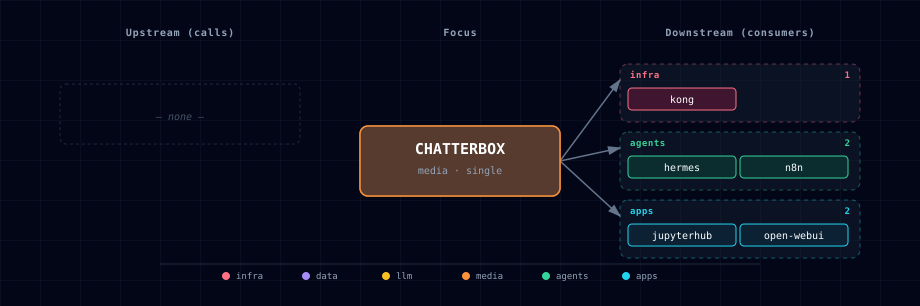

# 5.2.8. Chatterbox (TTS engine)

Chatterbox is one of the TTS engines selectable via `TTS_PROVIDER_SOURCE`. It is
documented under the **TTS Provider** aggregator rather than as a standalone
service, because the user-facing role is "pick a TTS engine" — not "pick
Chatterbox":

→ See [services/tts-provider/README.md](../tts-provider/README.md) for the full
user-facing description, source-variant table, and configuration reference.

## 1. Engine quick reference

- **Image:** `travisvn/chatterbox-tts-api:gpu` (GPU only; voice-cloning model)
- **License:** MIT (Resemble AI)
- **Activation:** `TTS_PROVIDER_SOURCE=chatterbox-container-gpu` (or
  `chatterbox-localhost` for a host-installed instance)
- **In-container port:** 4123
- **Host port:** `${CHATTERBOX_PORT}` (computed from `BASE_PORT` by the
  bootstrapper)

The manifest (`service.yml`) and compose fragment (`compose.yml`) in this folder
are the bootstrapper's source of truth for those values; treat this README as a
pointer, not a duplicate of the aggregator doc.

## 2. Dependencies & Integrations

### 2.1. Current — Upstream (this service calls)

_No upstream calls._

### 2.2. Current — Downstream (services that call this)

| Service | Category |
|---|---|
| kong | infra |
| hermes | agents |
| n8n | agents |
| jupyterhub | apps |
| open-webui | apps |

### 2.3. Architecture diagram

[Open the full-size diagram](./architecture.html) for a full-screen view.

### 2.4. Future — Missing pair integrations

_No high-confidence opportunities identified._

### 2.5. Future — Candidate new services

_No high-confidence opportunities identified._

### 2.6. Future — Unused features in this service

_No high-confidence opportunities identified._

## 3. Capabilities & limitations

| Capability | Status | Verification | Notes |
|---|---|---|---|
| GPU voice-cloning text-to-speech | supported | documented | The TTS selector starts the digest-pinned NVIDIA container and exposes Chatterbox synthesis and voice cloning through the selected provider endpoint. |
| Operator-run localhost Chatterbox | partial | documented | Atlas resolves a host Chatterbox endpoint selected by tts-provider, but installation, model downloads, process lifecycle, and hardware acceleration remain operator-owned. |
| Persistent registered voice library | not-supported | documented | The container persists only the Hugging Face weight cache; registered voice samples have no Atlas-managed volume or object-store workflow and may disappear on replacement. |
| Authenticated Chatterbox ingress | not-supported | documented | The host-published API and CORS-only tts.localhost Kong route have no Atlas authentication; use loopback or firewall controls, remove the publish, or add an authentication proxy. |
