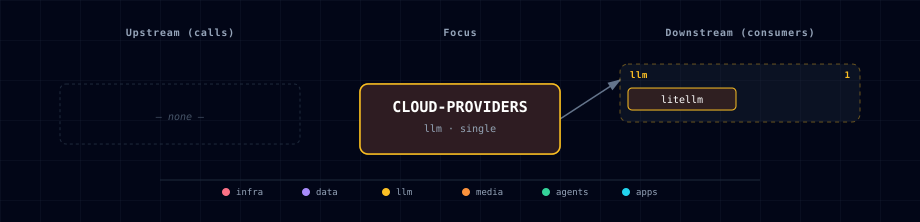

# 5.2.9. Cloud LLM providers (OpenAI, Anthropic, OpenRouter)

## 1. Overview

`cloud-providers` is an Atlas service family in the `llm` category. Its implementation and service-owned documentation live under `services/cloud-providers/`.

## 2. Role In Atlas

Atlas uses this service according to its manifest, topology row, SOURCE settings, dependencies, and runtime data-flow declarations.

## 3. Tracks And Category

- Category: `llm`
- Kind: `virtual`
- Tracks: `all, data-eng, gen-ai-creative, gen-ai-eng, gen-ai-rag, ml-eng, trading`

## 4. Access

- Kong aliases: `-`
- Port variables: `-`

## 5. Configuration

- SOURCE variables: `CLOUD_OPENAI_SOURCE, CLOUD_ANTHROPIC_SOURCE, CLOUD_OPENROUTER_SOURCE`
- Default SOURCE values: `disabled`
- Available SOURCE values: `enabled, disabled`

## 6. Dependencies And Topology

- Required dependencies: `litellm`
- Optional dependencies: `-`
- Runtime calls: `-`

## 7. Source Values

| SOURCE Variable | Default | Values |
| --- | --- | --- |
| CLOUD_OPENAI_SOURCE | disabled | enabled, disabled |
| CLOUD_ANTHROPIC_SOURCE | disabled | enabled, disabled |
| CLOUD_OPENROUTER_SOURCE | disabled | enabled, disabled |

## 8. Runtime Integration

The manifest data-flow list declares runtime calls to `-`. The topology row supplies aliases and port surfaces used by the generated gateway and service references.

## 9. Operations

Use `./start.sh` to configure this service through the wizard or pass the matching SOURCE flag when the service is source-configurable. Use `./stop.sh` to stop the active Atlas project.

## 10. Related Configuration

- Service manifest: `services/cloud-providers/service.yml`
- LiteLLM integration: `services/litellm/`

## 11. Dependencies & Integrations

### 11.1 Current — Upstream (this service calls)

_No upstream calls._

### 11.2 Current — Downstream (services that call this)

| Service | Category |
|---|---|
| litellm | llm |

### 11.3 Architecture diagram

[Open the interactive HTML diagram](./architecture.html) for a full-screen view.

### 11.4 Future — Missing pair integrations

_No high-confidence opportunities identified._

### 11.5 Future — Candidate new services

_No high-confidence opportunities identified._

### 11.6 Future — Unused features in this service

_No high-confidence opportunities identified._
