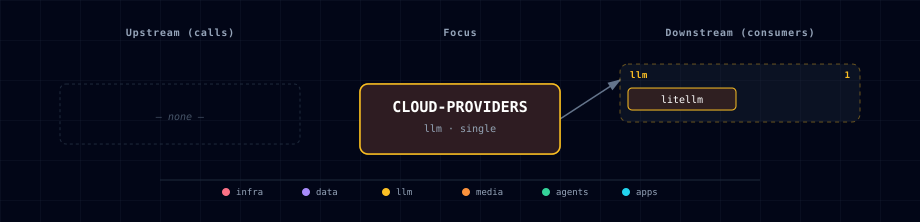

# 5.2.9. Cloud LLM providers (OpenAI, Anthropic, OpenRouter)

## 1. Overview

A virtual service with no container. It holds the switches, API keys and model
lists for OpenAI, Anthropic and OpenRouter. All requests to these providers go
through LiteLLM.

## 2. Role In Atlas

An enabled provider with a key adds model routes to LiteLLM. Applications call
those models through LiteLLM like any other model. Routing is described in
[the LiteLLM README](../litellm/README.md).

## 3. Tracks And Category

- Category: `llm`
- Kind: `virtual`
- Tracks: `all, data-eng, gen-ai-creative, gen-ai-eng, gen-ai-rag, ml-eng, trading`

## 4. Access

No port and no Kong route. Call the models through LiteLLM.

## 5. Configuration

| Provider | Switch (default `disabled`) | API key | Model list |
| --- | --- | --- | --- |
| OpenAI | `CLOUD_OPENAI_SOURCE` | `OPENAI_API_KEY` | `OPENAI_USER_MODELS` |
| Anthropic | `CLOUD_ANTHROPIC_SOURCE` | `ANTHROPIC_API_KEY` | `ANTHROPIC_USER_MODELS` |
| OpenRouter | `CLOUD_OPENROUTER_SOURCE` | `OPENROUTER_API_KEY` | `OPENROUTER_USER_MODELS` |

A provider adds LiteLLM routes only when its switch is `enabled` and its key is
set. Each `*_USER_MODELS` value is a comma-separated list of the model names
the wizard activated. The bootstrapper derives `LITELLM_OPENAI_ENABLED`,
`LITELLM_ANTHROPIC_ENABLED`, `LITELLM_OPENROUTER_ENABLED` and
`LITELLM_ENABLED_PROVIDERS` from the three switches.

## 6. Dependencies And Topology

- Required dependency: `litellm`
- Optional dependencies: none
- Runtime calls: none (LiteLLM calls the provider APIs)

## 7. Source Values

| SOURCE Variable | Default | Values |
| --- | --- | --- |
| CLOUD_OPENAI_SOURCE | disabled | enabled, disabled |
| CLOUD_ANTHROPIC_SOURCE | disabled | enabled, disabled |
| CLOUD_OPENROUTER_SOURCE | disabled | enabled, disabled |

## 8. Runtime Integration

LiteLLM is the only consumer. Disabling a provider removes its routes when the
LiteLLM configuration is next generated.

## 9. Operations

The wizard asks for each provider on every track. CLI flags:

- `--cloud-openai-source enabled|disabled` (and `--cloud-anthropic-source`, `--cloud-openrouter-source`).
- `--openai-api-key <key>` saves `OPENAI_API_KEY` to `.env` and enables the provider. `--anthropic-api-key` and `--openrouter-api-key` work the same way.
- `--openai-models <names>` saves `OPENAI_USER_MODELS`. `--anthropic-models` and `--openrouter-models` work the same way.

## 10. Related Configuration

- Service manifest: `services/cloud-providers/service.yml`
- LiteLLM integration: [LiteLLM README](../litellm/README.md)

## 11. Dependencies & Integrations

### 11.1. Current — Upstream (this service calls)

_No upstream calls._

### 11.2. Current — Downstream (services that call this)

| Service | Category |
|---|---|
| litellm | llm |

### 11.3. Architecture diagram

[Open the full-size diagram](./architecture.html) for a full-screen view.

### 11.4. Future — Missing pair integrations

_No high-confidence opportunities identified._

### 11.5. Future — Candidate new services

_No high-confidence opportunities identified._

### 11.6. Future — Unused features in this service

_No high-confidence opportunities identified._

## 12. Capabilities & limitations

Support tier: **experimental** — Capability contract declared; no cited cold-start, workflow, or upgrade qualification run yet (evidence at `v0.1.0`).

| Capability | Status | Verification | Notes |
|---|---|---|---|
| Virtual cloud-provider selection | supported | tested | Atlas independently enables OpenAI, Anthropic, and OpenRouter and exposes their selected models through the always-on LiteLLM gateway without running a provider container. |
| Key-gated model registration | supported | tested | A provider contributes LiteLLM rows only when its source is enabled and its server-side API key is non-empty; disabling it removes those routes on regeneration. |
| Uncatalogued cloud model metadata | partial | tested | User-selected names outside the curated catalogs are routable, but Atlas synthesizes generic capability metadata and cannot infer provider-specific limits or modalities. |
| Live cloud completion validation | not-supported | untested | Atlas statically tests selection, key isolation, and rendered routing but performs no live credential, entitlement, model-availability, or provider certification. Successful requests still depend on external accounts and APIs. |
| Direct cloud-provider service endpoint | not-supported | documented | This virtual manifest owns configuration only; applications must use LiteLLM because Atlas creates no cloud-provider container, port, or Kong route. |
