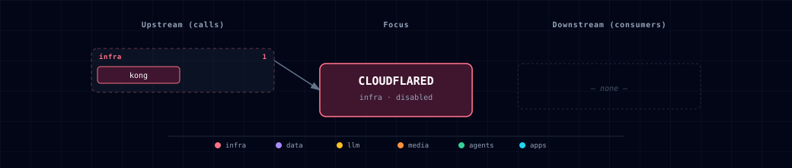

# 5.2.10. Cloudflare Tunnel

Egress-only public-edge service that terminates TLS at Cloudflare's global network and proxies inbound traffic to Kong. Disabled by default; enable when you need a publicly reachable Atlas stack without opening inbound firewall ports.

## 1. Overview

`cloudflared` runs as a single container that dials out to Cloudflare and registers as a named tunnel. All TLS termination happens at the Cloudflare edge — no certificate management is needed inside the stack. The tunnel forwards every request it receives to `http://kong-api-gateway:8000`, making Kong the single internal entry point for all routed traffic.

The service is **egress-only**: it publishes no host port and has no Kong route. It connects to `backend-network` and reaches Kong by Docker DNS name.

Image: `cloudflare/cloudflared:2026.6.1` (pin a dated tag; bump deliberately).

## 2. Access

| Path | URL | Notes |
|---|---|---|
| Public | configured in Cloudflare dashboard | One protected public hostname per Atlas Kong host route. |
| Internal metrics | `cloudflared:2000/metrics` | Prometheus-compatible; not scraped by default |
| Host port | — | None. Egress-only. |

All public hostnames and routing rules are defined in the Cloudflare Zero Trust dashboard, not in this repository. Kong selects Atlas routes by their internal Host values (`api.localhost`, `chat.localhost`, `n8n.localhost`, and the other aliases in the [Ports and Routes](../../docs/reference/ports-routes.md) reference). A public hostname therefore needs an Origin HTTP Host Header override (`httpHostHeader` in an ingress rule) set to the exact Kong alias for the service it exposes. Forwarding an arbitrary public Host header to Kong without this override returns a Kong 404.

## 3. Configuration

```bash
CLOUDFLARED_SOURCE=disabled               # change to "container" to enable
CLOUDFLARE_TUNNEL_TOKEN=                  # required when SOURCE=container; from Zero Trust > Networks > Tunnels
CLOUDFLARED_IMAGE=cloudflare/cloudflared:2026.6.1
# CLOUDFLARED_SCALE is auto-managed: 1 when SOURCE=container, 0 when disabled
```

The setup wizard exposes the same `container` / `disabled` choice. For automation, set `CLOUDFLARE_TUNNEL_TOKEN` in `.env`, then run `./start.sh --cloudflared-source container --detach`; source validation rejects container mode when the token is absent.

**To enable:**

1. Create a named tunnel in the Cloudflare Zero Trust dashboard (Zero Trust > Networks > Tunnels > Add a tunnel).
2. Copy the tunnel token.
3. Set `CLOUDFLARED_SOURCE=container` and `CLOUDFLARE_TUNNEL_TOKEN=<your-token>` in `.env`.
4. In the dashboard, add a public hostname pointing at `http://kong-api-gateway:8000` (service type HTTP, URL `kong-api-gateway:8000`). Set its Origin HTTP Host Header to the matching Kong alias; for example, a public Backend hostname uses `api.localhost`, while an Open WebUI hostname uses `chat.localhost`.
5. Create a Cloudflare Access application and least-privilege policy for that hostname before making it available to users. Repeat the hostname, origin Host override, and Access policy for each additional Atlas service you expose.
6. Restart the stack: `./start.sh`.

If `CLOUDFLARE_TUNNEL_TOKEN` is empty when `CLOUDFLARED_SOURCE=container`, Atlas rejects the configuration before Compose starts. This prevents the tunnel from entering an authentication-failure restart loop.

## 4. Architecture & wiring

**Startup ordering.** `cloudflared` depends on `kong-api-gateway: { condition: service_healthy }` so the gateway is ready before the tunnel connects.

**No ingress port.** Unlike most services, cloudflared has no `*_PORT` env var. The container listens on nothing externally; it dials out and forwards back. The internal metrics endpoint (`TUNNEL_METRICS: 0.0.0.0:2000`) is container-internal only.

**Scale toggle.** `CLOUDFLARED_SCALE` is written by the bootstrapper to `1` (SOURCE=container) or `0` (disabled). The compose fragment uses `deploy.replicas: ${CLOUDFLARED_SCALE:-0}`, so the container is simply not started when disabled.

**Security posture.** Cloudflare Access is required for every public Atlas hostname. Use identity-aware, least-privilege policies and do not treat possession of an unguessable hostname as access control. The tunnel does not replace Kong controls: after Access admits a request, Kong still applies the matched route's authentication, authorization, and rate limiting. Public exposure must therefore retain both layers, with an explicit `httpHostHeader` selecting the intended Kong route.

## 5. Dependencies & Integrations

### 5.1. Current — Upstream (this service calls)

| Service | Category |
|---|---|
| kong | infra |

### 5.2. Current — Downstream (services that call this)

_No downstream consumers._

### 5.3. Architecture diagram



[Open the full-size diagram](./architecture.html) for a full-screen view.

### 5.4. Future — Missing pair integrations

_No high-confidence opportunities identified._

### 5.5. Future — Candidate new services

_No high-confidence opportunities identified._

### 5.6. Future — Unused features in this service

_No high-confidence opportunities identified._

## 6. Capabilities & limitations

| Capability | Status | Verification | Notes |
|---|---|---|---|
| Outbound named-tunnel edge | supported | tested | Atlas runs cloudflared as an egress-only named tunnel to Kong and validates the required tunnel-token configuration before launch. |
| Atlas-managed public hostname routing | not-supported | documented | Public hostnames and their Origin Host Header mappings must be created in the Cloudflare dashboard; Atlas does not provision tunnel ingress rules. |
| Atlas-managed Cloudflare Access policy | not-supported | documented | Identity, application, and Access policy configuration remains external to Atlas and must be applied by the Cloudflare account operator. |
