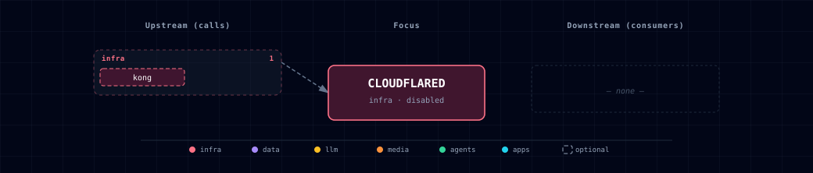

# 5.2.10. Cloudflare Tunnel

Egress-only public-edge service: TLS terminates at Cloudflare's network, and the tunnel proxies inbound traffic to Kong. Disabled by default. Enable it to make Atlas publicly reachable without opening inbound firewall ports.

## 1. Overview

`cloudflared` runs as one container that dials out to Cloudflare and registers as a named tunnel. TLS terminates at the Cloudflare edge, so the stack manages no certificates. The tunnel forwards every request to `http://kong-api-gateway:8000`, so Kong is the single internal entry point.

The service is **egress-only**: it publishes no host port and has no Kong route. It connects to `backend-network` and reaches Kong by Docker DNS name.

Image: `cloudflare/cloudflared:2026.6.1` (pin a dated tag; bump deliberately).

## 2. Access

| Path | URL | Notes |
|---|---|---|
| Public | configured in Cloudflare dashboard | One protected public hostname per Atlas Kong host route. |
| Internal metrics | `cloudflared:2000/metrics` | Prometheus-compatible; not scraped by default |
| Host port | — | None. Egress-only. |

### 2.1. Public hostnames

Define public hostnames and routing rules in the Cloudflare Zero Trust dashboard, not in this repository. Kong selects routes by Host (`api.localhost`, `chat.localhost`, `n8n.localhost` and the other aliases in [Ports and Routes](../../docs/reference/ports-routes.md)), so:

- Set each hostname's Origin HTTP Host Header (`httpHostHeader` in an ingress rule) to the exact Kong alias. Without it, the public Host matches no alias and Kong returns 404.
- Supabase path routes (`/rest/v1`, `/auth/v1`, `/storage/v1`, `/graphql/v1`, `/realtime/v1`, `/pg/`) answer only on `localhost`, `127.0.0.1`, `kong-api-gateway`, `<PROJECT_NAME>-kong-api-gateway` and `host.docker.internal`. A rule with the Host override therefore never reaches Supabase.
- To expose Supabase, use a rule *without* the Host override and add the hostname, in lowercase, to `KONG_SUPABASE_EXTRA_HOSTS` (Kong matches Host case-sensitively). The anon key alone then opens it, and the dashboard password alone opens `/pg/`, so put Cloudflare Access in front. Set the override on every other rule.
- Add an origin to `KONG_CORS_EXTRA_ORIGINS` when a page on one public hostname calls another.
- The n8n editor's live connection fails through a tunnel: n8n checks the WebSocket `Origin` against the `n8n.localhost` host Kong forwards (see the n8n README). Its webhooks work.

The Host override selects the route only. Apps that pin their own origin fail on a public hostname unless you override their settings:

- MLflow: `MLFLOW_SERVER_CORS_ALLOWED_ORIGINS` lists only `mlflow.localhost` and loopback, so state-changing requests get 403.
- Label Studio: `CSRF_TRUSTED_ORIGINS` / `LABEL_STUDIO_HOST` name its Kong alias, so login fails the CSRF check.
- Langfuse: `NEXTAUTH_URL` is `langfuse.localhost`, so sign-in redirects to an unreachable host.

## 3. Configuration

```bash
CLOUDFLARED_SOURCE=disabled               # change to "container" to enable
CLOUDFLARE_TUNNEL_TOKEN=                  # required when SOURCE=container; from Zero Trust > Networks > Tunnels
CLOUDFLARED_IMAGE=cloudflare/cloudflared:2026.6.1
# CLOUDFLARED_SCALE is auto-managed: 1 when SOURCE=container, 0 when disabled
```

The setup wizard offers the same `container` / `disabled` choice. For automation, set `CLOUDFLARE_TUNNEL_TOKEN` in `.env`, then run `./start.sh --cloudflared-source container --detach`.

**To enable:**

1. Create a named tunnel in the Cloudflare Zero Trust dashboard (Zero Trust > Networks > Tunnels > Add a tunnel).
2. Copy the tunnel token.
3. Set `CLOUDFLARED_SOURCE=container` and `CLOUDFLARE_TUNNEL_TOKEN=<your-token>` in `.env`.
4. In the dashboard, add a public hostname for `http://kong-api-gateway:8000` (service type HTTP, URL `kong-api-gateway:8000`).
5. Set its Origin HTTP Host Header to the Kong alias, for example `api.localhost` (Backend) or `chat.localhost` (Open WebUI).
6. Before users get the hostname, create a Cloudflare Access application with a least-privilege policy for it.
7. Repeat steps 4–6 for each additional Atlas service you expose.
8. Restart the stack: `./start.sh`.

If `CLOUDFLARE_TUNNEL_TOKEN` is empty when `CLOUDFLARED_SOURCE=container`, Atlas rejects the configuration before Compose starts. This prevents an authentication-failure restart loop.

## 4. Architecture & wiring

**Startup ordering.** `cloudflared` depends on `kong-api-gateway: { condition: service_healthy }` so the gateway is ready before the tunnel connects.

**No ingress port.** cloudflared has no `*_PORT` env var. The container publishes no port; it dials out and forwards back. The metrics endpoint (`TUNNEL_METRICS: 0.0.0.0:2000`) is reachable only inside the network.

**Scale toggle.** The bootstrapper sets `CLOUDFLARED_SCALE` to `1` (SOURCE=container) or `0` (disabled). The compose fragment uses `deploy.replicas: ${CLOUDFLARED_SCALE:-0}`, so a disabled tunnel does not start.

**Security posture.** Cloudflare Access is required for every public Atlas hostname. Use identity-aware, least-privilege policies; an unguessable hostname is not access control. The tunnel does not replace Kong controls. After Access admits a request, Kong still applies the matched route's plugins: authentication and ACL where the route has them, and rate limiting on `search.localhost`. Keep both layers, with an explicit `httpHostHeader` that selects the intended Kong route.

## 5. Dependencies & Integrations

### 5.1. Current — Upstream (this service calls)

| Service | Category | Status |
|---|---|---|
| kong | infra | optional: public hostnames configured in the Cloudflare dashboard |

### 5.2. Current — Downstream (services that call this)

_No downstream consumers._

### 5.3. Architecture diagram



[Open the full-size diagram](./architecture.html) for a full-screen view.

### 5.4. Future — Missing pair integrations

_No high-confidence opportunities identified._

### 5.5. Future — Candidate new services

_No high-confidence opportunities identified._

### 5.6. Future — Unused features in this service

_No high-confidence opportunities identified._

## 6. Capabilities & limitations

Support tier: **experimental** — Capability contract declared; no cited cold-start, workflow, or upgrade qualification run yet (evidence at `v0.1.0`).

| Capability | Status | Verification | Notes |
|---|---|---|---|
| Outbound named-tunnel edge | supported | tested | Atlas runs cloudflared as an egress-only named tunnel to Kong and validates the required tunnel-token configuration before launch. |
| Atlas-managed public hostname routing | not-supported | documented | Public hostnames and their Origin Host Header mappings must be created in the Cloudflare dashboard; Atlas does not provision tunnel ingress rules. |
| Atlas-managed Cloudflare Access policy | not-supported | documented | Identity, application, and Access policy configuration remains external to Atlas and must be applied by the Cloudflare account operator. |
