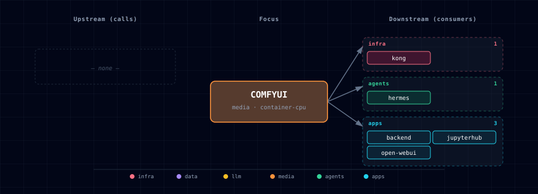

# 5.2.11. ComfyUI

Node-based image generation workflow engine. ComfyUI runs as a single container with a web UI on its own port, exposing an HTTP API (`/prompt`, `/history/{id}`, `/view`) and a WebSocket (`/ws`) that streams `executing`/`executed`/`progress` events while a workflow runs. The stack treats ComfyUI as a media-tier engine: backend, Hermes, and Open WebUI consume it through Kong (browser) or directly via the internal Docker DNS name; n8n reaches it through the backend (`backend:8000/comfyui/*`), not directly.

Three source variants cover the common deployment shapes: containerized CPU and GPU (built from `ai-dock/comfyui` images) and a localhost mode that routes consumers to a host-running ComfyUI. Disabled mode removes it from compose entirely. A short-lived `comfyui-init` container stages model checkpoints into the `comfyui-models` volume based on `COMFYUI_USER_MODELS` (selected via the wizard's "ComfyUI · models" step), while an AI-Dock provisioning hook installs pinned custom-node repositories and their declared requirements inside the ComfyUI runtime environment.

## 1. Overview

Image: `ghcr.io/ai-dock/comfyui:v2-cpu-22.04-v0.2.7` (CPU default) or an operator-provided CUDA ai-dock variant for GPU. Atlas pins the upstream ComfyUI core through `COMFYUI_REF=v0.27.0` and keeps `COMFYUI_AUTO_UPDATE=true` so the ai-dock startup path checks out that release even when the base image tag lags. Output behavior: by default outputs are uploaded to Supabase Storage via `COMFYUI_UPLOAD_TO_SUPABASE=true` and the `COMFYUI_STORAGE_BUCKET=comfyui-images` bucket. A second volume (`comfyui-custom-nodes`) holds allowlisted community nodes cloned from `services/comfyui/custom-nodes.yaml`.

## 2. Access

| Path | URL | Notes |
|---|---|---|
| Direct | `http://localhost:${COMFYUI_PORT}` (default `63054`) | Web UI + REST API. |
| Kong | `http://comfyui.localhost:${KONG_HTTP_PORT}` | Browser-friendly; needs `./start.sh --setup-hosts`. |
| Internal | `${COMFYUI_ENDPOINT}` | Resolved per `COMFYUI_SOURCE`: `http://comfyui:18188` for container, `http://host.docker.internal:${COMFYUI_LOCALHOST_PORT}` for localhost. |
| WebSocket | `ws://comfyui:18188/ws` | Streams progress events; one connection per caller today. |

Canonical port table: [Ports and Routes](../../docs/deployment/ports-and-routes.md).

## 3. Configuration

```bash
COMFYUI_SOURCE=container-cpu                # container-cpu | container-gpu | localhost | managed-localhost-mps | disabled
COMFYUI_PORT=63054                          # computed by topology.py
COMFYUI_BASE_URL=http://comfyui:18188       # in-container default
COMFYUI_ARGS=--listen                       # static — passed verbatim; add --cpu (CPU) or --force-fp16 (GPU) yourself (compose default when unset: --listen --cpu)
COMFYUI_PLATFORM=linux/amd64
COMFYUI_USER_MODELS=                         # comma-separated catalog names; set by the wizard
COMFYUI_UPLOAD_TO_SUPABASE=true
COMFYUI_STORAGE_BUCKET=comfyui-images
COMFYUI_AUTO_UPDATE=true                    # AI-Dock startup updates ComfyUI to COMFYUI_REF
COMFYUI_REF=v0.27.0                         # pinned upstream ComfyUI release tag or full commit SHA
COMFYUI_MEMORY_LIMIT=40g                    # hard ceiling, not a reservation; supports large bundles such as Krea 2
COMFYUI_CUSTOM_NODES_FILE=/custom-nodes.yaml # host-side fallback resolves to services/comfyui/custom-nodes.yaml
```

Localhost overrides:

```bash
COMFYUI_LOCALHOST_PORT=8000                 # URL is derived as http://host.docker.internal:8000 at compose-render time
COMFYUI_LOCAL_MODELS_PATH=~/Documents/ComfyUI/models   # bind-mounted when SOURCE=localhost
```

Managed Apple-Silicon / Metal (MPS) overrides (`SOURCE=managed-localhost-mps`; see §10):

```bash
COMFYUI_MPS_LOCALHOST_PORT=8188             # fixed host port; URL is http://host.docker.internal:8188 (named _LOCALHOST_ so the slot allocator leaves it fixed)
COMFYUI_MPS_REF=v0.27.0                     # pinned upstream ComfyUI git ref the managed host checks out (mirrors COMFYUI_REF)
COMFYUI_MPS_STATE_DIR=~/.atlas/comfyui-mps  # Atlas-owned host state dir: pinned checkout + venv + pid/log/status files
COMFYUI_MPS_MODELS_PATH=~/Documents/ComfyUI/models   # existing host models dir reused via extra_model_paths (no duplicate weights)
COMFYUI_MPS_MIN_MEMORY_GB=16                # unified-memory floor the preflight warns below
```

Auto-managed (do not edit manually):

```bash
COMFYUI_ENDPOINT=...                        # what backend/n8n/jupyterhub/open-webui consume
COMFYUI_SCALE / COMFYUI_INIT_SCALE
```

## 4. Architecture & wiring

**Request flow.** The backend POSTs a workflow JSON to `${COMFYUI_ENDPOINT}/prompt` and receives a `prompt_id` (n8n workflows call the backend's `/comfyui/*` routes rather than ComfyUI directly). To track progress, the caller either polls `GET /history/{prompt_id}` or opens a `/ws` websocket and filters by `prompt_id`. Outputs land under `output/` inside the container; the `/view` endpoint serves them by filename.

**Init flow** (`comfyui-init`): plain alpine + `apk add wget ca-certificates`. At bootstrapper start, `comfyui_resolver` (host-side, DB-free) computes the active model set from `COMFYUI_USER_MODELS` + `services/comfyui/custom-models.yaml` and writes `volumes/comfyui/selected-models.yaml` (full manifest) and `volumes/comfyui/active-models.tsv` (shell-consumable TSV). A single logical catalog entry may declare `files:` to download multiple artifacts as one selectable bundle; the manifest expands that bundle into one row per file with `bundle_id`, `bundle_file_role`, `precision`, `variant`, and explicit `target_dir` metadata. The same pass maps active `requires_custom_node` values through `services/comfyui/custom-nodes.yaml` and writes `volumes/comfyui/active-custom-nodes.tsv`; only allowlisted GitHub repos pinned to full commit SHAs are auto-installed. `comfyui-init` bind-mounts `volumes/comfyui/` and downloads each model TSV row into the `comfyui-models` volume via resumable `wget -c` with optional SHA256 verification. The main ComfyUI container mounts the same manifest directory plus `services/comfyui/provisioning/provision_custom_nodes.sh` as AI-Dock's provisioning hook; that hook clones each custom-node TSV row into `comfyui-custom-nodes` and installs `requirements.txt` through the ComfyUI Python environment when `install_requirements=true`. Failure mode is non-fatal — ComfyUI starts even if downloads or custom-node provisioning are incomplete, you just get model-not-found or node-missing errors at workflow time. The former `comfyui-catalog-init` container and `public.comfyui_models` DB table have been removed.

**Hard dependencies** (`depends_on.required`): `supabase`, `litellm`, `ollama`. The Supabase dep covers the Storage upload path; LiteLLM and Ollama are listed for **canonical wizard/row ordering** (the topology backbone — see ollama/parakeet for the same convention), NOT because ComfyUI calls them at startup. ComfyUI's only `runtime_adaptive` entry is `adapts_to: comfyui`.

**Volumes:** `comfyui-models` (checkpoints, VAEs, LoRAs), `comfyui-custom-nodes` (allowlisted community nodes cloned at pinned refs), `comfyui-input` (input images at `/opt/ComfyUI/input`), `comfyui-output` (generated images, also uploaded to Supabase).

**Output deduplication.** None today — the same workflow run twice generates two outputs and two Supabase uploads. There is no content-hash dedup pass.

## 5. Dependencies & Integrations

### 5.1. Current — Upstream (this service calls)

| Service | Category |
|---|---|
| supabase | data |

### 5.2. Current — Downstream (services that call this)

| Service | Category |
|---|---|
| kong | infra |
| hermes | agents |
| backend | apps |
| jupyterhub | apps |
| open-webui | apps |

### 5.3. Architecture diagram



[Open the interactive HTML diagram](./architecture.html) for a full-screen view.

### 5.4. Future — Missing pair integrations

- **comfyui ↔ minio** — *Why:* ComfyUI currently uploads outputs to Supabase Storage via `COMFYUI_UPLOAD_TO_SUPABASE`/`COMFYUI_STORAGE_BUCKET`, but `services/minio/service.yml` already provisions a dedicated `comfyui` bucket plus `MINIO_COMFYUI_ACCESS_KEY` that is never consumed. Routing outputs to MinIO keeps generated media in the artifact tier and gives downstream services a stable S3 URL. *Mechanism:* small ComfyUI custom node (or sidecar reading the `executed` event on `ws://comfyui:18188/ws`) that pushes `/view`-rendered artifacts to `s3://comfyui` on `http://minio:9000` using `MINIO_COMFYUI_ACCESS_KEY`. Add `minio` to `runtime_deps.optional`. *Effort:* small. *Confidence:* high.
- **comfyui ↔ weaviate (via multi2vec-clip)** — *Why:* every ComfyUI generation produces an image plus the prompt that made it. The stack already runs `multi2vec-clip` as part of the weaviate family, so generated outputs can be auto-embedded for similarity search with zero new infra. *Mechanism:* post-execution hook PUTs `{image, prompt, workflow_id}` into a `ComfyImage` Weaviate class with `vectorizer: multi2vec-clip` on `http://weaviate:8080/v1/objects`. *Effort:* medium. *Confidence:* high.
- **comfyui ↔ n8n** — *Why:* `services/n8n/service.yml` already installs `n8n-nodes-comfyui` and the image-to-image package, but the comfyui manifest declares no `runtime_deps.optional` link to n8n and the credentials store is not pre-seeded. *Mechanism:* pre-seed an n8n credential at startup (n8n REST API `POST /credentials`) pointing at `${COMFYUI_ENDPOINT}`; add `n8n` to comfyui's `runtime_deps.optional`. *Effort:* small. *Confidence:* medium.
- **comfyui ↔ redis** — *Why:* compose already lists `redis` in `depends_on` but Redis isn't actually used by ComfyUI. A small queue-state bridge would let n8n/backend poll job status without holding a websocket open per request. *Mechanism:* custom node subscribing to its own websocket and mirroring `executing`/`executed`/`progress` events into Redis pubsub channels `comfyui:job:<prompt_id>`. *Effort:* medium. *Confidence:* low (cheaper path is polling `/history`).

### 5.5. Future — Candidate new services

- **Langfuse** ([details](../../docs/research/candidates/langfuse.md)) — *Headline:* self-hostable trace store capturing LiteLLM + ComfyUI + Hermes generation pipelines end-to-end. *Wires into:* litellm, hermes, n8n, backend, open-webui.

### 5.6. Future — Unused features in this service

- **ComfyUI-Manager + `cm-cli` for richer custom-node lifecycle management** — *Why pursue:* Atlas now clones pinned custom-node repositories from an allowlist, but it does not use ComfyUI-Manager for enable/disable/remove operations or dependency reconciliation inside the runtime Python environment. Manager remains a future decision because its GPL-3.0 license and runtime behavior need explicit acceptance. *Effort:* small.
- **Workflow-API mode + `/prompt` ingestion from non-UI clients** — *Resolved by #519:* ComfyUI is now a first-class provider in the hosted media gateway. `POST /media/generate` with `provider=comfyui, modality=image` builds a graph (CheckpointLoaderSimple for SD1.5/SDXL, or the split UNETLoader/CLIPLoader(krea2)/VAELoader graph for Krea 2), submits it to `/prompt`, polls `/history/{prompt_id}` + `/queue` into the same normalized envelope as the FAL path, and serves the artifact via `GET /comfyui/image/{filename}`. img2img (`image_url` + `strength`) and `POST /media/operations/{id}/cancel` (queue-delete + interrupt) are supported for provider parity.
- **Video model support (Mochi / LTX-Video)** — *Why pursue:* ComfyUI upstream supports video diffusion; the picker catalog includes a `video` category filter but the initial curated list is thin. Expanding the catalog with production-ready video checkpoints (Mochi, LTX-Video, Wan) would give GPU users first-class video generation. *Effort:* medium.
- **Authentication on the ComfyUI endpoint** — *Why pursue:* `server.py` ships no auth and Kong fronts ComfyUI on `comfyui.localhost`. A Kong basic-auth or JWT plugin would prevent any LAN peer from queueing GPU jobs. *Effort:* small.

## 6. Troubleshooting

**`AssertionError: Torch not compiled with CUDA enabled` on GPU mode.** You selected `container-gpu` but the host lacks NVIDIA Container Toolkit. Verify with `docker info | grep -i runtime`; expect `nvidia` listed. Otherwise switch to `container-cpu` or install the toolkit.

**Init container downloads stall mid-workflow.** `comfyui-init` runs in the background of the first `./start.sh`; large model sets (`full`) take ~10 GB and 5-15 min. Workflows referencing not-yet-downloaded models 404 until init exits. `docker logs <project>-comfyui-init -f` shows progress.

**Generated images don't appear in Supabase.** Confirm `COMFYUI_UPLOAD_TO_SUPABASE=true` and `SUPABASE_SERVICE_KEY` is valid. Upload happens after each successful workflow; failure mode is silent retry (check `docker logs <project>-comfyui` for `[supabase upload] …`).

**Localhost mode (`COMFYUI_SOURCE=localhost`) — containers can't reach host.** Linux Docker needs `host.docker.internal` mapped to the host gateway. The bootstrapper injects `extra_hosts: ["host.docker.internal:host-gateway"]` automatically; if you bypassed it, that's the gap. Kong's compose has the same wiring for the same reason.

**Managed MPS mode (`COMFYUI_SOURCE=managed-localhost-mps`) — `unsupported host` at start.** That source runs a native Metal process and only works on Apple Silicon (macOS/arm64). On Linux/Intel/Windows the preflight fails by design. Run `./start.sh comfyui-mps preflight` to see which check failed; use `container-cpu`/`container-gpu` or unmanaged `localhost` on non-Apple hosts. See §10.

**Managed MPS mode — health shows `device: cpu` or an fp8 model crashes.** MPS requires BF16 weights; `fp8`/`fp8-scaled` variants crash on Metal. `./start.sh comfyui-mps preflight` warns on fp8 catalog picks. If `health` reports `device: cpu`, Torch didn't pick up Metal — reinstall with `./start.sh comfyui-mps install --update`. A freshly started host is *reachable but cold*; the first request loads the model (~9–13 s) — that's not a hang.

**`ws://comfyui:18188/ws` 502s through Kong.** Kong's WebSocket support is wired but consumers using `comfyui.localhost` instead of `comfyui:18188` may hit timeout-related drops. From sibling containers prefer the internal DNS name.

```bash
docker compose ps comfyui comfyui-init
docker compose logs -f comfyui
curl -s http://localhost:${COMFYUI_PORT}/system_stats | jq .   # GPU/CPU info, queue depth
```

For general startup and routing issues, see [Troubleshooting](../../docs/quick-start/troubleshooting.md).

## 7. Operations

**Choosing models.** Run `./start.sh` (or the wizard standalone) and navigate to the "ComfyUI · models" step. The step shows for every non-`disabled` source (container-cpu / container-gpu / localhost) — same shape as the Ollama picker. Use filter chips (`f` key) to browse by category (Image / Image-edit / Video / Audio / 3D), `/` or `Tab` to search by name, `Space` to toggle rows, and `Enter` to confirm. Selected names are persisted as `COMFYUI_USER_MODELS` in `.env`. On the next `./start.sh`:

- **`container-cpu` / `container-gpu`:** the bootstrapper resolves the active set via `comfyui_resolver` and writes `volumes/comfyui/selected-models.yaml`, `volumes/comfyui/active-models.tsv`, and `volumes/comfyui/active-custom-nodes.tsv`. `comfyui-init` downloads each model in the model TSV into the `comfyui-models` volume. The AI-Dock provisioning hook in the main ComfyUI container clones each allowlisted custom-node row into `comfyui-custom-nodes` and installs its requirements when enabled.
- **`localhost`:** the bootstrapper still writes the manifest (so the backend `/comfyui/db/models` endpoint surfaces the active set to Open WebUI + n8n). `comfyui-init` does NOT run (scale=0) — you populate your host ComfyUI install's models directory yourself, same way you'd run `ollama pull <name>` on the host for Ollama localhost.

All three files under `volumes/comfyui/` are **gitignored runtime artifacts** — rewritten on every non-`disabled` start, never hand-edited, never committed — so a normal start leaves the checkout (and any consumer's Atlas submodule) clean. The directory itself stays present on fresh clones via tracked marker files (`.gitkeep` plus a short README), because the always-on backend bind-mounts it read-only. The catalog you *do* edit is `services/comfyui/models.yaml`.

CLI alternative (works for all non-disabled sources):
```bash
./start.sh --comfyui-models=sdxl-base-1.0,sdxl-vae,flux1-dev-Q4_K_S
```
Unknown names log a warning at bootstrapper start but don't block startup.

**Required custom_nodes.** Some models (Flux GGUF, AnimateDiff, IP-Adapter, InstantID, 3D-Pack, etc.) need specific ComfyUI custom_nodes installed before they will load. The wizard marks those rows with `required node: <node-name>`. For container sources, Atlas maps those names through `services/comfyui/custom-nodes.yaml` and writes `active-custom-nodes.tsv`; the AI-Dock provisioning hook clones only the allowlisted repos at their pinned commit refs and installs requirements when `install_requirements=true`. Unknown node names still warn and are not auto-cloned. When adding a new catalog requirement, add the node to `custom-nodes.yaml` with a GitHub HTTPS repo, a full 40-character commit SHA, and an explicit `install_requirements` flag.

**Adding models not in the catalog.** Edit `services/comfyui/custom-models.yaml`. The wizard surfaces additions on the next run with a `[Custom]` family badge; the bootstrapper ingests them via `comfyui_resolver` at start and adds them to the download manifest. Single-file entries use `url`/`filename` directly. Multi-file entries use `files:` so one logical selection can stage, for example, diffusion weights, text encoders, and a VAE into distinct ComfyUI model directories. Per-file `target_dir` is authoritative and lets mesh/3D loaders place weights in `checkpoints` when required. Schema is documented in the file's header comment.

**Removing models.** Unchecking a model in the wizard sets it inactive on the next start (it is removed from the manifest and won't be re-downloaded). The underlying file is NOT deleted from the volume (same behavior as Ollama). To reclaim disk:

```bash
# Nuke the entire volume:
./stop.sh --cold

# Selective delete:
docker run --rm -v <project>-comfyui-models:/m alpine \
  rm /m/checkpoints/<file>
```

**Backend REST view.** `GET /comfyui/db/models?active_only=true` on the backend service returns the active catalog rows for Open WebUI + n8n consumers.

**Queue a workflow programmatically.**

```bash
curl -X POST http://localhost:${COMFYUI_PORT}/prompt \
  -H 'content-type: application/json' \
  -d @workflow.json
# → {"prompt_id": "abc-123", "number": 0, "node_errors": {}}

curl http://localhost:${COMFYUI_PORT}/history/abc-123
# → {"abc-123": {"prompt": [...], "outputs": {...}}}
```

**Monitor a running workflow.**

```bash
# Open ws://comfyui:18188/ws and filter messages by prompt_id
# Event types: status, executing, executed, progress, execution_error
```

## 8. Performance notes

- **CPU mode is slow.** A 512×512 SD 1.5 generation takes ~30-90s on CPU; the same on a modest GPU takes 2-5s. Use CPU mode for testing workflows, not for production.
- **GPU FP16.** Add `--force-fp16` to `COMFYUI_ARGS` in `.env` when running the GPU variant; halves VRAM usage with negligible quality impact for most SD/SDXL workloads.
- **Model loading dominates first-run latency.** Each checkpoint is ~2-7 GB; the first workflow using a model pays a 5-30s load cost as ComfyUI maps it into memory. Subsequent runs reuse the cached model.
- **No batching today.** ComfyUI processes one workflow at a time; concurrent requests queue. For high throughput, add replicas (out of scope for the default stack).

## 9. Krea 2 model bundles

### 9.1. Bundle inventory

Atlas exposes Krea 2 as two independent BF16 catalog selections. Both use ComfyUI core loaders and share the same Qwen3-VL 4B text encoder and Qwen-Image VAE. Selecting both keeps six logical manifest rows for bundle provenance but writes four unique physical downloads to `active-models.tsv`.

Container sources use a `COMFYUI_MEMORY_LIMIT=40g` hard ceiling so the bundle can load without the former 4 GB container OOM boundary. This is a limit, not a reservation; smaller workloads still consume only their actual memory.

| Bundle | Catalog ID | Precision | Disk | Recommended RAM | Recommended VRAM |
|---|---|---:|---:|---:|---:|
| Krea 2 Turbo | `krea2-turbo-bf16` | BF16 | 35.413 GB | 32 GB | 32 GB |
| Krea 2 RAW | `krea2-raw-bf16` | BF16 | 35.413 GB | 32 GB | 32 GB |

### 9.2. Pinned artifacts

All four unique files come from immutable revision `8038ce89b91b042141541ad0fa51b985ca262c5f` of [`Comfy-Org/Krea-2`](https://huggingface.co/Comfy-Org/Krea-2/tree/8038ce89b91b042141541ad0fa51b985ca262c5f).

| Bundle use | Target | Bytes | SHA-256 |
|---|---|---:|---|
| Turbo diffusion model | `diffusion_models/krea2_turbo_bf16.safetensors` | 26,283,332,608 | `78bbf8f4165eda19cea3cb06c78089221932a39e2eed8af9da741f942c47ffb3` |
| RAW diffusion model | `diffusion_models/krea2_raw_bf16.safetensors` | 26,283,332,608 | `f99bb0ff8e362b77342bc4994e0c50906fe7ef7074864b181b7d48d2fa6d03d7` |
| Shared text encoder | `text_encoders/qwen3vl_4b_bf16.safetensors` | 8,875,719,384 | `36f3ff447ef59201722e8f9ce6020c9819fdcfba6aa2608c4e09b1c0ce114e34` |
| Shared VAE | `vae/qwen_image_vae.safetensors` | 253,806,246 | `a70580f0213e67967ee9c95f05bb400e8fb08307e017a924bf3441223e023d1f` |

### 9.3. Core-node workflow

[`workflows/krea2-turbo-api.json`](./workflows/krea2-turbo-api.json) is an API-ready 1024-square example. It uses `CLIPLoader` type `krea2`, 8 steps, CFG 1.0, `euler` with the `simple` scheduler, and `ConditioningZeroOut` for negative conditioning. No custom nodes are required. Atlas pins ComfyUI `v0.27.0`; upstream core Krea 2 support first appeared in `v0.26.0`.

Queue it after selecting `krea2-turbo-bf16`:

```bash
curl -X POST http://localhost:${COMFYUI_PORT}/prompt \
  -H 'content-type: application/json' \
  --data-binary @services/comfyui/workflows/krea2-turbo-api.json
```

### 9.4. License and deployment obligations

The weights use the pinned [Krea 2 Community License](https://huggingface.co/krea/Krea-2-Turbo/blob/1161245028ef398cd0a951101b2bbf486464f841/LICENSE.pdf). Commercial use at or above **$1,000,000 USD ($1M) in company-wide annual revenue** requires an enterprise license. Deployments must also implement reasonable and appropriate **content filtering**. The authoritative license does not state a seat-count threshold; the previously reported 50-seat limit must not be applied.

These obligations appear directly in the model picker and generated manifest metadata so operators see them before downloading the weights.

### 9.5. Verification

Offline tests validate the immutable artifact metadata, bundle expansion, shared-download deduplication, wizard badges, workflow node graph, and all three documentation surfaces. The actual 1024-square generation remains an opt-in live smoke test because it requires the 35.413 GB bundle and suitable hardware:

```bash
ATLAS_COMFYUI_LIVE_ENDPOINT=http://localhost:${COMFYUI_PORT} \
  uv run --project bootstrapper pytest bootstrapper/tests/test_krea2_catalog.py -m live -q
```

## 10. Managed Apple-Silicon / Metal (MPS) source

`COMFYUI_SOURCE=managed-localhost-mps` is a **managed** host source for Apple Silicon (M-series) Macs. Docker Desktop on macOS cannot pass Metal into a Linux container, so instead of a container Atlas installs and runs a **native ComfyUI process on the host** and points `COMFYUI_ENDPOINT` at it — turning the unmanaged `localhost` mode (where you install, update, and launch ComfyUI yourself) into a provisioned one. Every downstream consumer (backend, Open WebUI, JupyterHub, Celery, consumer manifests) resolves the same `COMFYUI_ENDPOINT` contract, so nothing downstream cares that the source is a host process rather than a container.

**One process per host.** A single ComfyUI instance already saturates the GPU on Apple Silicon; a second instance on the same box is net-negative (GPU contention). The managed source therefore runs exactly one process, keyed by a PID file. Parallelism comes from more machines, not more instances.

### 10.1. What Atlas manages

- **Pinned checkout + reconciled venv** — `COMFYUI_MPS_REF` (default `v0.27.0`, mirroring `COMFYUI_REF`) is checked out into `COMFYUI_MPS_STATE_DIR` (default `~/.atlas/comfyui-mps`) with a dedicated venv holding Metal-enabled Torch. Every install compares the checkout ref and requirements fingerprint with recorded state; a changed pin or dependency file is reinstalled automatically, while unchanged environments are reused.
- **Host models reuse** — the process reads `COMFYUI_MPS_MODELS_PATH` (default `~/Documents/ComfyUI/models`, shared with `COMFYUI_LOCAL_MODELS_PATH`) through a generated `extra_model_paths.yaml`, so an existing Krea 2 / Flux install is used in place with **no duplicate weights**.
- **Fixed port + PID/log/status files** — the process listens on `COMFYUI_MPS_LOCALHOST_PORT` (default `8188`, `127.0.0.1` only). `comfyui-mps.pid`, `comfyui-mps.log`, and `status.json` live under the state dir. A start aborts if the port is already taken by an unrelated process.

### 10.2. Lifecycle

A normal `./start.sh` with this source runs preflight → install → start at the launch boundary, immediately before `docker compose up`. If image build, Compose startup, or a required init container fails, Atlas stops a ComfyUI process created by that launch; it does not stop an instance that was already running. After the stack converges, the host process becomes part of the running stack. The process is **host-global** — shared by every Atlas consumer on the machine — so a project-scoped `./stop.sh` leaves it running by default (with an advisory) rather than interrupting another consumer; pass `./stop.sh --stop-managed-hosts` to stop it explicitly (this affects all consumers), or use the per-runtime `comfyui-mps stop` command below. A container `down` never reaches native host processes regardless. For explicit control there is a headless CLI:

```bash
./start.sh comfyui-mps preflight     # read-only host probe (OS/arch, memory, Torch/MPS, per-model precision). No install.
./start.sh comfyui-mps install       # idempotent pinned checkout + venv + Metal Torch
./start.sh comfyui-mps install --update   # force a fresh dependency reconciliation
./start.sh comfyui-mps start         # launch the host process (idempotent — one per host)
./start.sh comfyui-mps status        # running / pid / installed ref (JSON)
./start.sh comfyui-mps health        # probe /system_stats: reachability + compute device (mps/cpu)
./start.sh comfyui-mps stop          # stop the complete managed process group
./start.sh comfyui-mps remove        # stop + delete the state dir (checkout, venv, logs)
```

The same preflight also runs as a CI-safe doctor check: `./start.sh doctor` reports a `comfyui-mps` line — `skipped` when the source isn't selected, `fail` with an actionable message on an unsupported host, `pass`/`warn` on Apple Silicon.

### 10.3. Preflight (the narrow MPS probe)

`preflight` is read-only and never launches anything. It checks: **OS** (macOS) and **arch** (arm64) — a hard `fail` elsewhere; **git** + **python3** presence; **unified-memory headroom** against `COMFYUI_MPS_MIN_MEMORY_GB` (`warn` below the floor — large BF16 bundles may OOM); **Torch/MPS availability** (`torch.backends.mps.is_available()`, only after the venv exists); and **per-model precision** — `fp8`/`fp8-scaled` weights crash on MPS and are flagged `warn` with a "use a BF16 variant" hint (BF16 is required; this is the ComfyUI-specific slice of the media preflight).

### 10.4. Cold vs warm, and health

Weights load **lazily on the first request** (~9–13 s slower than a warm request on an M2 Ultra). `health` reports `reachable` and the compute `device` (`mps` when `/system_stats` shows a non-CPU device). A freshly launched process is *reachable but cold*; the first generation warms it. `./start.sh` waits up to 60 s for reachability and prints a warm/cold line — a still-warming host is **not** an error (downstream containers retry), so read first-request latency as model load, not a hang.

`status` is **ownership-aware** (#647): a bare `kill -0` on the pidfile would trust a **recycled** PID (another process inheriting the number after a reboot or crash), reporting a dead host as `running`. Instead `status` also cross-checks the process argv against the ComfyUI checkout/state dir, so a recycled or foreign (e.g. root-owned) PID reports `running: false` — and `start` then clears the stale pidfile and relaunches instead of no-opping. No manual `stop` → `start` dance is needed to recover.

### 10.5. Unsupported hosts

On anything that is not macOS/arm64 (Linux CI, Intel Macs, Windows) the preflight `fail`s with an explicit message and `install`/`ensure_running` refuse to proceed — Atlas never claims a Linux container is Metal-capable. Selecting this source on such a host surfaces the error at `./start.sh` time rather than booting a half-configured stack.

### 10.6. Upgrades, rollback, logs, removal

- **Upgrade / rollback** — change `COMFYUI_MPS_REF` in `.env` (a release tag or full commit SHA), then stop and start the service. Install detects the ref and requirements drift and reconciles the venv automatically; `install --update` remains available to force a rebuild. Stop targets the full process group so child workers do not survive the managed server.
- **Logs** — `tail -f "${COMFYUI_MPS_STATE_DIR/#\~/$HOME}/comfyui-mps.log"` (default `~/.atlas/comfyui-mps/comfyui-mps.log`), the same file `status`/`start` report.
- **Removal** — `./start.sh comfyui-mps remove` stops the process and deletes the state dir. Your host models dir (`COMFYUI_MPS_MODELS_PATH`) is **never** touched — it is reused, not owned.

### 10.7. n8n is excluded (unchanged)

n8n does not receive `COMFYUI_ENDPOINT` injection today for **any** ComfyUI source (`n8n-nodes-comfyui` is installed, but users hand-enter `http://comfyui:18188` in workflow credentials — tracked as a "Missing pair integration" in [`services/n8n/README.md`](../n8n/README.md#6-dependencies--integrations)). The managed-MPS source does not change that: it is consumed identically to every other source by the backend, Open WebUI, JupyterHub, and Celery, which **do** receive the endpoint. Wiring n8n is out of scope here and left to that separately-tracked integration.

### 10.8. Verification

Host lifecycle, failure recovery, and the preflight are covered by fully-mocked unit tests (`bootstrapper/tests/test_comfyui_mps_manager.py`) that run on generic Linux CI. Two opt-in Darwin-arm64 `live` checks prove the real path without downloading duplicate weights:

```bash
# 1. Bring the managed host up (reuses your existing host models dir):
./start.sh comfyui-mps install && ./start.sh comfyui-mps start

# 2. Prove /system_stats reports MPS:
uv run --project bootstrapper pytest bootstrapper/tests/test_comfyui_mps_manager.py -m live -q

# 3. Run one Krea 2 Turbo generation against the managed endpoint (reuses the same live smoke as container sources):
ATLAS_COMFYUI_LIVE_ENDPOINT=http://localhost:8188 \
  uv run --project bootstrapper pytest bootstrapper/tests/test_krea2_catalog.py -m live -q
```

## 11. Hunyuan3D-2 native image→3D (MPS-runnable, shape-only)

Atlas curates the ComfyUI-**core** native Hunyuan3D-2 single-image shape generator (`track:creative-3d`). Unlike TRELLIS/Pixal3D — which need CUDA sparse kernels — Hunyuan3D-2's DiT is pure Torch, so it runs on Apple-Silicon **MPS** through the managed source (§10). It is a large optional download: **never `essential`**, so it stages only when explicitly selected (`COMFYUI_USER_MODELS=hunyuan3d-2`), never on an empty selection.

Native support is **shape-only** — geometry generation with **no texture / PBR / material** stage (that path is CUDA-bound and intentionally excluded from this bundle).

### 11.1. Inventory

| Model | Catalog ID | Category | Precision | Disk | RAM | VRAM |
|-------|-----------|----------|-----------|------|-----|------|
| Hunyuan3D-2 | `hunyuan3d-2` | `mesh_model` | fp16 | 4.928 GB | 16 GB | 8 GB |

### 11.2. Pinned artifact

| Role | Target | Bytes | SHA-256 |
|------|--------|-------|---------|
| dit checkpoint | `checkpoints/hunyuan3d-dit-v2.safetensors` | 4,928,151,562 | `360bc281fc956d4acac0c3d36d5ec0ebf8cdddbf4b8892e894d12419388d479b` |

The URL and license are pinned to immutable revision [`9cd649ba6913f7a852e3286bad86bfa9a2d83dcf`](https://huggingface.co/tencent/Hunyuan3D-2/tree/9cd649ba6913f7a852e3286bad86bfa9a2d83dcf) of [`tencent/Hunyuan3D-2`](https://huggingface.co/tencent/Hunyuan3D-2). The dit checkpoint's category is `mesh_model` but its `target_dir` overrides to `checkpoints` so ComfyUI's `ImageOnlyCheckpointLoader` resolves it. Native Hunyuan3D-2 support predates Atlas's pinned ComfyUI ref (`COMFYUI_REF` / `COMFYUI_MPS_REF`, default `v0.27.0`).

### 11.3. Core-node workflow

[`workflows/hunyuan3d-2-image-to-glb-api.json`](./workflows/hunyuan3d-2-image-to-glb-api.json) is an API-ready single-image → shape example. It uses only ComfyUI-core native nodes — `ImageOnlyCheckpointLoader` → `CLIPVisionEncode` → `Hunyuan3Dv2Conditioning` → `KSampler` → `VAEDecodeHunyuan3D` → `VoxelToMeshBasic` → `SaveGLB` — so **no custom node** and no CUDA sparse kernels are required. The terminal `SaveGLB` emits a shape-only `.glb`. Put an input image at ComfyUI's `input/example.png` (or edit node `2`), then:

```bash
curl -XPOST "$COMFYUI_ENDPOINT/prompt" -H 'content-type: application/json' \
  --data-binary @services/comfyui/workflows/hunyuan3d-2-image-to-glb-api.json
```

### 11.4. License

The weights use the [Tencent Hunyuan Community License](https://huggingface.co/tencent/Hunyuan3D-2/blob/main/LICENSE). Material operator obligations:

- **Territory-restricted** — not licensed for use in the European Union, the United Kingdom, or South Korea.
- Products or services with over **100 million monthly active users** require a separate license from Tencent.
- Use is subject to the Tencent Hunyuan Community License Agreement and its Acceptable Use Policy.

### 11.5. Verification

Offline catalog/workflow/GLB-structure tests run on generic CI (`bootstrapper/tests/test_comfyui_hunyuan3d_workflow.py`). Rendering a real mesh is an opt-in `live` smoke — official docs alone do not prove MPS support:

```bash
# Bring up the managed MPS host (§10), select the model, then:
ATLAS_COMFYUI_LIVE_ENDPOINT=http://localhost:8188 \
  uv run --project bootstrapper pytest bootstrapper/tests/test_comfyui_hunyuan3d_workflow.py -m live -q
```
