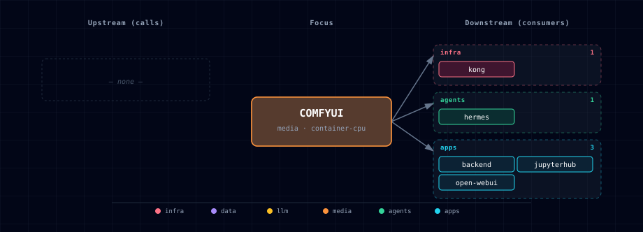

# 5.2.11. ComfyUI

Node-based image generation workflow engine. ComfyUI runs as one container with a web UI and an HTTP API (`/prompt`, `/history/{id}`, `/view`) on its own port. Its WebSocket (`/ws`) streams `executing`, `executed` and `progress` events while a workflow runs. Backend, Hermes, JupyterHub and Open WebUI call ComfyUI at `COMFYUI_ENDPOINT` (§2); browsers use the Kong route. n8n reaches it through the backend (`backend:8000/comfyui/*`), not directly.

Source variants:

- `container-cpu` and `container-gpu`: run the `ai-dock/comfyui` image.
- `localhost`: consumers use a ComfyUI that you run on the host.
- `managed-localhost-mps`: Atlas installs and runs a native Metal ComfyUI on Apple Silicon (§9).
- `disabled`: removes ComfyUI from compose.

A short-lived `comfyui-init` container stages the models in `COMFYUI_USER_MODELS` into the `comfyui-models` volume. The wizard's "ComfyUI · models" step sets that variable. An AI-Dock provisioning hook installs pinned custom-node repositories and their declared requirements in the ComfyUI runtime.

Where to start: choose models in §6 and queue a workflow through the API (§6, §8.3). Apple Silicon setup is in §9. Known problems are in §11.

## 1. Overview

Image: `ghcr.io/ai-dock/comfyui:v2-cpu-22.04-v0.2.7` (CPU default). `COMFYUI_REF=v0.27.0` with `COMFYUI_AUTO_UPDATE=true` makes the ai-dock startup check out that ComfyUI release, even when the base image tag lags.

**`container-gpu` is not GPU-accelerated.** `COMFYUI_IMAGE` stays the CPU image (which forces `--cpu`), and the fragment reserves no NVIDIA device. So `container-gpu` behaves like `container-cpu`, also when `COMFYUI_SOURCE=auto` selects it on NVIDIA hosts. A CUDA ai-dock image alone does not help without a GPU reservation.

Generated images go to the `comfyui-output` volume, and the `/view` endpoint serves them. `COMFYUI_UPLOAD_TO_SUPABASE=true` and `COMFYUI_STORAGE_BUCKET=comfyui-images` are **reserved but inert**. No component in the stock ai-dock image, Atlas provisioning or the backend reads them, so outputs are *not* uploaded to Supabase (§5.4). The `comfyui-custom-nodes` volume holds the allowlisted community nodes from `services/comfyui/custom-nodes.yaml`.

## 2. Access

| Path | URL | Notes |
|---|---|---|
| Direct | `http://localhost:${COMFYUI_PORT}` (default `63054`) | Web UI + REST API. |
| Kong | `http://comfyui.localhost:${KONG_HTTP_PORT}` | Browser-friendly; needs `./start.sh --setup-hosts`. |
| Internal | `${COMFYUI_ENDPOINT}` | Resolved per `COMFYUI_SOURCE`: `http://comfyui:18188` for container, `http://host.docker.internal:${COMFYUI_LOCALHOST_PORT}` for localhost. |
| WebSocket | `ws://comfyui:18188/ws` | Streams progress events; one connection per caller. |

Canonical port table: [Ports and Routes](../../docs/reference/ports-routes.md).

## 3. Configuration

```bash
COMFYUI_SOURCE=container-cpu                # container-cpu | container-gpu | localhost | managed-localhost-mps | disabled
COMFYUI_PORT=63054                          # computed by topology.py
COMFYUI_BASE_URL=http://comfyui:18188       # in-container default
COMFYUI_ARGS=--listen                       # static — passed verbatim; the CPU image adds --cpu itself (compose default when unset: --listen --cpu)
COMFYUI_PLATFORM=linux/amd64
COMFYUI_USER_MODELS=                         # comma-separated catalog names; set by the wizard
COMFYUI_UPLOAD_TO_SUPABASE=true
COMFYUI_STORAGE_BUCKET=comfyui-images
COMFYUI_AUTO_UPDATE=true                    # AI-Dock startup updates ComfyUI to COMFYUI_REF
COMFYUI_REF=v0.27.0                         # pinned upstream ComfyUI release tag or full commit SHA
COMFYUI_MEMORY_LIMIT=40g                    # hard ceiling, not a reservation; supports large bundles such as Krea 2
COMFYUI_CPU_LIMIT=2.0                       # container CPU ceiling; stops CPU-mode inference from taking every host core
COMFYUI_CUSTOM_MODELS_FILE=/custom-models.yaml  # sidecar of models outside the catalog; set with --comfyui-custom-models-file (§6)
COMFYUI_CUSTOM_NODES_FILE=/custom-nodes.yaml # os.pathsep-joined path-list: Atlas allowlist always present + consumer custom_nodes.comfyui paths
```

Localhost overrides:

```bash
COMFYUI_LOCALHOST_PORT=8000                 # URL is derived as http://host.docker.internal:8000 at compose-render time
COMFYUI_LOCAL_MODELS_PATH=~/Documents/ComfyUI/models   # SOURCE=localhost preflight path (managed MPS uses COMFYUI_MPS_MODELS_PATH); container sources mount it read-only at /host_models (unused)
```

Managed Apple-Silicon / Metal (MPS) overrides (`SOURCE=managed-localhost-mps`; see §9):

```bash
COMFYUI_MPS_LOCALHOST_PORT=8188             # fixed host port; URL is http://host.docker.internal:8188 (named _LOCALHOST_ so the slot allocator leaves it fixed)
COMFYUI_MPS_LISTEN=127.0.0.1                # bind address; set 0.0.0.0 on Linux container engines (§9.1)
COMFYUI_MPS_REF=v0.27.0                     # pinned upstream ComfyUI git ref the managed host checks out (mirrors COMFYUI_REF)
COMFYUI_MPS_TORCH_PIN="torch==2.11.0 torchvision==0.26.0 torchaudio==2.11.0"   # pinned Metal Torch; bump with COMFYUI_MPS_REF
COMFYUI_MPS_STATE_DIR=~/.atlas/comfyui-mps  # Atlas-owned host state dir: pinned checkout + venv + pid/log/status files
COMFYUI_MPS_MODELS_PATH=~/Documents/ComfyUI/models   # existing host models dir reused via extra_model_paths (no duplicate weights)
COMFYUI_MPS_MIN_MEMORY_GB=16                # unified-memory floor the preflight warns below (whole GiB)
```

Auto-managed (do not edit manually):

```bash
COMFYUI_ENDPOINT=...                        # consumed by backend, celery, open-webui, jupyterhub (hermes as COMFYUI_INTERNAL_URL); not n8n
COMFYUI_SCALE / COMFYUI_INIT_SCALE
```

## 4. Architecture & wiring

**Request flow.** The backend POSTs a workflow JSON to `${COMFYUI_ENDPOINT}/prompt` and receives a `prompt_id`. n8n workflows call the backend's `/comfyui/*` routes, not ComfyUI. To track progress, the caller polls `GET /history/{prompt_id}`, or opens a `/ws` websocket and filters by `prompt_id`. Outputs go to `output/` in the container; the `/view` endpoint serves them by filename.

**Init flow.** At start, the bootstrapper resolves the selected models and custom nodes from `COMFYUI_USER_MODELS` and the catalogs, and writes a manifest to `volumes/comfyui/`. `comfyui-init` downloads the models into `comfyui-models`. Downloads are SHA-256 verified; an interrupted download restarts from the beginning, and verified files are kept. The ComfyUI AI-Dock provisioning hook clones the allowlisted nodes into `comfyui-custom-nodes`.

Selected models and nodes are required for readiness, whether or not they have a checksum; `provisioning_required: false` opts an advisory asset out.

Each provisioner publishes `provisioning`, `ready` or `failed` for its exact plan into its volume. The healthcheck passes only on a matching `ready` and then probes `/system_stats`. A failed required model makes `comfyui-init` exit nonzero; optional failures only warn. Re-running `./start.sh` retries failed work and reuses verified files. The manifest and TSV formats are documented in the `comfyui_resolver` module and `services/comfyui/provisioning/provision_custom_nodes.sh`.

**Hard dependencies** (`depends_on.required`): `supabase`, `litellm`, `ollama`. Compose gates `comfyui` on `supabase-db-init` and `comfyui-init`, and `comfyui-init` on `ollama-pull`. ComfyUI does not call LiteLLM; `litellm` is listed only for canonical wizard row ordering. The `supabase-storage` dependency is reserved for an output-upload path that is inert (§5.4). ComfyUI's only `runtime_adaptive` entry is `adapts_to: comfyui`.

**Volumes:** `comfyui-models` (checkpoints, VAEs, LoRAs), `comfyui-custom-nodes` (allowlisted community nodes cloned at pinned refs), `comfyui-input` (input images at `/opt/ComfyUI/input`), `comfyui-output` (generated images, served by `/view`).

**Output deduplication.** None. The same workflow run twice writes two output files to the `comfyui-output` volume.

## 5. Dependencies & Integrations

### 5.1. Current — Upstream (this service calls)

_No upstream calls._

### 5.2. Current — Downstream (services that call this)

| Service | Category |
|---|---|
| kong | infra |
| hermes | agents |
| backend | apps |
| jupyterhub | apps |
| open-webui | apps |

### 5.3. Architecture diagram



[Open the full-size diagram](./architecture.html) for a full-screen view.

### 5.4. Future — Missing pair integrations

- **comfyui ↔ minio** — *Why:* outputs stay in the `comfyui-output` volume only, and `COMFYUI_UPLOAD_TO_SUPABASE` and `COMFYUI_STORAGE_BUCKET` have no consumer. `services/minio/service.yml` already provisions a `comfyui` bucket and an unused `MINIO_COMFYUI_ACCESS_KEY`. *Mechanism:* a small custom node, or a sidecar that reads the `executed` event on `ws://comfyui:18188/ws`, pushes `/view` artifacts to `s3://comfyui` on `http://minio:9000`. Add `minio` to `runtime_deps.optional`. *Effort:* small. *Confidence:* high.
- **comfyui ↔ weaviate (via multi2vec-clip)** — *Why:* each generation produces an image and its prompt. The weaviate family already runs `multi2vec-clip`, so outputs can be embedded for similarity search with no new infrastructure. *Mechanism:* a post-execution hook PUTs `{image, prompt, workflow_id}` into a `ComfyImage` class with `vectorizer: multi2vec-clip` on `http://weaviate:8080/v1/objects`. *Effort:* medium. *Confidence:* high.
- **comfyui ↔ n8n** — *Why:* `services/n8n/service.yml` installs `n8n-nodes-comfyui` and the image-to-image package. The comfyui manifest has no `runtime_deps.optional` link to n8n, and no n8n credential is pre-seeded. *Mechanism:* pre-seed an n8n credential at startup (`POST /credentials`) that points at `${COMFYUI_ENDPOINT}`; add `n8n` to `runtime_deps.optional`. *Effort:* small. *Confidence:* medium.
- **comfyui ↔ redis** — *Why:* compose lists `redis` in `depends_on`, but ComfyUI does not use it. A queue-state bridge would let n8n and the backend poll job status without one open websocket per request. *Mechanism:* a custom node mirrors `executing`/`executed`/`progress` events into Redis pub/sub channels `comfyui:job:<prompt_id>`. *Effort:* medium. *Confidence:* low (polling `/history` is cheaper).

### 5.5. Future — Candidate new services

_No high-confidence opportunities identified._

### 5.6. Future — Unused features in this service

- **ComfyUI-Manager + `cm-cli` for custom-node lifecycle** — *Why pursue:* Atlas clones pinned nodes from an allowlist. It does not use ComfyUI-Manager to enable, disable or remove nodes, or to reconcile their dependencies. Its GPL-3.0 license and runtime behavior need an explicit decision first. *Effort:* small.
- **Video model support (Mochi / LTX-Video)** — *Why pursue:* upstream ComfyUI supports video diffusion. The picker has a `video` category filter, but the curated list is thin. Production-ready video checkpoints (Mochi, LTX-Video, Wan) would give GPU users video generation. *Effort:* medium.
- **Authentication on the ComfyUI endpoint** — *Why pursue:* `server.py` ships no auth and Kong fronts ComfyUI on `comfyui.localhost`. A Kong basic-auth or JWT plugin would stop any LAN peer from queueing GPU jobs. *Effort:* small.

## 6. Operations

**Choosing models.** Run `./start.sh` with no arguments to open the wizard, and go to the "ComfyUI · models" step. The step shows for every non-`disabled` source, like the Ollama picker. Keys:

- `f`: filter chips by category (Image / Image-edit / Video / Audio / 3D).
- `/` or `Tab`: search by name.
- `Space`: toggle a row.
- `Enter`: confirm.

The selection is saved as `COMFYUI_USER_MODELS` in `.env`. On the next `./start.sh`:

- **`container-cpu` / `container-gpu`:** `comfyui_resolver` writes `volumes/comfyui/selected-models.yaml`, `active-models.tsv` and `active-custom-nodes.tsv`. Both TSVs have a `required`/`optional` column; a plan without it fails safe as required. `comfyui-init` downloads each model row into `comfyui-models`. The AI-Dock hook clones each allowlisted node into `comfyui-custom-nodes`. Node dependencies come from the content-addressed lock copied beside the TSV, never from the clone's `requirements.txt`.
- **`localhost`:** the bootstrapper still writes the manifest, so the backend `/comfyui/db/models` endpoint shows the active set to Open WebUI and n8n. `comfyui-init` does not run (scale=0). You populate your host ComfyUI models directory yourself.
- **`managed-localhost-mps`:** the same set is provisioned into `COMFYUI_MPS_MODELS_PATH` at start, and allowlisted nodes are installed into the host ComfyUI. No `comfyui-init` container runs (§9).

Each start re-scrapes Hugging Face and civitai. A selected model that the scrape no longer returns stays active with its last-resolved metadata, kept in `volumes/comfyui/selected-library-entries.json`. A name that nothing resolves is not staged; the start warns, and the wizard keeps it as a `saved` row. If that file cannot be read, the step shows the reason as a warning.

If two selected models would be saved at the same path, the first wins, and the start warns and continues.

The files under `volumes/comfyui/` are **gitignored runtime artifacts**. Each non-`disabled` start rewrites them; do not edit or commit them. A normal start therefore leaves the checkout, and a consumer's Atlas submodule, clean. Tracked marker files (`.gitkeep` and a short README) keep the directory on fresh clones, because the backend bind-mounts it read-only. The catalog you edit is `services/comfyui/models.yaml`.

CLI alternative (works for all non-disabled sources):
```bash
./start.sh --comfyui-models=sdxl-base-1.0,sdxl-vae,flux1-dev-Q4_K_S
```
Unknown names log a warning at bootstrapper start but don't block startup.

**Required custom_nodes.** Some models (Flux GGUF, AnimateDiff, IP-Adapter, InstantID, 3D-Pack, etc.) need specific custom nodes. The wizard marks those rows with a `node: <node-name>` badge. For container sources, Atlas maps the names through `services/comfyui/custom-nodes.yaml` into `active-custom-nodes.tsv`. The hook clones only allowlisted repos at their pinned commits.

A node with `install_requirements: true` must also declare `requirements_lock` and `requirements_lock_sha256`. Both the container and managed-MPS provisioners verify that digest and install with `--require-hashes --no-deps`. Unknown or unconstrained nodes fail closed. To regenerate the reviewed locks:

1. Run `uv run python scripts/compile_comfyui_custom_node_locks.py --write`.
2. Update the catalog digest that it prints.
3. Prove byte identity with `--check`.

An optional `mps_unsafe: true` skips a node under `managed-localhost-mps` (CUDA/x86-only native wheels). Container sources ignore it.

**3D-Pack secure-install boundary.** The pinned 3D-Pack imports `rembg`, Real-ESRGAN and BasicSR. The AI-Dock runtime is Python 3.10, but the first `rembg` release that fixes its advisories needs Python 3.11 or newer. BasicSR has no fixed release. Atlas therefore does not clone 3D-Pack. Its catalog rows stay visible for operators who manage the node outside Atlas, and the unknown-node warning states the boundary.

**Consumer-declared custom nodes.** A consumer manifest can add nodes with `custom_nodes.comfyui` in `atlas.consumer.yml`. The value is a path or path-list to a file with the same schema: `{name, repo, ref, install_requirements, requirements_lock, requirements_lock_sha256, mps_unsafe, provisioning_required}`. Rules:

- Lock paths are relative to the declaring YAML and must not escape its directory. The two lock fields are required only when `install_requirements` is true.
- `provisioning_required` is a boolean, default `true`.
- The Atlas `custom-nodes.yaml` is always in the merged allowlist and wins on a name collision.
- Consumer nodes are active **unconditionally**: no model needs to reference them.
- The pinned-SHA, GitHub-HTTPS and hashed-lock rules are enforced at manifest load (fail-loud) and again at provision.
- Under `managed-localhost-mps`, the nodes are cloned into the host `custom_nodes/`, and their locked requirements go into the host venv.

**Adding models not in the catalog.** Edit `services/comfyui/custom-models.yaml` (schema in its header comment). Entries show in the wizard with a `[Custom]` badge. Use `url`/`filename` for one file. Use `files:` with a per-file `target_dir` for multi-file models, for example weights, text encoders and a VAE; `target_dir` can place mesh weights in `checkpoints`. The start skips an entry, with a warning, in these cases:

- The downloader would refuse it: a name with `/`, a URL without a path, or a SHA-256 that is not 64 hex digits. Upper-case hex is valid.
- It would be saved at the same `target_dir/filename` as another active model. Give it a distinct `filename:`.

Scraped Hugging Face files with a generic name, such as `diffusion_pytorch_model.safetensors`, are saved as `<owner>--<repo>--<file>`. A copy saved earlier under the generic name is not reused, so the model downloads once more.

To use another sidecar, pass `--comfyui-custom-models-file <path>`. A relative path resolves against the directory you run `./start.sh` from and is stored absolute. Join several paths with the OS path separator. A configured path that does not exist gives a startup warning and fails `./start.sh doctor`. Only the shipped default `/custom-models.yaml` falls back to the repo sidecar silently.

The shipped curated catalog has a stricter trust contract. Each artifact uses an immutable Hugging Face revision and an exact lowercase SHA-256, and the init container refuses an unverified curated row. User sidecars and live or fallback discovery are operator-controlled. A supplied SHA-256 is enforced. A file without a digest is downloaded and logged as `<source>/unverified` (for example `custom/unverified`); Atlas does not call it verified.

**Removing models.** Unchecking a model in the wizard makes it inactive on the next start: it leaves the manifest and is not downloaded again. The file stays in the volume, as with Ollama. To reclaim disk:

```bash
# Nuke the entire volume:
./stop.sh --cold

# Selective delete:
docker run --rm -v <project>-comfyui-models:/m alpine \
  rm /m/checkpoints/<file>
```

**Backend REST view.** `GET /comfyui/db/models?active_only=true` on the backend returns the active catalog rows for Open WebUI and n8n.

**Media gateway.** The backend's `POST /media/generate` with `provider=comfyui, modality=image` builds and submits a ComfyUI graph: an SD1.5/SDXL checkpoint graph, or the Krea 2 split-loader graph. It supports img2img (`image_url` and `strength` 0–1; init image at most 4096 px per side) and cancellation with `POST /media/operations/{id}/cancel`. The owner gets the result from `GET /media/operations/{operation_id}/artifacts/{index}`. `GET /comfyui/image/{filename}` remains for n8n and Open WebUI.

**Queue and monitor a workflow programmatically.** POST a workflow graph to `/prompt` to get a `prompt_id`. Then poll `/history/{prompt_id}`, or open `ws://comfyui:18188/ws` and filter events by that ID (`status`, `executing`, `executed`, `progress`, `execution_error`). This is stock ComfyUI API behavior; upstream ComfyUI documents the full contract.

## 7. Performance notes

- **Container sources run on CPU.** Both `container-cpu` and `container-gpu` run the CPU image (§1), capped at `COMFYUI_CPU_LIMIT` (default 2.0 CPUs). CPU generation is much slower than GPU or Metal generation. Atlas has not published measured generation times. Use the container sources to test workflows, not for production.
- **Model loading adds first-run latency.** The curated SD 1.5 and SDXL checkpoints are 3.97 GB and 6.94 GB (`models.yaml`). The first workflow that uses a model waits while ComfyUI loads it into memory; later runs reuse it. Atlas has not measured this load time.
- **No batching.** ComfyUI processes one workflow at a time; concurrent requests queue. For high throughput, add replicas (out of scope for the default stack).

## 8. Krea 2 model bundles

### 8.1. Bundle inventory

Atlas exposes Krea 2 as two independent BF16 catalog selections. Both use ComfyUI core loaders and share the same Qwen3-VL 4B text encoder and Qwen-Image VAE. If you select both, the manifest keeps six logical rows for bundle provenance, but `active-models.tsv` has four unique downloads.

Container sources use a `COMFYUI_MEMORY_LIMIT=40g` hard ceiling so the bundle can load. This is a limit, not a reservation; smaller workloads use only their actual memory.

| Bundle | Catalog ID | Precision | Disk | Recommended RAM | Recommended VRAM |
|---|---|---:|---:|---:|---:|
| Krea 2 Turbo | `krea2-turbo-bf16` | BF16 | 35.413 GB | 32 GB | 32 GB |
| Krea 2 RAW | `krea2-raw-bf16` | BF16 | 35.413 GB | 32 GB | 32 GB |

Exact catalog IDs, per-file sizes, and pinned SHA-256 hashes are maintained in `services/comfyui/models.yaml`, the authoritative catalog source.

### 8.2. Pinned artifacts

All four unique files (Turbo diffusion model, RAW diffusion model, shared text encoder, shared VAE) come from immutable revision `8038ce89b91b042141541ad0fa51b985ca262c5f` of [`Comfy-Org/Krea-2`](https://huggingface.co/Comfy-Org/Krea-2/tree/8038ce89b91b042141541ad0fa51b985ca262c5f). Per-file target paths, byte sizes, and SHA-256 hashes are recorded in `services/comfyui/models.yaml`.

### 8.3. Core-node workflow

[`workflows/krea2-turbo-api.json`](https://github.com/thekaveh/atlas/blob/main/services/comfyui/workflows/krea2-turbo-api.json) is an API-ready 1024-square example. It uses `CLIPLoader` type `krea2`, 8 steps, CFG 1.0, `euler` with the `simple` scheduler, and `ConditioningZeroOut` for negative conditioning. No custom nodes are required. Atlas pins ComfyUI `v0.27.0`; core Krea 2 support first appeared in `v0.26.0`.

Queue it after selecting `krea2-turbo-bf16`:

```bash
curl -X POST http://localhost:${COMFYUI_PORT}/prompt \
  -H 'content-type: application/json' \
  --data-binary @services/comfyui/workflows/krea2-turbo-api.json
```

### 8.4. License and deployment obligations

The weights use the pinned [Krea 2 Community License](https://huggingface.co/krea/Krea-2-Turbo/blob/1161245028ef398cd0a951101b2bbf486464f841/LICENSE.pdf). The `krea/Krea-2-Turbo` repository is gated: Hugging Face shows the file only after you sign in and accept its terms. Commercial use at or above **$1,000,000 USD ($1M) in company-wide annual revenue** requires an enterprise license. Deployments must also implement reasonable and appropriate **content filtering**. The license states no seat-count threshold.

The model picker and the generated manifest metadata show these obligations before the weights download.

### 8.5. Verification

Offline tests validate the artifact metadata, bundle expansion, shared-download deduplication, wizard badges, workflow node graph and all three documentation surfaces. The real 1024-square generation is an opt-in live smoke test, because it needs the 35.413 GB bundle and suitable hardware:

```bash
ATLAS_COMFYUI_LIVE_ENDPOINT=http://localhost:${COMFYUI_PORT} \
  uv run --project bootstrapper pytest bootstrapper/tests/test_krea2_catalog.py -m live -q
```

### 8.6. Identity Edit LoRA for `comfyui-krea2edit`

The `comfyui-krea2edit` node pack is not in the Atlas allowlist; a consumer declares it with `custom_nodes.comfyui` (§6). The pack needs a Krea 2 model, the Qwen3-VL encoder and the `krea2_identity_edit_v1_2.safetensors` LoRA. Without the LoRA, the nodes register but do not edit. Under `managed-localhost-mps`, `provision-nodes` and `doctor` still report success.

Select the curated `krea2-identity-edit-v1-2` entry (1.83 GB, category `lora`) together with the node. The wizard badges it `requires GPU` and recommends 32 GB RAM and 32 GB VRAM. Like all Krea 2 artifacts, it carries the `other` license under the Krea 2 Community License.

The LoRA is an unofficial community fine-tune, trained on Krea 2 **Raw**; identity fidelity on Turbo can be lower.

## 9. Managed Apple-Silicon / Metal (MPS) source

`COMFYUI_SOURCE=managed-localhost-mps` is a **managed** host source for Apple Silicon (M-series) Macs. Docker Desktop on macOS cannot pass Metal into a Linux container. So Atlas installs and runs a **native ComfyUI process on the host** and points `COMFYUI_ENDPOINT` at it. In unmanaged `localhost` mode you install, update and launch ComfyUI yourself. Every consumer (backend, Open WebUI, JupyterHub, consumer manifests) uses the same `COMFYUI_ENDPOINT` contract, whatever the source.

**One process per host.** One ComfyUI instance already saturates the Apple Silicon GPU; a second one on the same machine is slower overall. The managed source runs exactly one process, keyed by a PID file. For parallelism, add machines.

### 9.1. What Atlas manages

- **Pinned checkout and venv** — `COMFYUI_MPS_REF` (default `v0.27.0`, mirroring `COMFYUI_REF`) is checked out into `COMFYUI_MPS_STATE_DIR` (default `~/.atlas/comfyui-mps`), with a venv that holds Metal-enabled Torch. Each install compares the ref and requirements fingerprint with recorded state. A changed pin or dependency file is reinstalled; an unchanged environment is reused.
- **Host models reuse and provisioning** — the process reads `COMFYUI_MPS_MODELS_PATH` (default `~/Documents/ComfyUI/models`, shared with `COMFYUI_LOCAL_MODELS_PATH`) through a generated `extra_model_paths.yaml`. Existing weights, for example a Krea 2 or Flux install, are used in place with **no duplicate weights**. At start, Atlas downloads the selected catalog models (`COMFYUI_USER_MODELS`) that are missing from that tree, as the container init would.
- **Download rules** — downloads are SHA-256 verified, and a verified file is skipped. They resume from a `.part` file, publish atomically, check free disk first and announce licenses.
- **Resume and failures** — fp8 variants are skipped with a warning (MPS needs BF16). A resume sends `If-Range` with the recorded ETag or Last-Modified, so a changed upstream file downloads again from the start. A `.part` with no recorded validator also restarts. A short transfer keeps the `.part` and fails that file; an oversized `.part` is deleted and fetched again. Neither is published.
- **Provisioning runs** — only one provisioning run uses a models tree at a time. A second run (for example `./start.sh comfyui-mps provision` during a start) waits, then skips the files the first run published. A per-file failure does not stop the stack; re-run `./start.sh comfyui-mps provision`. A symlinked model folder (for example `models/checkpoints -> /Volumes/x`) is written through the link.
- **Port, bind address, PID/log/status files** — the process listens on `COMFYUI_MPS_LOCALHOST_PORT` (default `8188`) at `COMFYUI_MPS_LISTEN` (default `127.0.0.1`). Loopback works on Docker Desktop/macOS, where `host.docker.internal` forwards to host loopback. On **Linux container engines**, `host.docker.internal` maps to a bridge address that **cannot reach a loopback listener**; set `COMFYUI_MPS_LISTEN=0.0.0.0` there.
- **Probes and state files** — when the process listens on all interfaces (`0.0.0.0` or `::`), Atlas's health and port probes use `127.0.0.1`. Otherwise they use the bind address, including an IPv6 literal such as `::1`. `comfyui-mps.pid`, `comfyui-mps.log` and `status.json` are in the state dir. A start aborts if an unrelated process holds the port.
- **Custom nodes share the Metal venv** — unlike the disposable container image, this venv holds the pinned Metal Torch stack. Atlas never installs a node's own `requirements.txt`. It installs only the reviewed, hash-verified lock, which omits the base Torch triple, without dependency resolution. `provision-nodes` compares `pip freeze` before and after, and points to `./start.sh comfyui-mps install --update` if Torch drifts.
- **CUDA-only nodes** — mark them `mps_unsafe: true` so they skip before pip runs. 3D-Pack is not provisioned on either runtime (§6).

### 9.2. Lifecycle

A normal `./start.sh` with this source runs preflight → install → start immediately before `docker compose up`. The shared managed-host rules apply: rollback on a failed launch, host-global processes, and opt-in stop with `./stop.sh --stop-managed-hosts`. See [Operations §8](../../docs/operations/index.md#8-managed-host-lifecycle). ComfyUI-specific points:

- A read-only check runs before a warm start stops the stack. It looks for a failed preflight, an untrusted pid record or a foreign listener on the port. On a failure, the launch exits and leaves the running containers as they are.
- A plain `./stop.sh` leaves the process running and prints an advisory. To stop only ComfyUI, run `./start.sh comfyui-mps stop`. A container `down` never stops a native host process.

Headless CLI:

```bash
./start.sh comfyui-mps preflight     # read-only host probe (OS/arch, memory, Torch/MPS, per-model precision). No install.
./start.sh comfyui-mps install       # idempotent pinned checkout + venv + Metal Torch
./start.sh comfyui-mps install --update   # force a fresh dependency reconciliation
./start.sh comfyui-mps provision     # idempotent model provisioning into COMFYUI_MPS_MODELS_PATH; --verify forces a full re-hash
./start.sh comfyui-mps provision-nodes  # idempotent custom-node provisioning into <state>/ComfyUI/custom_nodes; one run at a time; a node folder that is not a git checkout is reported, never deleted
./start.sh comfyui-mps start         # launch the host process (idempotent — one per host; restarts it after a port/listen change)
./start.sh comfyui-mps status        # running / pid / installed ref (JSON)
./start.sh comfyui-mps health        # probe /system_stats: reachability + compute device (mps/cpu)
./start.sh comfyui-mps stop          # stop the complete managed process group
./start.sh comfyui-mps remove        # stop + delete the state dir (checkout, venv, logs)
```

**Changing the port or listen address.** `status.json` records the launch port and listen address, and `status` reports that port while the process runs. When `COMFYUI_MPS_LOCALHOST_PORT` or `COMFYUI_MPS_LISTEN` changes, the next start stops the Atlas-owned process and relaunches it on the new address.

**Doctor.** `./start.sh doctor` runs the same preflight as a CI-safe check and reports a `comfyui-mps` line. It is `skipped` when the source is not selected, `fail` with a fix on an unsupported host, and `pass`/`warn` on Apple Silicon. Under `managed-localhost-mps`, doctor also lints declared custom nodes. A node whose repo is absent or not at its pinned ref points to `./start.sh comfyui-mps provision-nodes`; `mps_unsafe` nodes are ignored.

### 9.3. Preflight (the narrow MPS probe)

`preflight` is read-only and never launches anything. It checks:

- OS macOS and arch arm64 (`fail` elsewhere).
- `git` and `python3` are present.
- Unified memory against `COMFYUI_MPS_MIN_MEMORY_GB` (`warn` below the floor; large BF16 bundles can run out of memory).
- `COMFYUI_MPS_MODELS_PATH` exists and has expected model subdirectories such as `checkpoints`, `vae`, `diffusion_models` (`warn` otherwise, so a typo shows at preflight).
- `torch.backends.mps.is_available()`, after the venv exists.
- Per-model precision: `fp8`/`fp8-scaled` weights crash on MPS and get a `warn` with a "use a BF16 variant" hint.

### 9.4. Cold vs warm, and health

Weights load **lazily on the first request**, so the first request is slower than a warm one. Atlas has not measured this delay. `health` reports `reachable` and the compute `device` (`mps` when `/system_stats` shows a non-CPU device). A new process is *reachable but cold*; the first generation warms it. `./start.sh` waits up to 60 s for reachability and prints a warm/cold line. A warming host is **not** an error: downstream containers retry.

`status` reports `running` only when the pidfile's recorded start time matches the live process. A dead stale PID, whose process group is also gone, is cleared before relaunch. A PID that the OS recycled to a younger process is stale: `start` replaces the record, and `doctor` warns first.

If identity is missing, cannot be probed or does not match without that proof, `start` and `stop` fail closed and keep the evidence. Atlas never signals a process it cannot prove it launched. `bootstrapper/tests/test_comfyui_mps_manager.py` holds the exact recovery logic.

### 9.5. Unsupported hosts

On any host that is not macOS/arm64 (Linux CI, Intel Macs, Windows), the preflight `fail`s with an explicit message, and `install`/`ensure_running` refuse to proceed. Atlas never claims a Linux container is Metal-capable. `./start.sh` shows the error instead of booting a half-configured stack.

### 9.6. Upgrades, rollback, logs, removal

- **Upgrade / rollback** — set `COMFYUI_MPS_REF` in `.env` (a release tag or full commit SHA), then stop and start the service. Install detects the drift and reconciles the venv; `install --update` forces a rebuild. Stop acts on the full process group, so child workers do not survive the server.
- **Reproducible Torch** — `COMFYUI_MPS_TORCH_PIN` pins the Torch versions and is reconciled automatically, so a fresh install of the same `COMFYUI_MPS_REF` is reproducible. Bump the pin with `COMFYUI_MPS_REF` when the new ComfyUI ref needs a newer Torch. The default is in `.env.example`.
- **Pid file without an identity stamp** — a pid file written by an older Atlas has no `start_utc=` stamp. `./start.sh` does not signal or adopt that process: it warns, leaves it running and starts the rest of the stack. To hand it back to Atlas, confirm the pid is ComfyUI (`ps -p "$(head -n1 ~/.atlas/comfyui-mps/comfyui-mps.pid)" -o command=`). Then run the `kill -TERM <pid>` and `rm -f <pid file>` commands that the warning prints, and re-run `./start.sh`.
- **Logs** — `tail -f "${COMFYUI_MPS_STATE_DIR/#\~/$HOME}/comfyui-mps.log"` (default `~/.atlas/comfyui-mps/comfyui-mps.log`), the same file `status`/`start` report.
- **Removal** — `./start.sh comfyui-mps remove` stops the process and deletes the state dir (a blank `COMFYUI_MPS_STATE_DIR` uses the default). It refuses when any of these is true:
  - `ComfyUI/output` holds a file other than ComfyUI's placeholder. `ComfyUI/user` holds saved workflows or subgraphs (at any depth). `ComfyUI/input` holds an upload other than the shipped `example.png`. Move them first.
  - `COMFYUI_MPS_MODELS_PATH` is inside the state dir, however the path is spelled.
  - The state dir is, or is a parent of, the working directory, the repository, `$HOME` or the `~/.atlas` state root (`ATLAS_MANAGED_HOST_STATE_ROOT`). The check compares file identity, so another spelling is refused too.
- **Host models are never deleted** — Atlas never deletes or prunes `COMFYUI_MPS_MODELS_PATH`. Provisioning only adds catalog files and a small `.atlas_provisioned.json` verification cache. A file with a wrong checksum is replaced only after a verified download that fits on disk beside it. If the download fails, the file stays. An empty response is refused. A zero-byte file without a declared checksum is fetched again.

### 9.7. n8n is excluded

n8n does not receive `COMFYUI_ENDPOINT` for **any** ComfyUI source. `n8n-nodes-comfyui` is installed, but users enter `http://comfyui:18188` in workflow credentials by hand. The [n8n README](../n8n/README.md) lists this under "Dependencies & Integrations" as a missing pair integration. The managed-MPS source does not change that. The backend, Open WebUI and JupyterHub **do** receive the endpoint. Celery also receives it as `COMFYUI_BASE_URL`, but runs no ComfyUI task, so it is not a functional consumer.

### 9.8. Verification

Fully mocked unit tests (`bootstrapper/tests/test_comfyui_mps_manager.py`) cover the host lifecycle, failure recovery and preflight on generic Linux CI. Two opt-in Darwin-arm64 `live` checks prove the real path without duplicate weight downloads:

```bash
# 1. Bring the managed host up (reuses your existing host models dir):
./start.sh comfyui-mps install && ./start.sh comfyui-mps start

# 2. Prove /system_stats reports MPS:
uv run --project bootstrapper pytest bootstrapper/tests/test_comfyui_mps_manager.py -m live -q

# 3. Run one Krea 2 Turbo generation against the managed endpoint (reuses the same live smoke as container sources):
ATLAS_COMFYUI_LIVE_ENDPOINT=http://localhost:8188 \
  uv run --project bootstrapper pytest bootstrapper/tests/test_krea2_catalog.py -m live -q
```

## 10. Hunyuan3D-2 native image→3D (MPS-runnable, shape-only)

Atlas curates the ComfyUI-**core** native Hunyuan3D-2 single-image shape generator. TRELLIS and Pixal3D need CUDA sparse kernels; Hunyuan3D-2's DiT is pure Torch, so it runs on Apple-Silicon **MPS** through the managed source (§9). It is a large optional download and **never `essential`**. It stages only when selected (`COMFYUI_USER_MODELS=hunyuan3d-2`), never on an empty selection.

Native support is **shape-only**: geometry with **no texture / PBR / material** stage. That stage is CUDA-bound and excluded from this bundle.

### 10.1. Inventory

Single catalog entry `hunyuan3d-2` (`mesh_model`, fp16), roughly 4.9 GB on disk, recommending 16 GB RAM / 8 GB VRAM. Catalog ID, disk/RAM/VRAM figures, and the pinned SHA-256 are maintained in `services/comfyui/models.yaml`.

### 10.2. Pinned artifact

The DiT checkpoint (`checkpoints/hunyuan3d-dit-v2.safetensors`) is pinned to revision [`9cd649ba6913f7a852e3286bad86bfa9a2d83dcf`](https://huggingface.co/tencent/Hunyuan3D-2/tree/9cd649ba6913f7a852e3286bad86bfa9a2d83dcf) of [`tencent/Hunyuan3D-2`](https://huggingface.co/tencent/Hunyuan3D-2). `services/comfyui/models.yaml` records its byte size and SHA-256. Its category is `mesh_model`, but `target_dir` is `checkpoints`, so ComfyUI's `ImageOnlyCheckpointLoader` finds it. Native Hunyuan3D-2 support predates Atlas's pinned ComfyUI ref (`COMFYUI_REF` / `COMFYUI_MPS_REF`, default `v0.27.0`).

### 10.3. Core-node workflow

[`workflows/hunyuan3d-2-image-to-glb-api.json`](https://github.com/thekaveh/atlas/blob/main/services/comfyui/workflows/hunyuan3d-2-image-to-glb-api.json) is an API-ready single-image → shape example. It uses only ComfyUI-core nodes: `ImageOnlyCheckpointLoader` → `CLIPVisionEncode` → `Hunyuan3Dv2Conditioning` → `KSampler` → `VAEDecodeHunyuan3D` → `VoxelToMeshBasic` → `SaveGLB`. It needs **no custom node** and no CUDA sparse kernels. `SaveGLB` writes a shape-only `.glb`. Put an input image at ComfyUI's `input/example.png` (or edit node `2`), then:

```bash
curl -XPOST "$COMFYUI_ENDPOINT/prompt" -H 'content-type: application/json' \
  --data-binary @services/comfyui/workflows/hunyuan3d-2-image-to-glb-api.json
```

### 10.4. License

The weights use the [Tencent Hunyuan Community License](https://huggingface.co/tencent/Hunyuan3D-2/blob/9cd649ba6913f7a852e3286bad86bfa9a2d83dcf/LICENSE). Material operator obligations:

- **Territory-restricted** — not licensed for use in the European Union, the United Kingdom, or South Korea.
- Products or services with over **100 million monthly active users** require a separate license from Tencent.
- Use is subject to the Tencent Hunyuan Community License Agreement and its Acceptable Use Policy.

### 10.5. Verification

Offline catalog, workflow and GLB-structure tests run on generic CI (`bootstrapper/tests/test_comfyui_hunyuan3d_workflow.py`). Rendering a real mesh is an opt-in `live` smoke, because official docs alone do not prove MPS support:

```bash
# Bring up the managed MPS host (§9), select the model, then:
ATLAS_COMFYUI_LIVE_ENDPOINT=http://localhost:8188 \
  uv run --project bootstrapper pytest bootstrapper/tests/test_comfyui_hunyuan3d_workflow.py -m live -q
```

## 11. Troubleshooting

**`container-gpu` runs at CPU speed.** Expected. `container-gpu` uses the same CPU image as `container-cpu`, which starts ComfyUI with `--cpu`, and Atlas reserves no GPU for it (§1). An NVIDIA Container Toolkit on the host does not change this. For Metal acceleration on Apple Silicon, use `managed-localhost-mps` (§9). Otherwise run a GPU ComfyUI yourself and use `localhost`.

**First start takes a long time.** ComfyUI starts only after `comfyui-init` exits successfully, and `comfyui-init` waits for `ollama-pull`. A large `COMFYUI_USER_MODELS` selection can be tens of GB (Krea 2 alone is 35.4 GB). Follow progress with `docker logs -f <project>-comfyui-init`. If a required download fails, `comfyui-init` exits nonzero and ComfyUI does not start. Re-run `./start.sh` to retry.

**Generated images don't appear in Supabase.** Expected: the Supabase upload path is inert (§1). Retrieve outputs from the `comfyui-output` volume or the `/view` endpoint.

**Localhost mode (`COMFYUI_SOURCE=localhost`) — containers can't reach host.** Linux Docker needs `host.docker.internal` mapped to the host gateway. The bootstrapper injects `extra_hosts: ["host.docker.internal:host-gateway"]`; if you bypassed it, that mapping is missing. Kong's compose has the same wiring.

**Managed MPS mode (`COMFYUI_SOURCE=managed-localhost-mps`) — `unsupported host` at start.** This source runs a native Metal process and works only on Apple Silicon (macOS/arm64). Elsewhere the preflight fails by design. Run `./start.sh comfyui-mps preflight` to see the failed check. On non-Apple hosts use `container-cpu`, `container-gpu` or unmanaged `localhost` (§9).

**Managed MPS mode — health shows `device: cpu` or an fp8 model crashes.** MPS needs BF16 weights; `fp8`/`fp8-scaled` variants crash on Metal. `./start.sh comfyui-mps preflight` warns on fp8 catalog picks. If `health` reports `device: cpu`, Torch did not find Metal: run `./start.sh comfyui-mps install --update`. A new host process is *reachable but cold*; the first request loads the model, so it is slower than later requests. That is not a hang.

**ComfyUI shows `health: starting` for several minutes on first run.** First the container checks out `COMFYUI_REF` and installs custom nodes (amd64-emulated on Apple Silicon). The healthcheck allows a 600 s start period.

**`/comfyui/workflow` or `/comfyui/generate` returns 400.** ComfyUI rejected the graph (a missing node, wrong input or unknown model file). Fix the workflow; do not retry. A 502 means ComfyUI returned an invalid response; a 503 means it is unreachable.

**`/comfyui/workflow` or `/comfyui/generate` returns 504.** ComfyUI did not confirm the prompt in time, but it can still have queued it. Check `GET /comfyui/queue` before you retry; a blind retry can run the workflow twice.

**`ws://comfyui:18188/ws` 502s through Kong.** Kong's WebSocket support is wired, but consumers that use `comfyui.localhost` can see timeout drops. From sibling containers, use the internal DNS name `comfyui:18188`.

```bash
docker compose ps comfyui comfyui-init
docker compose logs -f comfyui
curl -s http://localhost:${COMFYUI_PORT}/system_stats | jq .   # GPU/CPU info, queue depth
```

For general startup and routing issues, see [Troubleshooting](../../docs/quick-start/troubleshooting.md).

## 12. Capabilities & limitations

Support tier: **experimental** — Capability contract declared; no cited cold-start, workflow, or upgrade qualification run yet (evidence at `v0.1.0`).

| Capability | Status | Verification | Notes |
|---|---|---|---|
| Container and managed-MPS image generation | supported | tested | Atlas configures a CPU container and an Apple-Silicon Metal host process behind the same endpoint contract. `container-gpu` currently runs the same CPU image with no GPU device reservation, so it gets no CUDA acceleration. |
| Workflow and model provisioning | partial | tested | Atlas stages selected catalog models and pinned custom nodes and gates container readiness on their exact required plan; arbitrary third-party workflow dependencies remain operator-managed. |
| Supabase output upload | stubbed | documented | The upload flag and bucket variables are placeholders with no stock image, provisioning, or backend consumer. |
| Authenticated ComfyUI ingress | not-supported | documented | The published container UI/API and CORS-only comfyui.localhost route run without Atlas authentication; keep HOST_BIND_IP=127.0.0.1:, remove the publish, or add an authentication proxy before remote exposure. |
