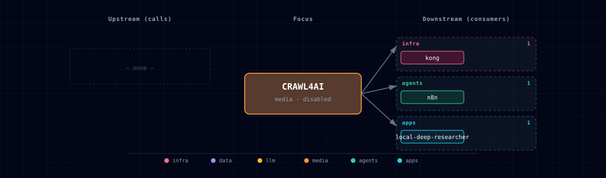

# Crawl4AI

## 1. Overview
Crawl4AI provides a local, token-protected web extraction API for pages that need browser-backed rendering before Atlas services can summarize, ingest, or index them. Atlas pins the Docker server image to `unclecode/crawl4ai:0.9.0` because the upstream Docker API is now secure-by-default and requires `CRAWL4AI_API_TOKEN` for every endpoint except `GET /health`.

## 2. Access
- Direct URL: `http://localhost:${CRAWL4AI_PORT}`
- Kong URL: `http://crawl4ai.localhost:${KONG_HTTP_PORT}`
- Internal URL: `http://crawl4ai:11235`

The Kong route is created only when `CRAWL4AI_SOURCE=container`. Kong adds the standard dashboard-user `basic-auth`, `acl`, and `cors` plugins, while Crawl4AI still requires `Authorization: Bearer ${CRAWL4AI_API_TOKEN}` for API calls.

## 3. Configuration
- `CRAWL4AI_SOURCE=disabled|container` controls whether the service runs.
- `CRAWL4AI_IMAGE=unclecode/crawl4ai:0.9.0` pins the upstream image.
- `CRAWL4AI_API_TOKEN` is generated by `./start.sh` and should be treated as a secret.
- `CRAWL4AI_TIMEOUT_SECONDS` and `CRAWL4AI_MAX_CHARS` tune Local Deep Researcher extraction calls.
- `CRAWL4AI_ALLOW_INTERNAL_URLS=false` is intentionally conservative; keep it disabled unless internal crawling is explicitly intended.

## 4. Architecture & wiring
Local Deep Researcher can use Crawl4AI when `LOCAL_DEEP_RESEARCHER_FULL_PAGE_MODE=crawl4ai`. That mode sets `FETCH_FULL_PAGE=true`, patches the upstream `fetch_raw_content()` helper at container startup, submits each URL to `POST /crawl`, polls `/task/{task_id}`, and keeps the returned markdown as `raw_content`. Failures return `None` for that URL so a single fetch problem does not abort the research loop.

n8n receives `CRAWL4AI_ENDPOINT` and `CRAWL4AI_API_TOKEN` for HTTP Request nodes. This slice does not add a custom n8n community node.

## 5. Dependencies & Integrations

### 5.1 Current — Upstream (this service calls)

_No upstream calls._

### 5.2 Current — Downstream (services that call this)

| Service | Category |
|---|---|
| n8n | agents |
| local-deep-researcher | apps |

### 5.3 Architecture diagram

[Open the interactive HTML diagram](./architecture.html) for a full-screen view.

### 5.4 Future — Missing pair integrations

_No high-confidence opportunities identified._

### 5.5 Future — Candidate new services

_No high-confidence opportunities identified._

### 5.6 Future — Unused features in this service

_No high-confidence opportunities identified._

## 6. MCP
Crawl4AI exposes MCP endpoints at `/mcp/sse`, `/mcp/ws`, and `/mcp/schema` on the same token-protected server. Atlas documents those endpoints here but Crawl4AI is not registered into the curated MCP package in this ticket; that belongs with the MCP package integration work so transport, auth, and service discovery stay consistent.

## 7. Troubleshooting
- `401 Unauthorized`: include `Authorization: Bearer ${CRAWL4AI_API_TOKEN}`.
- Kong route missing: confirm `CRAWL4AI_SOURCE=container` and rerun `./start.sh`.
- Local Deep Researcher still using snippets: set `LOCAL_DEEP_RESEARCHER_FULL_PAGE_MODE=crawl4ai`, ensure `CRAWL4AI_SOURCE=container`, and restart the stack.
