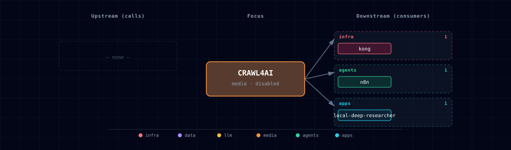

# 5.2.12. Crawl4AI

## 1. Overview
Crawl4AI is a local, token-protected web extraction API. It renders pages in a browser so Atlas services can summarize, ingest or index them. Atlas pins `unclecode/crawl4ai:0.9.0`. Its API is secure by default: every endpoint except `GET /health` requires `CRAWL4AI_API_TOKEN`.

## 2. Access
- Direct URL: `http://localhost:${CRAWL4AI_PORT}`
- Kong URL: `http://crawl4ai.localhost:${KONG_HTTP_PORT}`
- Internal URL: `http://crawl4ai:11235`

The Kong route exists only when `CRAWL4AI_SOURCE=container`. Kong adds the dashboard-user `basic-auth`, `acl` and `cors` plugins, and Crawl4AI still requires its bearer token. The two credentials cannot share the `Authorization` header. Through Kong, send the dashboard credential as `Proxy-Authorization`, which Kong's basic-auth reads. Run from the repository root:

```bash
set -a; . ./.env; set +a   # loads DASHBOARD_*, CRAWL4AI_API_TOKEN, KONG_HTTP_PORT
curl -H "Proxy-Authorization: Basic $(printf '%s:%s' "$DASHBOARD_USERNAME" "$DASHBOARD_PASSWORD" | base64)" \
     -H "Authorization: Bearer $CRAWL4AI_API_TOKEN" \
     http://crawl4ai.localhost:${KONG_HTTP_PORT}/health
```

## 3. Configuration
- `CRAWL4AI_SOURCE=disabled|container` controls whether the service runs.
- `CRAWL4AI_IMAGE=unclecode/crawl4ai:0.9.0` pins the upstream image.
- `CRAWL4AI_API_TOKEN` is generated by `./start.sh` and should be treated as a secret.
- `CRAWL4AI_TIMEOUT_SECONDS` and `CRAWL4AI_MAX_CHARS` tune Local Deep Researcher extraction calls.
- `CRAWL4AI_ALLOW_INTERNAL_URLS=false` blocks internal URLs. Keep it `false` unless you intend to crawl internal hosts.

## 4. Architecture & wiring
Local Deep Researcher uses Crawl4AI when `LOCAL_DEEP_RESEARCHER_FULL_PAGE_MODE=crawl4ai`. That mode sets `FETCH_FULL_PAGE=true` and patches the upstream `fetch_raw_content()` helper at container start.

- Each URL goes to one synchronous `POST /crawl` call.
- The first result's markdown, cut to `CRAWL4AI_MAX_CHARS`, becomes `raw_content`.
- A failed URL returns `None`, so one fetch problem does not abort the research loop.
- Startup fails if this mode is set while `CRAWL4AI_SOURCE` is not `container`.

n8n receives `CRAWL4AI_ENDPOINT` and `CRAWL4AI_API_TOKEN` for HTTP Request nodes. Atlas does not add a custom n8n community node for Crawl4AI.

## 5. Dependencies & Integrations

### 5.1. Current — Upstream (this service calls)

_No upstream calls._

### 5.2. Current — Downstream (services that call this)

| Service | Category |
|---|---|
| kong | infra |
| n8n | agents |
| local-deep-researcher | apps |

### 5.3. Architecture diagram



[Open the full-size diagram](./architecture.html) for a full-screen view.

### 5.4. Future — Missing pair integrations

_No high-confidence opportunities identified._

### 5.5. Future — Candidate new services

_No high-confidence opportunities identified._

### 5.6. Future — Unused features in this service

_No high-confidence opportunities identified._

## 6. MCP
Crawl4AI exposes MCP endpoints at `/mcp/sse`, `/mcp/ws` and `/mcp/schema` on the same token-protected server. Atlas does not register them in the curated MCP package.

## 7. Troubleshooting
- `401 Unauthorized`: include `Authorization: Bearer ${CRAWL4AI_API_TOKEN}`.
- Kong route missing: confirm `CRAWL4AI_SOURCE=container` and rerun `./start.sh`.
- Local Deep Researcher still using snippets: set `LOCAL_DEEP_RESEARCHER_FULL_PAGE_MODE=crawl4ai`, ensure `CRAWL4AI_SOURCE=container`, and restart the stack.

## 8. Capabilities & limitations

Support tier: **experimental** — Capability contract declared; no cited cold-start, workflow, or upgrade qualification run yet (evidence at `v0.1.0`).

| Capability | Status | Verification | Notes |
|---|---|---|---|
| Browser-backed web extraction | supported | tested | Atlas configures Crawl4AI's JavaScript-capable API and a Local Deep Researcher adapter that submits URLs and retains bounded markdown output. |
| Layered extraction-route authentication | supported | tested | The direct and internal APIs require the generated Crawl4AI bearer token, while the Kong alias adds dashboard Basic authentication and ACL; only health is public. |
| Conservative crawl isolation | supported | tested | Internal-URL access defaults off and the container is read-only with dropped capabilities, no-new-privileges, bounded processes, and ephemeral working directories. |
| Curated MCP package registration | not-supported | documented | The upstream server exposes MCP transports, but Atlas does not register them in its curated MCP package or provide transport-specific discovery. |
