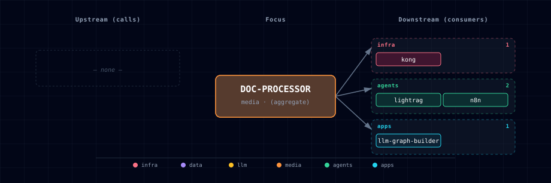

# 5.2.13. Document Processor Service

Document processing using IBM's Docling library, exposed through a bounded REST API.

## 1. Overview

The Document Processor service converts and extracts content from documents. It supports:

- **Multiple Backend Support**: Localhost (CPU/GPU) and Docker (NVIDIA GPU)
- **Advanced Processing**: Tables (DocLayNet + TableFormer), formulas, images, code blocks
- **GPU Acceleration**: 4.3x speedup for table extraction on NVIDIA GPUs
- **Multiple Formats**: PDF, DOCX, PPTX, HTML, Images, and more
- **RAG-Ready**: Structure-aware chunking for retrieval-augmented generation
- **Hardened Provider Boundary**: bearer authentication, bounded admission, and finite conversion deadlines

## 2. Quick Start

### 2.1. GPU Users (NVIDIA CUDA)

**Edit `.env`:**
```bash
DOC_PROCESSOR_SOURCE=docling-container-gpu
```

**Start the stack:**
```bash
./start.sh
```

### 2.2. Localhost Users (CPU or Native GPU)

**Step 1: Install dependencies**
```bash
cd services/docling/provider/localhost
uv sync
```

**Step 2: Start doc processor server on host (in separate terminal)**
```bash
cd services/docling/provider/localhost
uv run server.py
```

**Step 3: Start the stack with doc processor enabled**
```bash
./start.sh --doc-processor-source docling-localhost
```

**Note:**
- Document processor is **disabled by default** - you must explicitly enable it
- First run downloads models (~500MB) and may take 5-10 minutes
- Subsequent runs are instant
- Alternative: Edit `.env` and set `DOC_PROCESSOR_SOURCE=docling-localhost` for permanent enable

### 2.3. Disable Document Processor

```bash
DOC_PROCESSOR_SOURCE=disabled
```

## 3. Test the API

```bash
curl -X POST http://localhost:63051/v1/document/convert \
  -H "Authorization: Bearer ${DOCLING_API_TOKEN}" \
  -F "file=@document.pdf" \
  -F "output_format=markdown" \
  -F "use_ocr=auto" \
  -F "table_mode=accurate"
```

## 4. Configuration

### 4.1. Environment Variables

| Variable | Description | Default |
|----------|-------------|---------|
| `DOC_PROCESSOR_SOURCE` | Service source (docling-container-gpu, docling-localhost, disabled) | `disabled` |
| `DOC_PROCESSOR_PORT` | External port (container mode) | `63051` |
| `DOCLING_OUTPUT_FORMAT` | Output format (markdown, html, json, doctags) | `markdown` |
| `DOCLING_USE_OCR` | OCR mode (auto, always, never) | `auto` |
| `DOCLING_TABLE_MODE` | Table extraction (accurate, fast) | `accurate` |
| `DOCLING_API_TOKEN` | Auto-generated bearer credential for every route except `/health` | generated |
| `DOCLING_AUTH_MODE` | `required`, or `disabled` only as an explicit rollback | `required` |
| `DOCLING_CORS_ORIGINS` | Comma-separated browser origin allowlist; empty disables CORS | empty |
| `DOCLING_INFERENCE_TIMEOUT_SECONDS` | Conversion and lazy-load deadline; timeout returns `504` and terminates the process for restart | `900` |

### 4.2. GPU-Specific (NVIDIA Docker)

| Variable | Description | Default |
|----------|-------------|---------|
| `DOCLING_GPU_DEVICE` | Device type | `cuda` |
| `DOCLING_GPU_IMAGE` | Digest-pinned Docker base image | `pytorch/pytorch:2.13.0-cuda12.6-cudnn9-runtime@sha256:…` |
| `DOCLING_GPU_SCALE` | Container replicas (set by bootstrapper) | `0` |

### 4.3. Processing Options

| Variable | Description | Default |
|----------|-------------|---------|
| `DOCLING_MAX_FILE_SIZE` | Max file size in bytes | `52428800` (50MB) |
| `DOCLING_CONCURRENCY` | Maximum concurrent conversions per provider process | `1` |
| `DOCLING_ENABLE_FORMULAS` | Extract mathematical formulas | `true` |
| `DOCLING_ENABLE_CODE_BLOCKS` | Extract code blocks | `true` |
| `DOCLING_CHUNK_SIZE` | Default chunk size for RAG | `512` |
| `DOCLING_CHUNK_OVERLAP` | Default chunk overlap | `50` |

Request bodies are capped before multipart parsing at `DOCLING_MAX_FILE_SIZE` plus 1 MiB of framing/form overhead and must arrive within the total `DOCLING_UPLOAD_TIMEOUT_SECONDS` deadline (120 seconds by default). Uploads then stream to bounded temporary files and are rejected (`413`/`408`/`400`) if they exceed the file limit, time out, or are empty, so a failed conversion is never indexed as document content downstream. `DOCLING_CHUNK_OVERLAP` must stay non-negative and no more than half of `DOCLING_CHUNK_SIZE`; a single conversion is capped at 10,000 chunks. Full validation and status-code behavior lives in the provider's shared `api_server.py` module.

### 4.4. Localhost-Specific

| Variable | Description | Default |
|----------|-------------|---------|
| `DOCLING_LOCALHOST_PORT` | Local service port for the host-installed source variant. URL is derived as `http://host.docker.internal:${DOCLING_LOCALHOST_PORT}` at compose-render time. | `18159` |
| `DOCLING_LOCALHOST_BIND_HOST` | Native provider listen address | `127.0.0.1` |

Container mode publishes Docling on loopback by default. Set `HOST_BIND_IP=0.0.0.0:` only when deliberate external access is protected by a firewall or gateway. Native mode is also loopback-only by default; change `DOCLING_LOCALHOST_BIND_HOST` explicitly if remote clients must connect.

### 4.5. Provider boundary and LightRAG adapter

`GET /health` is public so Docker and service managers can probe readiness. Every other Docling route, including `/docs`, `/v1/models`, `POST /v1/document/convert`, and `POST /internal/lightrag/bundle`, requires `Authorization: Bearer ${DOCLING_API_TOKEN}` while `DOCLING_AUTH_MODE=required`. Atlas generates and preserves the token in `.env`; use a placeholder such as `<DOCLING_API_TOKEN>` in shared examples, never the generated value. Setting authentication to `disabled` is an explicit emergency/local rollback, not the normal operating mode. A wildcard CORS origin is rejected while authentication is required.

Conversion capacity is reserved before multipart parsing, so overload is rejected with `429` before a large body is accepted. Conversion and lazy model loading have a finite 900-second default deadline. If the deadline expires, the provider returns a generic `504` response and then exits with status 70 so Docker can restart it. A native deployment must be run under a service manager such as systemd or launchd with restart-on-failure; a bare `uv run server.py` process will remain stopped after a fatal timeout.

In-stack LightRAG does not receive the Docling provider token. Instead, `docling-lightrag-adapter` is placed only on the dedicated `docling-lightrag-network` with LightRAG and `docling-gpu`; it has no host port and does not join the backend network. The adapter authenticates upstream and implements LightRAG v1.5.4's exact four-route protocol: `POST /v1/convert/file/async` with multipart field `files`, `GET /v1/status/poll/{task_id}`, `GET /v1/result/{task_id}`, and `GET /health`. It reserves one of `DOCLING_ADAPTER_MAX_JOBS` slots before reading the upload, makes at most `DOCLING_ADAPTER_UPSTREAM_MAX_ATTEMPTS` upstream attempts after `429` responses, and caps streamed ZIP results at `DOCLING_ADAPTER_MAX_RESULT_BYTES`. Download, failure, cancellation, and `DOCLING_ADAPTER_RESULT_TTL_SECONDS` expiry (900 seconds by default) all trigger artifact cleanup; deletion is verified before the slot is released, and filesystem failures are logged and retried while the slot remains occupied so sensitive files cannot escape the admission bound. The adapter is enabled only for in-stack LightRAG plus an enabled Docling source; localhost LightRAG receives no isolated adapter endpoint.

## 5. API Reference

The service exposes a REST API: `POST /v1/document/convert` uploads a file and returns structured content (optionally chunked for RAG) with the request shown in §3; `GET /health` is the public readiness probe, returning `200` only when the selected provider's document converter can be imported and `503` otherwise; `GET /v1/models` lists the available conversion model configuration. The full request/response schema, all `convert` parameters (`output_format`, `use_ocr`, `table_mode`, `enable_chunking`, `chunk_size`, `chunk_overlap`), and response fields are served at `/docs` after bearer authentication.

## 6. Supported Formats

Documents: PDF, Microsoft Word (`.docx`/`.doc`), PowerPoint (`.pptx`/`.ppt`), Excel (`.xlsx`), and HTML. Images: PNG, JPEG, and TIFF. See §1 for the high-level format summary.

## 7. Output Formats

`output_format` selects the shape of the returned content: `markdown` (default) for clean, readable structure; `html` for semantic markup with styling preserved; `json` for structured output with detailed metadata; `doctags`, Docling's native format with full document structure. See §5's parameter list for the request field.

## 8. Integration

### 8.1. Open WebUI

Open WebUI is **not** auto-wired to the doc processor — it uses its own built-in
extraction, and `services/open-webui/service.yml` deliberately leaves
`DOCLING_ENDPOINT` commented out. To route Open WebUI's document extraction
through Docling, set `CONTENT_EXTRACTION_ENGINE=docling` (and the matching
Docling endpoint) manually.

### 8.2. n8n Workflows

Use HTTP Request node:

```
POST http://docling-gpu:8000/v1/document/convert
Authorization: Bearer {{$env.DOCLING_API_TOKEN}}
```

### 8.3. JupyterHub Notebooks

JupyterHub notebooks call the same `/v1/document/convert` endpoint with `requests`, passing `Authorization: Bearer ${DOCLING_API_TOKEN}` from the server-side notebook environment plus the conversion form fields. Do not print the token or persist it in notebook output.

### 8.4. Backend API

The backend service automatically exposes doc processor endpoints if available.

## 9. RAG Integration

Passing `enable_chunking=true` (with `chunk_size`/`chunk_overlap`) to `/v1/document/convert` returns pre-split `chunks`, each carrying `chunk_index`, `page_number`, `section_title`, and `chunk_type` metadata, ready to embed and store in a vector database such as Weaviate. A typical pipeline is: convert with chunking enabled → embed each chunk → store in Weaviate → retrieve top-k chunks for a query → pass them as context to an LLM. JupyterHub ships an example RAG notebook (`02_langchain_rag.ipynb`) demonstrating this end to end.

## 10. Source Modes

### 10.1. docling-container-gpu

Runs Docling in Docker container with NVIDIA GPU acceleration.

**Best for**: NVIDIA GPU users (RTX 3060+, A100, etc.)

**Resources**: ~2GB VRAM, CUDA 12.4+

**Advantages**:
- 4.3x faster table extraction
- Isolated environment
- No local installation needed

### 10.2. docling-localhost

Connects to Docling running on host machine.

**Best for**: Custom installations, development, CPU-only systems

**Setup**: Run Docling locally on port 18159

**Advantages**:
- Works on any platform (Mac, Linux, Windows)
- Can use native GPU drivers
- Easier debugging

### 10.3. disabled

No document processing service.

**Best for**: When document processing is not needed

**Impact**: Document upload/conversion features unavailable

## 11. Required Services

### 11.1. Required

- None (Document processor is optional for all services)

### 11.2. Optional (Can Use Doc Processor)

- **n8n**: Document processing workflows
- **backend**: Proxy document processing API endpoints
- **jupyterhub**: Notebooks with document processing capabilities

## 12. References

- [Docling Documentation](https://docling-project.github.io/docling/)
- [Docling GitHub](https://github.com/DS4SD/docling)
- [TableFormer Paper](https://arxiv.org/abs/2203.01017)
- [DocLayNet Dataset](https://github.com/DS4SD/DocLayNet)

## 13. Dependencies & Integrations

### 13.1. Current — Upstream (this service calls)

_No upstream calls._

### 13.2. Current — Downstream (services that call this)

| Service | Category |
|---|---|
| kong | infra |
| docling-lightrag-adapter | media |
| celery | agents |
| n8n | agents |
| backend | apps |
| jupyterhub | apps |

### 13.3. Architecture diagram



[Open the full-size diagram](./architecture.html) for a full-screen view.

### 13.4. Future — Missing pair integrations

- **doc-processor ↔ weaviate** — *Why:* closes the RAG loop — Docling already emits structure-aware chunks; persisting them straight into the stack's vector store removes per-consumer reimplementation. *Mechanism:* post-convert callback writes to `http://weaviate:8080/v1/objects` (upstream ships `rag_weaviate.ipynb` showing the pattern). *Effort:* medium. *Confidence:* high.
- **doc-processor ↔ minio** — *Why:* convert is slow (1-8s/page) and the same source is frequently re-requested. Caching `(sha256 → DocTags JSON)` in MinIO removes re-processing cost and gives stable S3 URIs that n8n/backend can reference. *Mechanism:* sidecar writes `s3://docling-cache/<sha>.json` via boto3 on convert; subsequent requests short-circuit. *Effort:* medium. *Confidence:* medium.
- **doc-processor ↔ n8n** — *Why:* README invites this pattern but no shipped workflow exists. A first-party "PDF → markdown → Weaviate" workflow makes RAG ingest a two-click setup. *Mechanism:* `services/n8n/init/workflows/docling-rag.json` doing HTTP Request → `POST http://docling-gpu:8000/v1/document/convert` → Weaviate node. *Effort:* small. *Confidence:* high.
- **doc-processor ↔ hermes** — *Why:* Hermes agents lack a "read this document" tool. Docling-MCP exposes convert/extract directly to MCP-capable runtimes. *Mechanism:* run `docling-mcp` as a streamable-HTTP MCP endpoint registered as a Hermes custom provider. *Effort:* medium. *Confidence:* medium.
- **doc-processor ↔ redis** — *Why:* response-cache the slow conversions in the stack's already-deployed cache. *Mechanism:* keyed on `sha256(file)+options`, TTL 24h, stored at `redis://redis:6379/2` with compressed JSON. *Effort:* small. *Confidence:* medium.

### 13.5. Future — Candidate new services

- **Docling MCP Server** ([details](../../docs/research/candidates/docling-mcp.md)) — *Headline:* first-party MCP wrapper exposing Docling convert/extract tools to agent runtimes. *Wires into:* hermes, openclaw, backend.
- **Apache Tika** ([details](../../docs/research/candidates/apache-tika.md)) — *Headline:* fallback extractor for legacy/exotic formats Docling doesn't cover (RTF, ODT, EML, MSG, ZIP). *Wires into:* n8n, backend.

### 13.6. Future — Unused features in this service

- **Audio/ASR pipeline** — *Why pursue:* Docling natively parses WAV/MP3/WebVTT to DoclingDocument with timestamps + sections, more structured than raw STT output. *Effort:* medium.
- **HybridChunker (tokenizer-aware)** — *Why pursue:* replaces naive `chunk_size`/`chunk_overlap` with embedding-model-aware boundaries, materially improving RAG recall. *Effort:* small.
- **DocTags lossless output** — *Why pursue:* enables round-trip editing and full-fidelity caching; we currently consume only markdown. *Effort:* small.
- **VLM pipeline (GraniteDocling 258M)** — *Why pursue:* better layout + chart understanding than the default DocLayNet/TableFormer pair, at low VRAM cost. *Effort:* medium.
- **Structured information extraction (beta)** — *Why pursue:* enables doc → entities/relations without a separate LLM step, feeding the proposed Neo4j integration. *Effort:* large.

## 14. Troubleshooting

### 14.1. Model Download Fails

**Problem**: First startup fails to download models

**Solution**:
1. Check Hugging Face Hub access
2. Set `HUGGING_FACE_HUB_TOKEN` if needed
3. Verify disk space (~1GB required)

### 14.2. Slow Processing

**Problem**: Document processing slower than expected

**Solution**:
- **GPU**: Check CUDA drivers (`nvidia-smi`)
- **GPU**: Use `table_mode=fast` for faster (less accurate) table extraction
- **Memory**: Ensure sufficient RAM/VRAM available

### 14.3. OCR Issues

**Problem**: Text not extracted from scanned PDFs

**Solution**:
- Set `use_ocr=always` to force OCR on all documents
- Check document quality (low-res images may fail)
- Verify OCR dependencies are installed

### 14.4. Container Won't Start

**Problem**: docling-gpu fails to start

**Solution**:
1. Check logs: `docker logs ${PROJECT_NAME}-docling-gpu`
2. Verify SOURCE setting matches your hardware
3. Ensure Docker has sufficient resources allocated
4. Check GPU drivers and CUDA version

### 14.5. File Size Errors

**Problem**: "File too large" error

**Solution**:
- Increase `DOCLING_MAX_FILE_SIZE` in `.env`
- Split large documents into smaller files
- Compress images in PDF documents

## 15. Capabilities & limitations

| Service | Capability | Status | Verification | Notes |
|---|---|---|---|---|
| docling | Docling document conversion sources | partial | tested | Atlas provides an NVIDIA GPU container and an existing-host endpoint, but no CPU container or Atlas-managed native Docling lifecycle. |
| docling | Structured extraction and bounded chunking | supported | tested | The provider converts documents once and renders structured markdown or JSON with validated OCR, table, formula, code, chunk-size, overlap, and total-chunk controls. |
| docling | Authenticated bounded provider API | partial | tested | Atlas-managed Docling routes require a generated bearer token and enforce upload, admission, and inference deadlines by default, but AUTH_MODE=disabled is an explicit rollback. |
| docling | Truthful model readiness | partial | tested | Health stays unavailable until converter construction succeeds, but it does not certify every lazily loaded model artifact needed by a later document. |
| docling | LightRAG conversion bundle | supported | tested | An authenticated internal route renders the JSON and Markdown bundle consumed by the isolated asynchronous LightRAG compatibility adapter. |
