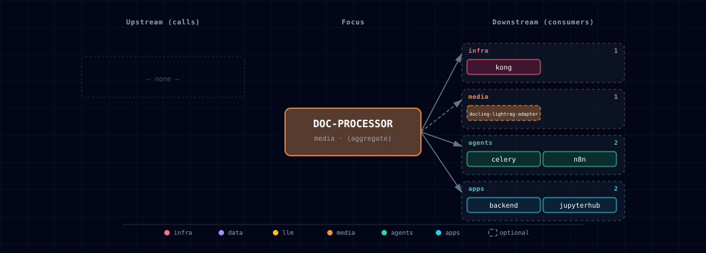

# 5.2.13. Document Processor Service

Document processing using IBM's Docling library, exposed through a bounded REST API.

## 1. Overview

The Document Processor service converts and extracts content from documents. It supports:

- **Multiple Backend Support**: Localhost (CPU/GPU) and Docker (NVIDIA GPU)
- **Advanced Processing**: Tables (DocLayNet + TableFormer), formulas, images, code blocks
- **GPU Acceleration**: NVIDIA GPU acceleration for layout and table models
- **Multiple Formats**: PDF, DOCX, PPTX, XLSX, HTML and images (§6)
- **RAG-Ready**: Structure-aware chunking for retrieval-augmented generation
- **Hardened Provider Boundary**: bearer authentication, bounded admission, and finite conversion deadlines

## 2. Quick Start

### 2.1. GPU Users (NVIDIA CUDA)

**Edit `.env`:**
```bash
DOC_PROCESSOR_SOURCE=docling-container-gpu
```

**Start the stack:**
```bash
./start.sh
```

### 2.2. Localhost Users (CPU or Native GPU)

**Step 1: Install dependencies**
```bash
cd services/docling/provider/localhost
uv sync
```

**Step 2: Start Atlas and generate the provider credential (repository root)**

```bash
cd ../../../..  # repository root
./start.sh --doc-processor-source docling-localhost
```

Atlas generates and preserves `DOCLING_API_TOKEN` in `.env`. The provider
loads that file once at process import, so this step must precede the host
process on a fresh checkout.

**Step 3: Start doc processor server on host (Terminal 2, repository root)**
```bash
cd services/docling/provider/localhost
uv run server.py
```

For long-lived use, run the provider under a service manager with restart-on-failure (§4.5).

**Note:**
- Document processor is **disabled by default** - you must explicitly enable it
- First run downloads Docling's layout and table models; allow several minutes
- Later runs reuse the downloaded models
- Alternative: Edit `.env` and set `DOC_PROCESSOR_SOURCE=docling-localhost` for permanent enable

### 2.3. Disable Document Processor

```bash
DOC_PROCESSOR_SOURCE=disabled
```

## 3. Test the API

Export the generated credential from the repository root, then use the port for
the selected source:

```bash
# repository root
export DOCLING_API_TOKEN="$(sed -n 's/^DOCLING_API_TOKEN=//p' .env)"

# Container GPU source
curl -X POST http://localhost:63051/v1/document/convert \
  -H "Authorization: Bearer ${DOCLING_API_TOKEN}" \
  -F "file=@document.pdf" \
  -F "output_format=markdown" \
  -F "use_ocr=auto" \
  -F "table_mode=accurate"

# Localhost source: use the native provider port instead
curl -X POST http://localhost:18159/v1/document/convert \
  -H "Authorization: Bearer ${DOCLING_API_TOKEN}" \
  -F "file=@document.pdf" \
  -F "output_format=markdown"
```

## 4. Configuration

### 4.1. Environment Variables

| Variable | Description | Default |
|----------|-------------|---------|
| `DOC_PROCESSOR_SOURCE` | Service source (docling-container-gpu, docling-localhost, disabled) | `disabled` |
| `DOC_PROCESSOR_PORT` | External port (container mode) | `63051` |
| `DOCLING_OUTPUT_FORMAT` | Output format (markdown, html, json, doctags) | `markdown` |
| `DOCLING_USE_OCR` | OCR mode (auto, always, never) | `auto` |
| `DOCLING_TABLE_MODE` | Table extraction (accurate, fast) | `accurate` |
| `DOCLING_API_TOKEN` | Auto-generated bearer credential for every route except `/health` | generated |
| `DOCLING_AUTH_MODE` | `required`, or `disabled` only as an explicit rollback | `required` |
| `DOCLING_CORS_ORIGINS` | Comma-separated browser origin allowlist; empty disables CORS | empty |
| `DOCLING_INFERENCE_TIMEOUT_SECONDS` | Conversion and lazy-load deadline; timeout returns `504` and terminates the process for restart | `900` |

### 4.2. GPU-Specific (NVIDIA Docker)

| Variable | Description | Default |
|----------|-------------|---------|
| `DOCLING_GPU_DEVICE` | Device type | `cuda` |
| `DOCLING_GPU_IMAGE` | Digest-pinned Docker base image | `pytorch/pytorch:2.13.0-cuda12.6-cudnn9-runtime@sha256:…` |
| `DOCLING_GPU_SCALE` | Container replicas (set by bootstrapper) | `0` |

### 4.3. Processing Options

| Variable | Description | Default |
|----------|-------------|---------|
| `DOCLING_MAX_FILE_SIZE` | Max file size in bytes | `52428800` (50MB) |
| `DOCLING_CONCURRENCY` | Maximum concurrent conversions per provider process | `1` |
| `DOCLING_ENABLE_FORMULAS` | Extract mathematical formulas | `true` |
| `DOCLING_ENABLE_CODE_BLOCKS` | Extract code blocks | `true` |
| `DOCLING_CHUNK_SIZE` | Default chunk size for RAG | `512` |
| `DOCLING_CHUNK_OVERLAP` | Default chunk overlap | `50` |

Upload limits:

- A request body may be at most `DOCLING_MAX_FILE_SIZE` plus 1 MiB of form framing. It must arrive within `DOCLING_UPLOAD_TIMEOUT_SECONDS` (default 120 s).
- Uploads stream to bounded temporary files. An oversized, late or empty upload is rejected with `413`, `408` or `400`, so a failed conversion is never indexed as content.
- `DOCLING_CHUNK_OVERLAP` must be non-negative and at most half of `DOCLING_CHUNK_SIZE`. One conversion returns at most 10,000 chunks.

Both providers enforce the same conversion fields: the container-GPU provider in `services/docling/provider/shared/api_server.py`, the localhost provider in its `server.py`.

### 4.4. Localhost-Specific

| Variable | Description | Default |
|----------|-------------|---------|
| `DOCLING_LOCALHOST_PORT` | Local service port for the host-installed source variant. URL is derived as `http://host.docker.internal:${DOCLING_LOCALHOST_PORT}` at compose-render time. | `18159` |
| `DOCLING_LOCALHOST_BIND_HOST` | Native provider listen address | `127.0.0.1` |

Container mode publishes Docling on loopback by default. Set `HOST_BIND_IP=0.0.0.0:` only when deliberate external access is protected by a firewall or gateway. Native mode is also loopback-only by default; change `DOCLING_LOCALHOST_BIND_HOST` explicitly if remote clients must connect.

### 4.5. Provider boundary and LightRAG adapter

**Authentication.** `GET /health` is public so Docker and service managers can probe readiness. While `DOCLING_AUTH_MODE=required`, every other route needs `Authorization: Bearer ${DOCLING_API_TOKEN}`. This includes `/docs`, `POST /v1/document/convert` and `POST /internal/lightrag/bundle`. `GET /v1/models` is exposed by the container-GPU provider only; the localhost provider does not advertise that route.

Atlas generates and preserves the token in `.env`. In shared examples, use a placeholder such as `<DOCLING_API_TOKEN>`, never the generated value. `DOCLING_AUTH_MODE=disabled` is an emergency or local rollback only. A wildcard CORS origin is rejected while authentication is required.

**Admission and deadlines.** Conversion capacity is reserved before multipart parsing, so overload gets `429` before a large body is read. Conversion and lazy model loading share one deadline, `DOCLING_INFERENCE_TIMEOUT_SECONDS` (default 900 s). On timeout the provider returns a generic `504` and exits with status 70, so Docker restarts it. Run a native provider under a service manager (systemd or launchd) with restart-on-failure. A bare `uv run server.py` stays stopped after a fatal timeout.

**LightRAG adapter.** In-stack LightRAG never receives the Docling token. It calls `docling-lightrag-adapter` on a private network, and the adapter authenticates to Docling. The adapter runs only when `LIGHTRAG_SOURCE=container` and a Docling source is enabled. See [Docling LightRAG Adapter](../docling-lightrag-adapter/README.md).

## 5. API Reference

Both providers expose `POST /v1/document/convert` and public `GET /health`; the response schema for health is source-specific. The container-GPU provider additionally exposes `GET /v1/models`. The selected provider's complete OpenAPI schema, including all conversion parameters (`output_format`, `use_ocr`, `table_mode`, `enable_chunking`, `chunk_size`, `chunk_overlap`), is served at `/docs` after bearer authentication.

## 6. Supported Formats

Both providers use Docling's default converter. Documents: PDF, Word (`.docx`), PowerPoint (`.pptx`), Excel (`.xlsx`) and HTML. Images: PNG, JPEG and TIFF.

Docling does not convert legacy Office (`.doc`, `.xls`, `.ppt`), `.epub`, mail, RTF, OpenDocument or archive files. Backend and Celery send these by file extension or content type straight to [Tika](../tika/README.md); this needs a Tika source. Tika is not a general fallback: other formats need a Docling source and fail when Docling is disabled or the conversion fails.

## 7. Output Formats

`output_format` selects the shape of the returned content (request field: see §5):

- `markdown` (default): readable structure.
- `html`: semantic markup with styling preserved.
- `json`: structured output with detailed metadata.
- `doctags`: Docling's native format with full document structure.

## 8. Integration

### 8.1. Open WebUI

Open WebUI is **not** wired to the Document Processor. It uses its own built-in
document extraction, and Atlas sets no Open WebUI Docling variable. Open WebUI's
own `docling` extraction engine expects the docling-serve API. The Atlas
provider serves a different API (`/v1/document/convert` with a bearer token),
so pointing that engine at it is not a supported configuration.

### 8.2. n8n Workflows

Use HTTP Request node:

```
POST {{$env.DOCLING_ENDPOINT}}/v1/document/convert
Authorization: Bearer {{$env.DOCLING_API_TOKEN}}
```

### 8.3. JupyterHub Notebooks

JupyterHub notebooks call the same `/v1/document/convert` endpoint with `requests`, passing `Authorization: Bearer ${DOCLING_API_TOKEN}` from the server-side notebook environment plus the conversion form fields. Do not print the token or persist it in notebook output.

### 8.4. Backend API

The backend's authenticated `POST /documents/extract` sends long-tail formats (§6) to Tika and every other upload to Docling. It returns `503` when the selected extractor is disabled. It does not proxy the Docling API.

## 9. RAG Integration

With `enable_chunking=true` (plus `chunk_size` and `chunk_overlap`), `/v1/document/convert` returns pre-split `chunks`. Each chunk carries `chunk_index`, `page_number`, `section_title` and `chunk_type` metadata. A typical pipeline: convert with chunking → embed each chunk → store in Weaviate → retrieve top-k chunks → pass them to an LLM as context.

JupyterHub notebooks receive `DOCLING_ENDPOINT` and `DOCLING_API_TOKEN`; no shipped notebook calls Docling yet.

## 10. Source Modes

### 10.1. docling-container-gpu

Runs Docling in Docker container with NVIDIA GPU acceleration.

**Best for**: hosts with an NVIDIA GPU

**Resources**: NVIDIA driver that supports CUDA 12.6 (the base image is `pytorch/pytorch:2.13.0-cuda12.6-cudnn9-runtime`)

**Advantages**:
- GPU-accelerated layout and table models
- Isolated environment
- No local installation needed

### 10.2. docling-localhost

Connects to Docling running on host machine.

**Best for**: Custom installations, development, CPU-only systems

**Setup**: Run the Atlas Docling provider on the host, port 18159 by default (§2.2)

**Advantages**:
- Works on any platform (Mac, Linux, Windows)
- Can use native GPU drivers
- Easier debugging

### 10.3. disabled

No document processing service.

**Best for**: When document processing is not needed

**Impact**: Document upload/conversion features unavailable

## 11. Required Services

No service requires the Document Processor. For the services that call it, see §13.2.

## 12. References

- [Docling Documentation](https://docling-project.github.io/docling/)
- [Docling GitHub](https://github.com/docling-project/docling)
- [TableFormer Paper](https://arxiv.org/abs/2203.01017)
- [DocLayNet Dataset](https://github.com/DS4SD/DocLayNet)

## 13. Dependencies & Integrations

### 13.1. Current — Upstream (this service calls)

_No upstream calls._

### 13.2. Current — Downstream (services that call this)

| Service | Category | Status |
|---|---|---|
| kong | infra | current |
| docling-lightrag-adapter | media | optional: DOC_PROCESSOR_SOURCE=docling-container-gpu or docling-localhost |
| celery | agents | current |
| n8n | agents | current |
| backend | apps | current |
| jupyterhub | apps | current |

### 13.3. Architecture diagram



[Open the full-size diagram](./architecture.html) for a full-screen view.

### 13.4. Future — Missing pair integrations

- **doc-processor ↔ weaviate** — *Why:* closes the RAG loop — Docling already emits structure-aware chunks; persisting them straight into the stack's vector store removes per-consumer reimplementation. *Mechanism:* post-convert callback writes to `http://weaviate:8080/v1/objects` (upstream ships `rag_weaviate.ipynb` showing the pattern). *Effort:* medium. *Confidence:* high.
- **doc-processor ↔ minio** — *Why:* conversion is slow and the same source is frequently re-requested. Caching `(sha256 → DocTags JSON)` in MinIO removes re-processing cost and gives stable S3 URIs that n8n/backend can reference. *Mechanism:* sidecar writes `s3://docling-cache/<sha>.json` via boto3 on convert; subsequent requests short-circuit. *Effort:* medium. *Confidence:* medium.
- **doc-processor ↔ n8n** — *Why:* README invites this pattern but no shipped workflow exists. A first-party "PDF → markdown → Weaviate" workflow makes RAG ingest a two-click setup. *Mechanism:* `services/n8n/init/workflows/docling-rag.json` doing HTTP Request → `POST http://docling-gpu:8000/v1/document/convert` → Weaviate node. *Effort:* small. *Confidence:* high.
- **doc-processor ↔ hermes** — *Why:* Hermes agents lack a "read this document" tool. Docling-MCP exposes convert/extract directly to MCP-capable runtimes. *Mechanism:* run `docling-mcp` as a streamable-HTTP MCP endpoint registered as a Hermes custom provider. *Effort:* medium. *Confidence:* medium.
- **doc-processor ↔ redis** — *Why:* response-cache the slow conversions in the stack's already-deployed cache. *Mechanism:* keyed on `sha256(file)+options`, TTL 24h, stored at `redis://redis:6379/2` with compressed JSON. *Effort:* small. *Confidence:* medium.

### 13.5. Future — Candidate new services

- **Docling MCP Server** ([details](https://github.com/thekaveh/atlas/blob/main/docs/research/candidates/docling-mcp.md)) — *Headline:* first-party MCP wrapper exposing Docling convert/extract tools to agent runtimes. *Wires into:* hermes, openclaw, backend.

### 13.6. Future — Unused features in this service

- **Audio/ASR pipeline** — *Why pursue:* Docling natively parses WAV/MP3/WebVTT to DoclingDocument with timestamps + sections, more structured than raw STT output. *Effort:* medium.
- **HybridChunker (tokenizer-aware)** — *Why pursue:* replaces naive `chunk_size`/`chunk_overlap` with embedding-model-aware boundaries, materially improving RAG recall. *Effort:* small.
- **DocTags lossless output** — *Why pursue:* enables round-trip editing and full-fidelity caching; we currently consume only markdown. *Effort:* small.
- **VLM pipeline (GraniteDocling 258M)** — *Why pursue:* better layout + chart understanding than the default DocLayNet/TableFormer pair, at low VRAM cost. *Effort:* medium.
- **Structured information extraction (beta)** — *Why pursue:* enables doc → entities/relations without a separate LLM step, feeding the proposed Neo4j integration. *Effort:* large.

## 14. Troubleshooting

### 14.1. Model Download Fails

**Problem**: First startup fails to download models

**Solution**:
1. Check Hugging Face Hub access
2. Set `HUGGING_FACE_HUB_TOKEN` if needed
3. Verify free disk space for the Hugging Face model cache

### 14.2. Slow Processing

**Problem**: Document processing slower than expected

**Solution**:
- **GPU**: Check CUDA drivers (`nvidia-smi`)
- **GPU**: Use `table_mode=fast` for faster (less accurate) table extraction
- **Memory**: Ensure sufficient RAM/VRAM available

### 14.3. OCR Issues

**Problem**: Text not extracted from scanned PDFs

**Solution**:
- Set `use_ocr=always` to force OCR on all documents
- Check document quality (low-res images may fail)
- Verify OCR dependencies are installed

### 14.4. Container Won't Start

**Problem**: docling-gpu fails to start

**Solution**:
1. Check logs: `docker logs ${PROJECT_NAME}-docling-gpu`
2. Verify SOURCE setting matches your hardware
3. Ensure Docker has sufficient resources allocated
4. Check GPU drivers and CUDA version

### 14.5. File Size Errors

**Problem**: "File too large" error

**Solution**:
- Increase `DOCLING_MAX_FILE_SIZE` in `.env`
- Split large documents into smaller files
- Compress images in PDF documents

## 15. Capabilities & limitations

`docling` — Support tier: **experimental** — Capability contract declared; no cited cold-start, workflow, or upgrade qualification run yet (evidence at `v0.1.0`).

| Service | Capability | Status | Verification | Notes |
|---|---|---|---|---|
| docling | Docling document conversion sources | partial | tested | Atlas provides an NVIDIA GPU container and an existing-host endpoint, but no CPU container or Atlas-managed native Docling lifecycle. |
| docling | Structured extraction and bounded chunking | supported | tested | The provider converts documents once and renders structured markdown or JSON with validated OCR, table, formula, code, chunk-size, overlap, and total-chunk controls. |
| docling | Authenticated bounded provider API | partial | tested | Atlas-managed Docling routes require a generated bearer token and enforce upload, admission, and inference deadlines by default, but AUTH_MODE=disabled is an explicit rollback. |
| docling | Truthful model readiness | partial | tested | Health stays unavailable until converter construction succeeds, but it does not certify every lazily loaded model artifact needed by a later document. |
| docling | LightRAG conversion bundle | supported | tested | An authenticated internal route renders the JSON and Markdown bundle consumed by the isolated asynchronous LightRAG compatibility adapter. |
