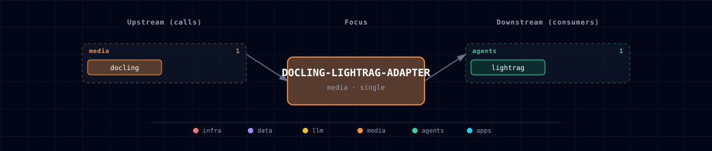

# 5.2.15. Docling LightRAG Adapter

Logical documentation for the isolated compatibility container owned by `services/docling/compose.yml`.

## 1. Overview

LightRAG v1.5.4 expects an asynchronous submit, poll, and result-download document parser. Atlas Docling exposes a synchronous authenticated conversion API. `docling-lightrag-adapter` bridges those protocols without giving LightRAG the Docling provider credential.

## 2. Runtime boundary

The adapter runs only when `LIGHTRAG_SOURCE=container` and a Docling source is enabled. It, LightRAG, and `docling-gpu` share the dedicated `docling-lightrag-network`; the adapter has no published host port and does not join the backend network. LightRAG receives only the adapter URL. The adapter alone receives `DOCLING_API_TOKEN` and uses it for the protected upstream bundle request.

The container is built from the pinned adapter lock, runs as a non-root user, and does not load document models. Container ownership, derived scale, and source permutations remain in the Docling manifest and compose fragment.

## 3. API contract

The adapter implements the exact LightRAG v1.5.4 parser routes:

- `POST /v1/convert/file/async` submits one document in multipart field `files`.
- `GET /v1/status/poll/{task_id}` polls job state.
- `GET /v1/result/{task_id}` downloads the completed artifact.
- `GET /health` reports adapter readiness.

It reserves one of `DOCLING_ADAPTER_MAX_JOBS` slots before multipart parsing, returning `429` before reading an upload when saturated. Upstream Docling `429` responses receive at most `DOCLING_ADAPTER_UPSTREAM_MAX_ATTEMPTS` total attempts (default `3`).

## 4. Artifact lifecycle

Job identifiers are random and do not disclose filenames or sequence. Docling ZIP responses stream directly to temporary storage with disk writes offloaded from the API event loop and fail if they exceed `DOCLING_ADAPTER_MAX_RESULT_BYTES` (100 MiB by default), avoiding an unbounded in-memory result. Downloads stream from disk without reading under the registry lock. Temporary uploads and results are removed after successful download, interrupted response transmission, failure, cancellation, or expiration. The bounded 512 MiB tmpfs covers two default jobs at their 50 MiB upload and 100 MiB result limits plus multipart and filesystem headroom. Completed results expire after `DOCLING_ADAPTER_RESULT_TTL_SECONDS` (900 seconds by default); clients must resubmit after expiry. Public failures are generic and do not expose provider details or document content, while server logs retain only the task identifier and exception type.

## 5. Dependencies & Integrations

### 5.1. Current — Upstream (this service calls)

| Service | Category |
|---|---|
| docling | media |

### 5.2. Current — Downstream (services that call this)

| Service | Category |
|---|---|
| lightrag | agents |

### 5.3. Architecture diagram

[Open the full-size diagram](./architecture.html) for a full-screen view.

### 5.4. Future — Missing pair integrations

None planned. This adapter is deliberately narrow.

### 5.5. Future — Candidate new services

None.

### 5.6. Future — Unused features in this service

None. Broader conversion behavior belongs in Docling, not this protocol adapter.

## 6. Troubleshooting

- A submit returning `429` means all adapter job slots are occupied; wait for a job to finish or expire before retrying.
- A result returning expired/not found means the TTL elapsed or the artifact was already downloaded; submit the original document again.
- An empty adapter endpoint is expected for localhost LightRAG and whenever either LightRAG or Docling is disabled.
