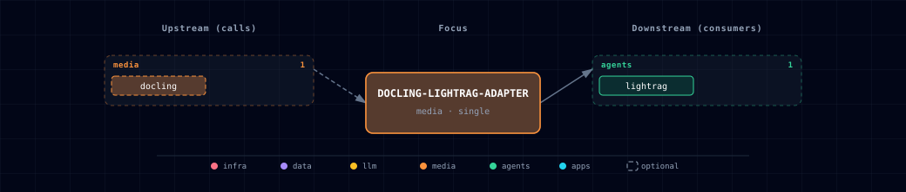

# 5.2.15. Docling LightRAG Adapter

Logical documentation for the isolated compatibility container owned by `services/docling/compose.yml`.

## 1. Overview

LightRAG v1.5.4 expects an asynchronous submit, poll, and result-download document parser. Atlas Docling exposes a synchronous authenticated conversion API. `docling-lightrag-adapter` bridges those protocols without giving LightRAG the Docling provider credential.

## 2. Runtime boundary

The adapter runs only when `LIGHTRAG_SOURCE=container` and a Docling source is enabled. It, LightRAG, and `docling-gpu` share the dedicated `docling-lightrag-network`; the adapter has no published host port and does not join the backend network. LightRAG receives only the adapter URL. The adapter alone receives `DOCLING_API_TOKEN` and uses it for the protected upstream bundle request.

The container is built from the pinned adapter lock, runs as a non-root user, and does not load document models. Container ownership, derived scale, and source permutations remain in the Docling manifest and compose fragment.

## 3. API contract

The adapter implements the exact LightRAG v1.5.4 parser routes:

- `POST /v1/convert/file/async` submits one document in multipart field `files`.
- `GET /v1/status/poll/{task_id}` polls job state.
- `GET /v1/result/{task_id}` downloads the completed artifact.
- `GET /health` reports adapter readiness.

It reserves one of `DOCLING_ADAPTER_MAX_JOBS` slots before multipart parsing, returning `429` before reading an upload when saturated. Upstream Docling `429` responses receive at most `DOCLING_ADAPTER_UPSTREAM_MAX_ATTEMPTS` total attempts (default `3`).

## 4. Artifact lifecycle

- Job IDs are random and do not reveal filenames or order.
- A request body may be at most the upload limit (`DOCLING_MAX_FILE_SIZE`) plus 1 MiB of form framing. It must arrive within `DOCLING_UPLOAD_TIMEOUT_SECONDS` (default 120 s). Oversized or slow uploads therefore cannot hold storage or a job slot.
- Docling's ZIP result streams to temporary storage, with disk writes off the API event loop. It fails above `DOCLING_ADAPTER_MAX_RESULT_BYTES` (default 100 MiB), so no result is held in memory.
- A download sends the whole archive once. It ignores Range headers and does not advertise byte-range support.
- The job slot stays leased until the transfer ends or `DOCLING_ADAPTER_DOWNLOAD_TIMEOUT_SECONDS` (default 300 s) passes.
- Uploads and results are deleted after a download, an interrupted or timed-out transfer, a failure, a cancellation or expiry.
- The slot is released only after the files are deleted. A failed deletion is logged and retried while the slot stays occupied, so files cannot escape the admission bound.
- Unclaimed results expire after `DOCLING_ADAPTER_RESULT_TTL_SECONDS` (default 900 s). Resubmit after that.
- `DOCLING_ADAPTER_TMPFS_SIZE` defaults to 512 MiB: two default jobs at 50 MiB upload and 100 MiB result, plus 64 MiB of staging. When you change limits, set it to at least `MAX_JOBS × max(2 × MAX_FILE_SIZE + 1 MiB, MAX_FILE_SIZE + MAX_RESULT_BYTES) + 64 MiB`. Startup checks the free space and fails if it is too small.
- Error responses are generic and expose no provider details or document content. Logs keep only the task ID and the exception type.

## 5. Dependencies & Integrations

### 5.1. Current — Upstream (this service calls)

| Service | Category | Status |
|---|---|---|
| docling | media | optional: DOC_PROCESSOR_SOURCE=docling-container-gpu or docling-localhost |

### 5.2. Current — Downstream (services that call this)

| Service | Category |
|---|---|
| lightrag | agents |

### 5.3. Architecture diagram

[Open the full-size diagram](./architecture.html) for a full-screen view.

### 5.4. Future — Missing pair integrations

None planned. This adapter is deliberately narrow.

### 5.5. Future — Candidate new services

None.

### 5.6. Future — Unused features in this service

None. Broader conversion behavior belongs in Docling, not this protocol adapter.

## 6. Troubleshooting

- A submit returning `429` means all adapter job slots are occupied. To free a slot, retrieve a completed result, or wait for a transfer to end or an unclaimed result to expire. Failed and cancelled jobs release their slots automatically.
- A result returning expired/not found means the TTL elapsed or the artifact was already downloaded; submit the original document again.
- An empty adapter endpoint is expected for localhost LightRAG and whenever either LightRAG or Docling is disabled.

## 7. Capabilities & limitations

Support tier: **experimental** — Capability contract declared; no cited cold-start, workflow, or upgrade qualification run yet (evidence at `v0.1.0`).

| Capability | Status | Verification | Notes |
|---|---|---|---|
| LightRAG asynchronous parser compatibility | supported | tested | The logical service exposes LightRAG v1.5.4 submit, poll, and one-shot result routes while delegating one authenticated synchronous conversion to Docling. |
| Docling credential isolation | supported | tested | LightRAG receives only the internal adapter URL; on that isolated boundary, the adapter alone receives the Docling bearer token and authenticates the upstream call. There is no host-published adapter port. |
| Bounded ephemeral adapter jobs | supported | tested | Admission, upload time, upstream retries, result size, download time, temporary capacity, cleanup, and completed-result TTL are explicitly bounded. |
| Source-coupled adapter availability | partial | tested | The adapter runs only for container LightRAG with an enabled Docling source; localhost or disabled LightRAG and disabled Docling intentionally resolve no adapter endpoint. |
