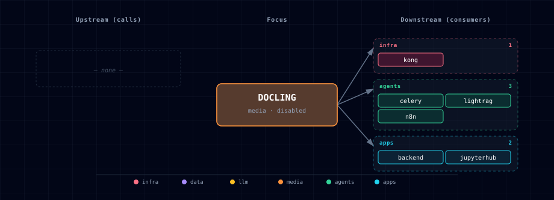

# 5.2.14. Docling (Document Processor engine)

Docling is the engine behind the **Document Processor** role selectable via
`DOC_PROCESSOR_SOURCE`. It is documented under the **Document Processor**
aggregator rather than as a standalone service, because the user-facing role is
"pick a doc-processing engine" — not "pick Docling":

→ See [services/doc-processor/README.md](../doc-processor/README.md) for the
full user-facing description, source-variant table, configuration reference,
and integration notes.

## 1. Engine quick reference

- **Image (GPU):** `pytorch/pytorch:2.13.0-cuda12.6-cudnn9-runtime` (digest-pinned; used as
  `BASE_IMAGE` in the GPU provider Dockerfile); the provider requirements keep
  `torch==2.13.0` and its matching `torchvision==0.28.0` patch pair.
- **License:** MIT (IBM)
- **Activation:** `DOC_PROCESSOR_SOURCE=docling-container-gpu` (or
  `docling-localhost` for host-installed Docling)
- **In-container port:** 8000
- **Host port:** `${DOC_PROCESSOR_PORT}` (computed from `BASE_PORT` by the
  bootstrapper)
- **Readiness:** `GET /health` starts configured converter construction off the
  API event loop and returns `503 starting` until it succeeds. Invalid pipeline
  or device configuration returns `503 unavailable`; health reports the
  converter only and does not claim lazily loaded model artifacts.

The manifest (`service.yml`) and compose fragment (`compose.yml`) in this folder
are the bootstrapper's source of truth for those values; treat this README as a
pointer, not a duplicate of the aggregator doc.

## 2. Dependencies & Integrations

### 2.1. Current — Upstream (this service calls)

_No upstream calls._

### 2.2. Current — Downstream (services that call this)

| Service | Category |
|---|---|
| kong | infra |
| docling-lightrag-adapter | media |
| celery | agents |
| n8n | agents |
| backend | apps |
| jupyterhub | apps |

### 2.3. Architecture diagram

[Open the full-size diagram](./architecture.html) for a full-screen view.

### 2.4. Future — Missing pair integrations

_No high-confidence opportunities identified._

### 2.5. Future — Candidate new services

_No high-confidence opportunities identified._

### 2.6. Future — Unused features in this service

_No high-confidence opportunities identified._

## 3. Capabilities & limitations

| Capability | Status | Verification | Notes |
|---|---|---|---|
| Docling document conversion sources | partial | tested | Atlas provides an NVIDIA GPU container and an existing-host endpoint, but no CPU container or Atlas-managed native Docling lifecycle. |
| Structured extraction and bounded chunking | supported | tested | The provider converts documents once and renders structured markdown or JSON with validated OCR, table, formula, code, chunk-size, overlap, and total-chunk controls. |
| Authenticated bounded provider API | partial | tested | Atlas-managed Docling routes require a generated bearer token and enforce upload, admission, and inference deadlines by default, but AUTH_MODE=disabled is an explicit rollback. |
| Truthful model readiness | partial | tested | Health stays unavailable until converter construction succeeds, but it does not certify every lazily loaded model artifact needed by a later document. |
| LightRAG conversion bundle | supported | tested | An authenticated internal route renders the JSON and Markdown bundle consumed by the isolated asynchronous LightRAG compatibility adapter. |
