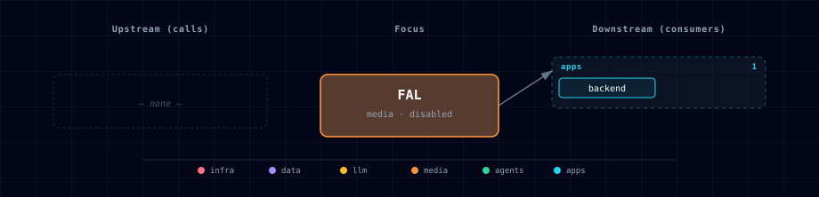

# FAL Cloud Media

## 1. Overview

FAL Cloud Media is a virtual media provider for fal.ai's hosted generation APIs. It adds a cloud path for users who want Atlas creative generation without running local ComfyUI CPU/GPU containers or a host ComfyUI process.

Atlas does not run a FAL container. The backend reads `FAL_SOURCE`, `FAL_API_KEY`, and model defaults from the environment, then routes hosted image-generation operations to the fal.ai Python client when `FAL_SOURCE=enabled`.

## 2. Access

| Surface | URL or command | Notes |
|---|---|---|
| Atlas SOURCE | `FAL_SOURCE=disabled` | Default. No FAL calls are made and no API key is required. |
| FAL provider | `FAL_SOURCE=enabled` | Enables FAL-backed hosted media generation through the backend. |
| Media gateway (image) | `POST /media/generate` with `{"modality":"image"}` | Submits FAL text-to-image operations and returns an operation id. |
| Media gateway (image→3D) | `POST /media/generate` with `{"modality":"image_to_3d"}` | Submits a hosted image→3D operation (Hunyuan3D / TRELLIS / Tripo / Rodin / Pixal3D) and returns an operation id. |
| Operation polling | `GET /media/operations/{operation_id}` | Polls provider status and returns normalized artifacts (the GLB is the primary `artifact_url`), cost, license, and provenance. |
| Spend read | `GET /media/spend?consumer=<c>` | Scoped spend read (committed/reserved totals + rows for one consumer). Empty unless `MEDIA_BUDGET_ENABLED=true`. |
| Compatibility route | `POST /comfyui/generate` | Uses FAL for simple image generation when `FAL_SOURCE=enabled`; otherwise preserves the existing ComfyUI path. |
| Kong | No direct route | FAL is a server-side provider only. The API key stays in the backend environment. |

Enable from the CLI with:

```bash
./start.sh --fal-source enabled --fal-api-key <your-fal-key>
```

**Interactive wizard (#517).** FAL is a paid cloud provider, so — like the OpenAI / Anthropic / OpenRouter cloud LLM keys — the wizard prompts for it with a **masked API-token step** placed right after the ComfyUI step (both are `media`), rather than a plain enabled/disabled tile: **enter a key to enable fal, or leave it blank to keep it disabled.** Entering a key sets `FAL_SOURCE=enabled` + `FAL_API_KEY`; a blank / `clear` leaves (or sets) `FAL_SOURCE=disabled` and wipes the key. This closes a footgun — it is no longer possible to enable fal in the wizard without a key (which would fail the backend guard `FAL_SOURCE=enabled requires FAL_API_KEY`). FAL still appears in the services grid as a media service.

## 3. Configuration

| Variable | Default | Purpose |
|---|---:|---|
| `FAL_SOURCE` | `disabled` | Enables or disables the FAL provider. |
| `FAL_API_KEY` | empty | Required when `FAL_SOURCE=enabled`; not required when disabled. |
| `FAL_MODEL` | `fal-ai/flux/dev` | Default FAL model endpoint used by the media gateway for text-to-image generation. |
| `FAL_IMAGE_TO_3D_MODEL` | `fal-ai/trellis` | Default endpoint id for the `image_to_3d` modality. Must resolve to a curated registry entry (see below); TRELLIS is the MIT-licensed default. |
| `FAL_MODEL_LICENSE` | `fal/provider-terms` | License or terms marker returned in normalized media operation responses when provider-specific model licensing is not more specific. For `image_to_3d`, the per-model registry license overrides this. |
| `BACKEND_MEDIA_INPUT_BUCKET` | `default` | Atlas storage bucket the gateway hosts `image_to_3d` inputs in (under the `media-inputs/` prefix) when a provider rejects data-URI inputs. Declared on the backend service. |
| `BACKEND_MEDIA_INPUT_PUBLIC_BASE_URL` | empty | Optional public base URL for hosted inputs (`<base>/<bucket>/<key>`) so the provider's cloud can fetch them through a reachable ingress; empty falls back to the storage client's public URL. Declared on the backend service. |
| `FAL_TIMEOUT_SECONDS` | `120` | Backend timeout budget for FAL media submit/poll operations and the compatibility route. |
| `FAL_OUTPUT_FORMAT` | `jpeg` | Requested image format for compatible models. |
| `FAL_ENABLE_SAFETY_CHECKER` | `true` | Requests the provider-side safety checker for compatible models. |

## 4. Architecture & Wiring

Atlas models FAL as a virtual media service:

- Track membership: `gen-ai-creative` and `all`.
- Service category: `media`.
- Source values: `disabled` and `enabled`.
- Runtime ownership: no compose service, no container, no volume, and no Kong route.
- Backend integration: `POST /media/generate` submits hosted image operations to FAL and `GET /media/operations/{operation_id}` polls provider status. `POST /comfyui/generate` still chooses FAL first when `FAL_SOURCE=enabled`, keeping existing Open WebUI and n8n callers compatible.
- ComfyUI-specific routes: workflow execution, queue inspection, history lookup, cancellation, and image file proxying remain ComfyUI-specific.
- Secret handling: `FAL_API_KEY` is server-side only. The backend maps it to `FAL_KEY` for the fal.ai Python client and never exposes it to browser clients.
- Operation state: the first media-gateway pass stores submitted operation metadata in the backend process. Restart-durable operation storage, media spend limits, and cost ledgers remain follow-up work.

### 4.1 Image→3D modality

`{"modality":"image_to_3d","provider":"fal","model":<id>,"input":{"image":<url-or-data-uri>}}` submits a hosted image→3D job. The backend owns the provider quirks centrally so consumers do not re-discover them:

- **Curated registry.** `model` resolves against a curated registry (canonical vendor endpoint ids only — `"Prism"` maps to the canonical Tripo id). Aliases and case are tolerated; an unknown id returns HTTP 400 listing the supported ids. Omitting `model` uses `FAL_IMAGE_TO_3D_MODEL`.
- **Normalized output.** On success the GLB is the primary `artifact_url` regardless of which response key the provider used (`model_glb` / `model_mesh` / `model` / `mesh` / `pbr_model` / `base_model`). `artifacts[]` carries the GLB plus any preview/texture entries, each tagged with a `role` and `source_key`. `license` and estimated `cost_usd` come from the registry entry (`provenance.cost_basis = "estimated"`), and unrecognized provider fields are preserved under `provenance.provider_fields`.
- **Input hosting.** Providers that reject data-URI inputs (Tripo) trigger an upload to Atlas storage (`BACKEND_MEDIA_INPUT_BUCKET`, `media-inputs/` prefix); the returned URL is substituted before submission. Remote `http(s)` inputs pass through untouched. Set `BACKEND_MEDIA_INPUT_PUBLIC_BASE_URL` when the provider's cloud must reach the hosted object through a public ingress.
- **Transparent-input conditioning.** Transparent inline inputs are composited onto a neutral studio background with ~35% padding before submission (fal Hunyuan3D v2 raises `IndexError` on tight transparent crops). Conditioning applies to `data:` inputs; remote URLs are not fetched.
- **Downstream post-processing is optional.** A successful GLB (`artifact_url` + `license`/`provenance`) is ready for the asset-worker bake contract (#343 / asset-baker `/assets/bake/ref`), but the gateway never invokes it automatically.

| Endpoint id | Family | License | Commercial use | Input hosting |
|---|---|---|---|---|
| `fal-ai/trellis` | TRELLIS | MIT | yes | data URI ok |
| `fal-ai/hunyuan3d/v2` | Hunyuan3D | tencent-hunyuan-community | yes via fal (self-host Tencent-gated, EU/UK/KR excluded) | data URI ok |
| `fal-ai/tripo3d/tripo/v2.5/image-to-3d` | Tripo | tripo-commercial-gated | gated to Pro/Enterprise | **requires hosted URL** |
| `fal-ai/hyper3d/rodin` | Rodin (Hyper3D) | hyper3d-provider-terms | conditional | data URI ok |
| `fal-ai/pixal3d/image-to-3d` | Pixal3D | pixal3d-provider-terms | conditional | data URI ok (endpoint id unverified) |

### 4.2 Spend ledger & budgets

Hosted media generation has no LiteLLM-style spend accounting of its own, so the media gateway carries its own cost ledger + budget engine — **disabled by default** (`MEDIA_BUDGET_ENABLED=false`), backend-owned, no new service SOURCE. When enabled:

- **Every generation is recorded.** A reservation is created *before* the provider is invoked with the estimated cost (from the image→3D registry; text-to-image has no per-model price today), then reconciled to the final cost on completion. Rows are immutable per operation (`consumer`/`project`, provider/model, estimated + final cost, currency, pricing timestamp, artifact refs, status) in `public.media_spend_ledger`.
- **Budget cap hard-stop.** Over-limit submissions return `402` **before** any provider call or storage write. Caps come from `MEDIA_BUDGET_DEFAULT_USD` and per-scope `MEDIA_BUDGET_CONSUMER_CAPS` (JSON keyed by `consumer` or `consumer:project`). Reservations are concurrency-safe — two simultaneous submissions at the remaining-budget boundary cannot both pass.
- **Per-provider kill-switch.** `MEDIA_DISABLED_PROVIDERS` (CSV, e.g. `fal`) returns `403` for a disabled provider without downing the gateway or other providers.
- **Unknown cost is never $0.** A budgeted submission for a model with no known cost is rejected (`402`) unless `MEDIA_BUDGET_ALLOW_UNKNOWN_COST=true`, in which case it is recorded with a `NULL` (not zero) cost.
- **Scoped reads.** `GET /media/spend?consumer=<c>[&project=<p>]` returns that consumer's totals + rows only; provider keys and other consumers' records are never exposed.

Attribution comes from the request `consumer`/`project` fields or the `X-Atlas-Consumer`/`X-Atlas-Project` headers (default `default`) — a pragmatic key, not authentication; gateway-level identity remains #345 follow-up work. `MEDIA_BUDGET_*` and `MEDIA_DISABLED_PROVIDERS` are declared on the backend service.

### 4.3 LiteLLM text→image route (#515)

When `FAL_SOURCE=enabled` with `FAL_API_KEY` set, `litellm-init` also registers a **`fal-image`** model on the LiteLLM gateway via LiteLLM's native `fal_ai` image provider (`model: fal_ai/${FAL_MODEL}`, gated + disabled-tolerant like the `hermes`/`vllm-metal` rows). This lets OpenAI-shaped clients (Open WebUI image generation, n8n, notebooks) reach fal **text→image** through the single `http://litellm:4000/v1/images/generations` surface with LiteLLM's unified auth, spend logging, and retries — no bespoke backend call needed.

- **Scope is text→image only.** fal **image→3D** (§4.1) and video/audio stay on the Backend media gateway — LiteLLM has no 3D/video modality, and the gateway owns the curated registry + normalized provenance + MinIO storage.
- **Provenance boundary.** The LiteLLM route returns raw image data (b64/URL) and does **not** perform Atlas provenance/storage; the Backend media gateway (`POST /media/generate`) remains authoritative wherever durable provenance/storage is required. The two paths **complement** each other.
- **Key wiring.** The `fal-image` row references `os.environ/FAL_AI_API_KEY`, which the LiteLLM *server* resolves at request time; the compose fragment sets `FAL_AI_API_KEY=${FAL_API_KEY}` on the litellm container. The key is never written into `config.yaml`.

## 5. Dependencies & Integrations

> Auto-generated section — the **Current** subsections are derived from `services/fal/service.yml`'s `data_flow.calls` field (and inverse passes). Re-run `python -m bootstrapper.docs.regen fal` after manifest changes.

### 5.1 Current — Upstream (this service calls)

_No upstream calls._

### 5.2 Current — Downstream (services that call this)

| Service | Category |
|---|---|
| litellm | llm |
| backend | apps |

### 5.3 Architecture diagram



[Open the interactive HTML diagram](./architecture.html) for a full-screen view.

### 5.4 Future — Missing pair integrations

- Restart-durable operation storage for hosted media operations if Atlas needs provider polling to survive backend container restarts.
- Optional FAL model catalog prompts if Atlas adopts a curated cloud-media model list.

### 5.5 Future — Candidate new services

- Additional cloud media providers such as Replicate, RunPod Serverless, or provider-specific video generation APIs behind the same backend provider seam.

### 5.6 Future — Unused features in this service

- FAL queue webhooks are not wired in this first media-gateway pass. The backend uses submit/poll operations instead.
