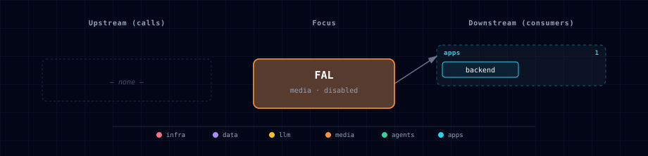

# 5.2.16. FAL Cloud Media

## 1. Overview

FAL Cloud Media is a virtual media provider for fal.ai's hosted generation APIs. It gives Atlas a cloud path for creative generation without local ComfyUI CPU/GPU containers or a host ComfyUI process.

Atlas does not run a FAL container. The backend reads `FAL_SOURCE`, `FAL_API_KEY` and model defaults from the environment. When `FAL_SOURCE=enabled`, it routes hosted image-generation operations to the fal.ai Python client.

## 2. Access

| Surface | URL or command | Notes |
|---|---|---|
| Atlas SOURCE | `FAL_SOURCE=disabled` | Default. No FAL calls are made and no API key is required. |
| FAL provider | `FAL_SOURCE=enabled` | Enables FAL-backed hosted media generation through the backend. |
| Media gateway (image) | `POST /media/generate` with `{"provider":"fal","modality":"image"}` | Submits a FAL image operation (text→image with `fal-ai/flux/dev`, or image-to-image with an init image) and returns an operation id. Custom endpoints take `input.provider_arguments`. `provider=comfyui` uses the same route for the managed or local ComfyUI host. Schema: backend `/docs` (OpenAPI). |
| Media gateway (image→3D) | `POST /media/generate` with `{"modality":"image_to_3d"}` | Submits a hosted image→3D operation through a verified Hunyuan3D, TRELLIS, Tripo, or Rodin endpoint and returns an operation id. |
| Operation polling | `GET /media/operations/{operation_id}` | Polls provider status and returns normalized artifacts (the GLB is the primary `artifact_url`), cost, license, and provenance. |
| Operation cancel | `POST /media/operations/{operation_id}/cancel` | Requests cancellation from FAL. Budget stays reserved until polling confirms a terminal provider outcome. Idempotent. Status codes: backend `/docs`. |
| Ambiguous submission reconciliation | `POST /media/operations/{operation_id}/reconcile` | An operator with `BACKEND_INTERNAL_API_TOKEN` records `outcome=commit|release` after checking FAL billing. A missing provider id counts as ambiguous. Intents and recovery rows do not expire before settlement; same-outcome retries are safe. `recovery_ledger_ids` names cleanup candidates if operation persistence fails. The default Postgres store survives restarts; `memory` is ephemeral. |
| Spend read | `GET /media/spend?consumer=<c>` | Scoped spend read (committed/reserved totals + rows for one consumer). Empty unless `MEDIA_BUDGET_ENABLED=true`. |
| Compatibility route | `POST /comfyui/generate` | Uses FAL for simple image generation when `FAL_SOURCE=enabled`; otherwise preserves the existing ComfyUI path. |
| Kong | No direct route | FAL is a server-side provider only. The API key stays in the backend environment. |

Enable from the CLI with:

```bash
./start.sh --fal-source enabled --fal-api-key <your-fal-key>
```

**Interactive wizard.** FAL is a paid cloud provider. Like the OpenAI, Anthropic and OpenRouter keys, it has a **masked API-key step**, placed after the ComfyUI step (both are `media`). There is no plain enabled/disabled tile. **Enter a key to enable FAL, or leave it blank to keep it disabled.** A key sets `FAL_SOURCE=enabled` and `FAL_API_KEY`. When a key is already saved, the step takes the same words as the cloud key steps:

- Enter changes nothing.
- `enable` turns FAL on with the saved key. Without a saved key, FAL stays disabled, because the backend rejects `FAL_SOURCE=enabled` without `FAL_API_KEY`.
- `disable` turns FAL off and **keeps** the key.
- `remove` (or its older synonym `clear`) sets `FAL_SOURCE=disabled` and blanks the key.

FAL still appears in the services grid as a media service. Its row shows the resulting source as soon as the key step is answered.

## 3. Configuration

| Variable | Default | Purpose |
|---|---:|---|
| `FAL_SOURCE` | `disabled` | Enables or disables the FAL provider. |
| `FAL_API_KEY` | empty | Required when `FAL_SOURCE=enabled`; not required when disabled. |
| `FAL_MODEL` | `fal-ai/flux/dev` | Default FAL model endpoint used by the media gateway for text-to-image generation. |
| `FAL_IMAGE_TO_3D_MODEL` | `fal-ai/trellis` | Default endpoint id for the `image_to_3d` modality. Must resolve to a curated registry entry (see below); TRELLIS is the MIT-licensed default. |
| `FAL_MODEL_LICENSE` | `fal/provider-terms` | License or terms marker returned in normalized media operation responses when provider-specific model licensing is not more specific. For `image_to_3d`, the per-model registry license overrides this. |
| `BACKEND_MEDIA_INPUT_BUCKET` | `default` | Supabase Storage bucket the gateway hosts `image_to_3d` inputs in (under the `media-inputs/` prefix) when a provider rejects data-URI inputs. Declared on the backend service. |
| `BACKEND_MEDIA_INPUT_PUBLIC_BASE_URL` | empty | Optional public base URL for hosted inputs (`<base>/<bucket>/<key>`), so the provider's cloud can fetch them through a reachable ingress. Empty uses the storage client's public URL. Declared on the backend service. |
| `FAL_TIMEOUT_SECONDS` | `120` | Backend timeout for FAL media submit/poll operations and the compatibility route. Greater than zero, at most 3,600 seconds. |
| `FAL_OUTPUT_FORMAT` | `jpeg` | Requested image format for compatible models. |
| `FAL_ENABLE_SAFETY_CHECKER` | `true` | Requests the provider-side safety checker for compatible models. |

## 4. Architecture & Wiring

Atlas models FAL as a virtual media service:

- Track membership: `gen-ai-creative` and `all`.
- Service category: `media`.
- Source values: `disabled` and `enabled`.
- Runtime ownership: no compose service, no container, no volume, and no Kong route.
- Backend integration: `POST /media/generate` validates the selected model's full schema before any state, budget, storage or provider work, then submits hosted image operations to FAL. `GET /media/operations/{operation_id}` polls provider status. `POST /media/operations/{operation_id}/cancel` records a cancellation request and keeps spend reserved until polling confirms FAL's terminal outcome.
- Compatibility route: `POST /comfyui/generate` uses FAL first when `FAL_SOURCE=enabled`, for the default `fal-ai/flux/dev` contract. It reserves no budget, so it returns `409` while `MEDIA_BUDGET_ENABLED=true`, and `504` on a FAL timeout. For custom endpoint schemas, use `POST /media/generate` with `input.provider_arguments`.
- Deadlines: a budget-tracked `/media/generate` FAL job past its deadline becomes `cancellation_requested` and keeps its reservation until a poll sees FAL's terminal state. If FAL never reports one, settle it with `POST /media/operations/{id}/reconcile`.
- ComfyUI-specific routes: workflow execution, queue inspection, history lookup, cancellation, and image file proxying remain ComfyUI-specific.
- Secret handling: `FAL_API_KEY` is server-side only. The backend maps it to `FAL_KEY` for the fal.ai Python client and never exposes it to browser clients.
- Operation state: submitted and terminal metadata is shared in Redis with a bounded TTL. Polling and cancellation therefore survive Backend restarts and stay consistent across replicas. An unresolved `submission_unknown` intent and a budget-tracked terminal transition do not expire until ledger settlement; then the normal TTL applies. Owner scope is recorded at submission and enforced on reads and cancellation. §4.2 describes the Postgres recovery/spend ledger and budget enforcement.

### 4.1. Image→3D modality

`{"modality":"image_to_3d","provider":"fal","model":<id>,"input":{"image":<url-or-data-uri>}}` submits a hosted image→3D job. `model` must match a verified registry endpoint id (aliases and case are tolerated). An unknown or unverified id returns HTTP 400 that lists the supported ids. If `model` is omitted, the gateway uses `FAL_IMAGE_TO_3D_MODEL`.

The backend handles provider differences, so consumers do not need to:

- It maps each provider's request field names and seed ranges onto one `input` shape.
- The GLB is always the primary `artifact_url`, with `license` and estimated `cost_usd` from the registry entry.
- It composites transparent inputs onto a neutral background before submission, to avoid a known fal Hunyuan3D v2 crop bug.
- For providers that reject data URIs, it uploads inputs to `BACKEND_MEDIA_INPUT_BUCKET`. An uploaded data URI must be PNG, JPEG or WebP and match its declared type, else HTTP 400. `image/jpg` is accepted as JPEG.

The per-provider field names, seed ranges and response-key mappings are in the backend `/docs` OpenAPI.

Limits:

- **Hosted inputs.** FAL can fetch uploaded inputs only if `BACKEND_MEDIA_INPUT_PUBLIC_BASE_URL` reaches a public bucket. The default `default` bucket is private, and the fallback URL uses the internal Kong host. So with the defaults, a data-URI input to Tripo fails at FAL.
- **Timeouts.** With media budgets off, `FAL_TIMEOUT_SECONDS` (120 s) is also the whole-operation deadline. A slower image→3D job (Rodin, Hunyuan, queued work) is marked `timeout` and its result is not fetched, although FAL may finish and bill it. Raise `FAL_TIMEOUT_SECONDS` for 3D work.
- **Per-request timeout.** A larger `timeout_seconds` (1–3600) extends Atlas's deadline and FAL's server-side queue-start limit together, so a long-queued job is not dropped. The queue-start limit is never below `FAL_TIMEOUT_SECONDS`, which still bounds each submit and poll HTTP call.
- **No GLB.** A completed job with no GLB in its result stays `succeeded`, with `artifact_url: null` and `provenance.glb_missing: true`. FAL billed it, so its spend settles as spent.
- An unrecognised FAL queue status returns HTTP 502, not 400.
- **Baking.** A successful GLB (`artifact_url` + `license`/`provenance`) stays on FAL's CDN. To bake it, download it and upload it to the `raw-assets` MinIO bucket. The asset-baker `/assets/bake/ref` endpoint accepts only `{bucket, key}` in an allowlisted bucket, and the gateway never calls it.

| Endpoint id | Family | License | Commercial use | Input hosting |
|---|---|---|---|---|
| `fal-ai/trellis` | TRELLIS | MIT | yes | data URI ok |
| `fal-ai/hunyuan3d/v2` | Hunyuan3D | tencent-hunyuan-community | yes via fal (self-host Tencent-gated, EU/UK/KR excluded) | data URI ok |
| `tripo3d/tripo/v2.5/image-to-3d` | Tripo | tripo-commercial-gated | gated to Pro/Enterprise | **requires hosted URL** |
| `fal-ai/hyper3d/rodin` | Rodin (Hyper3D) | hyper3d-provider-terms | conditional | data URI ok |

Pixal3D is in the internal research registry as an unverified candidate. It is not advertised or routable until its current endpoint id and request contract are validated.

### 4.2. Spend ledger & budgets

Hosted media generation has no LiteLLM-style spend accounting, so the media gateway has its own cost ledger and budget engine:

- **Enforcement is off by default** (`MEDIA_BUDGET_ENABLED=false`).
- Even with enforcement off, an ambiguous FAL submission writes a minimal recovery row to `MEDIA_BUDGET_STORE`. Keep the default `postgres` for cross-process and restart durability; `memory` is ephemeral.
- With enforcement on, each generation reserves its estimated cost before the provider call and reconciles to the final cost on completion, per operation, in `public.media_spend_ledger`.
- A submission over the cap (`MEDIA_BUDGET_DEFAULT_USD`, and per-scope `MEDIA_BUDGET_CONSUMER_CAPS`) is rejected before any provider call or storage write.
- `MEDIA_DISABLED_PROVIDERS` (CSV) turns off a specific provider, with or without enforcement.
- `GET /media/spend?consumer=<c>[&project=<p>]` returns that consumer's totals and rows only.
- An accepted cancellation is not a settlement: spend stays reserved until a provider poll proves a terminal outcome.

The full status-code, concurrency-safety and unknown-cost contract is in the backend `/docs` OpenAPI.

Attribution comes from the authenticated Backend principal plus optional request `consumer`/`project` fields or `X-Atlas-Consumer`/`X-Atlas-Project` headers (default `default`). A `consumer`, `project` or `model` value is rejected with `400` if it is longer than 255 characters or contains a control character (such as NUL). Operation polling and cancellation are owner-scoped. Spend reads require the same Backend application-auth boundary. `MEDIA_BUDGET_*` and `MEDIA_DISABLED_PROVIDERS` are declared on the backend service.

### 4.3. LiteLLM text→image route

When `FAL_SOURCE=enabled` and `FAL_API_KEY` is set, `litellm-init` also registers a **`fal-image`** model on the LiteLLM gateway. It uses LiteLLM's native `fal_ai` image provider (`model: fal_ai/${FAL_MODEL}`), gated and disabled-tolerant like the `hermes`/`vllm-metal` rows. OpenAI-shaped clients (Open WebUI image generation, n8n, notebooks) then reach FAL **text→image** through `http://litellm:4000/v1/images/generations`. They get LiteLLM's unified auth, spend logging and retries, with no bespoke backend call.

- **Scope is text→image only.** FAL **image→3D** (§4.1), video and audio stay on the Backend media gateway. LiteLLM has no 3D or video modality. The gateway owns the curated registry, normalized provenance, and hosting of image inputs in Supabase Storage (results stay on FAL's CDN).
- **Provenance boundary.** The LiteLLM route returns raw image data (b64/URL) and does **not** perform Atlas provenance or storage. The Backend media gateway (`POST /media/generate`) is authoritative for provenance and spend accounting. It does not copy artifacts: `artifact_url` is FAL's own CDN URL, which expires, so download results you need to keep. The two paths **complement** each other.
- **Key wiring.** The `fal-image` row references `os.environ/FAL_AI_API_KEY`, which the LiteLLM *server* resolves at request time. The compose fragment sets `FAL_AI_API_KEY=${FAL_API_KEY}` on the litellm container. The key is never written into `config.yaml`.

## 5. Dependencies & Integrations

### 5.1. Current — Upstream (this service calls)

_No upstream calls._

### 5.2. Current — Downstream (services that call this)

| Service | Category |
|---|---|
| litellm | llm |
| backend | apps |

### 5.3. Architecture diagram



[Open the full-size diagram](./architecture.html) for a full-screen view.

### 5.4. Future — Missing pair integrations

- Optional FAL model catalog prompts if Atlas adopts a curated cloud-media model list.

### 5.5. Future — Candidate new services

- Additional cloud media providers such as Replicate, RunPod Serverless, or provider-specific video generation APIs behind the same backend provider seam.

### 5.6. Future — Unused features in this service

- FAL queue webhooks are not wired; the backend uses submit/poll operations.

## 6. Capabilities & limitations

Support tier: **experimental** — Capability contract declared; no cited cold-start, workflow, or upgrade qualification run yet (evidence at `v0.1.0`).

| Capability | Status | Verification | Notes |
|---|---|---|---|
| Virtual hosted media generation | supported | tested | The backend uses the server-side FAL key for hosted image and curated image-to-3D operations; Atlas runs no FAL container or direct provider ingress. |
| LiteLLM text-to-image passthrough | partial | tested | An enabled keyed provider registers fal-image through LiteLLM, but that route covers text-to-image only. It returns LiteLLM's OpenAI-shaped b64/URL image result without Atlas storage or provenance normalization. |
| Durable media-operation accounting | partial | tested | Redis operation state and the Postgres recovery ledger handle polling and ambiguous submissions, while spend-budget enforcement remains disabled unless explicitly configured. |
| Automatic 3D post-processing | not-supported | documented | Image-to-3D returns a normalized GLB reference but never invokes Asset Baker or Asset Worker; callers must submit the artifact to those services explicitly. |
| Provider webhook completion | not-supported | documented | Atlas uses bounded submit-and-poll operations rather than FAL queue webhooks, so no webhook ingress or signature-validation path is configured. |
