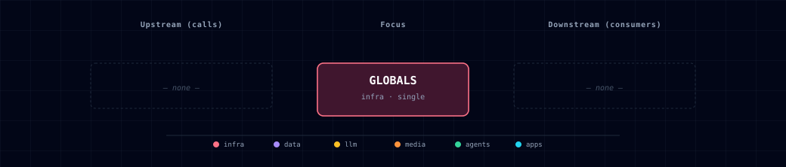

# 5.2.17. Globals (project + branding)

## 1. Overview

`globals` is a virtual manifest in the `infra` category. It owns stack-wide settings and runs no container. Its variables appear at the top of the generated `.env.example`.

## 2. Role In Atlas

`./start.sh` and `./stop.sh` read these values from `.env`. The compose fragments use them for the project namespace, port binds, host-gateway mapping, GPU visibility and log rotation.

## 3. Tracks And Category

- Category: `infra`
- Kind: `virtual`
- Tracks: `all, data-eng, gen-ai-creative, gen-ai-eng, gen-ai-rag, ml-eng, trading`

## 4. Access

`globals` has no Kong alias and no port of its own. `BASE_PORT` is the base from which every service `*_PORT` derives.

## 5. Configuration

| Variable | Default | Purpose |
| --- | --- | --- |
| `PROJECT_NAME` | `atlas` | Compose project name and the prefix for containers, volumes and networks. `./stop.sh` uses it to stop what `./start.sh` started. Set a unique name when Atlas runs as a submodule. |
| `BASE_PORT` | `63000` | Base port. Every service `*_PORT` is this value plus a fixed offset. |
| `HOST_BIND_IP` | `127.0.0.1:` | Host interface prefix for all published ports. Keep the trailing colon. Set `0.0.0.0:` only for deliberate remote access. |
| `HOST_GATEWAY_IP` | `host-gateway` | Target of `host.docker.internal`. `./start.sh` computes it: `host-gateway` on Docker, the gateway IP on Podman. |
| `BRAND_NAME`, `BRAND_TAGLINE`, `BRAND_VERSION`, `BRAND_AUTHOR`, `BRAND_AUTHOR_EMAIL`, `BRAND_LICENSE`, `BRAND_REPO_URL` | Atlas values | Brand metadata in the wizard and the `--no-tui` banner. |
| `BRAND_LOGO_FILE` | empty | Path to a custom block-art logo. Empty uses the built-in ATLAS lockup. |
| `COMPOSE_PROFILES` | empty | Compose profile list. `./start.sh` rebuilds it on every run from the STT, TTS and doc-processor sources. Do not edit it. |
| `NVIDIA_VISIBLE_DEVICES` | `all` | Host GPU visibility for NVIDIA-runtime containers. |
| `PROD_ENV_CPUS`, `PROD_ENV_MEM_LIMIT`, `PROD_ENV_BACKEND_*`, `PROD_ENV_N8N_*` | `2`, `8g`, `1`/`2g`, `1`/`2g` | Reserved resource caps. No compose fragment reads them yet. |
| `PROD_ENV_COMFYUI_CPUS`, `PROD_ENV_COMFYUI_MEM_LIMIT` | `2`, `4g` | CPU and memory caps for the ComfyUI `container-gpu` source. |
| `LOG_MAX_SIZE`, `LOG_MAX_FILE` | `10m`, `3` | Docker `json-file` log size and file count per container. |
| `BOOTSTRAPPER_PORT_LAYOUT_VERSION` | `5` | Migration sentinel. A missing or lower value runs the chained `.env` migrations. |

The [environment variable reference](../../docs/reference/env-vars.md) has the full descriptions.

## 6. Dependencies And Topology

`globals` has no dependencies and no runtime calls.

## 7. Source Values

`globals` has no SOURCE variable. It is always active.

## 8. Runtime Integration

Compose fragments bind published ports as `${HOST_BIND_IP-127.0.0.1:}`. An unset variable binds loopback; an explicitly empty value binds all interfaces. Ray, Zeppelin and mcp-servers always bind `127.0.0.1`.

## 9. Operations

- Change the project name: `./start.sh --project <name>` (or `-p`). The value is written back to `.env`.
- Change the base port: `./start.sh --base-port <port>` or `--base-port auto`.
- Stop the project: `./stop.sh`.

## 10. Related Configuration

- Service manifest: `services/globals/service.yml`
- Generated environment template: `.env.example`

## 11. Dependencies & Integrations

### 11.1. Current — Upstream (this service calls)

_No upstream calls._

### 11.2. Current — Downstream (services that call this)

_No downstream consumers._

### 11.3. Architecture diagram

[Open the full-size diagram](./architecture.html) for a full-screen view.

### 11.4. Future — Missing pair integrations

_No high-confidence opportunities identified._

### 11.5. Future — Candidate new services

_No high-confidence opportunities identified._

### 11.6. Future — Unused features in this service

_No high-confidence opportunities identified._

## 12. Capabilities & limitations

Support tier: **experimental** — Capability contract declared; no cited cold-start, workflow, or upgrade qualification run yet (evidence at `v0.1.0`).

| Capability | Status | Verification | Notes |
|---|---|---|---|
| Project namespace and base-port ownership | supported | tested | This virtual manifest owns the Compose project namespace, the bind and gateway settings, and the base port from which service ports derive. It launches no container of its own. |
| Branding and launch defaults | supported | tested | Atlas assembles the brand metadata, Compose profiles, GPU reservation flags, and shared logging defaults declared here into the generated environment. |
| Generic production resource limits | partial | documented | The PROD_ENV limit variables are reserved shared configuration, but most service compose fragments do not yet consume them as generic runtime caps. |
