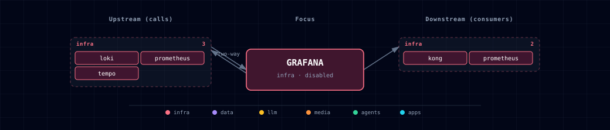

# 5.2.18. Grafana (observability UI + alerting)

## 1. Overview

Grafana runs as a single container in the stack's `infra` band and is disabled by default. It provisions Prometheus, Tempo and Loki datasources, plus 7 starter dashboards under the **Atlas** folder. Persistence uses SQLite on a named volume, so it supports one replica only.

Image: `grafana/grafana:11.4.3` (AGPL — operational-use safe). `./start.sh` generates `GRAFANA_ADMIN_PASSWORD` on first run. Anonymous access and self sign-up are **off**; admin login is required.

Unified alerting is enabled, but no alert rules or contact points are provisioned. Add your own under `provisioning/alerting/`. Its `placeholder.yml` is a no-op that stops Grafana warning about a non-YAML file; replace it.

`config/provisioning/` ships four subdirectories. Grafana scans all of them at startup and logs an error for any that is missing:

- `datasources/` — Prometheus (`prometheus.yml`, UID `Prometheus`) plus Tempo and Loki (`tempo-loki.yml`)
- `dashboards/` — the 7 shipped JSON dashboards + `dashboards.yml` provider
- `alerting/` — alert rules / contact points (currently just the placeholder)
- `plugins/` — app-plugin provisioning (currently empty, kept via `.gitkeep`)

The Loki datasource derives a `TraceID` link from the OTLP `trace_id` structured-metadata label and opens the trace in Tempo. Trace and span IDs stay structured metadata, so LogQL can filter on them directly. Applications need not repeat the trace ID in the log body.

## 2. Access

| Surface | URL | Auth |
|---|---|---|
| Direct | `http://localhost:${GRAFANA_PORT}` | `${GRAFANA_ADMIN_USERNAME}` / `${GRAFANA_ADMIN_PASSWORD}` |
| Kong | `http://grafana.localhost:${KONG_HTTP_PORT}` | Same |
| Internal | `http://grafana:3000` | Same — backend-network only |

## 3. Configuration

```bash
GRAFANA_SOURCE=disabled                 # container | disabled
GRAFANA_ADMIN_USERNAME=admin
GRAFANA_ADMIN_PASSWORD=                 # auto-generated on first run
GRAFANA_PORT=                           # auto-assigned by topology (infra block)
```

Auto-managed (do not edit by hand):

```bash
GRAFANA_ENDPOINT=...                    # not consumed externally; written for symmetry
GRAFANA_SCALE
```

Grafana starts when Prometheus is `disabled`. Its `depends_on` on a healthy `prometheus` does not block it. Compose skips that condition for a service scaled to 0 replicas (checked on Docker Compose 5.1.4).

The provisioned datasource reads `${PROMETHEUS_ENDPOINT}`. When Prometheus is `disabled` the value in `.env` is empty, but `compose.yml` passes `${PROMETHEUS_ENDPOINT:-http://prometheus:9090}`, and `:-` also replaces an empty value. The datasource therefore still points at `http://prometheus:9090`, which does not resolve, and Grafana shows "datasource unreachable" until Prometheus is turned on. The Tempo and Loki datasources behave the same way: they fall back to `http://tempo:3200` and `http://loki:3100` and fail until `TEMPO_SOURCE` and `LOKI_SOURCE` are `container`.

## 4. Dashboards (7 shipped)

| File | Title | Source metrics |
|---|---|---|
| `stack-overview.json` | Stack Overview | UP/DOWN counts, request rate aggregation, host + container resource summary |
| `litellm.json` | LiteLLM | Per-model requests, tokens, spend, latency p50/p95/p99, errors |
| `kong.json` | Kong API Gateway | Per-route req rate, status codes, p95 latency, bandwidth |
| `postgres-redis.json` | Postgres + Redis | Connections, query rate, table sizes, memory, ops/sec, hit ratio |
| `containers-and-host.json` | Containers + Host | Per-container CPU, memory and IO (cAdvisor); host load and disk (node-exporter). cAdvisor has no Docker discovery, so series have no container name. Panels group by the first 12 characters of the container ID; match them with `docker ps`. |
| `n8n.json` | n8n | Executions per minute, p50/p95 duration, active workflows, execution-data writes, uptime |
| `app-tier.json` | App tier (Weaviate + MinIO) | Weaviate request rate and query p95, MinIO S3 request rate and cluster usage |

All dashboards reference the Prometheus datasource by UID `Prometheus`, set explicitly in `provisioning/datasources/prometheus.yml`.

## 5. Dependencies & Integrations

### 5.1. Current — Upstream (this service calls)

| Service | Category |
|---|---|
| loki | infra |
| prometheus ↔ | infra |
| tempo | infra |

### 5.2. Current — Downstream (services that call this)

| Service | Category |
|---|---|
| kong | infra |
| prometheus ↔ | infra |

### 5.3. Architecture diagram



[Open the full-size diagram](./architecture.html) for a full-screen view.

### 5.4. Future — Missing pair integrations

_No high-confidence opportunities identified._

### 5.5. Future — Candidate new services

- **Alertmanager** — only if Grafana's unified alerting hits a real limitation (HA, clustering).
- **OAuth provider** — replace the admin-password model with Supabase Auth / GitHub OAuth via `GF_AUTH_GENERIC_OAUTH_*` env vars.

### 5.6. Future — Unused features in this service

- **Anonymous read mode** — `GF_AUTH_ANONYMOUS_ENABLED=true` would let teammates view dashboards without an account. It is off by default for safety.
- **Postgres backend** — Supabase Postgres could replace the SQLite store and allow horizontal scaling. The single-replica deployment does not need it.
- **Image renderer** — server-side panel-to-PNG rendering for alert notifications and reports. Adds a sidecar but unlocks rich alert payloads.

## 6. Troubleshooting

- **"Datasource unreachable" on every panel** — Prometheus is `disabled`; Grafana runs, but its Prometheus datasource has no target. Set `PROMETHEUS_SOURCE=container` in `.env` and re-run `./start.sh`. The datasource URL is interpolated at provisioning time, so a Grafana restart is required after changing `PROMETHEUS_ENDPOINT`.
- **Admin login rejected** — check `GRAFANA_ADMIN_PASSWORD` in `.env`. The bootstrapper generates it only when the value is empty (first run). Grafana reads the value only when it first creates its database in the `grafana-data` volume, so editing `.env` afterwards does not change the stored password. Apply a new one with `docker exec ${PROJECT_NAME}-grafana grafana cli admin reset-admin-password "$GRAFANA_ADMIN_PASSWORD"` after updating `.env`, or remove the `grafana-data` volume to start over.
- **Stack Overview "Targets DOWN" is never 0** — the scrape list is static, so disabled services count as down. By default these are `asset-worker` and `asset-baker`; narrower tracks add n8n, Weaviate, MinIO and others. Check Prometheus' Targets page before you treat the number as an outage.
- **Dashboards missing** — Grafana's provisioner watches the directory every 30s (`updateIntervalSeconds: 30`). If a dashboard JSON has a syntax error, Grafana logs it under "Provisioning errors" and skips the file.
- **Redirect URL contains internal `grafana` hostname instead of `grafana.localhost`** — Kong's `preserve_host: True` flag must be set on the Grafana route. The route generator handles this; verify with `curl -I http://grafana.localhost:${KONG_HTTP_PORT}` (default 63000).

## 7. Capabilities & limitations

Support tier: **experimental** — Capability contract declared; no cited cold-start, workflow, or upgrade qualification run yet (evidence at `v0.1.0`).

| Capability | Status | Verification | Notes |
|---|---|---|---|
| Provisioned observability dashboards and datasources | supported | tested | Atlas provisions Prometheus, Tempo, and Loki datasources plus the bundled stack dashboards through committed Grafana configuration. |
| Unified alerting workflows | partial | documented | Grafana unified alerting is enabled, but Atlas ships no alert rules, contact points, or notification policies for operators. |
| Highly available dashboard persistence | not-supported | documented | The stock deployment is a single Grafana replica backed by a local SQLite volume rather than a shared highly available database. |
