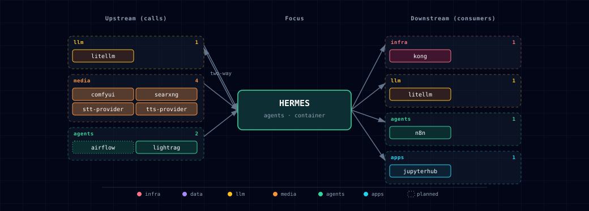

# 5.2.19. Hermes Agent

**Port:** 63072 (API), 63073 (dashboard)
**SOURCE variable:** `HERMES_SOURCE`
**SOURCE options:** container, localhost, disabled

## 1. Overview

Hermes is a programmable AI-agent runtime from Nous Research. It adds the
agent loop between raw LLM chat and channel adapters such as OpenClaw. It
exposes an OpenAI-compatible API on container port 8642 and a web dashboard on
container port 9119.

Key facts:

- **File-based persistence** — all state lives under `/opt/data` (the
  `hermes-data` named volume). Hermes needs no Postgres or Redis.
- **No GPU** — Hermes orchestrates; the model endpoint in `model.base_url`
  does the inference. The stack default is the LiteLLM gateway.
- **MCP client** — Hermes can call any MCP server.
- **64K context floor** — Hermes checks the model's context window at
  preflight. `HERMES_DEFAULT_MODEL` must have a context window of at least
  64K. Stock Ollama default contexts depend on VRAM (4K/32K/256K) and are
  often lower. Set `OLLAMA_CONTEXT_LENGTH=65536` on the Ollama server, run
  `/set parameter num_ctx 65536` + `/save <model>` inside `ollama run`, or use
  a cloud model.
- **Disk** — the image is multi-arch (`linux/amd64`, `linux/arm64`) and
  large: about 3.7 GB unpacked on arm64.
- **Bundled skills** — the image ships its skills under `/opt/hermes/skills`.
  `hermes-init` adds the companion skill
  `creative/atlas-comfyui-host/SKILL.md` under `/opt/data/skills/`. It gives
  the agent the in-network ComfyUI host; it is guidance, not an override.

## 2. Access

| Path | URL | Notes |
|---|---|---|
| OpenAI-compatible API (direct) | `http://localhost:${HERMES_API_PORT}` (default 63072) | Bearer token: `${HERMES_API_KEY}`. Same surface as OpenAI's `/v1/chat/completions`. |
| Dashboard (direct) | `http://localhost:${HERMES_DASHBOARD_PORT}` (default 63073) | Web admin UI for skills, sessions, model config. |
| Dashboard (Kong) | `http://hermes.localhost:63000` | Requires `./start.sh --setup-hosts`. Kong asks for the dashboard credential (`DASHBOARD_USERNAME` / `DASHBOARD_PASSWORD`); the dashboard itself has no login. |
| Internal DNS (other containers) | `http://hermes:8642` | Reachable from LiteLLM, n8n, jupyterhub; Backend and OpenClaw get the endpoint but do not call it yet (see §6). |

See the canonical port table at [Ports and Routes](../../docs/reference/ports-routes.md).

## 3. Architecture & wiring

Hermes is wired into the stack in two directions:

1. **Hermes → LiteLLM (outbound)** — Hermes calls
   `http://litellm:4000/v1/chat/completions` for every LLM operation. Pick
   the model via `HERMES_DEFAULT_MODEL` (any name LiteLLM exposes).
2. **LiteLLM → Hermes (inbound)** — `services/litellm/init/scripts/init.py` appends
   a `hermes-agent` row to LiteLLM's `model_list` when `HERMES_SOURCE !=
   disabled`. Consequence: Open WebUI, n8n, backend and JupyterHub see
   `hermes-agent` in their model lists automatically — no per-consumer
   wiring. OpenClaw sees it through its `litellm` provider (see the
   [OpenClaw README](../openclaw/README.md)).

The loop is intentional. Hermes is the agent runtime above raw chat; LiteLLM
is the single front door for LLM traffic.

### 3.1. Optional integration points (wired by `hermes-init`)

`services/hermes/init/scripts/init-hermes.sh` renders `/opt/data/config.yaml` from
environment. When the underlying service is enabled, Hermes gets:

| Hermes feature | Stack service | Mechanism |
|---|---|---|
| LLM reasoning | LiteLLM | `model.provider: custom`, `base_url: http://litellm:4000/v1` |
| TTS (text-to-speech) | Speaches (Kokoro/Piper, default) / Chatterbox (voice cloning) | `tts.provider: openai`, `tts.openai.base_url: ${TTS_ENDPOINT}/v1`, set from the active TTS engine (for example `http://speaches:8000/v1` or `http://chatterbox:4123/v1`). The key is the placeholder `VOICE_TOOLS_OPENAI_KEY=not-required`, so audio never reaches api.openai.com, even when `OPENAI_API_KEY` is set. With TTS disabled, init omits the block. Hermes then uses its default `edge` provider, which sends the text to Microsoft's Edge TTS cloud service. |
| STT (speech-to-text) | Speaches (Faster-Whisper, default) / Parakeet (NVIDIA NeMo) / whisper.cpp (Apple Silicon) | `stt.provider: openai`, `stt.openai.base_url: ${STT_ENDPOINT}/v1`, `stt.openai.api_key: ${STT_INTERNAL_API_KEY}`, all set from the active STT engine. Hermes ignores the base URL without a key, so init writes the placeholder `not-required` when the key is blank. |
| Web search | SearXNG | `SEARXNG_URL=http://searxng:8080` on the hermes container plus `web.search_backend: searxng` |
| Image generation | ComfyUI | Companion skill `/opt/data/skills/creative/atlas-comfyui-host/SKILL.md` tells the agent that ComfyUI is at `http://comfyui:18188`. The bundled `creative/comfyui` skill still uses `127.0.0.1:8188`, so this is guidance, not a config override. |

When a dependency is `disabled`, init omits its block from `config.yaml` and
Hermes does not offer that capability. Startup does not fail.

## 4. Configuration

```bash
HERMES_SOURCE=container             # container | localhost | disabled
HERMES_IMAGE=nousresearch/hermes-agent:v2026.6.19
HERMES_API_PORT=63072
HERMES_DASHBOARD_PORT=63073
HERMES_DASHBOARD_ENABLED=true
HERMES_DASHBOARD_TUI=1              # inert in v2026.6.19 — the Chat tab is always on (see below)
HERMES_DEFAULT_MODEL=               # blank = hermes-init auto-picks from LiteLLM's model_list
HERMES_CONTEXT_LENGTH=65536         # hard floor; leave alone
HERMES_API_KEY=                     # auto-generated if empty
STT_INTERNAL_API_KEY=               # Parakeet token, compatibility dummy, or blank; auto-derived
HERMES_MEMORY_LIMIT=4g
HERMES_CPU_LIMIT=2.0
```

**Auto-default model.** When `HERMES_DEFAULT_MODEL` is blank, `hermes-init`
queries `http://litellm:4000/v1/models` at startup. It picks the first match
from a priority list: `ollama/qwen3.8:latest` → `claude-sonnet-4-6` →
`claude-opus-4-7` → `gpt-5` → `gpt-5-codex` → `gpt-5-mini`. If none matches,
it picks the first remaining chat model, excluding `hermes-agent`, `lightrag`
and embedding models. If no chat model is available, `hermes-init` fails and
Hermes does not start; set `HERMES_DEFAULT_MODEL`. An operator value is never
overridden.

**Dashboard Chat tab.** Hermes v2026.6.19 always embeds a `hermes --tui`
terminal as a Chat tab (`/api/pty`, `/api/ws`) and ignores
`HERMES_DASHBOARD_TUI`. The tab is a full agent with a terminal tool. While
`HERMES_DASHBOARD_INSECURE=true`, it needs no login on the direct port or from
backend-network peers. The agent can read `LITELLM_MASTER_KEY` from its
environment and from `/opt/data/config.yaml`. To remove the tab, set
`HERMES_DASHBOARD_ENABLED=false`; to require Nous Portal OAuth, set
`HERMES_DASHBOARD_INSECURE=false`. Reference: [upstream Web-Dashboard
docs](https://hermes-agent.nousresearch.com/docs/user-guide/features/web-dashboard).

Use `./start.sh` for the guided wizard, or pass `--hermes-source <option>`
for scripted changes.

`STT_INTERNAL_API_KEY` resolves to `PARAKEET_API_TOKEN` for a Parakeet source, to `sk-unused` for other enabled STT engines, and to empty when STT is disabled. `hermes-init` writes it into the server-side provider configuration. It is not a browser credential; do not emit it in tool output.

### 4.1. Containerize vs. localhost

| Scenario | Recommended SOURCE |
|---|---|
| Hermes consumed by Open WebUI / n8n / OpenClaw (default) | **container** |
| Hermes operates your real machine (real shell, real browser) | `localhost` |
| Microphone-driven live voice mode | `localhost` (container mic passthrough is non-trivial) |
| Resource-constrained machine | `disabled` |

With `localhost`, LiteLLM's `hermes-agent` route sends Atlas's `HERMES_API_KEY` as the bearer token. Set `HERMES_API_KEY` in `.env` to the host instance's own `API_SERVER_KEY`, or every call through LiteLLM returns 401. Atlas renders none of the config above (TTS, STT, SearXNG, ComfyUI) for a host instance; configure it on the host.

## 5. Known caveats

- **`HERMES_UID` cannot be `0`** — the upstream entrypoint runs
  `usermod -u $HERMES_UID hermes`, which fails with
  `usermod: UID '0' already exists`. The stack default is `10000`; keep it
  non-zero.
- **Gateway warning on first boot** — the gateway logs
  `WARNING gateway.run: No user allowlists configured. All unauthorized
  users will be denied.` This applies to the messaging-platform allowlists
  (Telegram, Discord and others), not to the OpenAI-compatible API. When you
  connect messaging channels, set `GATEWAY_ALLOW_ALL_USERS=true` in
  `/opt/data/.env` (`HERMES_HOME` in the container). Or configure
  per-platform allowlists (`TELEGRAM_ALLOWED_USERS=...`,
  `DISCORD_ALLOWED_USERS=...`).
- **Image pin** — Atlas pins the dated release
  `nousresearch/hermes-agent:v2026.6.19`. Upstream also publishes immutable
  `sha-<commit>` tags. To pin one build, set `HERMES_IMAGE` to a `sha-` tag:

  ```bash
  # In .env — pin a specific build
  HERMES_IMAGE=nousresearch/hermes-agent:sha-e85592591e8028cceecb0ea2b4992a1643b52f93
  ```

  Tags are listed at <https://hub.docker.com/r/nousresearch/hermes-agent/tags>.
- **ComfyUI hard-coded URL** — the bundled `creative/comfyui` skill uses
  `127.0.0.1:8188`. The companion skill `creative/atlas-comfyui-host` under
  `/opt/data/skills/` gives the in-network host. If a workflow ignores it,
  add a `socat` sidecar that maps `127.0.0.1:8188 → comfyui:18188`.
- **Open WebUI model-list cache** — Open WebUI caches the LiteLLM model list
  for 5 minutes (`MODELS_CACHE_TTL=300`). After first start, `hermes-agent`
  can take up to 5 minutes to appear in the dropdown. Set
  `OPEN_WEB_UI_MODEL_CACHE_TTL=0` to disable the cache while you develop.

## 6. Integration notes

Hermes needs LiteLLM. TTS, STT, ComfyUI and SearXNG are optional (§3.1).
Open WebUI, n8n and JupyterHub reach Hermes as the `hermes-agent` LiteLLM
model. n8n and JupyterHub also get `HERMES_ENDPOINT` for direct calls. Backend
and OpenClaw receive `HERMES_ENDPOINT` and `HERMES_API_KEY` but do not call
Hermes yet.

## 7. References

- Upstream repo — <https://github.com/NousResearch/hermes-agent>
- Official docs — <https://hermes-agent.nousresearch.com/docs/>
- Open WebUI integration guide — <https://hermes-agent.nousresearch.com/docs/user-guide/messaging/open-webui>
- Docker / bridged-network compose form — <https://hermes-agent.nousresearch.com/docs/user-guide/docker>

## 8. RAG capability via LightRAG

Hermes has no direct LightRAG tool. This release cannot declare an HTTP tool in `config.yaml`; its `tools:` section holds only built-in tool settings. LightRAG is reachable as the `lightrag` model through LiteLLM. `LIGHTRAG_INTERNAL_URL` and `LIGHTRAG_API_KEY` reach hermes-init for a future MCP or skill integration.

## 9. Hermes → Airflow integration

Hermes can trigger Airflow DAG runs through the Airflow REST API. Airflow
3.x's public `/api/v2/` uses JWT bearer tokens, not HTTP basic auth.
Exchange the admin password for a JWT, then trigger the run. Run from the
repository root; the commands read the values from `.env`:

```bash
env_get() { grep "^$1=" .env | cut -d= -f2-; }
KONG_HTTP_PORT=$(env_get KONG_HTTP_PORT)
TOKEN=$(curl -fsS -X POST \
  -H 'Content-Type: application/json' \
  -d "{\"username\":\"admin\",\"password\":\"$(env_get AIRFLOW_ADMIN_PASSWORD)\"}" \
  http://airflow.localhost:${KONG_HTTP_PORT}/auth/token | jq -r .access_token)

curl -fsS -X POST \
  -H "Authorization: Bearer $TOKEN" \
  -H 'Content-Type: application/json' \
  -d '{"logical_date": null, "conf": {}}' \
  http://airflow.localhost:${KONG_HTTP_PORT}/api/v2/dags/example_etl_with_llm/dagRuns
```

In this pattern, Hermes decides that a request needs a long-running pipeline
and triggers an Airflow DAG. See the [Airflow README](../airflow/README.md)
for the example DAG.

## 10. Dependencies & Integrations

### 10.1. Current — Upstream (this service calls)

_Rows marked planned are documented or intended, not wired yet._

| Service | Category | Status |
|---|---|---|
| litellm ↔ | llm | current |
| comfyui | media | current |
| searxng | media | current |
| stt-provider | media | current |
| tts-provider | media | current |
| airflow | agents | planned |
| lightrag | agents | planned |

### 10.2. Current — Downstream (services that call this)

| Service | Category |
|---|---|
| kong | infra |
| litellm ↔ | llm |
| n8n | agents |
| jupyterhub | apps |

### 10.3. Architecture diagram



[Open the full-size diagram](./architecture.html) for a full-screen view.

### 10.4. Future — Missing pair integrations

- **hermes ↔ neo4j** — *Why:* Adds durable cross-session episodic memory (entities, relations) queryable from other services, replacing flat-file state under `/opt/data`. *Mechanism:* Custom skill over `bolt://neo4j-graph-db:7687` exposed as a `memory.graph` tool. *Effort:* medium. *Confidence:* medium.
- **hermes ↔ weaviate** — *Why:* Semantic recall across sessions and ingested docs, reusing the in-stack `multi2vec-clip` vectorizer. *Mechanism:* Skill calling `http://weaviate:8080/v1/objects` against a `HermesMemory` class. *Effort:* medium. *Confidence:* medium.
- **hermes ↔ minio** — *Why:* Skill outputs (ComfyUI images, STT transcripts) get shareable URLs other services can fetch instead of being trapped in a bind mount. *Mechanism:* New `hermes-artifacts` bucket via the existing `minio-init` IAM pattern; S3 SigV4 against `http://minio:9000`. *Effort:* small. *Confidence:* high.
- **hermes ↔ n8n** — *Why:* Reverses the one-way edge so Hermes can call n8n workflows as tools. The 400+ n8n connectors then become Hermes capabilities without per-platform skills. *Mechanism:* Generic "call-n8n" skill POSTing to `http://n8n:5678/webhook/<id>` with `N8N_WEBHOOK_TOKEN`. *Effort:* small. *Confidence:* high.
- **hermes ↔ doc-processor** — *Why:* Lets Hermes answer questions about uploaded PDFs by routing them through the in-stack Docling parser before context or vector ingest. *Mechanism:* Skill POSTing multipart to `http://docling-gpu:8000/v1/document/convert`. *Effort:* small. *Confidence:* high.
- **hermes ↔ supabase** — *Why:* A JWT-scoped shared session store lets one Hermes session follow a user across Open WebUI, JupyterHub and OpenClaw. Sessions are then not pinned to single-tenant `/opt/data`. *Mechanism:* Skill writing to `hermes_sessions` via PostgREST at `http://supabase-api:3000`, keyed by Supabase JWT `sub`. *Effort:* medium. *Confidence:* medium.

### 10.5. Future — Candidate new services

_No high-confidence opportunities identified._

### 10.6. Future — Unused features in this service

- **MCP server mode** — *Why pursue:* Unlocks tool-use over Neo4j/Weaviate/MinIO/n8n via a uniform protocol instead of bespoke skills, leveraging Hermes's existing MCP-client support. *Effort:* medium.
- **Messaging-platform allowlists** — *Why pursue:* Wiring `GATEWAY_ALLOW_ALL_USERS`, `TELEGRAM_ALLOWED_USERS`, and `DISCORD_ALLOWED_USERS` is required before OpenClaw can safely bridge Hermes to Telegram/Discord/WhatsApp without an open relay. *Effort:* small.
- **Per-user / multi-tenant sessions** — *Why pursue:* Needed for any shared deployment beyond a single developer's laptop; current `/opt/data` layout is single-tenant. *Effort:* large.
- **Voice mode (mic passthrough)** — *Why pursue:* Enables true voice agent UX in-stack, currently gated on running Hermes via `localhost` SOURCE for mic access. *Effort:* large.
- **Skill marketplace / dynamic skill install** — *Why pursue:* Lets users add capabilities without rebuilding the image; Hermes upstream already supports dynamic skill loading. *Effort:* medium.

## 11. Troubleshooting

Run from the repository root; the commands read keys and ports from `.env`.

```bash
env_get() { grep "^$1=" .env | cut -d= -f2-; }

# Service status
docker compose ps hermes hermes-init

# Logs
docker compose logs -f hermes
docker compose logs hermes-init   # one-shot config rendering

# Verify the OpenAI-compatible API is up
curl -fsS http://localhost:$(env_get HERMES_API_PORT)/v1/models \
  -H "Authorization: Bearer $(env_get HERMES_API_KEY)" | jq .

# Verify hermes-agent appears in LiteLLM's model_list
curl -fsS http://localhost:$(env_get LITELLM_PORT)/v1/models \
  -H "Authorization: Bearer $(env_get LITELLM_MASTER_KEY)" | jq '.data[].id' | grep hermes

# Inspect the rendered config Hermes is using
docker compose exec hermes cat /opt/data/config.yaml
```

For general startup and routing issues, see [Troubleshooting](../../docs/quick-start/troubleshooting.md).

## 12. Capabilities & limitations

Support tier: **experimental** — Capability contract declared; no cited cold-start, workflow, or upgrade qualification run yet (evidence at `v0.1.0`).

| Capability | Status | Verification | Notes |
|---|---|---|---|
| LiteLLM-backed programmable agent | supported | tested | Atlas renders one usable default chat model from LiteLLM, filters recursive aliases, and exposes Hermes back through LiteLLM as hermes-agent. |
| Source-aware agent tools | partial | tested | Init renders enabled speech and SearXNG settings in the shape Hermes reads, plus a ComfyUI host companion skill. Unavailable services are omitted. LightRAG is reachable only through LiteLLM. Airflow triggering remains a user-authored skill or curl pattern. |
| Container and operator-host lifecycle | partial | tested | Atlas manages the container and its generated config. Localhost mode only resolves an operator-run API and dashboard, and cannot guarantee their setup, tools, or process supervision. |
| Hermes API and dashboard authentication | partial | documented | The OpenAI-compatible API uses HERMES_API_KEY, and hermes.localhost requires the Kong dashboard Basic credential. The dashboard runs in upstream insecure mode, so the direct host port and backend-network peers reach it without authentication. |
| Agent workspace persistence | partial | documented | Sessions, memories, skills, auth, and logs persist in one hermes-data volume, with no shared database, tenant isolation, replication, or cross-service artifact store. |
| Backend and OpenClaw direct bridges | stubbed | tested | Atlas injects Hermes endpoint credentials into Backend and OpenClaw, but neither currently calls the promised direct bridge. Open WebUI and n8n use LiteLLM or manual HTTP paths instead. |
| Untrusted autonomous tool isolation | not-supported | documented | Hermes skills can execute tools and code with the runtime's mounted workspace and network access. Atlas provides no per-user sandbox or policy engine for untrusted agent execution. |
