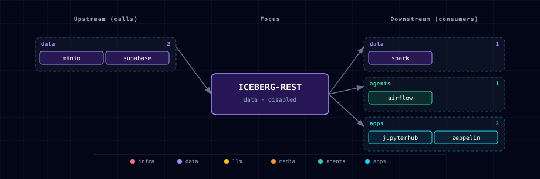

# 5.2.20. Apache Iceberg REST Catalog

## 1. Overview

Apache Iceberg REST Catalog provides Atlas' internal table catalog for the data-engineering lakehouse path. It stores Iceberg catalog metadata in Supabase Postgres through Iceberg's JDBC catalog implementation and points table data at MinIO.

## 2. Access

The service is intentionally internal-only in this slice. In-stack clients use `http://iceberg-rest:8181`; operators can use the host port from `ICEBERG_REST_PORT` for local smoke checks.

## 3. Configuration

- `ICEBERG_REST_SOURCE=disabled` keeps the catalog off by default.
- `ICEBERG_REST_SOURCE=container` runs the REST catalog and its Postgres init companion.
- `ICEBERG_REST_PORT` is assigned by the topology port allocator.
- `ICEBERG_DB_USER` and `ICEBERG_DB_PASSWORD` define the dedicated Supabase Postgres role.
- `MINIO_BUCKET_ICEBERG_LAKEHOUSE`, `MINIO_BUCKET_ICEBERG_JARS`, `MINIO_BUCKET_ICEBERG_CHECKPOINTS`, and `MINIO_BUCKET_ICEBERG_LANDING` define the lakehouse buckets created by `minio-init`.

## 4. Architecture & Wiring

`iceberg-rest-init` creates the `iceberg` database and role idempotently before `iceberg-rest` starts. `iceberg-rest` then exposes the Apache Iceberg REST API backed by Supabase JDBC catalog metadata and MinIO object storage.

Atlas builds a small local image from `ICEBERG_REST_IMAGE` because the upstream fixture image contains the Iceberg JDBC catalog implementation but not the PostgreSQL JDBC driver required for Supabase-backed persistence. `ICEBERG_REST_POSTGRES_JDBC_VERSION` pins that driver.

## 5. Dependencies & Integrations

### 5.1. Current — Upstream (this service calls)

| Service | Category |
|---|---|
| minio | data |
| supabase | data |

### 5.2. Current — Downstream (services that call this)

| Service | Category |
|---|---|
| spark | data |
| trino | data |
| airflow | agents |
| jupyterhub | apps |
| zeppelin | apps |

### 5.3. Architecture diagram

[Open the full-size diagram](./architecture.html) for a full-screen view.

### 5.4. Future — Missing pair integrations

_No high-confidence opportunities identified._

### 5.5. Future — Candidate new services

_No high-confidence opportunities identified._

### 5.6. Future — Unused features in this service

_No high-confidence opportunities identified._

## 6. Troubleshooting

- `curl -fsS http://iceberg-rest:8181/v1/config` should return catalog configuration once the service is healthy.
- If metadata disappears after restart, verify `CATALOG_URI` points at `jdbc:postgresql://supabase-db:5432/iceberg` and not the fixture image's SQLite default.
- If object writes fail, verify the `iceberg` MinIO service account exists and has access to the configured lakehouse buckets.
