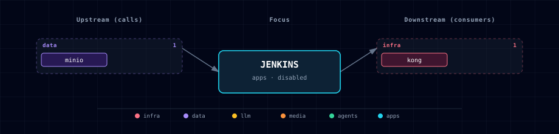

# 5.2.20. Jenkins (Maven Spark app builder)

Jenkins is an optional `apps` service for building Maven-based Spark applications and publishing their JAR artifacts to the Atlas MinIO `jars` bucket.

## 1. Overview

Image: `jenkins/jenkins:lts-jdk21` (MIT), wrapped by `services/jenkins/build/Dockerfile` so the controller has Maven, the MinIO `mc` client, and a small plugin baseline installed at build time.

Atlas provides the Jenkins server, JCasC, Maven, and MinIO publishing seam. Downstream projects provide repositories, Jenkinsfiles, seed jobs, credentials, and project-specific job definitions.

## 2. Access

| Surface | URL | Auth |
|---|---|---|
| Direct | `http://localhost:${JENKINS_PORT}` | `${JENKINS_ADMIN_USER}` / `${JENKINS_ADMIN_PASSWORD}` |
| Kong | `http://jenkins.localhost:${KONG_HTTP_PORT}` | Same Jenkins login |

`JENKINS_ADMIN_PASSWORD` is auto-generated on first bootstrap and persisted to `.env`.

## 3. Configuration

```bash
JENKINS_SOURCE=disabled            # container | disabled
JENKINS_IMAGE=jenkins/jenkins:lts-jdk21
JENKINS_PORT=                      # auto-assigned in the apps band
JENKINS_ADMIN_USER=admin
JENKINS_ADMIN_PASSWORD=            # auto-generated
```

JCasC is loaded from `services/jenkins/casc/jenkins.yaml` via `CASC_JENKINS_CONFIG`. The bundled config disables signup, creates the admin user, and avoids the first-run setup wizard.

## 4. Artifact Publishing

Jenkins receives MinIO endpoint and scoped Iceberg/lakehouse credentials from the Atlas environment. The canonical artifact path is:

```text
s3a://jars/<app>/<version>/app.jar
```

A downstream pipeline can publish with `mc`:

```groovy
sh 'mvn -q package'
sh 'mc alias set atlas "$MINIO_ENDPOINT" "$MINIO_ICEBERG_ACCESS_KEY" "$MINIO_ICEBERG_SECRET_KEY"'
sh 'mc cp target/*.jar "atlas/${MINIO_BUCKET_ICEBERG_JARS}/<app>/<version>/app.jar"'
```

Atlas does not ship downstream project job definitions. Mount or seed project jobs from the downstream repository.

## 5. Architecture & wiring

Jenkins calls MinIO to publish built artifacts. Airflow, Spark, notebooks, and downstream labs consume those artifacts later via `s3a://jars/...`; Jenkins does not need direct startup dependencies on those consumers.

## 6. Dependencies & Integrations

### 6.1. Current — Upstream (this service calls)

| Service | Category |
|---|---|
| minio | data |

### 6.2. Current — Downstream (services that call this)

| Service | Category |
|---|---|
| kong | infra |

### 6.3. Architecture diagram



[Open the full-size diagram](./architecture.html) for a full-screen view.

### 6.4. Future — Missing pair integrations

_No high-confidence opportunities identified._

### 6.5. Future — Candidate new services

_No high-confidence opportunities identified._

### 6.6. Future — Unused features in this service

_No high-confidence opportunities identified._

## 7. Troubleshooting

- **Login rejected** — check `JENKINS_ADMIN_USER` and `JENKINS_ADMIN_PASSWORD` in `.env`; restart Jenkins after changing them so JCasC reloads.
- **Artifact upload fails** — verify MinIO is enabled, `minio-init` completed, and `MINIO_ICEBERG_ACCESS_KEY` / `MINIO_ICEBERG_SECRET_KEY` are populated.
- **Do not expose publicly as-is** — the default auth posture is intended for local/dev or trusted VPN use.
