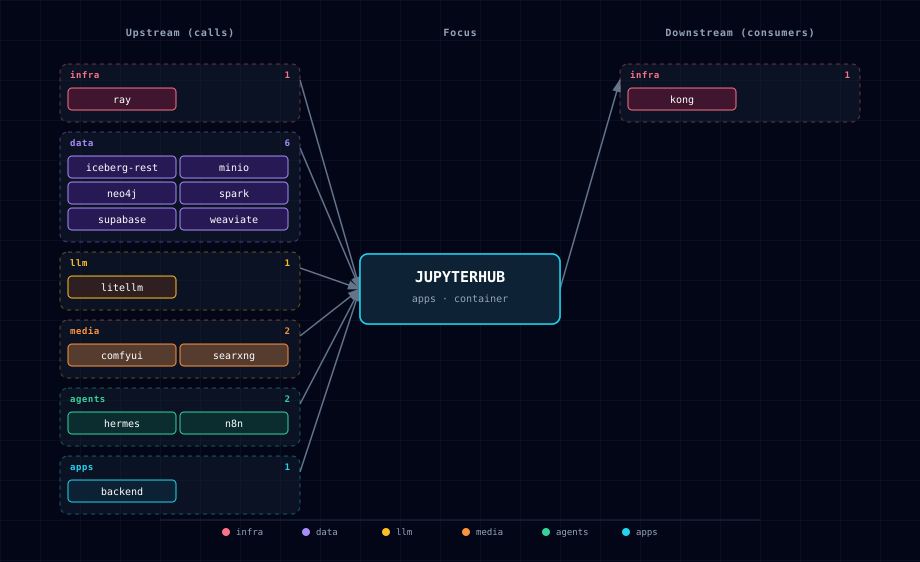

# 5.2.21. JupyterHub - Data Science IDE

**Port:** 63094
**Category:** Application Tier
**Primary dependencies:** PostgreSQL, Redis, LiteLLM (gateway to Ollama / cloud LLMs), Weaviate, Neo4j, MinIO, Iceberg REST, Spark — see §15 (Dependencies & Integrations) for the full upstream set (Ray, Redpanda, ComfyUI, n8n, backend, SearXNG, Hermes, MLflow, Label Studio, …).

---

## 1. Overview

JupyterHub provides an interactive Jupyter Lab environment pre-configured with access to all Atlas services. It's designed for data scientists and AI engineers to experiment, prototype, and develop AI applications.

## 2. Quick Start

### 2.1. Access JupyterHub

```bash
# Start the stack (JupyterHub enabled by default)
./start.sh

# Access at: http://localhost:63094
```

### 2.2. Disable JupyterHub

```bash
# Temporarily disable
./start.sh --jupyterhub-source disabled

# Permanently disable (edit .env)
JUPYTERHUB_SOURCE=disabled
```

## 3. Features

- **Pre-installed AI Libraries**: OpenAI SDK (pointed at LiteLLM), LangChain, LlamaIndex, Transformers, Chonkie, Ragas
- **Database Clients**: Weaviate, Neo4j, PostgreSQL, Redis, Supabase
- **Lakehouse Clients**: PySpark Connect, `boto3`, `s3fs`, `pyiceberg`, `pyarrow`, and `duckdb` for MinIO + Iceberg REST workflows
- **Financial Research Kit**: OpenBB + CCXT libraries and a guarded paper-portfolio notebook for read-only market research
- **Sample Notebooks**: 15 ready-to-use notebooks (00-14) demonstrating service integration
- **Persistent Storage**: All notebooks saved in Docker volumes
- **Environment Variables**: Auto-configured connections to all services
- **Multi-kernel runtime**: Python 3 (default) plus **Scala 2.13** and **Scala 3** kernels via Almond. Pick one from JupyterLab's launcher or VS Code's kernel picker. See §11.
- **VS Code-ready**: configured for remote-Jupyter access out of the box. Open local `.ipynb` files in VS Code and run them on this container as the kernel. See §10.

## 4. Configuration

### 4.1. Environment Variables (`.env`)

```bash
JUPYTERHUB_SOURCE=container     # Options: container, disabled
# Maintained quay.io home of the Jupyter Docker Stacks, pinned to python-3.11.10.
JUPYTERHUB_IMAGE=quay.io/jupyter/datascience-notebook:python-3.11.10
JUPYTERHUB_PORT=63094
JUPYTERHUB_TOKEN=               # Optional: authentication token
BACKEND_NOTEBOOK_API_TOKEN=     # Auto-generated; scoped Backend bearer
```

> **Performance Tip**: The pinned `python-3.11.10` tag keeps Docker layer caching stable (5-10 s rebuilds); a moving `:latest` tag would force a full 8-10 min rebuild on every start.

### 4.2. Authentication

- **No token set**: Auto-generated token shown in logs
- **Custom token**: Set `JUPYTERHUB_TOKEN` in `.env`
- **View token**: `docker logs ${PROJECT_NAME}-jupyterhub | grep token`

`BACKEND_NOTEBOOK_API_TOKEN` is separate from Jupyter's login token. Atlas
injects it into the server-side notebook environment so the bundled Chonkie
and Ragas notebooks can call the Backend's stateless `/api/chunk` and
`/api/rag/evaluate` endpoints; it does not grant access to memory, research,
media, storage, workflow, job, or ingestion operations. Do not print it or
persist it in notebook output. See `services/backend/README.md` for the full
route-scoping contract. JupyterHub remains an operator-trusted engineering
environment with direct database and service credentials; it is not a
hostile multi-tenant sandbox. The unused Supabase service-role key is
deliberately not injected.

## 5. Sample Notebooks

| Notebook | Description |
|----------|-------------|
| `00_environment_check.ipynb` | Inspect configured core integrations and run bounded HTTP/database connectivity probes without printing credential-bearing URLs. |
| `01_litellm_basics.ipynb` | LLM inference via the LiteLLM gateway (Ollama upstream) |
| `02_langchain_rag.ipynb` | RAG pipeline with Weaviate |
| `03_neo4j_graphs.ipynb` | Knowledge graph queries |
| `04_supabase_data.ipynb` | Database and storage operations |
| `05_comfyui_images.ipynb` | AI image generation |
| `06_n8n_workflows.ipynb` | Workflow automation |
| `07_ray_cluster.ipynb` | Distributed compute on the Ray cluster |
| `08_scala_basics.ipynb` | Scala 3 syntax, `import $ivy` dependency loading, calling LiteLLM from Scala, Scala-3 enums + extension methods. Opens on the `scala3` kernel. |
| `09_spark_connect.ipynb` | Distributed Spark via the `spark-connect` sidecar (DataFrame/SQL + an s3a MinIO round-trip). Requires `SPARK_SOURCE != disabled`. |
| `10_spark_scala.ipynb` | The Scala counterpart to 09 — Spark Connect from the **Scala 2.13** kernel, including the same DataFrame, SQL, and MinIO round-trip checks. |
| `11_financial_research_kit.ipynb` | Read-only OpenBB + CCXT market research, paper portfolio analytics, optional MinIO datasets, MLflow paper-run metrics, and LiteLLM summaries. No live trading. |
| `12_iceberg_advanced_sql.ipynb` | Spark Connect advanced Iceberg smoke: `MERGE INTO`, `VERSION AS OF`, branch/WAP, schema evolution, nested JSON, Structured Streaming, and table maintenance. |
| `13_chonkie_chunking.ipynb` | Compare Chonkie token, recursive, and optional semantic chunking, then call the Backend `/api/chunk` runtime endpoint. |
| `14_ragas_evaluation.ipynb` | Evaluate RAG answers with Ragas metrics and the Backend `/api/rag/evaluate` runtime endpoint. |

The repository gate keeps this inventory synchronized with the image welcome
page and environment-check notebook, compiles every Python code cell, and
requires each direct third-party import to be declared in the image
requirements. Service-dependent execution remains an explicit live smoke test.

## 6. Service Integration Examples

Every notebook talks to LiteLLM via the OpenAI-compatible API — never to Ollama directly. `startup.sh` writes `OPENAI_API_BASE` / `OPENAI_API_KEY` into the work-dir `/home/jovyan/work/.env`; since they aren't in the container's process env, load them with `load_dotenv()` before reading via `os.getenv`. Weaviate, Neo4j, and the Postgres/Supabase clients connect directly using the equivalent auto-injected `WEAVIATE_URL` / `NEO4J_URI` / `NEO4J_USER` / `NEO4J_PASSWORD` env vars. Spark Connect (`SPARK_REMOTE`, default `sc://spark-connect:15002`, requires `SPARK_SOURCE != disabled`) and the MinIO/Iceberg lakehouse clients (`boto3`, `pyiceberg`, `duckdb` against `AWS_ENDPOINT_URL_S3` / `ICEBERG_REST_URI` / `ICEBERG_WAREHOUSE`) work the same way — connection details are pre-wired, no credentials to hand-assemble.

Working, runnable examples for each of these live in the sample notebooks (§5): `01_litellm_basics.ipynb`, `02_langchain_rag.ipynb`, `03_neo4j_graphs.ipynb`, and `09_spark_connect.ipynb`. For the advanced Iceberg/Spark lakehouse validation flow (`MERGE INTO`, `VERSION AS OF`, Structured Streaming, table maintenance), see `12_iceberg_advanced_sql.ipynb` or run it directly from the repository root with `scripts/smoke-iceberg-advanced-sql.sh spark-connect` — see [`docs/deployment/iceberg-advanced-smoke.md`](../../docs/deployment/iceberg-advanced-smoke.md) for the full smoke-test contract.

## 7. Data Persistence

- **Work Directory**: `/home/jovyan/work` - Persisted in `jupyterhub-data` volume
- **Sample Notebooks**: `/home/jovyan/notebooks` - Read-only, copy to `work/` to modify
- **Shared Config**: `/shared` - Weaviate configuration (read-only)

## 8. Custom Packages

### 8.1. Temporary Installation

```bash
!pip install package-name
```

### 8.2. Permanent Installation

1. Edit `services/jupyterhub/build/requirements.txt`
2. Rebuild: `docker compose build jupyterhub`
3. Restart: `./stop.sh && ./start.sh`

## 9. Advanced Configuration

### 9.1. GPU-aware workflows

JupyterHub itself is configured through `.env` and the stack startup flow. Prefer enabling GPU-backed upstream services through their SOURCE variables, for example `LLM_PROVIDER_SOURCE=ollama-container-gpu`, `COMFYUI_SOURCE=container-gpu`, or `MULTI2VEC_CLIP_SOURCE=container-gpu`.

Avoid direct `docker-compose.yml` edits for normal operation; local compose edits are unsupported experiments and can be overwritten or invalidated by future stack changes.

### 9.2. Multi-user Setup

For authentication, create `jupyterhub_config.py`:

```python
c.JupyterHub.authenticator_class = 'firstuseauthenticator.FirstUseAuthenticator'
```

## 10. Connecting from VS Code (run local notebooks on this container)

VS Code's Jupyter extension can use this container as the **remote kernel** for any `.ipynb` you open on your laptop. Notebook cells execute inside the container — with the full ML toolchain — while editor, history, and source control stay on your local machine.

### 10.1. One-time setup

1. **Install Microsoft's Jupyter extension** in VS Code (`ms-toolsai.jupyter`).
2. **Start the stack** so this container is running:
   ```bash
   ./start.sh
   ```
3. **Grab the token.** `JUPYTERHUB_TOKEN` in `.env` is optional — `service.yml` defaults it to empty, in which case Jupyter Server auto-generates one and prints it to the container's stdout on every restart. Pick whichever applies:
   ```bash
   # If you set JUPYTERHUB_TOKEN in .env manually:
   grep '^JUPYTERHUB_TOKEN=' .env

   # Otherwise (default), grep the auto-generated value out of the logs:
   docker logs ${PROJECT_NAME}-jupyterhub 2>&1 | grep -oE 'token=[a-f0-9]+' | tail -1
   ```
   Treat the token like a password. It changes every restart unless you pin it in `.env`.

### 10.2. Connect

1. Open any local `.ipynb` in VS Code.
2. Click the **kernel selector** in the top-right of the notebook → **"Select Another Kernel"** → **"Existing Jupyter Server"** → **"Enter the URL of the running Jupyter server"**.
3. Paste one of these URLs, substituting the actual token **and your actual ports**. The ports below are the defaults for `BASE_PORT=63000`; if you launched with `--base-port`, use your stack's real `JUPYTERHUB_PORT` (direct) and Kong HTTP port (aliased) from `.env` — e.g. on `--base-port 64000` the direct port is `64094`. `grep -E '^(JUPYTERHUB_PORT|KONG_HTTP_PORT)=' .env` prints both.
   - Direct port: `http://localhost:${JUPYTERHUB_PORT}/?token=<JUPYTERHUB_TOKEN>` (default `63094`)
   - Kong-aliased (after `./start.sh --setup-hosts`): `http://jupyter.localhost:${KONG_HTTP_PORT}/?token=<JUPYTERHUB_TOKEN>` (default `63000`)
4. When VS Code prompts to **remember the server**, give it a name (e.g. `atlas`). The server now appears in every future kernel-picker.
5. VS Code then asks which **kernel** to use on that server. Pick **Python 3 (ipykernel)**, **Scala 2.13**, or **Scala 3** depending on the notebook.

### 10.3. What's pre-configured on the stack side

The container's `ENTRYPOINT` (`services/jupyterhub/build/Dockerfile`) wraps the upstream `start-notebook.sh` boot script, and the compose `command:` override (`services/jupyterhub/compose.yml`) appends three `--ServerApp.*` flags so the upstream server accepts VS Code's remote-kernel workflow across the Docker network: `allow_origin` opens the CORS/WebSocket origin check (VS Code's webview origin would otherwise be rejected), `allow_remote_access` lets the non-loopback, container-bridge connection through the pre-auth IP check, and `disable_check_xsrf=False` keeps CSRF protection on (already Jupyter's default; listed explicitly as a visible knob). None of this loosens authentication — the `JUPYTERHUB_TOKEN` remains the actual auth gate on every request. To tighten the origin allowlist beyond `*`, set `JUPYTER_ALLOW_ORIGIN` to a comma-separated list in `.env` and restart. See the `ENTRYPOINT` / `command:` directives in the Dockerfile and compose fragment for the exact dispatch chain.

### 10.4. Notebook layout: where files live

- The notebook file lives **on your laptop** (wherever you opened it in VS Code).
- The kernel runs **in the container**. Anything `os.getcwd()` returns is the container's filesystem, not your laptop's.
- The `/home/jovyan/work` directory is the persistent volume (`jupyterhub-data`). Use this if you need files (datasets, models) to survive container restarts.
- To open a notebook that ALREADY lives in the container (e.g., a sample), use VS Code's "Open Folder over SSH" workflow or browse to `http://localhost:63094` for the native JupyterLab UI. The VS Code remote-kernel flow above is for the inverse case: local file, remote kernel.

### 10.5. Troubleshooting

- **Token rejected.** Re-read `.env`; check the variable hasn't been hand-rotated. `docker logs ${PROJECT_NAME}-jupyterhub | grep -i token` shows the value the container actually started with.
- **Kernel starts but cells hang.** WebSocket upgrade failure — confirm the three `--ServerApp.*` flags are present in `docker inspect ${PROJECT_NAME}-jupyterhub --format='{{json .Config.Cmd}}'`. If the compose file was edited but the container wasn't rebuilt, run `./stop.sh && ./start.sh`.
- **CORS error in VS Code's developer console.** `JUPYTER_ALLOW_ORIGIN` was tightened past what VS Code uses. Set it to `*` temporarily; the Jupyter token is still required for any kernel operation.
- **"Address already in use" on 63094.** `./start.sh --base-port 64000` to relocate the whole stack.
- **Scala 2.13 / Scala 3 missing from the kernel picker.** The running image predates the Almond layer in `services/jupyterhub/build/Dockerfile`. Rebuild with `docker compose up jupyterhub --build --no-deps -d` (no full-stack restart needed). Confirm via `docker exec ${PROJECT_NAME}-jupyterhub jupyter kernelspec list` — both `scala213` and `scala3` should appear alongside `python3`. See §11 for full kernel-install details.
- **Server connects but no kernels listed.** Look at the URL VS Code stored — it must include `/?token=<value>`. If you pasted the URL without the token, VS Code thinks it's connected but every kernel request 403s. `Jupyter: Specify Jupyter Server for Connections` → re-enter the URL with the token suffix.
- **Cell output appears in the wrong notebook.** VS Code occasionally caches a stale kernel binding when you switch between two notebooks on the same server. Right-click the notebook tab → `Restart Kernel` resets the binding.

## 11. Multi-kernel runtime (Python + Scala)

This container ships **three kernels**:

| Kernel ID | Display name | Versions | Source |
|---|---|---|---|
| `python3` | Python 3 (ipykernel) | matches the `JUPYTERHUB_IMAGE` (currently 3.11) | upstream `jupyter/datascience-notebook` |
| `scala213` | Scala 2.13 | Scala `2.13.16`, Almond `0.14.5` | installed at image build time via Coursier |
| `scala3` | Scala 3 | Scala `3.4.3`, Almond `0.14.5` | installed at image build time via Coursier |

**To pick a Scala kernel:**

- **In JupyterLab:** open the launcher (`+` button) and click the Scala tile.
- **In VS Code:** kernel-picker → "Scala 2.13" or "Scala 3".

**To verify the kernels are actually installed in the running container:**

```bash
docker exec ${PROJECT_NAME}-jupyterhub jupyter kernelspec list
```

You should see `scala213` and `scala3` alongside `python3` (and `ir`, `julia-1.9` from the upstream image). If only `ir` / `julia-1.9` / `python3` appear, the container was built before the Scala layer was added — rebuild with the args at the top of the Dockerfile baked in:

```bash
docker compose up jupyterhub --build --no-deps -d
```

`--no-deps` skips restarting the entire stack; only the jupyterhub container is replaced. The image gains ~600 MB of toolchain on this build, mostly cached after the first run.

**Smoke-test a Scala cell** without opening JupyterLab — useful in CI / cold-start verification:

```bash
docker exec ${PROJECT_NAME}-jupyterhub bash -lc \
  "echo 'val x = (1 to 5).map(_ * 2).sum; println(s\"sum=\$x\")' | jupyter run --kernel=scala3 /dev/stdin"
```

The expected last line is `sum=30`. The first run for each Scala kernel resolves Almond's classpath and can take 30-60 s; subsequent runs are sub-second.

Scala/Almond versions are pinned via build args near the top of `services/jupyterhub/build/Dockerfile`; edit and rebuild there to change them or to drop the Scala toolchain entirely.

## 12. Architecture

JupyterHub runs inside the Docker Compose network and receives environment variables for the services that are enabled. It reaches LLMs through the always-on LiteLLM gateway (`LITELLM_BASE_URL` / `LITELLM_API_KEY`, also exported as `OPENAI_API_BASE` / `OPENAI_API_KEY`) and connects directly to Weaviate, Neo4j, PostgreSQL/Supabase, Redis, MinIO, Iceberg REST, Spark Connect, ComfyUI, n8n, STT/TTS, and document-processing services when those services are available.

For the current high-level stack diagram, see [Architecture Diagram](../../docs/diagrams/architecture.svg).

## 13. Resources

- [Jupyter Lab Documentation](https://jupyterlab.readthedocs.io/)
- [JupyterHub Documentation](https://jupyterhub.readthedocs.io/)
- [Almond — Scala kernel for Jupyter](https://almond.sh/)
- [VS Code Jupyter extension](https://marketplace.visualstudio.com/items?itemName=ms-toolsai.jupyter)
- [Sample Notebooks](./build/notebooks/)
- [Atlas Docs](../../README.md)

## 14. Support

- **Logs**: `docker logs ${PROJECT_NAME}-jupyterhub`
- **Issues**: [GitHub Issues](https://github.com/thekaveh/atlas/issues)
- **Docs**: [Full Documentation](../../README.md)

## 15. Dependencies & Integrations

### 15.1. Current — Upstream (this service calls)

| Service | Category |
|---|---|
| ray | infra |
| iceberg-rest | data |
| minio | data |
| neo4j | data |
| redis | data |
| redpanda | data |
| spark | data |
| supabase | data |
| weaviate | data |
| litellm | llm |
| comfyui | media |
| docling | media |
| searxng | media |
| stt-provider | media |
| tts-provider | media |
| hermes | agents |
| n8n | agents |
| backend | apps |
| label-studio | apps |
| mlflow | apps |

### 15.2. Current — Downstream (services that call this)

| Service | Category |
|---|---|
| kong | infra |

### 15.3. Architecture diagram



[Open the interactive HTML diagram](./architecture.html) for a full-screen view.

### 15.4. Future — Missing pair integrations

- **jupyterhub ↔ backend** — *Why:* the FastAPI backend already aggregates LiteLLM, Weaviate, Neo4j, ComfyUI, and Hermes so notebooks should reuse it instead of hand-rolling per-upstream clients. *Mechanism:* adaptive env `BACKEND_BASE_URL=http://backend:8000` consumed via `httpx` against `/v1/...` routes. *Effort:* small. *Confidence:* high.
- **jupyterhub ↔ hermes** — *Why:* researchers want to drive the tool-using agent runtime from notebooks (chain prompts, inspect intermediate tool calls) without going through Open WebUI. *Mechanism:* `HERMES_AGENT_MODEL=hermes-agent` env hint plus a sample notebook calling the existing `OPENAI_API_BASE` LiteLLM alias. *Effort:* small. *Confidence:* high.
- **jupyterhub ↔ local-deep-researcher** — *Why:* long LangGraph deep-research runs should be launchable from a notebook and streamable into a dataframe. *Mechanism:* `DEEP_RESEARCHER_BASE_URL=http://local-deep-researcher:2024` plus an SSE client snippet against LangGraph's `/runs/stream`. *Effort:* medium. *Confidence:* medium.
- **jupyterhub ↔ openclaw** — *Why:* unattended notebook jobs (training, sweeps, embeddings) should ping Slack/Discord when they finish. *Mechanism:* inject `OPENCLAW_WEBHOOK_URL=http://openclaw-gateway:<port>/webhook/notify` and post JSON from a util helper. *Effort:* small. *Confidence:* medium.

### 15.5. Future — Candidate new services

_No high-confidence opportunities identified._

### 15.6. Future — Unused features in this service

- **Real multi-user JupyterHub (DockerSpawner + Authenticator)** — *Why pursue:* today the container is single-user `jupyter/datascience-notebook` despite the service name, so a proper Hub with `DockerSpawner` and `NativeAuthenticator`/OAuth would let multiple humans share the stack. *Effort:* large.
- **Jupyter AI extension wired to LiteLLM** — *Why pursue:* `jupyter-ai` accepts any OpenAI-compatible base URL, so pointing it at `LITELLM_BASE_URL` exposes every gateway model as a first-class `%ai` magic. *Effort:* small.
- **GPU enablement for the notebook container** — *Why pursue:* the image already ships PyTorch + PyG but the manifest exposes no `container-gpu` source, so heavy training falls back to CPU even when the host has a GPU. *Effort:* medium.
- **jupyter-server-proxy for ComfyUI/n8n** — *Why pursue:* the proxy is already in `requirements.txt` but unused; mounting ComfyUI and n8n behind `/proxy/<service>/` would embed those UIs in iframes without leaving the lab. *Effort:* small.
- **Persistent kernel state via ipyparallel** — *Why pursue:* long-running RAG/agent loops lose state on kernel restart; an `ipyparallel` cluster (workers as sidecars) would survive restarts. *Effort:* medium.

## 16. Troubleshooting

### 16.1. Cannot Access JupyterHub

**Check if running:**
```bash
docker ps | grep jupyterhub
```

**View logs:**
```bash
docker logs ${PROJECT_NAME}-jupyterhub
```

### 16.2. Token Not Working

**Get current token:**
```bash
docker logs ${PROJECT_NAME}-jupyterhub | grep "token="
```

**Set permanent token:**
```bash
# In .env
JUPYTERHUB_TOKEN=my-secret-token
```

### 16.3. Port Already in Use

```bash
# In .env
JUPYTERHUB_PORT=64094  # Use different port (offset 94 from BASE_PORT)
```

### 16.4. Out of Memory

Increase Docker memory:
- Docker Desktop → Settings → Resources → Memory
- Recommended: 8GB+ for data science workloads
