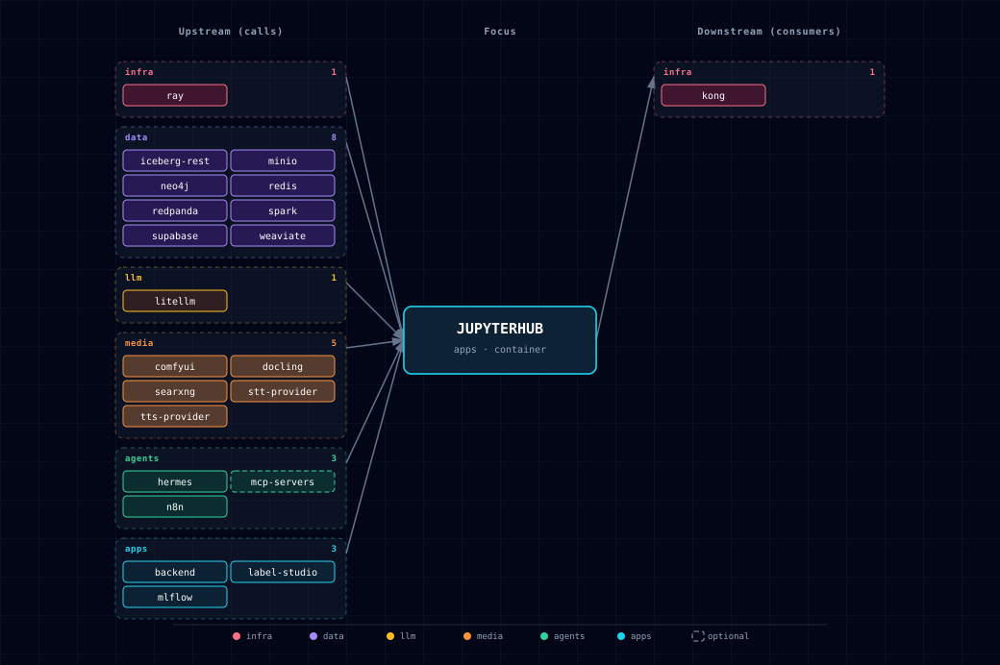

# 5.2.22. JupyterHub - Data Science IDE

- **Port:** `JUPYTERHUB_PORT` (default 63094 with `BASE_PORT=63000`)
- **Category:** `apps`
- **Primary dependencies:** PostgreSQL, Redis, LiteLLM (gateway to Ollama and cloud LLMs), Weaviate, Neo4j, MinIO, Iceberg REST and Spark. §15 lists the full upstream set.

---

## 1. Overview

JupyterHub provides a JupyterLab server pre-configured for Atlas's declared notebook integrations. Data scientists and AI engineers use it to experiment with LLM, RAG, lakehouse and ML workloads against the running stack.

It is one shared, token-protected JupyterLab server, not a multi-user JupyterHub. §9.2 explains this limit.

## 2. Quick Start

### 2.1. Access JupyterHub

`JUPYTERHUB_SOURCE` defaults to `container`. The `gen-ai-rag` and `gen-ai-creative` tracks do not include JupyterHub and set it to `disabled`.

```bash
# Start the stack
./start.sh

# Open http://localhost:${JUPYTERHUB_PORT} (default 63094)
```

The login page asks for the Jupyter token. §4.2 shows how to read it.

### 2.2. Disable JupyterHub

```bash
# Temporarily disable
./start.sh --jupyterhub-source disabled

# Permanently disable (edit .env)
JUPYTERHUB_SOURCE=disabled
```

## 3. Features

- **Pre-installed AI Libraries**: OpenAI SDK (pointed at LiteLLM), LangChain, LlamaIndex, Transformers, Chonkie, Ragas
- **Database Clients**: Weaviate, Neo4j, PostgreSQL, Redis, Supabase
- **Lakehouse Clients**: PySpark Connect, `boto3`, `s3fs`, `pyiceberg`, `pyarrow`, and `duckdb` for MinIO + Iceberg REST workflows
- **Financial Research Kit**: OpenBB + CCXT libraries and a guarded paper-portfolio notebook for read-only market research
- **Sample Notebooks**: 16 ready-to-use notebooks (00-15) demonstrating service integration
- **Persistent Storage**: Your work is saved in the `jupyterhub-data` volume (§7)
- **Environment Variables**: Auto-configured connections for the integrations declared in `services/jupyterhub/service.yml`; optional endpoints, including `MCP_SERVERS_URL`, remain empty when their source is disabled
- **Multi-kernel runtime**: Python 3 (default), R, Julia 1.12, **Scala 2.13**, and **Scala 3**. Pick one from JupyterLab's launcher or VS Code's kernel picker. See §11.
- **VS Code-ready**: configured for remote-Jupyter access out of the box. Open local `.ipynb` files in VS Code and run them on this container as the kernel. See §10.

## 4. Configuration

### 4.1. Environment Variables (`.env`)

```bash
JUPYTERHUB_SOURCE=container     # Options: container, disabled
# Maintained quay.io home of the Jupyter Docker Stacks, pinned to a reviewed release digest.
JUPYTERHUB_IMAGE=quay.io/jupyter/datascience-notebook:2026-08-24@sha256:e5029672ab8a861345f117dc466a4dab91ad7c299f3c7c853b9b193860b16aaf
JUPYTERHUB_PORT=63094
JUPYTERHUB_TOKEN=               # Optional: authentication token
BACKEND_NOTEBOOK_API_TOKEN=     # Auto-generated; scoped Backend bearer
DOCLING_API_TOKEN=              # Auto-generated Docling bearer; server-side only
PARAKEET_API_TOKEN=             # Auto-generated Parakeet bearer; server-side only
```

The image is pinned by digest, so builds are reproducible and a base change happens only through a reviewed pin update.

### 4.2. Authentication

- **No token set**: Auto-generated token shown in logs
- **Custom token**: Set `JUPYTERHUB_TOKEN` in `.env`
- **View token**: `docker logs ${PROJECT_NAME}-jupyterhub 2>&1 | grep token=`

`BACKEND_NOTEBOOK_API_TOKEN` is not the Jupyter login token. It lets the Chonkie and Ragas notebooks call the Backend's stateless `/api/chunk` and `/api/rag/evaluate`. It grants no memory, research, media, storage, workflow, job or ingestion route (see `services/backend/README.md`). Do not print it or keep it in notebook output.

JupyterHub holds direct database and service credentials. Treat it as an operator-trusted workspace, not a multi-tenant sandbox. Atlas does not inject the Supabase service-role key.

Direct notebook calls to Docling and Atlas-managed Parakeet must send the matching bearer token from the server-side environment, for example `headers={"Authorization": f"Bearer {os.environ['DOCLING_API_TOKEN']}"}`. The environment-check notebook only checks that the tokens are set. Notebooks must not print these tokens or keep them in cell output. Speaches and whisper.cpp do not consume `PARAKEET_API_TOKEN`.

## 5. Sample Notebooks

The notebooks read MinIO bucket names from the `MINIO_BUCKET_*` variables (`MINIO_BUCKET_SPARK_HISTORY`, `MINIO_BUCKET_ICEBERG_LANDING`, …) and fall back to the default names. A renamed bucket needs no notebook edit.

| Notebook | Description |
|----------|-------------|
| `00_environment_check.ipynb` | Inspect configured core integrations and run bounded HTTP/database connectivity probes without printing credential-bearing URLs. |
| `01_litellm_basics.ipynb` | Chat, streaming and embeddings through the LiteLLM gateway, using `LITELLM_DEFAULT_MODEL` / `LITELLM_EMBEDDING_MODEL`. |
| `02_langchain_rag.ipynb` | RAG pipeline with Weaviate. With Weaviate disabled it says so and skips the Weaviate cells. |
| `03_neo4j_graphs.ipynb` | Knowledge graph queries |
| `04_supabase_data.ipynb` | Database and storage operations |
| `05_comfyui_images.ipynb` | AI image generation |
| `06_n8n_workflows.ipynb` | Workflow automation |
| `07_ray_cluster.ipynb` | Distributed compute on the Ray cluster. Currently fails at `ray.init()`: the kernel runs Python 3.13 and the Ray image 3.10 (see the Ray README, §6). |
| `08_scala_basics.ipynb` | Scala 3 syntax, `import $ivy` dependency loading, calling LiteLLM from Scala, Scala-3 enums + extension methods. Opens on the `scala3` kernel. |
| `09_spark_connect.ipynb` | Distributed Spark via the `spark-connect` sidecar (DataFrame/SQL + an s3a MinIO round-trip). Requires `SPARK_SOURCE != disabled`. |
| `10_spark_scala.ipynb` | The Scala counterpart to 09 — Spark Connect from the **Scala 2.13** kernel, including the same DataFrame, SQL, and MinIO round-trip checks. |
| `11_financial_research_kit.ipynb` | Read-only OpenBB + CCXT market research, paper portfolio analytics, optional MinIO datasets, MLflow paper-run metrics, and LiteLLM summaries. No live trading. |
| `12_iceberg_advanced_sql.ipynb` | Spark Connect advanced Iceberg smoke: `MERGE INTO`, `VERSION AS OF`, branch/WAP, schema evolution, nested JSON, Structured Streaming, and table maintenance. |
| `13_chonkie_chunking.ipynb` | Compare Chonkie token, recursive, and optional semantic chunking, then call the Backend `/api/chunk` runtime endpoint. |
| `14_ragas_evaluation.ipynb` | Evaluate RAG answers with Ragas metrics and the Backend `/api/rag/evaluate` runtime endpoint. |
| `15_mcp_clients.ipynb` | Discovers and invokes Curated MCP tools through FastMCP 3, exercises error handling, and prototypes an in-process tool. The bootstrapper injects `MCP_SERVERS_URL` only when `MCP_SERVERS_SOURCE=container` and leaves it empty when the curated package is disabled. |

The repository gate keeps this inventory in sync with the image welcome page and the environment-check notebook. It compiles every Python code cell and checks that each direct third-party import is declared in the image requirements. Service-dependent execution remains an explicit live smoke test.

## 6. Service Integration Examples

Notebooks reach LLMs only through LiteLLM's OpenAI-compatible API, never Ollama directly. `startup.sh` writes `OPENAI_API_BASE` and `OPENAI_API_KEY` to `/home/jovyan/work/.env`. They are not in the process environment, so call `load_dotenv()` before `os.getenv`.

Other clients read injected process variables, so no credentials need hand-assembly. A variable is empty when its service is disabled.

| Client | Variables |
|---|---|
| LiteLLM | `LITELLM_BASE_URL`, `LITELLM_API_KEY`, `LITELLM_DEFAULT_MODEL`, `LITELLM_EMBEDDING_MODEL` |
| Postgres, Redis, Supabase | `DATABASE_URL` (scoped notebook role), `REDIS_URL` (database 3), `SUPABASE_URL`, `SUPABASE_ANON_KEY` |
| Weaviate, Neo4j | `WEAVIATE_URL`, `NEO4J_URI`, `NEO4J_USER`, `NEO4J_PASSWORD` |
| Spark Connect | `SPARK_REMOTE` (default `sc://spark-connect:15002`; needs `SPARK_SOURCE=container`) |
| Ray | `RAY_ADDRESS` |
| MLflow | `MLFLOW_TRACKING_URI` (`http://mlflow:5000`) |
| Redpanda (Kafka) | `SPARK_KAFKA_BOOTSTRAP_SERVERS` |
| MinIO, Iceberg (`boto3`, `pyiceberg`, `duckdb`) | `AWS_ENDPOINT_URL_S3`, `AWS_ACCESS_KEY_ID`, `AWS_SECRET_ACCESS_KEY`, `ICEBERG_REST_URI`, `ICEBERG_WAREHOUSE`, `PYICEBERG_CATALOG__REST__*` |
| Other services | `COMFYUI_BASE_URL`, `N8N_BASE_URL`, `SEARXNG_URL`, `BACKEND_API_URL`, `HERMES_ENDPOINT`, `LABEL_STUDIO_URL`, `MCP_SERVERS_URL`, `STT_ENDPOINT`, `TTS_ENDPOINT`, `DOCLING_ENDPOINT` |

Three limits apply:
- DuckDB reads the key and region from the environment, but not the endpoint. Before `read_parquet('s3://…')`, run `CREATE SECRET (TYPE s3, ENDPOINT 'minio:9000', URL_STYLE 'path', USE_SSL false)`. Otherwise DuckDB targets AWS.
- The JupyterHub MinIO account is read-only on the `lakehouse` bucket by design. Write tables through Spark Connect, not PyIceberg or boto3.
- `ray.init()` from the notebook kernel fails: the kernel runs Python 3.13 and the Ray image Python 3.10. Submit Ray work through the Ray Jobs REST API instead. The Ray README troubleshooting section has an example.

Docling and Parakeet calls need a bearer token (§4.2). Runnable examples are in the sample notebooks (§5): `01_litellm_basics.ipynb`, `02_langchain_rag.ipynb`, `03_neo4j_graphs.ipynb` and `09_spark_connect.ipynb`.

For the advanced Iceberg/Spark validation flow (`MERGE INTO`, `VERSION AS OF`, Structured Streaming, table maintenance), see `12_iceberg_advanced_sql.ipynb`. You can also run `scripts/smoke-iceberg-advanced-sql.sh spark-connect` from the repository root. The [Iceberg advanced smoke](../../docs/operations/iceberg-advanced-smoke.md) page has the full contract.

### 6.1. Connecting to the lakehouse from Python

The image ships the lakehouse clients `boto3`, `s3fs`, `pyiceberg[s3fs]`, `pyarrow` and `duckdb`, pre-wired against MinIO and the Iceberg REST catalog. To confirm connectivity, load the catalog with `pyiceberg.catalog.load_catalog` and call `list_namespaces()`:

```python
import os
from pyiceberg.catalog import load_catalog

catalog = load_catalog(
    "rest",
    uri=os.environ["ICEBERG_REST_URI"],
    warehouse=os.environ["ICEBERG_WAREHOUSE"],
)
print(catalog.list_namespaces())
```

MinIO access goes through `boto3`/`s3fs` against `AWS_ENDPOINT_URL_S3`. To check from the host that the client packages import:

```bash
docker exec ${PROJECT_NAME}-jupyterhub python -c \
  "import boto3, s3fs, pyarrow, duckdb; from pyiceberg.catalog import load_catalog; print('ok')"
```

## 7. Data Persistence

- **Work Directory**: `/home/jovyan/work` - Persisted in `jupyterhub-data` volume
- **Sample Notebooks**: `/home/jovyan/notebooks` - Read-only bind mount of `services/jupyterhub/build/notebooks/`. Each start copies any missing notebook into `work/examples/` and never overwrites an existing copy. Delete a copy to get the updated version.
- **Shared Config**: `/shared` - Weaviate configuration (read-only)
- **Generated `.env`**: `startup.sh` rewrites `work/.env` (owner-only) on every start. It holds the LiteLLM key and database and MinIO secrets.

`./stop.sh --cold` removes `jupyterhub-data` and everything in `work/`.

## 8. Custom Packages

### 8.1. Temporary Installation

```bash
!pip install package-name
```

### 8.2. Permanent Installation

1. Edit `services/jupyterhub/build/requirements.txt`.
2. Run `./start.sh`. It rebuilds local images whose build inputs changed.

## 9. Advanced Configuration

### 9.1. GPU-aware workflows

JupyterHub itself is configured through `.env` and the stack startup flow. Prefer enabling GPU-backed upstream services through their SOURCE variables, for example `LLM_PROVIDER_SOURCE=ollama-container-gpu`, `COMFYUI_SOURCE=container-gpu`, or `MULTI2VEC_CLIP_SOURCE=container-gpu`.

Avoid direct `docker-compose.yml` edits for normal operation; local compose edits are unsupported experiments and can be overwritten or invalidated by future stack changes.

### 9.2. Multi-user access

Not supported. Despite the service name, the container runs one `start-notebook.sh` JupyterLab server, not a JupyterHub spawner. There is no authenticator to configure, and no `jupyterhub_config.py` is read. The only access control is the `JUPYTERHUB_TOKEN` token (passed to the server as `JUPYTER_TOKEN`); everyone who has it shares one server and one home directory. See §17 (Capabilities & limitations) for the full limitation.

## 10. Connecting from VS Code (run local notebooks on this container)

VS Code's Jupyter extension can use this container as the **remote kernel** for any `.ipynb` you open on your laptop. Notebook cells execute inside the container — with the full ML toolchain — while editor, history, and source control stay on your local machine.

### 10.1. One-time setup

1. **Install Microsoft's Jupyter extension** in VS Code (`ms-toolsai.jupyter`).
2. **Start the stack** so this container is running:
   ```bash
   ./start.sh
   ```
3. **Grab the token.** `JUPYTERHUB_TOKEN` in `.env` is optional and empty by default (`service.yml`). When it is empty, Jupyter Server generates a token and prints it to the container's stdout on every restart. Use whichever applies:
   ```bash
   # If you set JUPYTERHUB_TOKEN in .env manually:
   grep '^JUPYTERHUB_TOKEN=' .env

   # Otherwise (default), grep the auto-generated value out of the logs:
   docker logs ${PROJECT_NAME}-jupyterhub 2>&1 | grep -oE 'token=[a-f0-9]+' | tail -1
   ```
   Treat the token like a password. It changes every restart unless you pin it in `.env`.

### 10.2. Connect

1. Open any local `.ipynb` in VS Code.
2. Click the **kernel selector** in the top-right of the notebook. Then choose **"Select Another Kernel"** → **"Existing Jupyter Server"** → **"Enter the URL of the running Jupyter server"**.
3. Paste one of these URLs, substituting the actual token **and your actual ports**. The ports below are the defaults for `BASE_PORT=63000`. If you launched with `--base-port`, use `JUPYTERHUB_PORT` (direct) and `KONG_HTTP_PORT` (Kong) from `.env`. For example, `--base-port 64000` gives direct port `64094`. `grep -E '^(JUPYTERHUB_PORT|KONG_HTTP_PORT)=' .env` prints both.
   - Direct port: `http://localhost:${JUPYTERHUB_PORT}/?token=<JUPYTERHUB_TOKEN>` (default `63094`)
   - Kong-aliased (after `./start.sh --setup-hosts`): `http://jupyter.localhost:${KONG_HTTP_PORT}/?token=<JUPYTERHUB_TOKEN>` (default `63000`)
4. When VS Code prompts to **remember the server**, give it a name (e.g. `atlas`). The server now appears in every future kernel-picker.
5. VS Code then asks which **kernel** to use on that server. Pick **Python 3 (ipykernel)**, **R**, **Julia 1.12**, **Scala 2.13**, or **Scala 3** depending on the notebook.

### 10.3. What's pre-configured on the stack side

The image `ENTRYPOINT` (`build/scripts/startup.sh`, set in `services/jupyterhub/build/Dockerfile`) runs the upstream `start-notebook.sh`. The compose `command:` (`services/jupyterhub/compose.yml`) adds three Jupyter Server flags for remote kernels across the Docker network:

- `--ServerApp.allow_origin=${JUPYTER_ALLOW_ORIGIN}`: empty by default, which keeps Jupyter's same-origin check. Token-authenticated clients such as VS Code skip this check.
- `--ServerApp.allow_remote_access=True`: admits connections from the Docker bridge network.
- `--ServerApp.disable_check_xsrf=False`: keeps CSRF protection on (the Jupyter default, listed explicitly).

`JUPYTERHUB_TOKEN` is the access control. Do not set `JUPYTER_ALLOW_ORIGIN` to `*`. With `*`, a page on any other localhost port can use the browser's Jupyter cookie to open a terminal websocket. To admit one browser origin, set `JUPYTER_ALLOW_ORIGIN` to that exact origin in `.env` and restart. Jupyter compares the value as one string, so a comma-separated list matches no origin.

### 10.4. Notebook layout: where files live

- The notebook file lives **on your laptop** (wherever you opened it in VS Code).
- The kernel runs **in the container**. Anything `os.getcwd()` returns is the container's filesystem, not your laptop's.
- The `/home/jovyan/work` directory is the persistent volume (`jupyterhub-data`). Use this if you need files (datasets, models) to survive container restarts.
- To edit a notebook that lives in the container (for example, a sample), open JupyterLab at `http://localhost:${JUPYTERHUB_PORT}` (default `63094`). You can also attach VS Code with the Dev Containers command **Attach to Running Container**. The remote-kernel flow above is for the inverse case: local file, remote kernel.

### 10.5. Troubleshooting

- **Token rejected.** Re-read `.env`; check the variable hasn't been hand-rotated. `docker logs ${PROJECT_NAME}-jupyterhub 2>&1 | grep -i token` shows the value the container actually started with.
- **Kernel starts but cells hang.** WebSocket upgrade failure — confirm the three `--ServerApp.*` flags are present in `docker inspect ${PROJECT_NAME}-jupyterhub --format='{{json .Config.Cmd}}'`. If the compose file was edited but the container wasn't rebuilt, run `./stop.sh && ./start.sh`.
- **CORS error in VS Code's developer console.** Connect with the token URL: token-authenticated requests skip the origin check. If a browser page on another origin must connect, set `JUPYTER_ALLOW_ORIGIN` to that one origin, not `*`.
- **"Address already in use" on 63094.** `./start.sh --base-port 64000` to relocate the whole stack.
- **Scala 2.13 / Scala 3 missing from the kernel picker.** The running image predates the Almond layer in `services/jupyterhub/build/Dockerfile`. Run `./start.sh`, which rebuilds the stale image, or rebuild only this container with `docker compose -p "$PROJECT_NAME" up jupyterhub --build --no-deps -d`. Confirm via `docker exec ${PROJECT_NAME}-jupyterhub jupyter kernelspec list` — both `scala213` and `scala3` should appear alongside `python3`. See §11 for full kernel-install details.
- **Server connects but no kernels listed.** Look at the URL VS Code stored — it must include `/?token=<value>`. If you pasted the URL without the token, VS Code thinks it's connected but every kernel request 403s. `Jupyter: Specify Jupyter Server for Connections` → re-enter the URL with the token suffix.
- **Cell output appears in the wrong notebook.** VS Code occasionally caches a stale kernel binding when you switch between two notebooks on the same server. Right-click the notebook tab → `Restart Kernel` resets the binding.

## 11. Multi-kernel runtime (Python + R + Julia + Scala)

This container ships **five kernels**:

| Kernel ID | Display name | Versions | Source |
|---|---|---|---|
| `python3` | Python 3 (ipykernel) | matches the `JUPYTERHUB_IMAGE` (currently 3.13) | upstream `jupyter/datascience-notebook` |
| `ir` | R | matches the R runtime in `JUPYTERHUB_IMAGE` | upstream `jupyter/datascience-notebook` |
| `julia-1.12` | Julia 1.12 | Julia `1.12.7`, repository-locked packages | installed at image build time from the checksummed official Julia release |
| `scala213` | Scala 2.13 | Scala `2.13.16`, Almond `0.14.5` | installed at image build time via Coursier |
| `scala3` | Scala 3 | Scala `3.4.3`, Almond `0.14.5` | installed at image build time via Coursier |

**To pick a Scala kernel:**

- **In JupyterLab:** open the launcher (`+` button) and click the Scala tile.
- **In VS Code:** kernel-picker → "Scala 2.13" or "Scala 3".

**To verify the kernels are actually installed in the running container:**

```bash
docker exec ${PROJECT_NAME}-jupyterhub jupyter kernelspec list
```

You should see `python3`, `ir`, `julia-1.12`, `scala213`, and `scala3`. If `julia-1.11` appears instead, or either Scala kernel is absent, rebuild with the args at the top of the Dockerfile baked in:

```bash
docker compose -p "$PROJECT_NAME" up jupyterhub --build --no-deps -d
```

Set `PROJECT_NAME` in your shell to the value in `.env` (default `atlas`); without `-p`, Compose uses the checkout directory name and creates a second project. `--no-deps` replaces only the jupyterhub container. The rebuild reuses cached layers after the first run.

**Smoke-test a Scala cell** without opening JupyterLab — useful in CI / cold-start verification:

```bash
docker exec ${PROJECT_NAME}-jupyterhub bash -lc \
  "echo 'val x = (1 to 5).map(_ * 2).sum; println(s\"sum=\$x\")' | jupyter run --kernel=scala3 /dev/stdin"
```

The expected last line is `sum=30`. The first run for each Scala kernel resolves Almond's classpath and can take 30-60 s; subsequent runs are sub-second.

Scala/Almond versions are pinned by build args near the top of `services/jupyterhub/build/Dockerfile`. Edit them there and rebuild, or remove the Scala toolchain entirely.

## 12. Architecture

JupyterHub runs inside the Docker Compose network and receives environment variables for the enabled services. It reaches LLMs through the always-on LiteLLM gateway (`LITELLM_BASE_URL` / `LITELLM_API_KEY`). `startup.sh` also writes them as `OPENAI_API_BASE` / `OPENAI_API_KEY` to `work/.env`. When they are available, it connects directly to these services:

- data: Weaviate, Neo4j, PostgreSQL/Supabase, Redis, MinIO, Iceberg REST;
- compute and ML: Spark Connect, the Ray Jobs API, MLflow;
- media and workflow: ComfyUI, n8n, STT/TTS, document processing.

For the stack-wide diagram, see [Platform architecture](../../docs/architecture/index.md).

## 13. Resources

- [Jupyter Lab Documentation](https://jupyterlab.readthedocs.io/)
- [JupyterHub Documentation](https://jupyterhub.readthedocs.io/)
- [Almond — Scala kernel for Jupyter](https://almond.sh/)
- [VS Code Jupyter extension](https://marketplace.visualstudio.com/items?itemName=ms-toolsai.jupyter)
- Sample notebooks: `services/jupyterhub/build/notebooks/`
- [Atlas Docs](../../docs/README.md)

## 14. Support

- **Logs**: `docker logs ${PROJECT_NAME}-jupyterhub`
- **Issues**: [GitHub Issues](https://github.com/thekaveh/atlas/issues)
- **Docs**: [Documentation map](../../docs/README.md)

## 15. Dependencies & Integrations

### 15.1. Current — Upstream (this service calls)

| Service | Category | Status |
|---|---|---|
| ray | infra | current |
| iceberg-rest | data | current |
| minio | data | current |
| neo4j | data | current |
| redis | data | current |
| redpanda | data | current |
| spark | data | current |
| supabase | data | current |
| weaviate | data | current |
| litellm | llm | current |
| comfyui | media | current |
| docling | media | current |
| searxng | media | current |
| stt-provider | media | current |
| tts-provider | media | current |
| hermes | agents | current |
| mcp-servers | agents | optional: MCP_SERVERS_SOURCE=container |
| n8n | agents | current |
| backend | apps | current |
| label-studio | apps | current |
| mlflow | apps | current |

### 15.2. Current — Downstream (services that call this)

| Service | Category |
|---|---|
| kong | infra |

### 15.3. Architecture diagram



[Open the full-size diagram](./architecture.html) for a full-screen view.

### 15.4. Future — Missing pair integrations

- **jupyterhub ↔ local-deep-researcher** — *Why:* long LangGraph deep-research runs should be launchable from a notebook and streamable into a dataframe. *Mechanism:* `DEEP_RESEARCHER_BASE_URL=http://local-deep-researcher:2024` plus an SSE client snippet against LangGraph's `/runs/stream`. *Effort:* medium. *Confidence:* medium.
- **jupyterhub ↔ openclaw** — *Why:* unattended notebook jobs (training, sweeps, embeddings) should ping Slack/Discord when they finish. *Mechanism:* inject `OPENCLAW_WEBHOOK_URL=http://openclaw-gateway:<port>/webhook/notify` and post JSON from a util helper. *Effort:* small. *Confidence:* medium.

### 15.5. Future — Candidate new services

_No high-confidence opportunities identified._

### 15.6. Future — Unused features in this service

- **Real multi-user JupyterHub (DockerSpawner + Authenticator)** — *Why pursue:* the container is single-user `jupyter/datascience-notebook` despite the service name. A Hub with `DockerSpawner` and `NativeAuthenticator`/OAuth would let several people share the stack. *Effort:* large.
- **Jupyter AI extension wired to LiteLLM** — *Why pursue:* `jupyter-ai` accepts any OpenAI-compatible base URL. Pointed at `LITELLM_BASE_URL`, it exposes every gateway model through the `%ai` magic. *Effort:* small.
- **GPU enablement for the notebook container** — *Why pursue:* the image ships PyTorch and PyG, but the manifest has no `container-gpu` source. Heavy training therefore runs on CPU even on a GPU host. *Effort:* medium.
- **jupyter-server-proxy for ComfyUI/n8n** — *Why pursue:* `jupyter-server-proxy` is in `requirements.txt` but unused. Serving ComfyUI and n8n under `/proxy/<service>/` would embed their UIs in the lab. *Effort:* small.
- **Persistent kernel state via ipyparallel** — *Why pursue:* long-running RAG/agent loops lose state on kernel restart; an `ipyparallel` cluster (workers as sidecars) would survive restarts. *Effort:* medium.

## 16. Troubleshooting

### 16.1. Cannot Access JupyterHub

**Check if running:**
```bash
docker ps | grep jupyterhub
```

**View logs:**
```bash
docker logs ${PROJECT_NAME}-jupyterhub
```

### 16.2. Token Not Working

**Get current token:**
```bash
docker logs ${PROJECT_NAME}-jupyterhub 2>&1 | grep "token="
```

**Set permanent token:**
```bash
# In .env
JUPYTERHUB_TOKEN=my-secret-token
```

### 16.3. Port Already in Use

Move the whole port block: `./start.sh --base-port 64000` (JupyterHub then uses 64094), or `--base-port auto`. Do not edit `JUPYTERHUB_PORT` in `.env`; each start recomputes it from `BASE_PORT`.

### 16.4. Out of Memory

The jupyterhub container has no memory limit, so it can use all memory Docker has. Atlas has not measured a minimum. Increase Docker's memory in Docker Desktop → Settings → Resources → Memory, and check `docker stats ${PROJECT_NAME}-jupyterhub` while your workload runs.

## 17. Capabilities & limitations

Support tier: **experimental** — Capability contract declared; no cited cold-start, workflow, or upgrade qualification run yet (evidence at `v0.1.0`).

| Capability | Status | Verification | Notes |
|---|---|---|---|
| Integrated data and AI notebooks | supported | tested | Atlas ships a synchronized Python and Scala notebook inventory with clients and environment seams for LLM, RAG, lakehouse, ML, and media experimentation. |
| Spark Connect and lakehouse clients | partial | tested | Bundled notebooks configure Spark Connect, MinIO, and Iceberg clients, but service-dependent cells are static contracts until an operator runs the corresponding live smoke. |
| Token-authenticated notebook access | partial | tested | The direct and CORS-only jupyter.localhost paths require one Jupyter token. Browser origins are limited to Jupyter's same-origin check by default (JUPYTER_ALLOW_ORIGIN is empty); do not set it to '*'. |
| Operator-trusted credential environment | partial | documented | The server receives high-privilege database and service credentials and runs arbitrary user code. It is an engineering workspace, not a hostile multi-tenant sandbox. GRANT_SUDO is set but inert, because the container does not start as root. |
| Notebook workspace persistence | supported | tested | User work persists in jupyterhub-data and bundled notebooks mount read-only, but cold volume removal still deletes the writable workspace. |
| Curated MCP notebook endpoint | supported | tested | The bootstrapper injects MCP_SERVERS_URL only when MCP_SERVERS_SOURCE=container and leaves it empty when disabled; the bundled notebook exercises discovery, invocation, and error handling against that endpoint. The direct backend-network URL bypasses Kong authentication and is appropriate only for this operator-trusted notebook environment. |
| Multi-user JupyterHub isolation and HA | not-supported | documented | Despite the service name, Atlas runs one start-notebook JupyterLab process with one token. It has no Hub spawner, per-user servers, replicated state, or HA control plane. |
